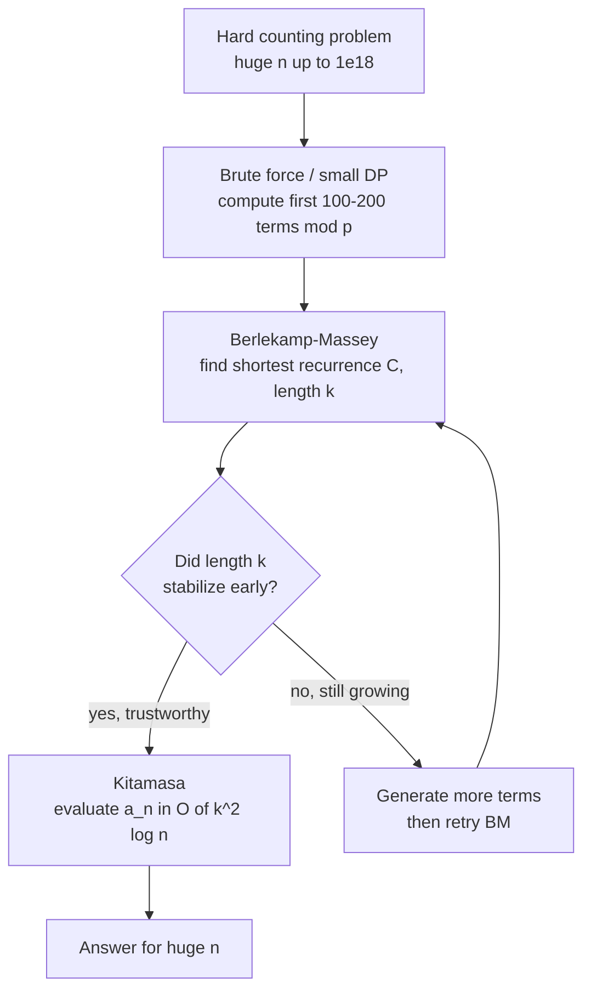

# Berlekamp-Massey & Kitamasa: Linear Recurrences

Many hard counting problems hide a **linear recurrence**. If you can compute the first handful of terms of a sequence (often by brute force), the Berlekamp-Massey algorithm can *discover* the shortest linear recurrence that fits them, and Kitamasa's method can then jump to the $n$-th term for astronomically large $n$ — all in time independent of $n$ except for a $\log n$ factor.

This guide explains the theory, the algorithms, and the classic competitive-programming workflow: **brute-force small terms → Berlekamp-Massey → Kitamasa extrapolation**.

## Table of Contents

- [What Is a Linear Recurrence?](#what-is-a-linear-recurrence)
- [How Many Terms Do You Need?](#how-many-terms-do-you-need)
- [The Berlekamp-Massey Algorithm](#the-berlekamp-massey-algorithm)
  - [Discrepancy and Update Intuition](#discrepancy-and-update-intuition)
  - [Pseudocode](#pseudocode)
  - [Implementation](#implementation)
- [Evaluating the n-th Term: Kitamasa](#evaluating-the-n-th-term-kitamasa)
  - [Characteristic Polynomial View](#characteristic-polynomial-view)
  - [Polynomial Exponentiation](#polynomial-exponentiation)
  - [Implementation](#kitamasa-implementation)
- [The CP Workflow: Brute → BM → Kitamasa](#the-cp-workflow-brute--bm--kitamasa)
- [Complexity Summary](#complexity-summary)
- [Common Pitfalls](#common-pitfalls)
- [Patterns](#patterns)

## What Is a Linear Recurrence?

A sequence $a_0, a_1, a_2, \dots$ over a field (we work modulo a prime $p$) satisfies a **linear recurrence of order $k$** if there exist constants $c_1, c_2, \dots, c_k$ such that for all $n \ge k$:

$$a_n = \sum_{i=1}^{k} c_i \, a_{n-i} = c_1 a_{n-1} + c_2 a_{n-2} + \cdots + c_k a_{n-k}.$$

The **order** $k$ is the length of the recurrence. The *shortest* such recurrence is unique and is what Berlekamp-Massey finds.

Examples:

- Fibonacci: $a_n = a_{n-1} + a_{n-2}$, so $k = 2$, $c = [1, 1]$.
- Geometric $a_n = r \cdot a_{n-1}$: $k = 1$, $c = [r]$.
- Any sequence produced by a fixed-size DP whose transition is a constant matrix is linearly recurrent, with $k$ at most the matrix dimension.

Working modulo a prime $p$ means $\mathbb{Z}/p\mathbb{Z}$ is a field, so every nonzero element has a modular inverse — this is essential for the algorithm.

## How Many Terms Do You Need?

To *recover* a recurrence of order $k$ you need at least $2k$ terms. Intuitively, the first $k$ terms are the "initial conditions" and the next $k$ terms give $k$ equations to pin down the $k$ unknown coefficients.

If you only suspect the true order is $\le k_{\max}$, feed Berlekamp-Massey at least $2k_{\max}$ terms. In practice, generate generously — if you think the order is around 20, compute 60–100 terms. If the recurrence length reported by BM **stops growing** well before you run out of terms, you can be confident it is genuine and not just overfitting noise.

$$\text{terms needed} \ge 2k. \qquad \text{When unsure: use } \ge 2k_{\max} + \text{slack}.$$

## The Berlekamp-Massey Algorithm

Berlekamp-Massey scans the sequence left to right, maintaining the **shortest** linear recurrence consistent with everything seen so far. When a new term violates the current recurrence, it patches the recurrence using a saved earlier version.

### Discrepancy and Update Intuition

At step $i$, with current coefficient list $C = [c_1, \dots, c_L]$ of length $L$, compute the **discrepancy** — the difference between the actual term and what the recurrence predicts:

$$\delta = a_i - \sum_{j=1}^{L} c_j \, a_{i-j} \pmod p.$$

- If $\delta = 0$, the current recurrence already explains $a_i$; do nothing.
- If $\delta \ne 0$, we must update $C$. We use the **last** recurrence that failed (call it $B$, the saved snapshot before the previous length change) to construct a correction. Scaling $B$ by $\delta / \delta_{\text{old}}$ and shifting it so its correction lands exactly at position $i$ cancels the discrepancy without disturbing earlier terms.

When the discrepancy forces the recurrence to **grow**, we save the old $C$ as the new $B$ and lengthen $L$. The clever invariant guarantees the resulting $L$ is always minimal.

### Pseudocode

```
function berlekamp_massey(a[0..n-1], p):
    C = []            # current recurrence coefficients
    B = [1]           # last failing snapshot (as polynomial 1 - sum c_j x^j)
    L = 0             # current recurrence length
    m = 1             # steps since last length change
    b = 1             # discrepancy at last length change
    for i in 0 .. n-1:
        # discrepancy
        d = a[i]
        for j in 1 .. L:
            d = (d + C[j-1] * a[i-j]) mod p
        if d == 0:
            m = m + 1
        else if 2*L <= i:
            T = copy(C)                 # save before growing
            coef = d * inverse(b) mod p
            extend/update C using coef * shift(B, m)
            L = i + 1 - L
            B = T
            b = d
            m = 1
        else:
            coef = d * inverse(b) mod p
            update C using coef * shift(B, m)  # length unchanged
            m = m + 1
    return C   # recurrence: a[i] = sum_{j=1..L} C[j-1] * a[i-j]
```

Here `C` stores the recurrence so that $a_i = \sum_j C[j-1]\, a_{i-j}$; the polynomial form uses the convention $a_i - \sum_j C[j-1] a_{i-j} = 0$, i.e. characteristic polynomial $1 - \sum_j C[j-1] x^j$.

### Implementation

The implementation below returns the coefficient list $C$ such that $a_n = \sum_{j} C[j]\, a_{n-1-j}$ (0-indexed coefficients).

```python
def berlekamp_massey(seq, mod):
    """Return shortest linear recurrence coefficients C such that
    seq[n] = sum(C[j] * seq[n-1-j] for j in range(len(C))) mod `mod`."""
    ls, cur = [], []          # ls = last failing snapshot, cur = current
    lf = 0                    # index where ls was recorded
    ld = 0                    # discrepancy at that point
    for i in range(len(seq)):
        t = 0
        for j in range(len(cur)):
            t = (t + cur[j] * seq[i - 1 - j]) % mod
        if (seq[i] - t) % mod == 0:
            continue
        if not cur:                       # first nonzero: start recurrence
            cur = [0] * (i + 1)
            lf, ld = i, (seq[i] - t) % mod
            continue
        k = (seq[i] - t) * pow(ld, mod - 2, mod) % mod
        c = [0] * (i - lf - 1) + [k]
        c += [(-k * x) % mod for x in ls]
        if len(c) < len(cur):
            c += [0] * (len(cur) - len(c))
        for j in range(len(cur)):
            c[j] = (c[j] + cur[j]) % mod
        if i - len(cur) >= lf - len(ls):  # grew: snapshot current
            ls, lf, ld = cur, i, (seq[i] - t) % mod
        cur = c
    return [x % mod for x in cur]
```

```cpp
#include <bits/stdc++.h>
using namespace std;
const long long MOD = 1e9 + 7;

long long power(long long b, long long e, long long m) {
    long long r = 1 % m;
    b %= m;
    while (e > 0) {
        if (e & 1) r = r * b % m;
        b = b * b % m;
        e >>= 1;
    }
    return r;
}

// Return C such that seq[n] = sum_j C[j] * seq[n-1-j] (mod MOD).
vector<long long> berlekampMassey(const vector<long long>& seq) {
    vector<long long> ls, cur;       // last snapshot, current
    long long lf = 0, ld = 0;        // index of snapshot, discrepancy then
    for (int i = 0; i < (int)seq.size(); i++) {
        long long t = 0;
        for (int j = 0; j < (int)cur.size(); j++)
            t = (t + cur[j] * seq[i - 1 - j]) % MOD;
        if (((seq[i] - t) % MOD + MOD) % MOD == 0) continue;
        if (cur.empty()) {           // first nonzero term
            cur.assign(i + 1, 0);
            lf = i;
            ld = ((seq[i] - t) % MOD + MOD) % MOD;
            continue;
        }
        long long k = (seq[i] - t) % MOD * power(ld, MOD - 2, MOD) % MOD;
        k = (k % MOD + MOD) % MOD;
        vector<long long> c(i - lf - 1, 0);
        c.push_back(k);
        for (long long x : ls) c.push_back((MOD - k * x % MOD) % MOD);
        if (c.size() < cur.size()) c.resize(cur.size(), 0);
        for (int j = 0; j < (int)cur.size(); j++)
            c[j] = (c[j] + cur[j]) % MOD;
        if (i - (int)cur.size() >= lf - (int)ls.size()) {
            ls = cur;
            lf = i;
            ld = ((seq[i] - t) % MOD + MOD) % MOD;
        }
        cur = c;
    }
    for (auto& x : cur) x = (x % MOD + MOD) % MOD;
    return cur;
}
```

The double loop costs $O(n \cdot L)$ where $L$ is the final recurrence length, i.e. $O(n^2)$ in the worst case.

## Evaluating the n-th Term: Kitamasa

Once you know the order-$k$ recurrence and the first $k$ terms, you still need $a_n$ for possibly enormous $n$ (up to $10^{18}$). Naively iterating is $O(n)$ — far too slow. **Kitamasa's method** computes $a_n$ in $O(k^2 \log n)$.

### Characteristic Polynomial View

The recurrence $a_n = \sum_{i=1}^{k} c_i a_{n-i}$ has **characteristic polynomial**

$$f(x) = x^k - c_1 x^{k-1} - c_2 x^{k-2} - \cdots - c_k.$$

Key fact: if you write $x^n \bmod f(x) = \sum_{j=0}^{k-1} r_j x^j$, then

$$a_n = \sum_{j=0}^{k-1} r_j \, a_j.$$

So evaluating $a_n$ reduces to computing the polynomial $x^n \bmod f(x)$ — a degree $< k$ polynomial — and dotting its coefficients with the known initial terms $a_0, \dots, a_{k-1}$.

### Polynomial Exponentiation

We compute $x^n \bmod f(x)$ by **fast exponentiation in the polynomial ring** $\mathbb{F}_p[x] / (f(x))$. Just like integer fast power, but "multiply" means multiply two polynomials (degree $< k$) and reduce modulo $f$:

$$x^n = \big(x^{\lfloor n/2 \rfloor}\big)^2 \cdot x^{(n \bmod 2)} \pmod{f(x)}.$$

Each squaring multiplies two degree-$<k$ polynomials in $O(k^2)$ and reduces modulo $f$ in $O(k^2)$. With $\log n$ steps this gives $O(k^2 \log n)$.

> With NTT-based polynomial multiplication and Newton-iteration reduction, each step drops to $O(k \log k)$, giving $O(k \log k \log n)$ overall. For typical CP sizes ($k \le 2000$) the simple $O(k^2 \log n)$ version is plenty.

### Kitamasa Implementation

```python
def kitamasa(rec, init, n, mod):
    """rec[i] = c_{i+1} so a_m = sum(rec[i]*a[m-1-i]).
    init = [a_0..a_{k-1}]. Return a_n mod `mod`."""
    k = len(rec)
    if n < k:
        return init[n] % mod
    # characteristic poly f(x) = x^k - sum rec[i] x^{k-1-i}; store as
    # the reduction rule: x^k == sum rec[i] x^{k-1-i}.
    def mul(a, b):
        res = [0] * (len(a) + len(b) - 1)
        for i, av in enumerate(a):
            if av:
                for j, bv in enumerate(b):
                    res[i + j] = (res[i + j] + av * bv) % mod
        # reduce modulo characteristic polynomial, high degree down
        for i in range(len(res) - 1, k - 1, -1):
            coef = res[i]
            if coef:
                res[i] = 0
                for j in range(k):
                    res[i - 1 - j] = (res[i - 1 - j] + coef * rec[j]) % mod
        return res[:k]

    result = [1]            # polynomial "1"
    base = [0, 1] if k > 1 else [rec[0] % mod]  # polynomial "x" reduced
    e = n
    while e > 0:
        if e & 1:
            result = mul(result, base)
        base = mul(base, base)
        e >>= 1
    ans = 0
    for i in range(min(k, len(result))):
        ans = (ans + result[i] * init[i]) % mod
    return ans
```

```cpp
#include <bits/stdc++.h>
using namespace std;
const long long MOD = 1e9 + 7;

// rec[i] = c_{i+1}, so a_m = sum_{i} rec[i] * a_{m-1-i}.
// init = {a_0, ..., a_{k-1}}. Returns a_n mod MOD.
long long kitamasa(const vector<long long>& rec,
                   const vector<long long>& init, long long n) {
    int k = (int)rec.size();
    if (n < k) return init[n] % MOD;

    auto mul = [&](const vector<long long>& a,
                   const vector<long long>& b) {
        vector<long long> res(a.size() + b.size() - 1, 0);
        for (int i = 0; i < (int)a.size(); i++)
            if (a[i])
                for (int j = 0; j < (int)b.size(); j++)
                    res[i + j] = (res[i + j] + a[i] * b[j]) % MOD;
        for (int i = (int)res.size() - 1; i >= k; i--) {
            long long coef = res[i];
            if (coef) {
                res[i] = 0;
                for (int j = 0; j < k; j++)
                    res[i - 1 - j] =
                        (res[i - 1 - j] + coef * rec[j]) % MOD;
            }
        }
        res.resize(k);
        return res;
    };

    vector<long long> result(k, 0), base(k, 0);
    result[0] = 1;
    if (k > 1) base[1] = 1;
    else base[0] = rec[0] % MOD;          // x reduced when k == 1

    long long e = n;
    while (e > 0) {
        if (e & 1) result = mul(result, base);
        base = mul(base, base);
        e >>= 1;
    }
    long long ans = 0;
    for (int i = 0; i < k; i++)
        ans = (ans + result[i] * init[i]) % MOD;
    return ans;
}
```

## The CP Workflow: Brute → BM → Kitamasa

The reason this pair of algorithms is so powerful: you often *don't even know* the recurrence. The standard trick for a hard counting problem is:

1. Write a slow but correct brute force (or a small DP) and compute the first $\sim 50$–$200$ terms modulo $p$.
2. Run Berlekamp-Massey on those terms to *discover* the recurrence coefficients.
3. Use Kitamasa (or matrix power) to evaluate the answer for the real, huge $n$.



A subtle but important check: the BM recurrence length should **stabilize** and stay well under half your sample count. If BM reports length $\approx n/2$ for $n$ samples, it has effectively memorized the data and found no real recurrence — you need more terms or there is no fixed-order linear recurrence.

## Complexity Summary

| Operation | Time | Space | Notes |
| --- | --- | --- | --- |
| Berlekamp-Massey | $O(n \cdot L)$, worst $O(n^2)$ | $O(n)$ | $n$ = #terms, $L$ = recurrence length |
| Kitamasa (schoolbook) | $O(k^2 \log n)$ | $O(k)$ | $k$ = recurrence order |
| Kitamasa (NTT) | $O(k \log k \log n)$ | $O(k)$ | needs prime-friendly modulus |
| Matrix exponentiation | $O(k^3 \log n)$ | $O(k^2)$ | simpler, slower for large $k$ |
| Brute force iterate | $O(n)$ | $O(k)$ | only when $n$ is small |

Kitamasa beats matrix power by a factor of $k$ and is the standard choice once $k$ is more than a handful.

## Common Pitfalls

- **Too few terms.** Feeding fewer than $2k$ terms gives a wrong (too short) recurrence. When unsure of $k$, generate generously and confirm the length stabilizes.
- **Forgetting the field requirement.** BM needs modular inverses, so the modulus **must be prime**. A composite modulus breaks `pow(ld, mod-2, mod)`.
- **Negative residues.** In C++, always normalize with `((x % MOD) + MOD) % MOD`. Subtractions of the discrepancy easily go negative.
- **Index/convention mismatch.** Be consistent about whether $C[j]$ multiplies $a_{n-1-j}$ or $a_{n-j}$. A single off-by-one shifts every prediction.
- **Sign of characteristic polynomial.** $f(x) = x^k - c_1 x^{k-1} - \dots - c_k$; the reduction rule is $x^k \equiv \sum c_i x^{k-i}$. Dropping a minus sign here silently corrupts Kitamasa.
- **Overfitting / no recurrence.** If BM's length is roughly half your input size, the data is not linearly recurrent at that order — do not trust the result.
- **$n < k$ edge case.** Always return $a_n$ directly from the initial terms when $n$ is smaller than the order.

## Patterns

- **Discover-then-extrapolate.** Whenever a problem says "compute $f(n) \bmod p$ for $n \le 10^{18}$" and a small DP exists, suspect a linear recurrence: brute small, BM, Kitamasa.
- **Linear algebra fingerprint.** Any quantity counted by paths in a fixed graph, tilings of an $m \times n$ board with fixed $m$, or a constant-size matrix DP is linearly recurrent — order bounded by the state count.
- **Sanity via overlap.** After fitting, regenerate a few terms *beyond* your training set with the recurrence and check they match brute force. Cheap insurance against overfitting.
- **Kitamasa vs. matrix power.** Use matrix exponentiation for tiny $k$ (clear and easy); switch to Kitamasa once $k$ grows so the $O(k^3)$ cube hurts.
- **Generating-function lens.** A sequence is linearly recurrent iff its generating function is rational $P(x)/Q(x)$; the denominator $Q$ is exactly the (reversed) characteristic polynomial BM finds.
```