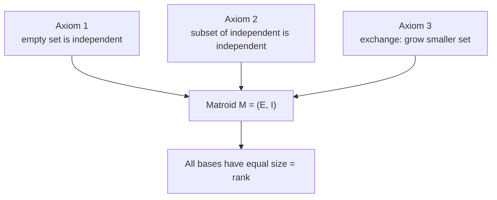
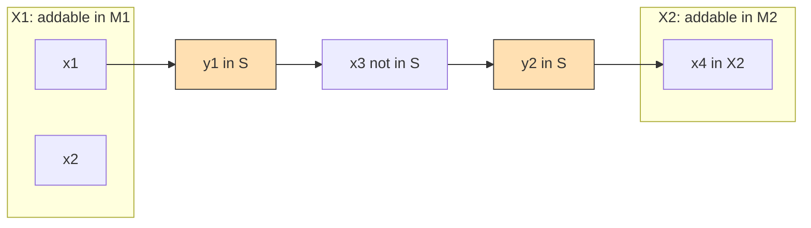
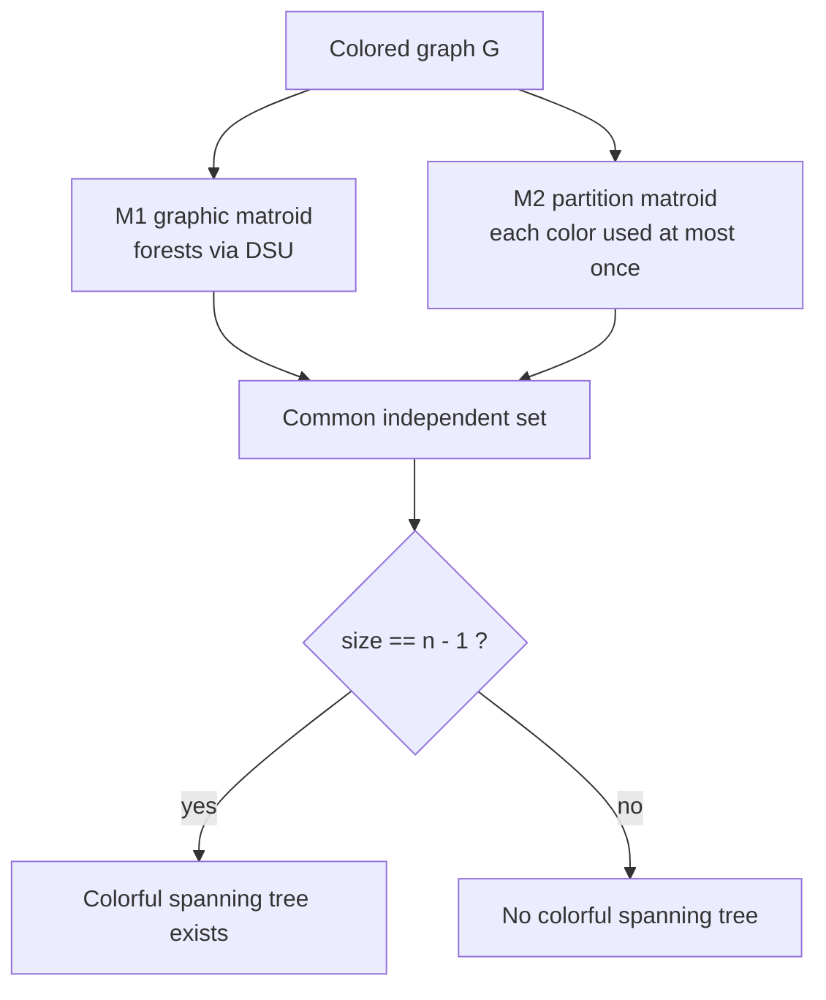

# Matroid Intersection

> **Niche / advanced topic.** This guide covers *matroids* and the *matroid intersection* problem — a beautiful but specialized corner of combinatorial optimization. You will rarely see it in a typical interview, but it shows up in competitive programming and research when a problem reduces to "pick the largest/heaviest set of objects that is simultaneously independent under two different constraint systems." If you are new to greedy/DSU/flow, master those first; this builds on all of them.

Matroids generalize the notion of *linear independence* (from linear algebra) and *acyclicity* (from graphs). Their magic: **the greedy algorithm is optimal if and only if the constraint structure is a matroid** (Rado–Edmonds). When two matroids are combined, greedy fails, but a polynomial **augmenting-path** algorithm still finds the optimum — that is *matroid intersection*.

## Table of Contents

- [What Is a Matroid?](#what-is-a-matroid)
- [The Three Axioms](#the-three-axioms)
- [Key Examples](#key-examples)
- [Rank, Circuits, and the Exchange Property](#rank-circuits-and-the-exchange-property)
- [Greedy on One Matroid (Rado–Edmonds)](#greedy-on-one-matroid-radoedmonds)
- [The Matroid Intersection Problem](#the-matroid-intersection-problem)
- [The Exchange Graph and Augmenting Paths](#the-exchange-graph-and-augmenting-paths)
- [Implementation: Graphic ∩ Partition](#implementation-graphic--partition)
- [Application: Colorful / Rainbow Spanning Tree](#application-colorful--rainbow-spanning-tree)
- [Matroid Union and Weighted Intersection](#matroid-union-and-weighted-intersection)
- [Complexity Summary](#complexity-summary)
- [Common Pitfalls](#common-pitfalls)
- [Patterns](#patterns)

---

## What Is a Matroid?

A **matroid** is a pair $M = (E, \mathcal{I})$ where:

- $E$ is a finite **ground set** (the universe of elements you may pick).
- $\mathcal{I} \subseteq 2^E$ is a family of subsets called the **independent sets**.

The family $\mathcal{I}$ must satisfy three axioms (below). A subset $S \subseteq E$ that is **not** in $\mathcal{I}$ is called *dependent*. The intuition:

- In a **graph**, $E$ = edges, and a set of edges is independent iff it contains **no cycle** (it is a forest).
- In a **matrix**, $E$ = columns, and a set of columns is independent iff they are **linearly independent**.

Matroids capture exactly what these two situations have in common.

## The Three Axioms

Let $M = (E, \mathcal{I})$. Then $\mathcal{I}$ is the independent-set family of a matroid iff:

1. **Non-emptiness.** $\varnothing \in \mathcal{I}$. The empty set is always independent.

2. **Hereditary / downward-closed.** If $A \in \mathcal{I}$ and $B \subseteq A$, then $B \in \mathcal{I}$. Any subset of an independent set is independent.

3. **Exchange / augmentation.** If $A, B \in \mathcal{I}$ and $|A| < |B|$, then there exists an element $x \in B \setminus A$ such that $A \cup \{x\} \in \mathcal{I}$. A smaller independent set can always be grown using some element from a larger one.

Formally:

$$
\varnothing \in \mathcal{I}, \qquad
(B \subseteq A \in \mathcal{I}) \Rightarrow B \in \mathcal{I}, \qquad
(A, B \in \mathcal{I},\, |A| < |B|) \Rightarrow \exists\, x \in B \setminus A : A \cup \{x\} \in \mathcal{I}.
$$

The third axiom is the powerhouse. It forces all **maximal** independent sets to have the **same size** — those are the *bases* of the matroid.



## Key Examples

### Graphic matroid (forests via DSU)

- Ground set $E$ = edges of a graph $G$.
- $S \in \mathcal{I}$ iff $S$ contains **no cycle** (i.e. $S$ is a forest).
- Independence oracle = "does adding edge $e$ keep the set acyclic?" → a **Disjoint Set Union (DSU)** check.

### Partition (colorful) matroid

- Ground set $E$ partitioned into groups (e.g. by **color**) $E = E_1 \cup E_2 \cup \dots \cup E_k$.
- Each group $i$ has a capacity $d_i$.
- $S \in \mathcal{I}$ iff $|S \cap E_i| \le d_i$ for every group $i$.
- With all $d_i = 1$, "independent" means "uses each color at most once" — the **colorful** matroid.

### Linear (matrix) matroid

- Ground set $E$ = columns of a matrix over a field.
- $S \in \mathcal{I}$ iff those columns are **linearly independent**.

### Uniform matroid

- $S \in \mathcal{I}$ iff $|S| \le k$ for a fixed $k$. Every $k$-subset is a basis.

## Rank, Circuits, and the Exchange Property

- **Rank** $r(S)$ = size of the largest independent subset of $S$. The matroid's rank $r = r(E)$ is the common size of all bases.
- A **circuit** is a *minimal dependent set*: it is dependent, but every proper subset is independent. In the graphic matroid a circuit is exactly a **cycle**; in the partition matroid a circuit is any group exceeding its capacity by one.
- **Fundamental circuit.** If $A \in \mathcal{I}$ and $A \cup \{x\} \notin \mathcal{I}$, then $A \cup \{x\}$ contains a *unique* circuit $C(x, A)$. Every $y \in C(x, A) \setminus \{x\}$ can be swapped out: $A \cup \{x\} \setminus \{y\} \in \mathcal{I}$. These swaps drive the intersection algorithm.

## Greedy on One Matroid (Rado–Edmonds)

To find a **maximum-weight independent set** in a *single* matroid with weights $w : E \to \mathbb{R}$:

```text
GREEDY(M = (E, I), w):
    sort E by weight descending
    A <- empty set
    for each e in E (in sorted order):
        if w(e) > 0 and A + {e} is in I:     # independence oracle
            A <- A + {e}
    return A
```

```python
def greedy_matroid(elements, weight, indep_oracle):
    """elements: list; weight: dict; indep_oracle(current_set, e) -> bool."""
    chosen = []
    for e in sorted(elements, key=lambda x: weight[x], reverse=True):
        if weight[e] <= 0:
            break
        if indep_oracle(chosen, e):
            chosen.append(e)
    return chosen
```

```cpp
#include <bits/stdc++.h>
using namespace std;

// indepOracle(chosen, e) -> bool : is chosen + {e} still independent?
template <class IndepOracle>
vector<int> greedyMatroid(vector<int> elements,
                          const vector<long long>& weight,
                          IndepOracle indepOracle) {
    sort(elements.begin(), elements.end(),
         [&](int a, int b) { return weight[a] > weight[b]; });
    vector<int> chosen;
    for (int e : elements) {
        if (weight[e] <= 0) break;
        if (indepOracle(chosen, e)) chosen.push_back(e);
    }
    return chosen;
}
```

**Rado–Edmonds theorem.** The greedy algorithm returns a maximum-weight independent set for *every* weight function **iff** $(E, \mathcal{I})$ is a matroid. This is *the* reason matroids matter: they are precisely the structures where greedy is provably optimal. Kruskal's minimum spanning tree algorithm is just greedy on the graphic matroid.

## The Matroid Intersection Problem

Given **two** matroids $M_1 = (E, \mathcal{I}_1)$ and $M_2 = (E, \mathcal{I}_2)$ on the **same** ground set, find a set $S \subseteq E$ that is independent in *both*:

$$
\text{maximize } |S| \quad \text{subject to} \quad S \in \mathcal{I}_1 \cap \mathcal{I}_2 .
$$

Greedy **fails** for two matroids in general. But there is a polynomial algorithm. Edmonds' celebrated **matroid intersection theorem** gives a min–max duality:

$$
\max_{S \in \mathcal{I}_1 \cap \mathcal{I}_2} |S| \;=\; \min_{E = E_1 \cup E_2} \big( r_1(E_1) + r_2(E_2) \big),
$$

where $r_1, r_2$ are the rank functions of $M_1, M_2$. The right side is a certificate of optimality.

Classic instances:

- **Bipartite matching** = (partition matroid on left endpoints) ∩ (partition matroid on right endpoints).
- **Colorful spanning tree** = (graphic matroid) ∩ (partition matroid on edge colors).
- **Arborescence / orientation** problems.

## The Exchange Graph and Augmenting Paths

Maintain a common independent set $S \in \mathcal{I}_1 \cap \mathcal{I}_2$, starting from $\varnothing$. We grow $|S|$ by one each phase via an **augmenting path** in a directed **exchange graph** $D_S$:

- **Nodes** = all elements of $E$.
- For $y \in S$ and $x \notin S$: add edge $y \to x$ if $S - y + x \in \mathcal{I}_1$ (swap allowed in matroid 1).
- For $y \in S$ and $x \notin S$: add edge $x \to y$ if $S - y + x \in \mathcal{I}_2$ (swap allowed in matroid 2).
- **Source set** $X_1 = \{\, x \notin S : S + x \in \mathcal{I}_1 \,\}$ (can be freely added to $M_1$).
- **Sink set** $X_2 = \{\, x \notin S : S + x \in \mathcal{I}_2 \,\}$ (can be freely added to $M_2$).

Find a **shortest** path from $X_1$ to $X_2$ (BFS). Along that path, flip membership of every node (elements outside $S$ enter, elements inside $S$ leave). Using the *shortest* path guarantees the result stays independent in both matroids and increases $|S|$ by exactly one. When no $X_1 \to X_2$ path exists, $S$ is **maximum**.



Flipping the path `x1 -> y1 -> x3 -> y2 -> x4` removes $y_1, y_2$ from $S$ and adds $x_1, x_3, x_4$, a net gain of one element.

```text
MATROID_INTERSECTION(M1, M2, E):
    S <- empty
    repeat:
        build exchange graph D_S
        X1 <- { x not in S : S + x in I1 }
        X2 <- { x not in S : S + x in I2 }
        P  <- shortest path from any X1 node to any X2 node (BFS)
        if no such P: break
        S <- S XOR vertices(P)        # flip membership along P
    return S
```

## Implementation: Graphic ∩ Partition

Here $E$ = edges; $M_1$ = graphic matroid (forests, tested by DSU); $M_2$ = partition matroid by color with capacity 1 per color. We compute the **largest common independent set**. For the spanning-tree question we then check whether its size equals $n - 1$.

```python
from typing import List, Tuple, Optional


class DSU:
    def __init__(self, n: int):
        self.p = list(range(n))

    def find(self, x: int) -> int:
        while self.p[x] != x:
            self.p[x] = self.p[self.p[x]]
            x = self.p[x]
        return x

    def union(self, a: int, b: int) -> bool:
        ra, rb = self.find(a), self.find(b)
        if ra == rb:
            return False
        self.p[ra] = rb
        return True


def is_forest(edges: List[Tuple[int, int]], n: int, subset: List[int]) -> bool:
    """Graphic-matroid oracle: are the chosen edges acyclic?"""
    dsu = DSU(n)
    for i in subset:
        u, v = edges[i]
        if not dsu.union(u, v):
            return False
    return True


def color_ok(colors: List[int], k: int, subset: List[int]) -> bool:
    """Partition-matroid oracle: each color used at most once."""
    seen = [False] * k
    for i in subset:
        c = colors[i]
        if seen[c]:
            return False
        seen[c] = True
    return True


def matroid_intersection(n: int, edges: List[Tuple[int, int]],
                         colors: List[int], k: int) -> List[int]:
    """Largest set of edge-indices that is a forest AND color-distinct."""
    m = len(edges)
    S = [False] * m  # membership flags

    def indep1(extra: Optional[int], removed: Optional[int]) -> bool:
        subset = [i for i in range(m) if (S[i] and i != removed)]
        if extra is not None:
            subset.append(extra)
        return is_forest(edges, n, subset)

    def indep2(extra: Optional[int], removed: Optional[int]) -> bool:
        subset = [i for i in range(m) if (S[i] and i != removed)]
        if extra is not None:
            subset.append(extra)
        return color_ok(colors, k, subset)

    while True:
        in_set = [i for i in range(m) if S[i]]
        out_set = [i for i in range(m) if not S[i]]

        X1 = [x for x in out_set if indep1(x, None)]   # addable in M1
        X2 = set(x for x in out_set if indep2(x, None))  # addable in M2

        # Build exchange graph adjacency.
        adj = {i: [] for i in range(m)}
        for y in in_set:
            for x in out_set:
                if indep1(x, y):          # y -> x  (swap keeps M1 independent)
                    adj[y].append(x)
                if indep2(x, y):          # x -> y  (swap keeps M2 independent)
                    adj[x].append(y)

        # BFS shortest path from X1 to any X2 node.
        from collections import deque
        prev = {s: -1 for s in X1}
        dq = deque(X1)
        found = -1
        while dq:
            u = dq.popleft()
            if u in X2:
                found = u
                break
            for w in adj[u]:
                if w not in prev:
                    prev[w] = u
                    dq.append(w)
        if found == -1:
            break

        node = found            # flip membership along the path
        while node != -1:
            S[node] = not S[node]
            node = prev[node]

    return [i for i in range(m) if S[i]]


if __name__ == "__main__":
    # Square with a diagonal; colors chosen to allow a colorful spanning tree.
    n = 4
    edges = [(0, 1), (1, 2), (2, 3), (3, 0), (0, 2)]
    colors = [0, 1, 2, 0, 1]
    k = 3
    res = matroid_intersection(n, edges, colors, k)
    print("size =", len(res), "edges =", res, "spanning =", len(res) == n - 1)
```

```cpp
#include <bits/stdc++.h>
using namespace std;

struct DSU {
    vector<int> p;
    explicit DSU(int n) : p(n) { iota(p.begin(), p.end(), 0); }
    int find(int x) {
        while (p[x] != x) { p[x] = p[p[x]]; x = p[x]; }
        return x;
    }
    bool unite(int a, int b) {
        int ra = find(a), rb = find(b);
        if (ra == rb) return false;
        p[ra] = rb;
        return true;
    }
};

// Graphic-matroid oracle: are the chosen edges acyclic?
static bool isForest(const vector<pair<int,int>>& edges, int n,
                     const vector<int>& subset) {
    DSU dsu(n);
    for (int i : subset)
        if (!dsu.unite(edges[i].first, edges[i].second)) return false;
    return true;
}

// Partition-matroid oracle: each color used at most once.
static bool colorOk(const vector<int>& colors, int k,
                    const vector<int>& subset) {
    vector<char> seen(k, 0);
    for (int i : subset) {
        int c = colors[i];
        if (seen[c]) return false;
        seen[c] = 1;
    }
    return true;
}

vector<int> matroidIntersection(int n, const vector<pair<int,int>>& edges,
                                const vector<int>& colors, int k) {
    int m = static_cast<int>(edges.size());
    vector<char> S(m, 0);  // membership flags

    auto buildSubset = [&](int extra, int removed) {
        vector<int> subset;
        for (int i = 0; i < m; ++i)
            if (S[i] && i != removed) subset.push_back(i);
        if (extra != -1) subset.push_back(extra);
        return subset;
    };
    auto indep1 = [&](int extra, int removed) {
        return isForest(edges, n, buildSubset(extra, removed));
    };
    auto indep2 = [&](int extra, int removed) {
        return colorOk(colors, k, buildSubset(extra, removed));
    };

    while (true) {
        vector<int> inSet, outSet;
        for (int i = 0; i < m; ++i) (S[i] ? inSet : outSet).push_back(i);

        vector<int> X1;
        vector<char> isX2(m, 0);
        for (int x : outSet) {
            if (indep1(x, -1)) X1.push_back(x);
            if (indep2(x, -1)) isX2[x] = 1;
        }

        vector<vector<int>> adj(m);
        for (int y : inSet)
            for (int x : outSet) {
                if (indep1(x, y)) adj[y].push_back(x);  // y -> x
                if (indep2(x, y)) adj[x].push_back(y);  // x -> y
            }

        vector<int> prev(m, -2);  // -2 = unvisited
        queue<int> q;
        for (int s : X1) { prev[s] = -1; q.push(s); }
        int found = -1;
        while (!q.empty()) {
            int u = q.front(); q.pop();
            if (isX2[u]) { found = u; break; }
            for (int w : adj[u])
                if (prev[w] == -2) { prev[w] = u; q.push(w); }
        }
        if (found == -1) break;

        for (int node = found; node != -1; node = prev[node])
            S[node] = !S[node];  // flip membership along the path
    }

    vector<int> res;
    for (int i = 0; i < m; ++i) if (S[i]) res.push_back(i);
    return res;
}

int main() {
    int n = 4;
    vector<pair<int,int>> edges = {{0,1},{1,2},{2,3},{3,0},{0,2}};
    vector<int> colors = {0,1,2,0,1};
    int k = 3;
    vector<int> res = matroidIntersection(n, edges, colors, k);
    cout << "size = " << res.size() << " spanning = "
         << (static_cast<int>(res.size()) == n - 1) << "\n";
    return 0;
}
```

## Application: Colorful / Rainbow Spanning Tree

A **colorful** (or **rainbow**) spanning tree of a graph with colored edges is a spanning tree that uses **each color at most once**. This is exactly a common independent set of:

- $M_1$ = **graphic matroid** (the tree must be a forest), and
- $M_2$ = **partition matroid** on colors with capacity $1$ per color.

A colorful spanning tree exists iff the largest common independent set has size $n - 1$ (the graph is connected and the color constraints permit it). Run the intersection algorithm above and compare the result size to $n - 1$.



## Matroid Union and Weighted Intersection

- **Matroid union.** Given matroids $M_1, \dots, M_t$, the union $M_1 \vee \dots \vee M_t$ has independent sets that can be partitioned into one independent set per matroid. Nash–Williams' theorem on packing edge-disjoint spanning trees is a corollary. Matroid union itself reduces to a matroid intersection instance.

- **Weighted matroid intersection.** Attach weights $w : E \to \mathbb{R}$ and seek the **maximum-weight** common independent set (of a given size, or overall). Replace BFS by a **shortest-path / Bellman–Ford** search on the exchange graph where node $x \notin S$ has cost $-w(x)$ and $y \in S$ has cost $+w(y)$; augment along the *minimum-cost* shortest path (tie-broken by fewest edges). This finds, for every $k$, the max-weight common independent set of size $k$.

$$
\text{cost of path } P = \sum_{x \in P \setminus S} (-w(x)) + \sum_{y \in P \cap S} w(y).
$$

## Complexity Summary

Let $n = |E|$, $r$ = rank (size of the answer, at most $\min(r_1, r_2)$), and let one independence-oracle call cost $Q$.

| Task | Complexity |
| --- | --- |
| Greedy on one matroid | $O(n \log n + n Q)$ |
| Build exchange graph (one phase) | $O(n^2 Q)$ |
| One augmentation (BFS) | $O(n^2)$ on top of graph build |
| Number of augmentations | $r$ phases |
| Matroid intersection (naive) | $O(r \cdot n^2 \cdot Q)$ |
| Matroid intersection (refined) | $\tilde{O}(r^{1.5} \cdot Q)$ roughly |
| Weighted intersection | $O(r \cdot n^2 \cdot Q)$ with shortest-path augment |

The $O(r^{1.5} \cdot \text{oracle})$ figure follows from Cunningham's analysis: shortest augmenting paths give $O(r^{1.5})$ total augmentation steps amortized.

## Common Pitfalls

- **Using greedy for two matroids.** Greedy is optimal for *one* matroid only. For an intersection you **must** use augmenting paths.
- **Non-shortest augmenting path.** You must use the **shortest** $X_1 \to X_2$ path (BFS). A longer path can break independence in one of the matroids.
- **Edge direction confusion.** $y \to x$ uses the **$M_1$** swap test ($S - y + x \in \mathcal{I}_1$); $x \to y$ uses the **$M_2$** swap test. Swapping them silently produces wrong answers.
- **Source/sink sets reversed.** $X_1$ = addable in $M_1$ (path start); $X_2$ = addable in $M_2$ (path end). Keep them consistent with the edge directions.
- **Forgetting the rank cap.** The answer never exceeds $\min(r_1(E), r_2(E))$; for a colorful spanning tree that is $\min(n-1, \text{number of colors})$.
- **Oracle correctness.** A buggy independence oracle (e.g. a DSU you forget to reset) corrupts the whole algorithm. Rebuild oracle state fresh per query in simple implementations.
- **Treating capacities as global.** In a partition matroid the capacity is **per group**, not a single total budget.

## Patterns

- **"Independent under two constraints" → matroid intersection.** If a problem asks for the largest/heaviest set satisfying two independence-like rules, model each rule as a matroid and intersect.
- **DSU = graphic-matroid oracle.** Any "no cycle / stays a forest" test is a graphic-matroid independence oracle.
- **Per-group capacity = partition matroid.** "Use each color/category/group at most $d_i$ times" is a partition matroid.
- **Greedy ⇔ single matroid.** If a greedy solution is provably optimal, the underlying structure is (almost certainly) a single matroid — Rado–Edmonds.
- **Min–max certificate.** Use Edmonds' theorem $\max |S| = \min_{E_1 \cup E_2 = E} (r_1(E_1) + r_2(E_2))$ to *prove* a bound or detect optimality.
- **Reduce richer problems.** Bipartite matching, rainbow spanning trees, and packing spanning trees (matroid union) all reduce to matroid intersection.
