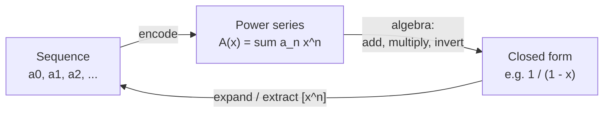
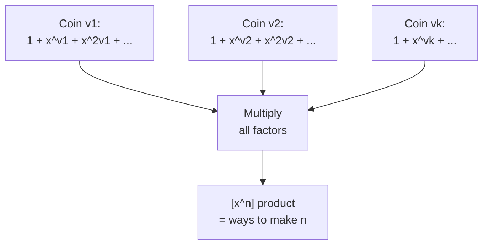

# Generating Functions

A **generating function** is a clothesline on which we hang a sequence of numbers for display. Formally, we take a sequence $a_0, a_1, a_2, \dots$ and encode it as the coefficients of a formal power series. Algebraic manipulations of that series — addition, multiplication, inversion — translate into *combinatorial* operations on the underlying sequence. This turns "counting" problems into "algebra" problems, and algebra is something we can automate.

This guide develops the two workhorses: **ordinary generating functions (OGF)** for unlabeled counting (coins, partitions, combinations with repetition), and **exponential generating functions (EGF)** for labeled structures (permutations, derangements). Along the way we extract closed forms via partial fractions and solve linear recurrences mechanically.

## Table of Contents

- [Ordinary Generating Functions (OGF)](#ordinary-generating-functions-ogf)
- [The Dictionary: Operations on Sequences](#the-dictionary-operations-on-sequences)
- [The Geometric Series and Its Powers](#the-geometric-series-and-its-powers)
- [Product = Convolution: Counting Combinations](#product--convolution-counting-combinations)
- [Polynomial Operations in Code](#polynomial-operations-in-code)
- [Closed Forms via Partial Fractions](#closed-forms-via-partial-fractions)
- [Solving Linear Recurrences](#solving-linear-recurrences)
- [Exponential Generating Functions (EGF)](#exponential-generating-functions-egf)
- [Complexity Summary](#complexity-summary)
- [Common Pitfalls](#common-pitfalls)
- [Patterns](#patterns)

## Ordinary Generating Functions (OGF)

Given a sequence $(a_n)_{n \ge 0}$, its **ordinary generating function** is the formal power series

$$A(x) = \sum_{n \ge 0} a_n x^n = a_0 + a_1 x + a_2 x^2 + \cdots.$$

We write $[x^n]A(x) = a_n$ to mean "the coefficient of $x^n$ in $A$". The variable $x$ is a *formal* placeholder — we never plug a number in and we never worry about convergence. The only thing that matters is the bookkeeping of coefficients.

The whole power of the method rests on a single idea: a sequence and its power series are two views of the **same object**.



(Mermaid cannot render bare parentheses inside labels; read `&lpar; &rpar;` as ordinary parentheses.)

## The Dictionary: Operations on Sequences

Each algebraic move on $A(x)$ corresponds to a transformation of $(a_n)$. Memorizing this dictionary is most of the battle.

| Operation on series | Effect on sequence | Identity |
|---|---|---|
| $A(x) + B(x)$ | $a_n + b_n$ (termwise sum) | $[x^n](A+B) = a_n + b_n$ |
| $c \cdot A(x)$ | scale by constant $c$ | $[x^n](cA) = c\,a_n$ |
| $x^k A(x)$ | **right shift** by $k$ | $[x^n](x^k A) = a_{n-k}$ |
| $\dfrac{A(x) - \sum_{i<k} a_i x^i}{x^k}$ | **left shift** by $k$ | $[x^n] = a_{n+k}$ |
| $A(cx)$ | scale terms by $c^n$ | $[x^n]A(cx) = c^n a_n$ |
| $A(x)B(x)$ | **convolution** $\sum_{i} a_i b_{n-i}$ | (see below) |
| $A'(x)$ | $[x^n] = (n+1)a_{n+1}$ | differentiate |
| $\dfrac{A(x)}{1-x}$ | **prefix sums** $\sum_{i\le n} a_i$ | partial sums |

The last row is a gem: multiplying by $\frac{1}{1-x}$ takes prefix sums, because $\frac{1}{1-x} = 1 + x + x^2 + \cdots$ and convolving with the all-ones sequence sums everything up to index $n$.

## The Geometric Series and Its Powers

The single most important identity is the **geometric series**:

$$\frac{1}{1-x} = \sum_{n \ge 0} x^n = 1 + x + x^2 + x^3 + \cdots.$$

It is the generating function of the constant sequence $a_n = 1$. Replacing $x$ by $cx$ scales each term:

$$\frac{1}{1 - cx} = \sum_{n \ge 0} c^n x^n, \qquad [x^n]\frac{1}{1-cx} = c^n.$$

Raising the geometric series to the $k$-th power counts **combinations with repetition**. Expanding $\frac{1}{(1-x)^k}$ gives the number of ways to write $n$ as an ordered sum of $k$ nonnegative integers (stars and bars):

$$\frac{1}{(1-x)^k} = \sum_{n \ge 0} \binom{n+k-1}{k-1} x^n.$$

So $[x^n]\frac{1}{(1-x)^k} = \binom{n+k-1}{k-1}$. This single formula answers "how many multisets of size $n$ from $k$ types?" without any further thought.

## Product = Convolution: Counting Combinations

If $A(x) = \sum a_i x^i$ and $B(x) = \sum b_j x^j$, then

$$A(x)\,B(x) = \sum_{n \ge 0}\left(\sum_{i=0}^{n} a_i\, b_{n-i}\right) x^n.$$

The coefficient of $x^n$ in the product is the **convolution** $\sum_i a_i b_{n-i}$. Combinatorially: if $a_i$ counts ways to do task A "with cost $i$" and $b_j$ counts ways to do task B "with cost $j$", then the product counts ways to do **both independently with total cost $n$**. Multiplication = "choose from A *and* from B"; addition = "choose from A *or* from B".

**Coin counting example.** Suppose we may use coin of value $v$ any number of times. The choices "use $0, 1, 2, \dots$ of this coin" contribute total values $0, v, 2v, \dots$, encoded by

$$1 + x^v + x^{2v} + x^{3v} + \cdots = \frac{1}{1 - x^v}.$$

To count the number of ways to form total $n$ using coins of values $v_1, \dots, v_k$ (each unbounded), multiply one factor per coin:

$$\prod_{j=1}^{k} \frac{1}{1 - x^{v_j}} = \sum_{n \ge 0} (\text{\# ways to make } n)\, x^n.$$

Each factor independently chooses how many of one coin to use; the product's $x^n$ coefficient sums over all combinations totaling $n$. This is exactly the unbounded-knapsack / partition idea.



## Polynomial Operations in Code

To actually extract coefficients we work with **truncated** power series: keep terms up to $x^{N-1}$ and drop the rest. Here are add, multiply, and the series inverse / geometric expansion, all truncated to $N$ terms.

Pseudocode for the series **inverse** of $A$ (computing $B$ with $A \cdot B \equiv 1$), assuming $a_0 \ne 0$:

```
inverse(A, N):
    b[0] = 1 / a[0]
    for n = 1 .. N-1:
        s = 0
        for i = 1 .. n:
            s += a[i] * b[n-i]
        b[n] = -s * b[0]      # since sum_{i=0}^n a[i] b[n-i] = 0
    return b
```

The special case $A(x) = 1 - cx$ has inverse $\sum c^n x^n$, recovering the geometric series — a good sanity check.

```python
def poly_add(a, b, n):
    """Sum of two series, truncated to n terms."""
    c = [0] * n
    for i in range(n):
        if i < len(a):
            c[i] += a[i]
        if i < len(b):
            c[i] += b[i]
    return c

def poly_mul(a, b, n):
    """Product (convolution) of two series, truncated to n terms."""
    c = [0] * n
    for i in range(min(len(a), n)):
        if a[i] == 0:
            continue
        for j in range(min(len(b), n - i)):
            c[i + j] += a[i] * b[j]
    return c

def poly_inverse(a, n):
    """Series B with A*B = 1, truncated to n terms. Requires a[0] != 0."""
    assert a[0] != 0
    inv0 = 1.0 / a[0]
    b = [0.0] * n
    b[0] = inv0
    for k in range(1, n):
        s = 0.0
        for i in range(1, k + 1):
            ai = a[i] if i < len(a) else 0
            s += ai * b[k - i]
        b[k] = -s * inv0
    return b

def geometric(c, n):
    """Expand 1 / (1 - c x) = sum c^n x^n, truncated to n terms."""
    return poly_inverse([1, -c], n)
```

```cpp
#include <bits/stdc++.h>
using namespace std;

vector<long long> poly_add(const vector<long long>& a,
                           const vector<long long>& b, int n) {
    vector<long long> c(n, 0);
    for (int i = 0; i < n; ++i) {
        if (i < (int)a.size()) c[i] += a[i];
        if (i < (int)b.size()) c[i] += b[i];
    }
    return c;
}

vector<long long> poly_mul(const vector<long long>& a,
                           const vector<long long>& b, int n) {
    vector<long long> c(n, 0);
    for (int i = 0; i < (int)a.size() && i < n; ++i) {
        if (a[i] == 0) continue;
        for (int j = 0; j < (int)b.size() && i + j < n; ++j)
            c[i + j] += a[i] * b[j];
    }
    return c;
}

// Series B with A*B = 1, truncated to n terms. Requires a[0] != 0.
vector<double> poly_inverse(const vector<double>& a, int n) {
    double inv0 = 1.0 / a[0];
    vector<double> b(n, 0.0);
    b[0] = inv0;
    for (int k = 1; k < n; ++k) {
        double s = 0.0;
        for (int i = 1; i <= k; ++i) {
            double ai = (i < (int)a.size()) ? a[i] : 0.0;
            s += ai * b[k - i];
        }
        b[k] = -s * inv0;
    }
    return b;
}

// Expand 1 / (1 - c x) = sum c^n x^n, truncated to n terms.
vector<double> geometric(double c, int n) {
    return poly_inverse({1.0, -c}, n);
}
```

## Closed Forms via Partial Fractions

When a generating function is a **rational function** $\frac{P(x)}{Q(x)}$ with $\deg P < \deg Q$, we can split it into simple fractions and read off a closed form for $[x^n]$. Each simple piece $\frac{c}{1 - r x}$ contributes $c\,r^n$.

**Fibonacci.** Let $F_0 = 0$, $F_1 = 1$, $F_n = F_{n-1} + F_{n-2}$. Form $F(x) = \sum F_n x^n$. Multiplying the recurrence by $x^n$ and summing gives

$$F(x) = \frac{x}{1 - x - x^2}.$$

The denominator factors as $1 - x - x^2 = (1 - \varphi x)(1 - \psi x)$ where $\varphi = \frac{1+\sqrt5}{2}$ and $\psi = \frac{1-\sqrt5}{2}$ are the roots' reciprocals. Partial fractions give

$$F(x) = \frac{1}{\sqrt5}\left(\frac{1}{1 - \varphi x} - \frac{1}{1 - \psi x}\right) \implies F_n = \frac{\varphi^n - \psi^n}{\sqrt5}.$$

That is **Binet's formula**, derived mechanically. The recipe generalizes: factor $Q(x)$, decompose, and each factor $\frac{1}{1 - r_i x}$ yields a geometric term $r_i^n$.

## Solving Linear Recurrences

The procedure to solve any constant-coefficient linear recurrence $a_n = \sum_{j=1}^{d} c_j\, a_{n-j}$ with generating functions:

1. Define $A(x) = \sum_{n\ge0} a_n x^n$.
2. Multiply the recurrence by $x^n$, sum over valid $n$, and recognize shifted copies of $A(x)$ (a shift by $j$ is multiplication by $x^j$).
3. Solve the resulting linear equation for $A(x)$, obtaining a rational $\frac{P(x)}{Q(x)}$ where $Q(x) = 1 - c_1 x - \cdots - c_d x^d$ is the **characteristic polynomial reflected**.
4. Either extract a closed form by partial fractions, or just expand $\frac{P(x)}{Q(x)}$ as a truncated series with `poly_inverse` to get the first $N$ terms in $O(Nd)$.

The expansion route is what competitive programmers use in practice: it sidesteps irrational roots and works directly modulo a prime.

## Exponential Generating Functions (EGF)

For **labeled** objects, the OGF's convolution counts the wrong thing — it forgets that the labels of the two parts must be interleaved. The fix is the **exponential generating function**:

$$\hat A(x) = \sum_{n \ge 0} a_n \frac{x^n}{n!}.$$

The magic is in the **product rule**. If $\hat A$ and $\hat B$ are EGFs, then

$$\hat A(x)\,\hat B(x) = \sum_{n\ge0}\left(\sum_{k=0}^{n}\binom{n}{k} a_k\, b_{n-k}\right)\frac{x^n}{n!}.$$

The binomial coefficient $\binom{n}{k}$ is exactly the number of ways to **split $n$ labels** into a group of $k$ for structure A and $n-k$ for structure B. So EGF multiplication = "combine two labeled structures on disjoint label sets".

**Two classics:**

- Permutations: there are $n!$ permutations of $n$ elements, so $\hat P(x) = \sum n! \frac{x^n}{n!} = \sum x^n = \frac{1}{1-x}$.
- Derangements: $D_n = n!\sum_{k=0}^n \frac{(-1)^k}{k!}$. Its EGF is $\hat D(x) = \frac{e^{-x}}{1-x}$, because "permutation = choose a set of fixed points $\times$ derange the rest" reads as $\frac{1}{1-x} = e^{x}\cdot \hat D(x)$, i.e. $\hat D(x) = e^{-x}\cdot\frac{1}{1-x}$.

Here is a small routine that builds derangement numbers from the EGF identity $D_n = n\,D_{n-1} + (-1)^n$ (which the EGF derivation produces), modulo a prime.

```python
def derangements(n, mod=10**9 + 7):
    """D[0..n] of derangement counts modulo mod."""
    d = [0] * (n + 1)
    d[0] = 1
    sign = 1
    for k in range(1, n + 1):
        sign = -sign
        d[k] = (k * d[k - 1] + sign) % mod
    return d
```

```cpp
#include <bits/stdc++.h>
using namespace std;
const long long MOD = 1e9 + 7;

// D[0..n] of derangement counts modulo MOD.
vector<long long> derangements(int n) {
    vector<long long> d(n + 1, 0);
    d[0] = 1;
    long long sign = 1;
    for (int k = 1; k <= n; ++k) {
        sign = -sign;
        d[k] = ((k * d[k - 1] + sign) % MOD + MOD) % MOD;
    }
    return d;
}
```

When NTT-style polynomial multiplication is needed for EGF/OGF products at scale, work modulo $998244353$ so that fast convolution applies.

## Complexity Summary

| Task | Method | Time | Space |
|---|---|---|---|
| Truncated add | termwise | $O(N)$ | $O(N)$ |
| Truncated multiply (naive) | convolution | $O(N^2)$ | $O(N)$ |
| Truncated multiply (NTT) | fast convolution mod $998244353$ | $O(N\log N)$ | $O(N)$ |
| Series inverse (naive) | recurrence | $O(N^2)$ | $O(N)$ |
| Recurrence first $N$ terms | expand $P/Q$ | $O(Nd)$ | $O(N)$ |
| Closed form $[x^n]$ | partial fractions | $O(d)$ per term | $O(d)$ |

## Common Pitfalls

- **Forgetting the truncation length.** A formal series is infinite; always fix an $N$ and keep coefficients $[x^0..x^{N-1}]$.
- **OGF vs EGF mix-up.** Use OGF for unlabeled counts (coins, partitions, multisets) and EGF for labeled structures (permutations, derangements). Their product rules differ.
- **Series inverse needs $a_0 \ne 0$.** A series with zero constant term is not invertible; factor out the lowest power of $x$ first.
- **Sign errors in partial fractions.** Each piece must be in the form $\frac{c}{1 - r x}$ (not $\frac{c}{r - x}$) before reading off $c\,r^n$.
- **Modular irrationalities.** Binet's formula needs $\sqrt5$; modulo $p$ this exists only if $5$ is a quadratic residue. When it is not, expand $P/Q$ as a series instead.
- **Integer overflow.** Accumulate products in `long long`; reduce modulo $10^9+7$ (or $998244353$ for NTT) at every step.

## Patterns

- **"Count ways to combine independent unbounded choices"** → product of $\frac{1}{1-x^{v}}$ factors (coin change, partitions).
- **"Combinations with repetition / stars and bars"** → $[x^n]\frac{1}{(1-x)^k} = \binom{n+k-1}{k-1}$.
- **"Closed form of a linear recurrence"** → write the OGF, get a rational $\frac{P}{Q}$, partial-fraction or expand.
- **"Labeled objects, split the labels"** → EGF with the $\binom{n}{k}$ product rule.
- **"First $N$ terms mod $p$ fast"** → truncated series inverse / `poly_inverse`, or NTT mod $998244353$.
