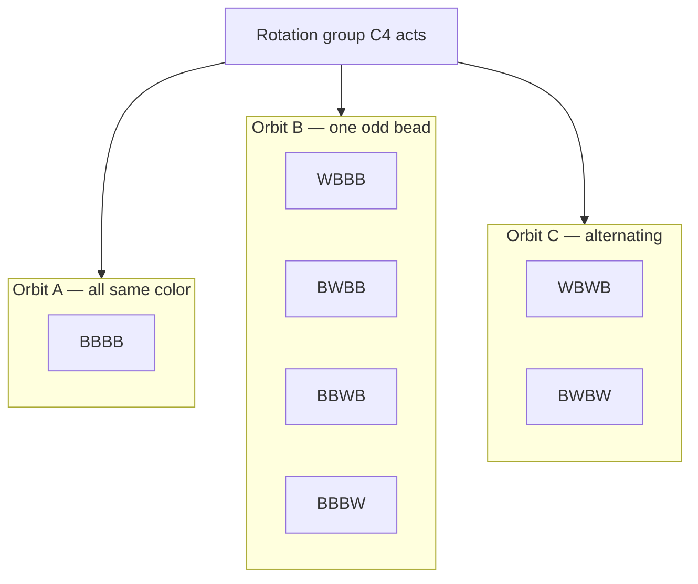
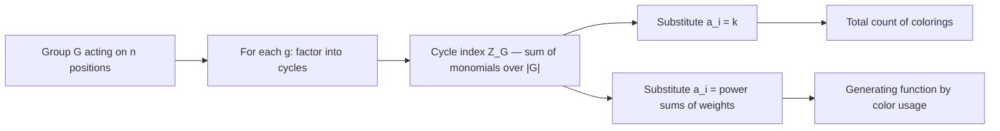

# Burnside's Lemma & Pólya Enumeration Theorem

Counting **distinct configurations up to symmetry** is a recurring theme in combinatorics: how many *different* necklaces, colored grids, dice, or molecules exist when rotations and reflections that map one configuration onto another are considered "the same"? Naively enumerating all configurations and deduplicating is exponential and error-prone. **Burnside's lemma** and its refinement, the **Pólya enumeration theorem**, give us clean closed forms by counting *fixed points* of symmetry operations instead.

This guide builds from group actions and orbits, through Burnside's lemma, the cycle index, and Pólya's theorem, to the classic necklace/bracelet/polyhedron counting formulas — all with paired Python and C++ implementations and modular arithmetic for competitive programming.

## Table of Contents

1. [Group Actions and Orbits](#group-actions-and-orbits)
2. [Burnside's Lemma](#burnsides-lemma)
3. [A Worked Example: Coloring a 2×2 Grid](#a-worked-example-coloring-a-22-grid)
4. [The Cycle Index and Pólya Enumeration Theorem](#the-cycle-index-and-polya-enumeration-theorem)
5. [Necklaces: The Cyclic Group $C_n$](#necklaces-the-cyclic-group-c_n)
6. [Bracelets: The Dihedral Group $D_n$](#bracelets-the-dihedral-group-d_n)
7. [More General Groups: Cube and Square Faces](#more-general-groups-cube-and-square-faces)
8. [Doing It All mod p](#doing-it-all-mod-p)
9. [Complexity Summary](#complexity-summary)
10. [Common Pitfalls](#common-pitfalls)
11. [Patterns](#patterns)

---

## Group Actions and Orbits

A **group** $G$ is a set of symmetry operations (rotations, reflections, permutations) that can be composed and inverted, with an identity element. When $G$ **acts** on a set $X$ of configurations, each $g \in G$ permutes $X$: it sends a configuration $x$ to another configuration $g \cdot x$ that "looks the same after applying the symmetry."

The **orbit** of a configuration $x$ is the set of all configurations reachable from it:

$$\text{Orb}(x) = \{\, g \cdot x : g \in G \,\}.$$

Two configurations are considered **identical up to symmetry** exactly when they lie in the same orbit. So **the number of distinct configurations is the number of orbits**.

The **stabilizer** of $x$ is the subgroup of symmetries that leave it unchanged:

$$\text{Stab}(x) = \{\, g \in G : g \cdot x = x \,\}.$$

The **orbit–stabilizer theorem** ties these together: $|\text{Orb}(x)| \cdot |\text{Stab}(x)| = |G|$.

The diagram below shows how rotations of a 4-bead ring partition all 2-colorings into orbits. Configurations in the same orbit are "the same necklace."



Each orbit collapses to **one** distinct necklace. The art is counting orbits *without* listing them.

---

## Burnside's Lemma

Listing orbits directly is hard. Burnside's lemma flips the problem: instead of counting orbits, count **fixed points** of each group element.

For $g \in G$, define its **fixed set**:

$$\text{Fix}(g) = \{\, x \in X : g \cdot x = x \,\}.$$

**Burnside's Lemma.** The number of orbits equals the *average* number of configurations fixed by the group elements:

$$\boxed{\;\#\text{orbits} \;=\; \frac{1}{|G|}\sum_{g \in G} |\text{Fix}(g)|\;}$$

**Intuition.** Count pairs $(g, x)$ with $g \cdot x = x$ in two ways. Summing over $g$ gives $\sum_g |\text{Fix}(g)|$. Summing over $x$ gives $\sum_x |\text{Stab}(x)|$, and by orbit–stabilizer each orbit of size $s$ contributes $s \cdot (|G|/s) = |G|$ to this sum, i.e. exactly $|G|$ per orbit. Equating the two counts and dividing by $|G|$ yields the lemma.

Pseudocode for the direct application:

```
burnside(G, X):
    total = 0
    for g in G:
        total += count_fixed_configurations(g, X)
    return total / |G|
```

The whole game becomes: **for each symmetry $g$, how many configurations does it leave unchanged?**

---

## A Worked Example: Coloring a 2×2 Grid

Color the four cells of a $2\times 2$ grid with $k$ colors. Two colorings are the same if one rotates into the other. The rotation group is $C_4 = \{e, r, r^2, r^3\}$ (rotations by $0°, 90°, 180°, 270°$).

A coloring is fixed by $g$ iff cells in the same **cycle of the permutation $g$ induces on the four cells** share a color. So $|\text{Fix}(g)| = k^{c(g)}$ where $c(g)$ is the number of cycles.

| $g$ | Cell permutation | Cycles $c(g)$ | $\text{Fix}(g) = k^{c(g)}$ |
|-----|------------------|---------------|----------------------------|
| $e$ (0°) | $(1)(2)(3)(4)$ | 4 | $k^4$ |
| $r$ (90°) | $(1\,2\,4\,3)$ | 1 | $k^1$ |
| $r^2$ (180°) | $(1\,4)(2\,3)$ | 2 | $k^2$ |
| $r^3$ (270°) | $(1\,3\,4\,2)$ | 1 | $k^1$ |

By Burnside:

$$\#\text{orbits} = \frac{1}{4}\left(k^4 + k + k^2 + k\right) = \frac{k^4 + k^2 + 2k}{4}.$$

For $k = 2$: $\frac{16 + 4 + 4}{4} = 6$ distinct colorings. Let's verify in code by brute force *and* by the formula.

```python
from itertools import product
from math import gcd

def grid2x2_rotations_bruteforce(k):
    # Cells indexed 0..3 as: 0 1 / 2 3
    # 90deg rotation maps positions: new[0]=old[2], new[1]=old[0],
    #                                new[2]=old[3], new[3]=old[1]
    def rotate(c):
        return (c[2], c[0], c[3], c[1])
    seen = set()
    for coloring in product(range(k), repeat=4):
        orbit = set()
        cur = coloring
        for _ in range(4):
            orbit.add(cur)
            cur = rotate(cur)
        seen.add(min(orbit))  # canonical representative
    return len(seen)

def grid2x2_rotations_formula(k):
    return (k**4 + k**2 + 2 * k) // 4

if __name__ == "__main__":
    for k in range(1, 5):
        print(k, grid2x2_rotations_bruteforce(k), grid2x2_rotations_formula(k))
```

```cpp
#include <bits/stdc++.h>
using namespace std;

int rotateApply(const array<int, 4> &c, array<int, 4> &out) {
    // new[0]=old[2], new[1]=old[0], new[2]=old[3], new[3]=old[1]
    out = {c[2], c[0], c[3], c[1]};
    return 0;
}

long long grid2x2RotationsBruteforce(int k) {
    set<array<int, 4>> seen;
    array<int, 4> coloring{};
    function<void(int)> rec = [&](int idx) {
        if (idx == 4) {
            array<int, 4> cur = coloring, best = coloring, tmp;
            for (int i = 0; i < 4; ++i) {
                best = min(best, cur);
                rotateApply(cur, tmp);
                cur = tmp;
            }
            seen.insert(best);
            return;
        }
        for (int col = 0; col < k; ++col) {
            coloring[idx] = col;
            rec(idx + 1);
        }
    };
    rec(0);
    return (long long)seen.size();
}

long long grid2x2RotationsFormula(int k) {
    long long kk = k;
    return (kk * kk * kk * kk + kk * kk + 2 * kk) / 4;
}

int main() {
    for (int k = 1; k <= 4; ++k) {
        cout << k << ' ' << grid2x2RotationsBruteforce(k)
             << ' ' << grid2x2RotationsFormula(k) << '\n';
    }
    return 0;
}
```

Both print matching brute-force and formula columns, confirming Burnside.

---

## The Cycle Index and Pólya Enumeration Theorem

The 2×2 example exposed the key fact: **a coloring with $k$ colors is fixed by $g$ iff each cycle of $g$ is monochromatic**, so

$$|\text{Fix}(g)| = k^{c(g)},$$

where $c(g)$ is the number of cycles in the permutation $g$ induces on the colored positions. Plugging this into Burnside gives the *plain count* version of Pólya's theorem.

**Pólya Enumeration Theorem (counting version).** The number of distinct colorings with $k$ colors is

$$\boxed{\;\#\text{colorings} \;=\; \frac{1}{|G|}\sum_{g \in G} k^{c(g)}\;}$$

The richer form uses the **cycle index polynomial** of $G$ acting on $n$ positions. If $g$ has $j_i$ cycles of length $i$, write the monomial $a_1^{j_1} a_2^{j_2}\cdots a_n^{j_n}$. The cycle index is

$$Z_G(a_1, a_2, \dots, a_n) = \frac{1}{|G|}\sum_{g \in G} \prod_{i=1}^{n} a_i^{\,j_i(g)}.$$

Substituting $a_i = k$ for all $i$ recovers the plain count $\frac{1}{|G|}\sum_g k^{c(g)}$. Substituting $a_i = x_1^i + x_2^i + \cdots + x_k^i$ (power sums of color "weights") gives the full **generating function** that tracks how many beads get each color — the complete Pólya theorem.



Generic implementation: enumerate group elements, count cycles of each, sum $k^{c(g)}$, divide by $|G|$.

```python
def polya_count(group_perms, k):
    """group_perms: list of permutations, each a list mapping position -> image."""
    n = len(group_perms[0])
    total = 0
    for perm in group_perms:
        seen = [False] * n
        cycles = 0
        for start in range(n):
            if not seen[start]:
                cycles += 1
                j = start
                while not seen[j]:
                    seen[j] = True
                    j = perm[j]
        total += k ** cycles
    return total // len(group_perms)
```

```cpp
#include <bits/stdc++.h>
using namespace std;

long long polyaCount(const vector<vector<int>> &groupPerms, long long k) {
    int n = (int)groupPerms[0].size();
    long long total = 0;
    for (const auto &perm : groupPerms) {
        vector<char> seen(n, 0);
        int cycles = 0;
        for (int start = 0; start < n; ++start) {
            if (!seen[start]) {
                ++cycles;
                int j = start;
                while (!seen[j]) {
                    seen[j] = 1;
                    j = perm[j];
                }
            }
        }
        long long term = 1;
        for (int i = 0; i < cycles; ++i) term *= k;
        total += term;
    }
    return total / (long long)groupPerms.size();
}
```

This single routine solves *every* finite-group counting problem in this guide once you provide the group's permutations.

---

## Necklaces: The Cyclic Group $C_n$

A **necklace** of $n$ beads in $k$ colors, considered the same under **rotation only**, corresponds to orbits under the cyclic group $C_n = \{r^0, r^1, \dots, r^{n-1}\}$, where $r^j$ rotates by $j$ positions.

The rotation $r^j$ decomposes the $n$ positions into $\gcd(n, j)$ cycles, each of length $n/\gcd(n,j)$. So $c(r^j) = \gcd(n, j)$ and Burnside gives

$$\#\text{necklaces} = \frac{1}{n}\sum_{j=0}^{n-1} k^{\gcd(n, j)}.$$

Grouping the $j$ by $d = \gcd(n, j)$ (there are exactly $\varphi(n/d)$ values of $j$ giving each divisor) yields the classic **closed form** with Euler's totient $\varphi$:

$$\boxed{\;\#\text{necklaces} = \frac{1}{n}\sum_{d \mid n} \varphi\!\left(\frac{n}{d}\right) k^{d} = \frac{1}{n}\sum_{d \mid n} \varphi(d)\, k^{\,n/d}\;}$$

```python
from math import gcd

def euler_phi(n):
    result = n
    p = 2
    m = n
    while p * p <= m:
        if m % p == 0:
            while m % p == 0:
                m //= p
            result -= result // p
        p += 1
    if m > 1:
        result -= result // m
    return result

def count_necklaces(n, k):
    total = 0
    d = 1
    while d * d <= n:
        if n % d == 0:
            total += euler_phi(n // d) * k ** d
            if d != n // d:
                total += euler_phi(d) * k ** (n // d)
        d += 1
    return total // n

if __name__ == "__main__":
    print(count_necklaces(4, 2))  # 6
    print(count_necklaces(6, 3))  # 130
```

```cpp
#include <bits/stdc++.h>
using namespace std;

long long eulerPhi(long long n) {
    long long result = n, m = n;
    for (long long p = 2; p * p <= m; ++p) {
        if (m % p == 0) {
            while (m % p == 0) m /= p;
            result -= result / p;
        }
    }
    if (m > 1) result -= result / m;
    return result;
}

long long ipow(long long base, long long exp) {
    long long r = 1;
    while (exp--) r *= base;
    return r;
}

long long countNecklaces(long long n, long long k) {
    long long total = 0;
    for (long long d = 1; d * d <= n; ++d) {
        if (n % d == 0) {
            total += eulerPhi(n / d) * ipow(k, d);
            if (d != n / d)
                total += eulerPhi(d) * ipow(k, n / d);
        }
    }
    return total / n;
}

int main() {
    cout << countNecklaces(4, 2) << '\n';  // 6
    cout << countNecklaces(6, 3) << '\n';  // 130
    return 0;
}
```

---

## Bracelets: The Dihedral Group $D_n$

A **bracelet** can be flipped over, so it is invariant under **both rotations and reflections**. The symmetry group is the **dihedral group** $D_n$ with $|D_n| = 2n$ elements: the $n$ rotations of $C_n$ plus $n$ reflections.

Counting reflections requires casing on parity of $n$:

- **$n$ odd:** every reflection axis passes through one bead and the midpoint of the opposite edge. Each reflection has $1$ fixed bead and $(n-1)/2$ swapped pairs, giving $c = \frac{n+1}{2}$ cycles. All $n$ reflections are alike, contributing $n \cdot k^{(n+1)/2}$.
- **$n$ even:** there are two axis types.
  - $n/2$ axes pass through **two opposite beads**: $2$ fixed beads $+ (n-2)/2$ pairs $\Rightarrow c = \frac{n}{2}+1$ cycles.
  - $n/2$ axes pass through **two opposite edges** (no fixed bead): $n/2$ pairs $\Rightarrow c = \frac{n}{2}$ cycles.

Combining with the rotation contribution $\sum_{d\mid n}\varphi(n/d)k^d$, the **closed forms** are:

$$\#\text{bracelets} = \frac{1}{2n}\left[\sum_{d\mid n}\varphi\!\Big(\frac{n}{d}\Big)k^{d}\;+\;R(n,k)\right],$$

$$R(n,k) = \begin{cases} n\, k^{\frac{n+1}{2}}, & n\text{ odd},\\[4pt] \dfrac{n}{2}\Big(k^{\frac{n}{2}} + k^{\frac{n}{2}+1}\Big), & n\text{ even}. \end{cases}$$

```python
from math import gcd

def euler_phi(n):
    result, m, p = n, n, 2
    while p * p <= m:
        if m % p == 0:
            while m % p == 0:
                m //= p
            result -= result // p
        p += 1
    if m > 1:
        result -= result // m
    return result

def rotation_sum(n, k):
    total, d = 0, 1
    while d * d <= n:
        if n % d == 0:
            total += euler_phi(n // d) * k ** d
            if d != n // d:
                total += euler_phi(d) * k ** (n // d)
        d += 1
    return total

def count_bracelets(n, k):
    rot = rotation_sum(n, k)
    if n % 2 == 1:
        refl = n * k ** ((n + 1) // 2)
    else:
        refl = (n // 2) * (k ** (n // 2) + k ** (n // 2 + 1))
    return (rot + refl) // (2 * n)

if __name__ == "__main__":
    print(count_bracelets(4, 2))  # 6
    print(count_bracelets(5, 2))  # 8
```

```cpp
#include <bits/stdc++.h>
using namespace std;

long long eulerPhi(long long n) {
    long long result = n, m = n;
    for (long long p = 2; p * p <= m; ++p) {
        if (m % p == 0) {
            while (m % p == 0) m /= p;
            result -= result / p;
        }
    }
    if (m > 1) result -= result / m;
    return result;
}

long long ipow(long long base, long long exp) {
    long long r = 1;
    while (exp--) r *= base;
    return r;
}

long long rotationSum(long long n, long long k) {
    long long total = 0;
    for (long long d = 1; d * d <= n; ++d) {
        if (n % d == 0) {
            total += eulerPhi(n / d) * ipow(k, d);
            if (d != n / d)
                total += eulerPhi(d) * ipow(k, n / d);
        }
    }
    return total;
}

long long countBracelets(long long n, long long k) {
    long long rot = rotationSum(n, k), refl;
    if (n % 2 == 1) {
        refl = n * ipow(k, (n + 1) / 2);
    } else {
        refl = (n / 2) * (ipow(k, n / 2) + ipow(k, n / 2 + 1));
    }
    return (rot + refl) / (2 * n);
}

int main() {
    cout << countBracelets(4, 2) << '\n';  // 6
    cout << countBracelets(5, 2) << '\n';  // 8
    return 0;
}
```

---

## More General Groups: Cube and Square Faces

For 3D objects there is no neat totient formula; instead **enumerate the rotation group explicitly** and count cycles of each element on the faces (or vertices/edges).

A cube has a **rotation group of order 24**. Acting on its **6 faces**, the elements split into conjugacy classes:

| Class | Count | Cycle structure on 6 faces | $c(g)$ | Contribution |
|-------|-------|----------------------------|--------|--------------|
| identity | 1 | $(1)(2)(3)(4)(5)(6)$ | 6 | $k^6$ |
| face-axis $90°,270°$ | 6 | two fixed + one 4-cycle | 3 | $k^3$ each |
| face-axis $180°$ | 3 | two fixed + two 2-cycles | 4 | $k^4$ each |
| vertex-axis $120°,240°$ | 8 | two 3-cycles | 2 | $k^2$ each |
| edge-axis $180°$ | 6 | three 2-cycles | 3 | $k^3$ each |

By Pólya:

$$\#\text{cube face colorings} = \frac{1}{24}\left(k^6 + 6k^3 + 3k^4 + 8k^2 + 6k^3\right) = \frac{k^6 + 3k^4 + 12k^3 + 8k^2}{24}.$$

For $k=2$ this gives $\frac{64 + 48 + 96 + 32}{24} = 10$ distinct ways to 2-color the faces of a cube.

```python
def cube_face_colorings(k):
    # Enumerate the 24 rotations as permutations of 6 faces, then apply Pólya.
    # Faces: 0=U,1=D,2=F,3=B,4=L,5=R
    perms = []
    # Identity
    perms.append([0, 1, 2, 3, 4, 5])
    # 90/180/270 about the U-D (vertical) axis: F->R->B->L->F
    perms.append([0, 1, 5, 4, 2, 3])  # 90
    perms.append([0, 1, 3, 2, 5, 4])  # 180
    perms.append([0, 1, 4, 5, 3, 2])  # 270
    # about F-B axis: U->R->D->L->U
    perms.append([4, 5, 2, 3, 1, 0])  # 90
    perms.append([1, 0, 2, 3, 5, 4])  # 180
    perms.append([5, 4, 2, 3, 0, 1])  # 270
    # about L-R axis: U->F->D->B->U
    perms.append([3, 2, 0, 1, 4, 5])  # 90
    perms.append([1, 0, 3, 2, 4, 5])  # 180
    perms.append([2, 3, 1, 0, 4, 5])  # 270
    # vertex axes (120/240), 8 total
    perms.append([2, 3, 5, 4, 0, 1])
    perms.append([4, 5, 0, 1, 2, 3])
    perms.append([3, 2, 4, 5, 1, 0])
    perms.append([5, 4, 1, 0, 3, 2])
    perms.append([2, 3, 4, 5, 1, 0])
    perms.append([5, 4, 0, 1, 2, 3])
    perms.append([4, 5, 1, 0, 3, 2])
    perms.append([3, 2, 5, 4, 0, 1])
    # edge axes (180), 6 total
    perms.append([2, 3, 0, 1, 5, 4])
    perms.append([3, 2, 1, 0, 5, 4])
    perms.append([5, 4, 3, 2, 1, 0])
    perms.append([4, 5, 2, 3, 0, 1])
    perms.append([1, 0, 4, 5, 2, 3])
    perms.append([1, 0, 5, 4, 3, 2])

    total = 0
    for perm in perms:
        seen = [False] * 6
        cycles = 0
        for s in range(6):
            if not seen[s]:
                cycles += 1
                j = s
                while not seen[j]:
                    seen[j] = True
                    j = perm[j]
        total += k ** cycles
    return total // len(perms)

def cube_face_colorings_formula(k):
    return (k**6 + 3 * k**4 + 12 * k**3 + 8 * k**2) // 24

if __name__ == "__main__":
    for k in range(1, 4):
        print(k, cube_face_colorings(k), cube_face_colorings_formula(k))
```

```cpp
#include <bits/stdc++.h>
using namespace std;

long long cubeFaceColorings(long long k) {
    // 24 rotations as permutations of 6 faces (0=U,1=D,2=F,3=B,4=L,5=R).
    vector<vector<int>> perms = {
        {0, 1, 2, 3, 4, 5},
        {0, 1, 5, 4, 2, 3}, {0, 1, 3, 2, 5, 4}, {0, 1, 4, 5, 3, 2},
        {4, 5, 2, 3, 1, 0}, {1, 0, 2, 3, 5, 4}, {5, 4, 2, 3, 0, 1},
        {3, 2, 0, 1, 4, 5}, {1, 0, 3, 2, 4, 5}, {2, 3, 1, 0, 4, 5},
        {2, 3, 5, 4, 0, 1}, {4, 5, 0, 1, 2, 3}, {3, 2, 4, 5, 1, 0},
        {5, 4, 1, 0, 3, 2}, {2, 3, 4, 5, 1, 0}, {5, 4, 0, 1, 2, 3},
        {4, 5, 1, 0, 3, 2}, {3, 2, 5, 4, 0, 1},
        {2, 3, 0, 1, 5, 4}, {3, 2, 1, 0, 5, 4}, {5, 4, 3, 2, 1, 0},
        {4, 5, 2, 3, 0, 1}, {1, 0, 4, 5, 2, 3}, {1, 0, 5, 4, 3, 2}};

    long long total = 0;
    for (const auto &perm : perms) {
        vector<char> seen(6, 0);
        int cycles = 0;
        for (int s = 0; s < 6; ++s) {
            if (!seen[s]) {
                ++cycles;
                int j = s;
                while (!seen[j]) { seen[j] = 1; j = perm[j]; }
            }
        }
        long long term = 1;
        for (int i = 0; i < cycles; ++i) term *= k;
        total += term;
    }
    return total / (long long)perms.size();
}

long long cubeFaceColoringsFormula(long long k) {
    return (k*k*k*k*k*k + 3*k*k*k*k + 12*k*k*k + 8*k*k) / 24;
}

int main() {
    for (long long k = 1; k <= 3; ++k)
        cout << k << ' ' << cubeFaceColorings(k) << ' '
             << cubeFaceColoringsFormula(k) << '\n';
    return 0;
}
```

The takeaway: **for any concrete object, list the group permutations once, then the generic cycle-counting routine does the rest.**

---

## Doing It All mod p

Burnside and Pólya both end with a division by $|G|$. Under a prime modulus $p$ we cannot divide directly — we multiply by the **modular inverse** of $|G|$, computed via Fermat's little theorem ($|G|^{-1} \equiv |G|^{p-2} \pmod p$), valid whenever $\gcd(|G|, p) = 1$ (true for $p = 10^9+7$ and small groups).

$$\#\text{orbits} \equiv \left(\sum_{g\in G} |\text{Fix}(g)| \bmod p\right) \cdot |G|^{\,p-2} \pmod p.$$

Replace every $k^{c}$ with modular exponentiation. Here is the necklace count mod $p$ as a template:

```python
MOD = 10**9 + 7

def power(base, exp, mod):
    result = 1
    base %= mod
    while exp > 0:
        if exp & 1:
            result = result * base % mod
        base = base * base % mod
        exp >>= 1
    return result

def inverse(a, mod):
    return power(a, mod - 2, mod)

def euler_phi(n):
    result, m, p = n, n, 2
    while p * p <= m:
        if m % p == 0:
            while m % p == 0:
                m //= p
            result -= result // p
        p += 1
    if m > 1:
        result -= result // m
    return result

def count_necklaces_mod(n, k):
    total, d = 0, 1
    while d * d <= n:
        if n % d == 0:
            total = (total + euler_phi(n // d) * power(k, d, MOD)) % MOD
            if d != n // d:
                total = (total + euler_phi(d) * power(k, n // d, MOD)) % MOD
        d += 1
    return total * inverse(n % MOD, MOD) % MOD

if __name__ == "__main__":
    print(count_necklaces_mod(4, 2))  # 6
```

```cpp
#include <bits/stdc++.h>
using namespace std;
const long long MOD = 1e9 + 7;

long long power(long long base, long long exp, long long mod) {
    long long result = 1;
    base %= mod;
    while (exp > 0) {
        if (exp & 1) result = result * base % mod;
        base = base * base % mod;
        exp >>= 1;
    }
    return result;
}

long long inverse(long long a, long long mod) {
    return power(a, mod - 2, mod);
}

long long eulerPhi(long long n) {
    long long result = n, m = n;
    for (long long p = 2; p * p <= m; ++p) {
        if (m % p == 0) {
            while (m % p == 0) m /= p;
            result -= result / p;
        }
    }
    if (m > 1) result -= result / m;
    return result;
}

long long countNecklacesMod(long long n, long long k) {
    long long total = 0;
    for (long long d = 1; d * d <= n; ++d) {
        if (n % d == 0) {
            total = (total + eulerPhi(n / d) % MOD * power(k, d, MOD)) % MOD;
            if (d != n / d)
                total = (total + eulerPhi(d) % MOD * power(k, n / d, MOD)) % MOD;
        }
    }
    return total * inverse(n % MOD, MOD) % MOD;
}

int main() {
    cout << countNecklacesMod(4, 2) << '\n';  // 6
    return 0;
}
```

---

## Complexity Summary

Let $n$ be the number of positions, $k$ the colors, $|G|$ the group size, and $d(n)$ the number of divisors of $n$.

| Task | Method | Time | Space |
|------|--------|------|-------|
| Generic Burnside / Pólya | enumerate $G$, count cycles | $O(|G|\cdot n)$ | $O(n)$ |
| Necklaces ($C_n$) | totient closed form | $O(\sqrt{n}\,d(n) + d(n)\log k)$ | $O(1)$ |
| Bracelets ($D_n$) | totient + reflection terms | $O(\sqrt{n}\,d(n) + d(n)\log k)$ | $O(1)$ |
| Cube / fixed polyhedron | enumerate 24 (or $|G|$) perms | $O(|G|\cdot F)$ | $O(F)$ |
| Modular variant | + modular exponent/inverse | $\times\,O(\log)$ factors | same |

The closed-form necklace/bracelet routines are effectively $O(\sqrt n)$ — they handle $n$ up to $10^{18}$ when arithmetic is done mod $p$.

---

## Common Pitfalls

- **Forgetting to divide by $|G|$.** The sum of fixed points is *not* the answer; divide (or multiply by the modular inverse) by the group order.
- **Including the identity is required.** $e$ fixes *all* $k^n$ configurations and is the dominant term — do not skip it.
- **Confusing $c(g)$ with cycle length.** Pólya uses the **number** of cycles, not their lengths. For rotation $r^j$ on $n$ beads, $c = \gcd(n,j)$.
- **Wrong reflection casing for $D_n$.** Odd and even $n$ have structurally different reflections; mixing them gives wrong (often non-integer) counts.
- **Dividing under a modulus.** Never use integer division mod $p$; multiply by the modular inverse, and ensure $\gcd(|G|, p) = 1$.
- **Overflow before reduction.** In C++, reduce products mod $p$ at every multiplication; an unreduced $k^n$ overflows `long long` instantly.
- **Acting on the wrong set.** Decide whether the group permutes faces, vertices, edges, or cells — the cycle structure (and answer) differs for each.
- **Assuming a closed form exists.** Beyond cyclic/dihedral groups, just enumerate the group elements; there is no universal totient shortcut.

---

## Patterns

- **Count orbits = average fixed points.** Whenever a problem says "two configurations are the same if a symmetry maps one to the other," reach for Burnside.
- **Fixed $\Leftrightarrow$ monochromatic cycles.** With $k$ free colors, $|\text{Fix}(g)| = k^{c(g)}$ — reduces counting to cycle counting.
- **Decompose-then-sum.** Factor each group element into cycles, raise $k$ to the cycle count, sum, divide by $|G|$.
- **Closed forms for $C_n$ and $D_n$.** Memorize the totient necklace formula and the dihedral reflection cases; they appear constantly in necklace/bracelet problems.
- **Enumerate for finite polyhedra.** For cubes, tetrahedra, squares, list the group as explicit permutations and feed them to the generic cycle-counter.
- **Modular discipline.** Sum mod $p$, then multiply by $|G|^{-1}$; use fast exponentiation for both the color powers and the inverse.
- **Sanity-check by brute force.** For small $n, k$, deduplicate orbits directly and compare against the formula before trusting it on large inputs.
