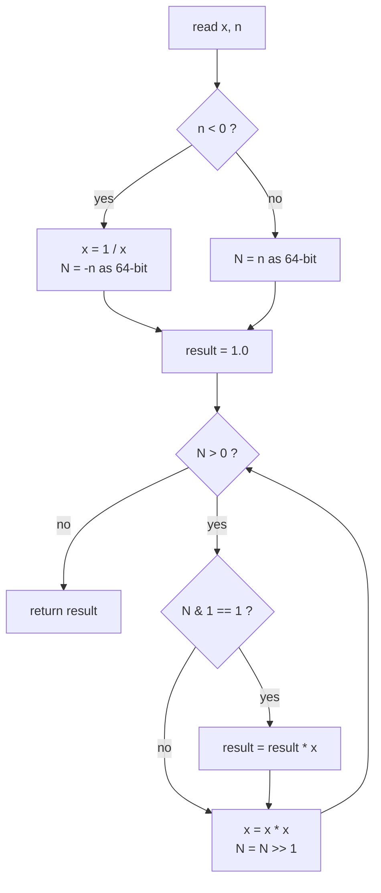
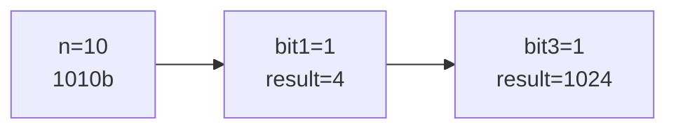

# LeetCode 50 — Pow(x, n)

| | |
|---|---|
| **Source** | LeetCode |
| **Difficulty** | Medium |
| **Topics** | Binary (fast) exponentiation, Math, Recursion |
| **Link** | https://leetcode.com/problems/powx-n/ |

---

## Problem Statement

Implement `pow(x, n)`, which computes $x$ raised to the integer power $n$ (i.e. $x^n$) — **without** modular arithmetic, on real-valued `double` $x$, where $n$ may be **negative**.

**Constraints**

$$
-100.0 < x < 100.0, \qquad -2^{31} \le n \le 2^{31} - 1, \qquad n \in \mathbb{Z}.
$$

Either $x \ne 0$ or $n > 0$, and the result is guaranteed to fit in a `double`.

```
Input:  x = 2.00000, n = 10
Output: 1024.00000

Input:  x = 2.10000, n = 3
Output: 9.26100

Input:  x = 2.00000, n = -2
Output: 0.25000     (2^-2 = 1 / 2^2 = 1/4)
```

> Two traps: (1) negating $n$ to handle negatives overflows when $n = -2^{31}$, since $+2^{31}$ is out of `int` range; (2) repeated squaring of a `double` is the floating-point analogue of the integer algorithm.

---

## Approach (WHY)

The same binary-exponentiation identity applies to real numbers:

$$
x^n =
\begin{cases}
\left(x^{2}\right)^{n/2}, & n \text{ even} \\[4pt]
x \cdot \left(x^{2}\right)^{(n-1)/2}, & n \text{ odd}
\end{cases}
$$

We square $x$ each step and multiply it into the result whenever the current exponent bit is $1$ — $O(\log n)$ multiplications instead of $O(n)$.

**Negative exponent.** $x^{-n} = 1 / x^n = (1/x)^n$. The clean trick is to widen $n$ to a 64-bit `long`, take its absolute value there (so $-2^{31}$ does not overflow), and if $n$ was negative, replace $x$ by $1/x$. Then run the standard positive-exponent loop.



---

## Solution

### Python

```python
class Solution:
    def myPow(self, x: float, n: int) -> float:
        # Python ints are unbounded, so -n never overflows
        N = n
        if N < 0:
            x = 1 / x
            N = -N
        result = 1.0
        while N > 0:
            if N & 1:
                result *= x
            x *= x
            N >>= 1
        return result
```

### C++

```cpp
class Solution {
public:
    double myPow(double x, int n) {
        // widen to 64-bit BEFORE negating so n = -2^31 does not overflow
        long long N = n;
        if (N < 0) {
            x = 1.0 / x;
            N = -N;
        }
        double result = 1.0;
        while (N > 0) {
            if (N & 1) result *= x;
            x *= x;
            N >>= 1;
        }
        return result;
    }
};
```

---

## Iteration Trace

Computing `myPow(2.0, -2)`. Since $n < 0$: set $x = 0.5$, $N = 2$ (binary $10_2$).

| Step | N (binary) | bit | x in | result in | took bit? | result out | x out |
|------|-----------|-----|------|-----------|-----------|------------|-------|
| 1 | 10 | 0 | 0.5 | 1.0 | no | 1.0 | 0.25 |
| 2 | 1 | 1 | 0.25 | 1.0 | yes | 0.25 | 0.0625 |
| — | 0 | — | — | 0.25 | stop | **0.25** | — |

Result $0.25 = 2^{-2}$. A second trace, `myPow(2.0, 10)` with $N = 1010_2$:

| Step | N (binary) | bit | x in | result in | took bit? | result out | x out |
|------|-----------|-----|------|-----------|-----------|------------|-------|
| 1 | 1010 | 0 | 2 | 1 | no | 1 | 4 |
| 2 | 101 | 1 | 4 | 1 | yes | 4 | 16 |
| 3 | 10 | 0 | 16 | 4 | no | 4 | 256 |
| 4 | 1 | 1 | 256 | 4 | yes | 1024 | 65536 |
| — | 0 | — | — | 1024 | stop | **1024** | — |



---

## Complexity

The loop runs once per bit of $|n|$, so it performs $O(\log n)$ floating-point multiplications:

$$
O(\log |n|).
$$

| Metric | Value |
|--------|-------|
| Time | $O(\log n)$ |
| Space | $O(1)$ (iterative; recursion would add $O(\log n)$ stack) |

---

## Takeaway

Binary exponentiation works identically on `double` bases — square `x`, read one exponent bit per step. For negative $n$, replace `x` with `1/x` and operate on $|n|$, but **widen $n$ to 64 bits before negating** so that $n = -2^{31}$ does not overflow when flipped to $+2^{31}$.
