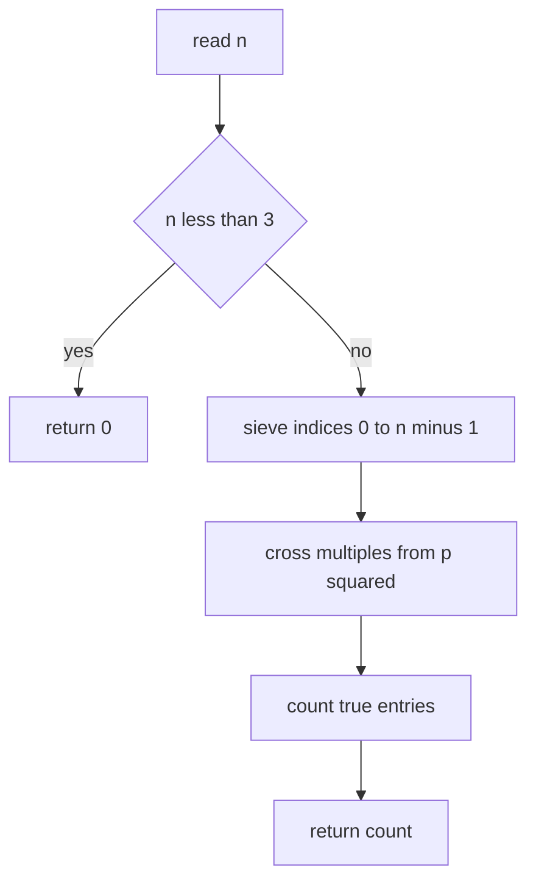
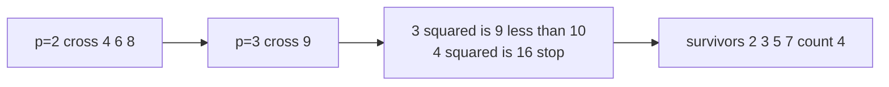

# LeetCode 204 — Count Primes

| Field | Value |
|---|---|
| Source | LeetCode |
| Difficulty | Medium |
| Topics | Sieve of Eratosthenes, prime counting |
| Link | https://leetcode.com/problems/count-primes/ |

---

## Problem Statement

Given an integer $n$, return the number of prime numbers that are **strictly less than** $n$.

$$
\text{answer} = \bigl|\{\, p : 2 \le p < n,\ p \text{ is prime}\,\}\bigr| = \pi(n - 1).
$$

Note the strict inequality: for $n = 10$ the primes counted are $2, 3, 5, 7$.

Constraints: $0 \le n \le 5 \times 10^6$.

```text
Input:  n = 10
Output: 4
Explanation: primes below 10 are 2, 3, 5, 7

Input:  n = 0
Output: 0

Input:  n = 1
Output: 0
```

## Approach (WHY)

The bound is small enough ($\le 5 \times 10^6$) that a single Sieve of Eratosthenes over $[0, n)$ runs comfortably. We mark composites and count survivors.

The only subtlety versus a classic sieve is the **strict** bound: we care about indices $< n$, so the array has size $n$ (indices $0 \dots n-1$) and we never consider $n$ itself. Edge cases $n \le 2$ return $0$ because there are no primes below $2$.



## Solution

### Python

```python
class Solution:
    def countPrimes(self, n: int) -> int:
        if n < 3:
            return 0
        is_prime = bytearray([1]) * n  # indices 0 .. n-1
        is_prime[0] = is_prime[1] = 0
        p = 2
        while p * p < n:
            if is_prime[p]:
                is_prime[p * p : n : p] = bytearray(len(range(p * p, n, p)))
            p += 1
        return sum(is_prime)


if __name__ == "__main__":
    print(Solution().countPrimes(10))  # 4
    print(Solution().countPrimes(0))   # 0
    print(Solution().countPrimes(1))   # 0
```

### C++

```cpp
#include <bits/stdc++.h>
using namespace std;

class Solution {
public:
    int countPrimes(int n) {
        if (n < 3) return 0;
        vector<char> is_prime(n, true);  // indices 0 .. n-1
        is_prime[0] = is_prime[1] = false;
        for (long long p = 2; p * p < n; ++p) {
            if (is_prime[p]) {
                for (long long multiple = p * p; multiple < n; multiple += p)
                    is_prime[multiple] = false;
            }
        }
        int count = 0;
        for (int i = 2; i < n; ++i)
            if (is_prime[i]) ++count;
        return count;
    }
};

int main() {
    Solution s;
    cout << s.countPrimes(10) << '\n';  // 4
    cout << s.countPrimes(0) << '\n';   // 0
    cout << s.countPrimes(1) << '\n';   // 0
    return 0;
}
```

## Iteration Trace

For $n = 10$ (count primes $< 10$), the loop runs while $p^2 < 10$, i.e. $p = 2, 3$:

| Prime $p$ | Start $p^2$ | Crossed out (indices $< 10$) |
|---|---|---|
| 2 | 4 | 4, 6, 8 |
| 3 | 9 | 9 |
| 4 | 16 ≥ 10 | loop stops |

Remaining primes below $10$: $2, 3, 5, 7$ — count $= 4$.



The marking cost is the harmonic-over-primes sum, giving

$$
O(n \log \log n).
$$

## Complexity

| Aspect | Cost |
|---|---|
| Time | $O(n \log \log n)$ |
| Space | $O(n)$ |

## Takeaway

LeetCode 204 is the canonical sieve warm-up. The one trap is the **strict** upper bound — size the array to $n$ and sieve only indices below $n$. Everything else is the textbook Eratosthenes mark-and-count.
