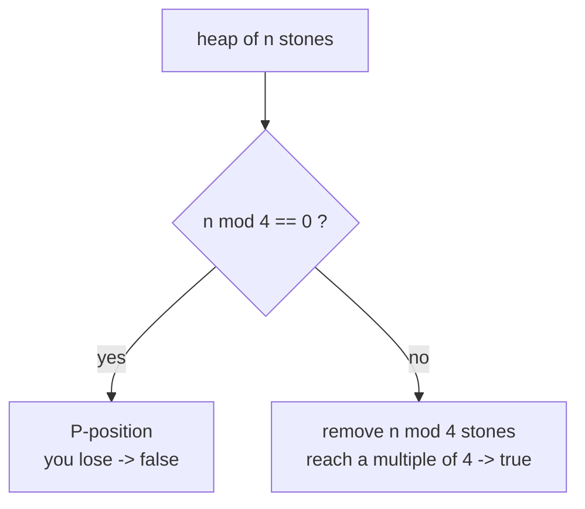
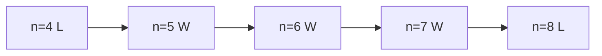

# LeetCode 292 — Nim Game

| | |
|---|---|
| **Source** | LeetCode |
| **Difficulty** | Easy |
| **Topics** | Game theory, Math, Modular reasoning |
| **Link** | https://leetcode.com/problems/nim-game/ |

---

## Problem Statement

You and a friend take turns removing $1$, $2$, or $3$ stones from a single heap of $n$ stones. You move **first**. Whoever removes the **last** stone **wins**. Both play optimally.

Return `true` if you can win, otherwise `false`.

**Constraints**

$$
1 \le n \le 2^{31} - 1.
$$

```
Input
n = 4
Output
false

Input
n = 1
Output
true

Input
n = 6
Output
true
```

With $n = 4$: whatever you take (1, 2, or 3) leaves 3, 2, or 1 stones — all of which your friend can clear in one move, so you lose. With $n = 6$ you take 2, leaving 4 (a losing position for your friend).

---

## Approach (WHY)

This is the subtraction game $\mathrm{Sub}(\{1,2,3\})$ under **last-move-wins** (normal play). The losing positions for the mover are exactly the **multiples of 4**.

**Inductive reasoning.** From a heap that is a multiple of 4, every move leaves $4k - 1$, $4k - 2$, or $4k - 3$ — never another multiple of 4. From any non-multiple of 4 you can always remove $1$, $2$, or $3$ to *reach* the nearest lower multiple of 4, handing your opponent the losing state. The base case $n = 0$ is a loss for the mover (nothing to take). Therefore:

$$
\text{first player wins} \iff n \bmod 4 \ne 0.
$$

The Grundy view agrees: $g(n) = n \bmod 4$, and $g(n) = 0$ (a P-position) precisely when $4 \mid n$.



---

## Solution

### Python

```python
class Solution:
    def canWinNim(self, n: int) -> bool:
        return n % 4 != 0
```

### C++

```cpp
class Solution {
public:
    bool canWinNim(int n) {
        return n % 4 != 0;
    }
};
```

A standalone driver demonstrating the same logic:

```python
def can_win_nim(n: int) -> bool:
    return n % 4 != 0

if __name__ == "__main__":
    for n in [1, 2, 3, 4, 5, 6, 7, 8]:
        print(n, can_win_nim(n))
```

```cpp
#include <bits/stdc++.h>
using namespace std;

bool can_win_nim(long long n) {
    return n % 4 != 0;
}

int main() {
    for (long long n : {1, 2, 3, 4, 5, 6, 7, 8})
        cout << n << ' ' << (can_win_nim(n) ? "true" : "false") << '\n';
    return 0;
}
```

---

## Iteration Trace

Small heaps classified directly from the recurrence (W = mover wins, L = mover loses):

| $n$ | $n \bmod 4$ | Result | Winning move |
|---|---|---|---|
| 0 | 0 | L | — |
| 1 | 1 | W | take 1 → 0 |
| 2 | 2 | W | take 2 → 0 |
| 3 | 3 | W | take 3 → 0 |
| 4 | 0 | L | every move loses |
| 5 | 1 | W | take 1 → 4 |
| 6 | 2 | W | take 2 → 4 |
| 7 | 3 | W | take 3 → 4 |
| 8 | 0 | L | every move loses |

The pattern **W W W L** repeats with period 4.



---

## Complexity

A single modulo operation answers the query:

$$
\text{Time } = O(1), \qquad \text{Space } = O(1).
$$

| Aspect | Cost |
|---|---|
| Time | $O(1)$ |
| Space | $O(1)$ |

---

## Takeaway

For the take-$1$-to-$3$ game, **you lose exactly on multiples of 4**. This is the canonical example of a subtraction game whose Grundy values follow $g(n) = n \bmod (\text{max move} + 1)$ — the period equals one more than the largest allowed removal.
