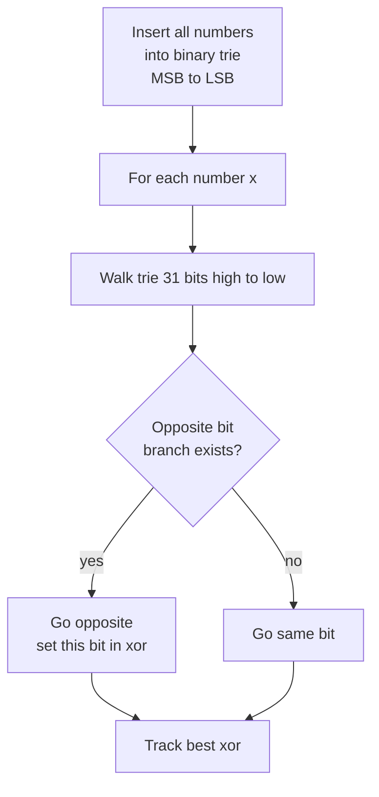
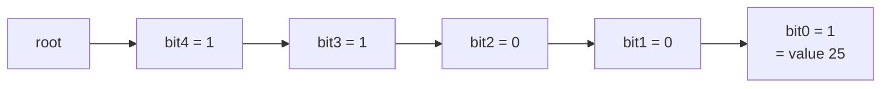

# Maximum XOR of Two Numbers in an Array

| Field | Value |
| --- | --- |
| Source | LeetCode 421 |
| Difficulty | Medium |
| Topics | Bit Manipulation, Trie, Greedy, Hash Set |
| Link | https://leetcode.com/problems/maximum-xor-of-two-numbers-in-an-array/ |

---

## Problem Statement

Given an integer array `nums`, return the maximum result of $a \oplus b$ where $a$ and $b$ are **two distinct elements** (by index) of the array.

$$
\text{answer} = \max_{i \ne j} \; nums_i \oplus nums_j.
$$

Constraints: $1 \le \texttt{nums.length} \le 2 \cdot 10^5$ and $0 \le nums_i < 2^{31}$.

```
Input:  nums = [3, 10, 5, 25, 2, 8]
Output: 28
Explanation: 5 XOR 25 = 28, the maximum over all pairs.
```

A brute force over all $\binom{n}{2}$ pairs is $O(n^2)$ — too slow at $2 \cdot 10^5$. We need to find the best partner for each number without testing every pair.

---

## Approach (WHY)

To maximize a XOR we want the **highest possible bit set**, then the next, and so on — a greedy bit-by-bit decision. A **binary trie** (each number stored as a path of its 31 bits, most significant first) makes "find the best partner" cheap: walking down the trie we always try to branch to the **opposite** bit, because a differing bit contributes a $1$ at that position to the XOR. If the opposite branch exists we take it; otherwise we follow the same bit.

Insert every number, then for each number walk the trie greedily to find its maximum-XOR partner. Each insert and each query touches exactly 31 nodes, so the whole thing is $O(n \cdot B)$ with $B = 31$.

An equivalent, even shorter view uses a **prefix + hash set** trick: build the answer bit by bit, and at each step check whether some pair can realize the candidate prefix using XOR's property $a \oplus b = p \Rightarrow a = p \oplus b$. We present the trie because it generalizes cleanly and matches the linear-basis intuition.



---

## Solution

### Python

```python
from typing import List


class TrieNode:
    __slots__ = ("child",)

    def __init__(self):
        self.child = [None, None]  # child[0], child[1]


class Solution:
    HIGH = 30  # since nums[i] < 2^31

    def findMaximumXOR(self, nums: List[int]) -> int:
        root = TrieNode()

        # Insert every number, most significant bit first.
        for x in nums:
            node = root
            for b in range(self.HIGH, -1, -1):
                bit = (x >> b) & 1
                if node.child[bit] is None:
                    node.child[bit] = TrieNode()
                node = node.child[bit]

        best = 0
        for x in nums:
            node = root
            cur = 0
            for b in range(self.HIGH, -1, -1):
                bit = (x >> b) & 1
                want = bit ^ 1  # prefer the opposite bit
                if node.child[want] is not None:
                    cur |= (1 << b)
                    node = node.child[want]
                else:
                    node = node.child[bit]
            best = max(best, cur)
        return best
```

### C++

```cpp
#include <bits/stdc++.h>
using namespace std;

class Solution {
    static const int HIGH = 30;  // nums[i] < 2^31

    struct Node {
        array<int, 2> child{-1, -1};
    };

public:
    int findMaximumXOR(vector<int>& nums) {
        vector<Node> trie(1);  // index 0 is the root

        // Insert every number, most significant bit first.
        for (int x : nums) {
            int node = 0;
            for (int b = HIGH; b >= 0; --b) {
                int bit = (x >> b) & 1;
                if (trie[node].child[bit] == -1) {
                    trie[node].child[bit] = (int)trie.size();
                    trie.emplace_back();
                }
                node = trie[node].child[bit];
            }
        }

        int best = 0;
        for (int x : nums) {
            int node = 0, cur = 0;
            for (int b = HIGH; b >= 0; --b) {
                int bit = (x >> b) & 1;
                int want = bit ^ 1;  // prefer the opposite bit
                if (trie[node].child[want] != -1) {
                    cur |= (1 << b);
                    node = trie[node].child[want];
                } else {
                    node = trie[node].child[bit];
                }
            }
            best = max(best, cur);
        }
        return best;
    }
};
```

---

## Iteration Trace

Querying `x = 5` (binary `00101`) against a trie holding `25` (`11001`), focusing on the top 5 bits:

| Bit | x bit | want (opposite) | branch taken | partner bit | xor bit |
| --- | --- | --- | --- | --- | --- |
| 4 | 0 | 1 | opposite exists (25 has 1) | 1 | 1 |
| 3 | 0 | 1 | opposite exists | 1 | 1 |
| 2 | 1 | 0 | opposite exists | 0 | 1 |
| 1 | 0 | 1 | none, follow same | 0 | 0 |
| 0 | 1 | 0 | opposite exists | 1 | 1 |

Resulting XOR bits `11011` = $5 \oplus 25 = 28$, the global maximum.



---

Each of the $n$ numbers is inserted and queried with a fixed $B = 31$ bit walk:

$$
T(n) = O(n \cdot B), \qquad B = 31.
$$

## Complexity

| Aspect | Cost |
| --- | --- |
| Time | $O(n \cdot B)$ |
| Space | $O(n \cdot B)$ for the trie |

---

## Takeaway

Maximizing a pairwise XOR is a **greedy, most-significant-bit-first** decision. A binary trie lets each number find its best partner in $O(B)$ by always preferring the opposite bit, collapsing the $O(n^2)$ pair scan into $O(n \cdot B)$.
