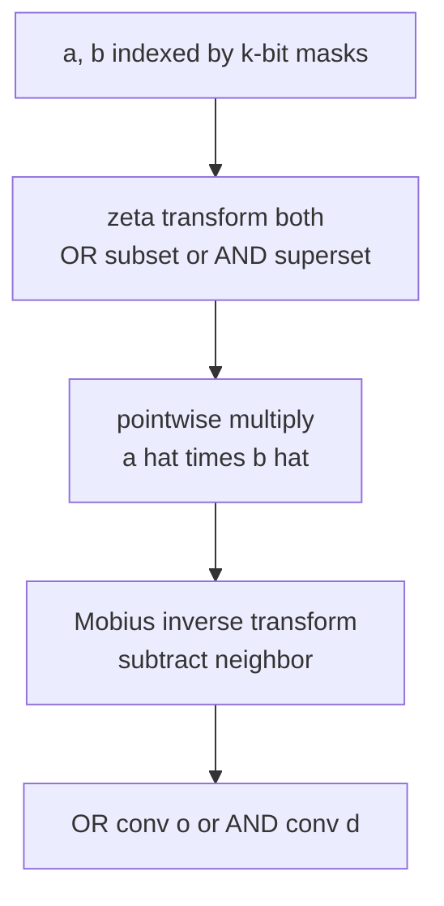
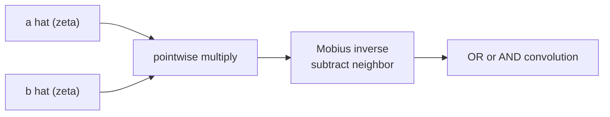

# AND / OR Convolution via the SOS (Subset/Superset) Transform

| | |
| --- | --- |
| **Source** | Classic (Sum over Subsets / Zeta–Möbius) |
| **Difficulty** | Medium |
| **Topics** | SOS DP, Zeta/Möbius Transform, AND/OR Convolution, Bitmasks |
| **Link** | https://cses.fi/problemset/ |

---

## Problem Statement

You are given two arrays $a_0, \dots, a_{n-1}$ and $b_0, \dots, b_{n-1}$ of length $n = 2^k$, indexed by $k$-bit masks. Compute both the **OR convolution** and the **AND convolution**:

$$o_t = \sum_{i \mid j = t} a_i \, b_j, \qquad \quad d_t = \sum_{i \,\&\, j = t} a_i \, b_j.$$

```text
Input:
A = [1, 2, 3, 4]      # n = 4 = 2^2, indices are 2-bit masks 00,01,10,11
B = [5, 6, 7, 8]

OR-convolution  O (o_t = sum over i OR j = t of A[i]*B[j]):
O = [5, 22, 31, 142]

AND-convolution D (d_t = sum over i AND j = t of A[i]*B[j]):
D = [110, 44, 39, 32]
# e.g. o_0: only 0|0 = 0  -> A[0]*B[0] = 1*5 = 5
#      d_3: only 3&3 = 3  -> A[3]*B[3] = 4*8 = 32
```

## Approach (WHY)

OR and AND combine indices over the **subset lattice**, so the diagonalizing transform is the **zeta transform** (a.k.a. Sum over Subsets, SOS), with the **Möbius transform** as its inverse.

- **OR ↔ subset zeta:** $\hat a_S = \sum_{T \subseteq S} a_T$. Forward butterfly adds the *lower* index into the *higher* one; inverse subtracts it.
- **AND ↔ superset zeta:** $\hat a_S = \sum_{T \supseteq S} a_T$. Forward butterfly adds the *higher* index into the *lower* one; inverse subtracts it.

After transforming, multiply pointwise and invert — no division by $n$ (unlike FWHT), because the inverse is the Möbius (subtractive) transform.



## Solution

### Python

```python
def or_transform(a, invert=False):
    """Subset zeta (forward) / Mobius (inverse) for OR convolution."""
    n = len(a)
    length = 1
    while length < n:
        for start in range(0, n, length * 2):
            for k in range(start, start + length):
                if not invert:
                    a[k + length] += a[k]
                else:
                    a[k + length] -= a[k]
        length <<= 1
    return a

def and_transform(a, invert=False):
    """Superset zeta (forward) / Mobius (inverse) for AND convolution."""
    n = len(a)
    length = 1
    while length < n:
        for start in range(0, n, length * 2):
            for k in range(start, start + length):
                if not invert:
                    a[k] += a[k + length]
                else:
                    a[k] -= a[k + length]
        length <<= 1
    return a

def or_convolve(a, b):
    fa, fb = a[:], b[:]
    or_transform(fa)
    or_transform(fb)
    for i in range(len(fa)):
        fa[i] *= fb[i]
    return or_transform(fa, invert=True)

def and_convolve(a, b):
    fa, fb = a[:], b[:]
    and_transform(fa)
    and_transform(fb)
    for i in range(len(fa)):
        fa[i] *= fb[i]
    return and_transform(fa, invert=True)

if __name__ == "__main__":
    print(or_convolve([1, 2, 3, 4], [5, 6, 7, 8]))   # [5, 22, 31, 142]
    print(and_convolve([1, 2, 3, 4], [5, 6, 7, 8]))  # [110, 44, 39, 32]
```

### C++

```cpp
#include <bits/stdc++.h>
using namespace std;

void or_transform(vector<long long>& a, bool invert) {
    int n = (int)a.size();
    for (int length = 1; length < n; length <<= 1)
        for (int start = 0; start < n; start += length * 2)
            for (int k = start; k < start + length; ++k) {
                if (!invert) a[k + length] += a[k];
                else         a[k + length] -= a[k];
            }
}

void and_transform(vector<long long>& a, bool invert) {
    int n = (int)a.size();
    for (int length = 1; length < n; length <<= 1)
        for (int start = 0; start < n; start += length * 2)
            for (int k = start; k < start + length; ++k) {
                if (!invert) a[k] += a[k + length];
                else         a[k] -= a[k + length];
            }
}

vector<long long> or_convolve(vector<long long> a, vector<long long> b) {
    int n = (int)a.size();
    or_transform(a, false);
    or_transform(b, false);
    for (int i = 0; i < n; ++i) a[i] *= b[i];
    or_transform(a, true);
    return a;
}

vector<long long> and_convolve(vector<long long> a, vector<long long> b) {
    int n = (int)a.size();
    and_transform(a, false);
    and_transform(b, false);
    for (int i = 0; i < n; ++i) a[i] *= b[i];
    and_transform(a, true);
    return a;
}

int main() {
    for (long long x : or_convolve({1, 2, 3, 4}, {5, 6, 7, 8}))
        cout << x << ' ';                 // 5 22 31 142
    cout << '\n';
    for (long long x : and_convolve({1, 2, 3, 4}, {5, 6, 7, 8}))
        cout << x << ' ';                 // 110 44 39 32
    cout << '\n';
    return 0;
}
```

## Iteration Trace

OR (subset) zeta forward on $a = [1,2,3,4]$, masks $00,01,10,11$. Each pass adds the lower index of a pair into the higher.

| Stage | length | Array | Meaning |
| --- | --- | --- | --- |
| input | — | $[1,2,3,4]$ | $a_T$ |
| pass 1 | 1 | $[1,\ 1{+}2,\ 3,\ 3{+}4] = [1,3,3,7]$ | sum over bit 0 |
| pass 2 | 2 | $[1,3,\ 3{+}1,\ 7{+}3] = [1,3,4,10]$ | $\hat a_S = \sum_{T\subseteq S} a_T$ |

So $\hat a = [1,3,4,10]$ and similarly $\hat b = [5,11,12,26]$. Pointwise product $\hat o = [5, 33, 48, 260]$. Möbius inverse (subtract lower from higher) recovers $o = [5, 22, 31, 142]$.

For AND, the superset zeta sums $\sum_{T\supseteq S}$ instead, and the inverse subtracts the higher index from the lower, giving $d = [110, 44, 39, 32]$.



## Complexity

Each zeta/Möbius transform is $k = \log_2 n$ passes over $n$ elements:

$$T(n) = O(n \log n), \qquad S(n) = O(n).$$

| Aspect | Cost |
| --- | --- |
| Time | $O(n \log n)$ |
| Space | $O(n)$ |
| Naive baseline | $O(n^2)$ |

## Takeaway

OR and AND convolutions are the zeta (Sum over Subsets / Superset) transform plus its Möbius inverse: transform both, multiply pointwise, then *subtract* back — no division. OR uses subset sums (add low into high), AND uses superset sums (add high into low); choosing the wrong direction is the classic bug.
