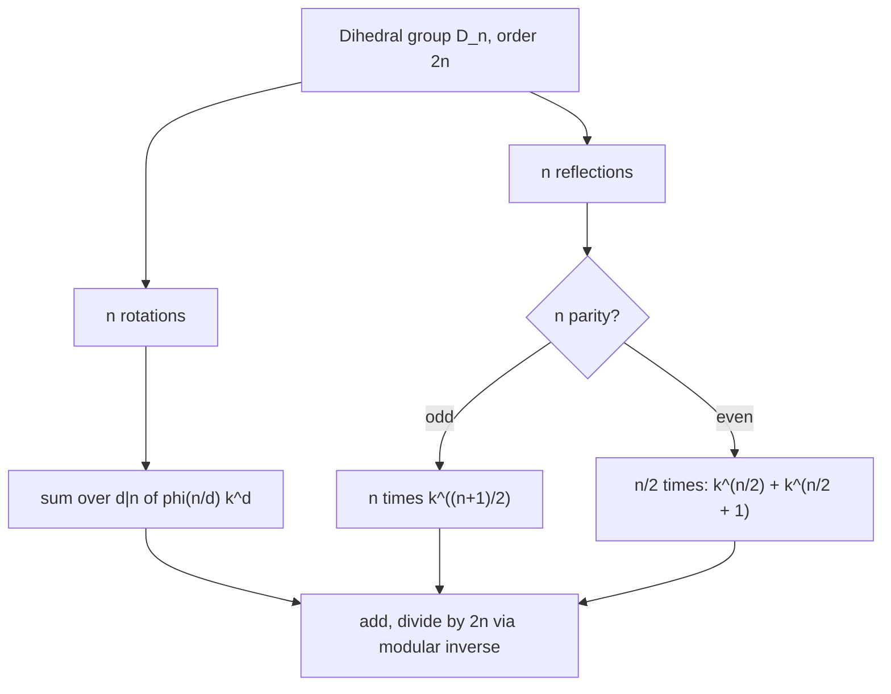
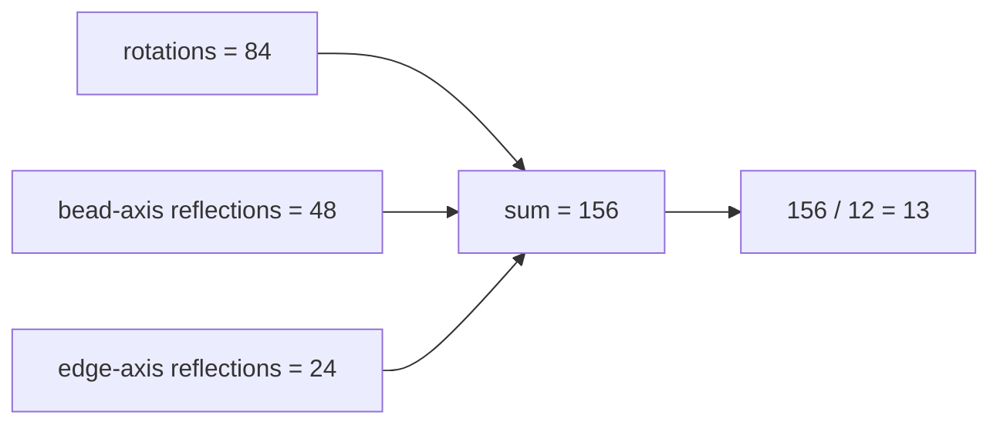

# Bracelet Colorings (Dihedral Group / Burnside)

| | |
|---|---|
| **Source** | Classic combinatorics (Pólya / Burnside) |
| **Difficulty** | Medium–Hard |
| **Topics** | Group actions, dihedral group, Burnside's lemma, Euler's totient, modular inverse |
| **Link** | [CSES problemset](https://cses.fi/problemset/) · [CP-Algorithms: Burnside](https://cp-algorithms.com/combinatorics/burnside.html) |

---

## Problem Statement

You have a circular **bracelet** of $n$ beads, each painted with one of $k$ colors. Unlike a necklace, a bracelet may be **flipped over**, so two bracelets are considered **the same** if one can be obtained from the other by a **rotation** *or* a **reflection** (flip).

Count the number of **distinct** bracelets, modulo a prime $p = 10^9 + 7$.

Formally, the **dihedral group** $D_n$ of order $2n$ acts on the $k^n$ colorings: the $n$ rotations of $C_n$ plus the $n$ reflections. You must count the number of **orbits**.

```
Input:  n = 4, k = 2
Output: 6

For n=4, k=2 the bracelet count equals the necklace count (6) because
no two distinct necklaces happen to be mirror images here.

Input:  n = 6, k = 2
Output: 13     (vs 14 necklaces — one mirror pair merges under reflection)
```

---

## Approach (WHY)

By **Burnside's lemma** over the dihedral group:

$$\#\text{bracelets} = \frac{1}{2n}\left[\underbrace{\sum_{j=0}^{n-1} k^{\gcd(n,j)}}_{\text{rotations}} + \underbrace{\sum_{\text{reflections}} k^{c(g)}}_{\text{reflections}}\right].$$

The **rotation** part is exactly the necklace sum $\sum_{d\mid n}\varphi(n/d)k^d$.

The **reflection** part depends on the **parity of $n$**, because the mirror axes are arranged differently:

- **$n$ odd:** all $n$ reflection axes pass through **one bead** and the opposite **edge midpoint**. Each fixes $1$ bead and pairs the remaining $n-1$ beads into $(n-1)/2$ swaps, giving $c = \frac{n+1}{2}$ cycles. Contribution: $n \cdot k^{(n+1)/2}$.
- **$n$ even:** two kinds of axes, $n/2$ of each:
  - through **two opposite beads** → $2$ fixed $+ \frac{n-2}{2}$ pairs → $c = \frac{n}{2}+1$,
  - through **two opposite edges** → $0$ fixed $+ \frac{n}{2}$ pairs → $c = \frac{n}{2}$.
  Contribution: $\frac{n}{2}\big(k^{\frac{n}{2}+1} + k^{\frac{n}{2}}\big)$.



Final division by $2n$ uses the modular inverse $(2n)^{-1} \equiv (2n)^{p-2}\pmod p$.

---

## Solution

### Python

```python
MOD = 10**9 + 7

def power(base, exp, mod):
    result = 1
    base %= mod
    while exp > 0:
        if exp & 1:
            result = result * base % mod
        base = base * base % mod
        exp >>= 1
    return result

def inverse(a, mod):
    return power(a, mod - 2, mod)

def euler_phi(n):
    result, m, p = n, n, 2
    while p * p <= m:
        if m % p == 0:
            while m % p == 0:
                m //= p
            result -= result // p
        p += 1
    if m > 1:
        result -= result // m
    return result

def rotation_sum(n, k):
    total, d = 0, 1
    while d * d <= n:
        if n % d == 0:
            total = (total + euler_phi(n // d) % MOD * power(k, d, MOD)) % MOD
            if d != n // d:
                total = (total + euler_phi(d) % MOD * power(k, n // d, MOD)) % MOD
        d += 1
    return total

def count_bracelets(n, k):
    rot = rotation_sum(n, k)
    if n % 2 == 1:
        refl = (n % MOD) * power(k, (n + 1) // 2, MOD) % MOD
    else:
        half = n // 2
        refl = (half % MOD) * ((power(k, half, MOD) + power(k, half + 1, MOD)) % MOD) % MOD
    total = (rot + refl) % MOD
    return total * inverse((2 * n) % MOD, MOD) % MOD

if __name__ == "__main__":
    print(count_bracelets(4, 2))   # 6
    print(count_bracelets(5, 2))   # 8
    print(count_bracelets(6, 2))   # 13
```

### C++

```cpp
#include <bits/stdc++.h>
using namespace std;
const long long MOD = 1e9 + 7;

long long power(long long base, long long exp, long long mod) {
    long long result = 1;
    base %= mod;
    while (exp > 0) {
        if (exp & 1) result = result * base % mod;
        base = base * base % mod;
        exp >>= 1;
    }
    return result;
}

long long inverse(long long a, long long mod) {
    return power(a, mod - 2, mod);
}

long long eulerPhi(long long n) {
    long long result = n, m = n;
    for (long long p = 2; p * p <= m; ++p) {
        if (m % p == 0) {
            while (m % p == 0) m /= p;
            result -= result / p;
        }
    }
    if (m > 1) result -= result / m;
    return result;
}

long long rotationSum(long long n, long long k) {
    long long total = 0;
    for (long long d = 1; d * d <= n; ++d) {
        if (n % d == 0) {
            total = (total + eulerPhi(n / d) % MOD * power(k, d, MOD)) % MOD;
            if (d != n / d)
                total = (total + eulerPhi(d) % MOD * power(k, n / d, MOD)) % MOD;
        }
    }
    return total;
}

long long countBracelets(long long n, long long k) {
    long long rot = rotationSum(n, k), refl;
    if (n % 2 == 1) {
        refl = (n % MOD) * power(k, (n + 1) / 2, MOD) % MOD;
    } else {
        long long half = n / 2;
        refl = (half % MOD) *
               ((power(k, half, MOD) + power(k, half + 1, MOD)) % MOD) % MOD;
    }
    long long total = (rot + refl) % MOD;
    return total * inverse((2 * n) % MOD, MOD) % MOD;
}

int main() {
    cout << countBracelets(4, 2) << '\n';  // 6
    cout << countBracelets(5, 2) << '\n';  // 8
    cout << countBracelets(6, 2) << '\n';  // 13
    return 0;
}
```

---

## Iteration Trace

For $n = 6$, $k = 2$ (even case):

| Component | Detail | Value |
|-----------|--------|-------|
| Rotations | $\sum_{d\mid 6}\varphi(6/d)2^d = \varphi(6)2^1 + \varphi(3)2^2 + \varphi(2)2^3 + \varphi(1)2^6$ | $2{\cdot}2 + 2{\cdot}4 + 1{\cdot}8 + 1{\cdot}64 = 84$ |
| Reflections (bead axes) | $\frac{n}{2}\,k^{n/2+1} = 3\cdot 2^{4}$ | $48$ |
| Reflections (edge axes) | $\frac{n}{2}\,k^{n/2} = 3\cdot 2^{3}$ | $24$ |
| Total | $84 + 48 + 24$ | $156$ |
| Divide by $2n = 12$ | $156 / 12$ | $13$ |



For $n = 5$, $k = 2$ (odd case): rotations $= 2^5 + 4\cdot 2^1 = 40$; reflections $= 5\cdot 2^{3} = 40$; total $80$; $80 / 10 = 8$. ✓

---

## Complexity

The rotation sum dominates with divisor iteration $O(\sqrt n)$, each totient $O(\sqrt n)$, each power $O(\log k)$. Reflection terms are $O(\log k)$.

$$O\!\left(\sqrt n \cdot (\sqrt n + \log k)\right) \approx O(\sqrt n\, d(n)).$$

| Aspect | Cost |
|--------|------|
| Time | $O(\sqrt n \cdot (\sqrt n + \log k))$ |
| Space | $O(1)$ |
| Modular division | $O(\log p)$ inverse |

---

## Takeaway

Bracelets = **necklaces + reflections**. Reuse the cyclic rotation sum, then add the dihedral reflection contribution, **casing carefully on the parity of $n$** (one reflection type for odd $n$, two for even). Divide the whole thing by $2n$ with a modular inverse.
