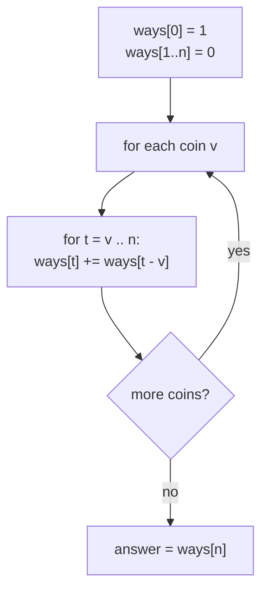
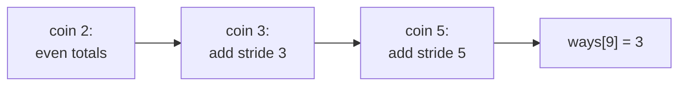

# Coin Change — Count the Number of Ways (Generating Functions)

| | |
|---|---|
| **Source** | Classic — Unbounded Coin Change (counting variant) |
| **Difficulty** | Easy–Medium |
| **Topics** | Generating functions, OGF, convolution, dynamic programming |
| **Link** | https://cses.fi/problemset/ |

---

## Problem Statement

You are given $k$ coin denominations $v_1, v_2, \dots, v_k$ and a target amount $n$. Each denomination may be used **any number of times** (unbounded supply). Count the number of distinct **multisets** of coins whose values sum to exactly $n$. Two orderings of the same coins count as **one** way (order does not matter). Output the count modulo $10^9 + 7$.

**Constraints**

$$
1 \le k \le 100, \qquad 1 \le v_j \le n \le 10^5.
$$

```
Input
3 9
2 3 5

Output
3
```

The target is $9$ with coins $\{2,3,5\}$. The ways are $\{2,2,5\}$, $\{3,3,3\}$, and $\{2,2,2,3\}$ — three multisets, so the answer is $3$.

---

## Approach (WHY)

Model each coin by the choices "use $0, 1, 2, \dots$ copies". A coin of value $v$ contributes total value from the set $\{0, v, 2v, \dots\}$, encoded by the **ordinary generating function**

$$1 + x^{v} + x^{2v} + \cdots = \frac{1}{1 - x^{v}}.$$

Choosing coins independently corresponds to **multiplying** their generating functions (product = convolution = "combine independent choices"):

$$G(x) = \prod_{j=1}^{k} \frac{1}{1 - x^{v_j}} = \sum_{n \ge 0} (\text{\# ways to make } n)\, x^n.$$

The answer is $[x^n]G(x)$. To compute it we never form the infinite product literally; instead we multiply factor by factor, truncating to degree $n$. Multiplying the running series by $\frac{1}{1 - x^{v}}$ is a *prefix-sum-with-stride-$v$*: each new coefficient adds the coefficient $v$ positions earlier. That recurrence

$$\text{ways}[t] \mathrel{+}= \text{ways}[t - v] \quad (t = v \dots n)$$

processes one coin at a time, automatically treating orderings as identical because each coin's count is fixed before the next coin is considered.



This is the generating-function view of the standard unbounded-coin DP: looping coins on the outside guarantees each multiset is counted once.

## Solution

### Python

```python
import sys

def count_ways(n, coins, mod=10**9 + 7):
    # ways[t] = [x^t] of the partial product of 1/(1 - x^v)
    ways = [0] * (n + 1)
    ways[0] = 1
    for v in coins:
        for t in range(v, n + 1):
            ways[t] = (ways[t] + ways[t - v]) % mod
    return ways[n]

def main():
    data = sys.stdin.read().split()
    idx = 0
    k = int(data[idx]); idx += 1
    n = int(data[idx]); idx += 1
    coins = [int(data[idx + i]) for i in range(k)]
    print(count_ways(n, coins))

if __name__ == "__main__":
    main()
```

### C++

```cpp
#include <bits/stdc++.h>
using namespace std;
const long long MOD = 1e9 + 7;

long long count_ways(int n, const vector<int>& coins) {
    // ways[t] = [x^t] of the partial product of 1/(1 - x^v)
    vector<long long> ways(n + 1, 0);
    ways[0] = 1;
    for (int v : coins)
        for (int t = v; t <= n; ++t)
            ways[t] = (ways[t] + ways[t - v]) % MOD;
    return ways[n];
}

int main() {
    ios::sync_with_stdio(false);
    cin.tie(nullptr);
    int k, n;
    cin >> k >> n;
    vector<int> coins(k);
    for (int i = 0; i < k; ++i) cin >> coins[i];
    cout << count_ways(n, coins) << "\n";
    return 0;
}
```

## Iteration Trace

Target $n = 9$, coins processed in order $2, 3, 5$. Showing the `ways` array after each coin.

| After coin | ways[0..9] |
|---|---|
| init | `1 0 0 0 0 0 0 0 0 0` |
| $v=2$ | `1 0 1 0 1 0 1 0 1 0` |
| $v=3$ | `1 0 1 1 1 1 2 1 2 2` |
| $v=5$ | `1 0 1 1 1 1 2 1 3 3` |

The final `ways[9] = 3`, matching $\{2,2,5\}, \{3,3,3\}, \{2,2,2,3\}$.



Each coin's inner loop runs $n - v + 1$ times, so the total work is

$$\sum_{j=1}^{k} (n - v_j + 1) = O(k\,n).$$

## Complexity

| Aspect | Cost |
|---|---|
| Time | $O(k \cdot n)$ |
| Space | $O(n)$ |

## Takeaway

Counting ways to combine **unbounded independent choices** is a product of geometric series $\prod \frac{1}{1 - x^{v_j}}$, and extracting $[x^n]$ is exactly the coin-on-the-outside unbounded DP. Looping denominations first is what makes the generating-function product treat reorderings as the same multiset.
