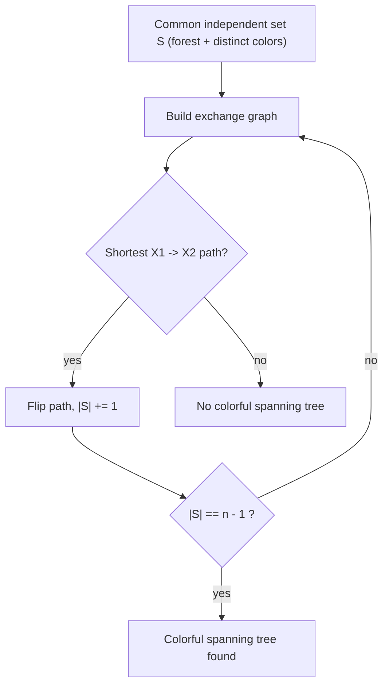
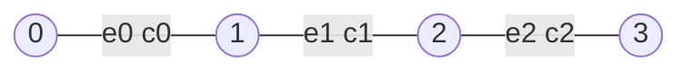

# Colorful Spanning Tree (Matroid Intersection)

| Field | Value |
| --- | --- |
| Source | Classic combinatorial optimization (Edmonds' matroid intersection) |
| Difficulty | Hard |
| Topics | Matroids, Matroid Intersection, Graphic Matroid, Partition Matroid, DSU, BFS |
| Link | [Matroid intersection — Wikipedia](https://en.wikipedia.org/wiki/Matroid_intersection) |

---

## Problem Statement

You are given a connected undirected graph with $n$ vertices and $m$ edges. Each edge has a **color** $c_i \in \{0, 1, \dots, k-1\}$. A **colorful spanning tree** is a spanning tree (exactly $n - 1$ edges, connecting all vertices, no cycle) that uses **each color at most once**.

Decide whether a colorful spanning tree exists, and if so output one such tree (the indices of its edges).

This is the intersection of two matroids on the edge set $E$:

- $M_1$, the **graphic matroid**: a set of edges is independent iff it is a forest.
- $M_2$, the **partition matroid** on colors with capacity $1$: a set is independent iff every color appears at most once.

A colorful spanning tree exists iff the largest common independent set $S \in \mathcal{I}_1 \cap \mathcal{I}_2$ satisfies $|S| = n - 1$.

```text
Input:
n = 4, k = 3
edges (0-indexed) with colors:
  e0: 0-1 color 0
  e1: 1-2 color 1
  e2: 2-3 color 2
  e3: 3-0 color 0
  e4: 0-2 color 1

Output:
YES
edges: 0 1 2     (a spanning tree using colors 0,1,2 — all distinct)
```

## Approach (WHY)

A spanning tree is a **basis** of the graphic matroid (size $n-1$). Requiring distinct colors is exactly independence in a **partition matroid**. So a colorful spanning tree is a *common* basis. Because greedy is optimal for a single matroid but **not** for two, we use the **matroid intersection** augmenting-path algorithm.

We grow a common independent set $S$ one element at a time. Each phase builds the **exchange graph** and finds a shortest path from "addable in $M_1$" ($X_1$) to "addable in $M_2$" ($X_2$); flipping membership along it increases $|S|$ by one. When $|S| = n-1$ we have a colorful spanning tree; if the algorithm stalls before reaching $n-1$, none exists.



## Solution

### Python

```python
from collections import deque
from typing import List, Tuple, Optional


class DSU:
    def __init__(self, n: int):
        self.p = list(range(n))

    def find(self, x: int) -> int:
        while self.p[x] != x:
            self.p[x] = self.p[self.p[x]]
            x = self.p[x]
        return x

    def union(self, a: int, b: int) -> bool:
        ra, rb = self.find(a), self.find(b)
        if ra == rb:
            return False
        self.p[ra] = rb
        return True


def is_forest(edges: List[Tuple[int, int]], n: int, subset: List[int]) -> bool:
    dsu = DSU(n)
    for i in subset:
        u, v = edges[i]
        if not dsu.union(u, v):
            return False
    return True


def colors_distinct(colors: List[int], k: int, subset: List[int]) -> bool:
    seen = [False] * k
    for i in subset:
        c = colors[i]
        if seen[c]:
            return False
        seen[c] = True
    return True


def colorful_spanning_tree(n: int, edges: List[Tuple[int, int]],
                           colors: List[int], k: int) -> Optional[List[int]]:
    m = len(edges)
    S = [False] * m

    def subset(extra: Optional[int], removed: Optional[int]) -> List[int]:
        s = [i for i in range(m) if S[i] and i != removed]
        if extra is not None:
            s.append(extra)
        return s

    def indep1(extra, removed):  # graphic matroid
        return is_forest(edges, n, subset(extra, removed))

    def indep2(extra, removed):  # partition matroid on colors
        return colors_distinct(colors, k, subset(extra, removed))

    while sum(S) < n - 1:
        in_set = [i for i in range(m) if S[i]]
        out_set = [i for i in range(m) if not S[i]]

        X1 = [x for x in out_set if indep1(x, None)]
        X2 = set(x for x in out_set if indep2(x, None))

        adj = {i: [] for i in range(m)}
        for y in in_set:
            for x in out_set:
                if indep1(x, y):      # y -> x
                    adj[y].append(x)
                if indep2(x, y):      # x -> y
                    adj[x].append(y)

        prev = {s: -1 for s in X1}
        dq = deque(X1)
        found = -1
        while dq:
            u = dq.popleft()
            if u in X2:
                found = u
                break
            for w in adj[u]:
                if w not in prev:
                    prev[w] = u
                    dq.append(w)
        if found == -1:
            break

        node = found
        while node != -1:
            S[node] = not S[node]
            node = prev[node]

    chosen = [i for i in range(m) if S[i]]
    return chosen if len(chosen) == n - 1 else None


if __name__ == "__main__":
    n, k = 4, 3
    edges = [(0, 1), (1, 2), (2, 3), (3, 0), (0, 2)]
    colors = [0, 1, 2, 0, 1]
    tree = colorful_spanning_tree(n, edges, colors, k)
    if tree is None:
        print("NO")
    else:
        print("YES")
        print("edges:", *tree)
```

### C++

```cpp
#include <bits/stdc++.h>
using namespace std;

struct DSU {
    vector<int> p;
    explicit DSU(int n) : p(n) { iota(p.begin(), p.end(), 0); }
    int find(int x) {
        while (p[x] != x) { p[x] = p[p[x]]; x = p[x]; }
        return x;
    }
    bool unite(int a, int b) {
        int ra = find(a), rb = find(b);
        if (ra == rb) return false;
        p[ra] = rb;
        return true;
    }
};

static bool isForest(const vector<pair<int,int>>& edges, int n,
                     const vector<int>& subset) {
    DSU dsu(n);
    for (int i : subset)
        if (!dsu.unite(edges[i].first, edges[i].second)) return false;
    return true;
}

static bool colorsDistinct(const vector<int>& colors, int k,
                           const vector<int>& subset) {
    vector<char> seen(k, 0);
    for (int i : subset) {
        int c = colors[i];
        if (seen[c]) return false;
        seen[c] = 1;
    }
    return true;
}

// Returns chosen edge indices, or empty vector if no colorful spanning tree.
vector<int> colorfulSpanningTree(int n, const vector<pair<int,int>>& edges,
                                 const vector<int>& colors, int k) {
    int m = static_cast<int>(edges.size());
    vector<char> S(m, 0);

    auto subset = [&](int extra, int removed) {
        vector<int> s;
        for (int i = 0; i < m; ++i)
            if (S[i] && i != removed) s.push_back(i);
        if (extra != -1) s.push_back(extra);
        return s;
    };
    auto indep1 = [&](int extra, int removed) {
        return isForest(edges, n, subset(extra, removed));
    };
    auto indep2 = [&](int extra, int removed) {
        return colorsDistinct(colors, k, subset(extra, removed));
    };

    auto countS = [&]() {
        int c = 0; for (char b : S) c += b; return c;
    };

    while (countS() < n - 1) {
        vector<int> inSet, outSet;
        for (int i = 0; i < m; ++i) (S[i] ? inSet : outSet).push_back(i);

        vector<int> X1;
        vector<char> isX2(m, 0);
        for (int x : outSet) {
            if (indep1(x, -1)) X1.push_back(x);
            if (indep2(x, -1)) isX2[x] = 1;
        }

        vector<vector<int>> adj(m);
        for (int y : inSet)
            for (int x : outSet) {
                if (indep1(x, y)) adj[y].push_back(x);  // y -> x
                if (indep2(x, y)) adj[x].push_back(y);  // x -> y
            }

        vector<int> prev(m, -2);
        queue<int> q;
        for (int s : X1) { prev[s] = -1; q.push(s); }
        int found = -1;
        while (!q.empty()) {
            int u = q.front(); q.pop();
            if (isX2[u]) { found = u; break; }
            for (int w : adj[u])
                if (prev[w] == -2) { prev[w] = u; q.push(w); }
        }
        if (found == -1) break;

        for (int node = found; node != -1; node = prev[node])
            S[node] = !S[node];
    }

    vector<int> chosen;
    for (int i = 0; i < m; ++i) if (S[i]) chosen.push_back(i);
    if (static_cast<int>(chosen.size()) != n - 1) return {};
    return chosen;
}

int main() {
    int n = 4, k = 3;
    vector<pair<int,int>> edges = {{0,1},{1,2},{2,3},{3,0},{0,2}};
    vector<int> colors = {0,1,2,0,1};
    vector<int> tree = colorfulSpanningTree(n, edges, colors, k);
    if (tree.empty()) {
        cout << "NO\n";
    } else {
        cout << "YES\nedges:";
        for (int e : tree) cout << ' ' << e;
        cout << '\n';
    }
    return 0;
}
```

## Iteration Trace

Run on the example ($n = 4$, edges `e0..e4`, colors `[0,1,2,0,1]`). Each phase adds one edge.

| Phase | $S$ before | $X_1$ (addable forest) | $X_2$ (addable color) | Shortest path | $S$ after |
| --- | --- | --- | --- | --- | --- |
| 1 | $\{\}$ | e0,e1,e2,e3,e4 | e0,e1,e2,e3,e4 | e0 (in both) | $\{e0\}$ |
| 2 | $\{e0\}$ | e1,e2,e4 (e3 forms cycle later) | e1,e2,e4 | e1 | $\{e0,e1\}$ |
| 3 | $\{e0,e1\}$ | e2 | e2 | e2 | $\{e0,e1,e2\}$ |
| stop | $\{e0,e1,e2\}$ | — | — | $|S| = n-1 = 3$ | done |

Result: edges `{0, 1, 2}` with colors $\{0, 1, 2\}$ — a colorful spanning tree.



## Complexity

Let $m$ = edges, $n$ = vertices, $k$ = colors. The answer has at most $n - 1$ elements, so there are $O(n)$ augmentation phases; each rebuilds the exchange graph with $O(m^2)$ oracle calls of cost $O(m\,\alpha)$.

$$
T = O\big(n \cdot m^2 \cdot (m\,\alpha)\big) = O(n\,m^3\,\alpha),
$$

which simplifies to $\tilde{O}(n m^3)$ for this straightforward implementation; optimized oracle state lowers it substantially.

| Aspect | Complexity |
| --- | --- |
| Augmentation phases | $O(n)$ |
| Exchange graph per phase | $O(m^2)$ edges, each via oracle |
| Oracle (DSU rebuild) | $O(m\,\alpha(n))$ |
| Total time | $O(n\,m^3\,\alpha)$ |
| Space | $O(m^2)$ for adjacency |

## Takeaway

A colorful spanning tree is a **common basis** of the graphic matroid and a color partition matroid. Greedy cannot solve two-matroid problems, but the **matroid intersection augmenting-path** algorithm finds the maximum common independent set; compare its size to $n - 1$ to decide feasibility.
