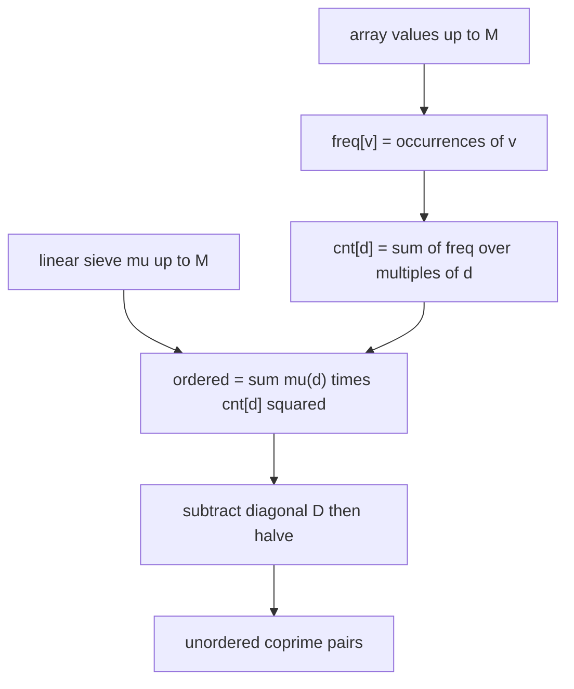
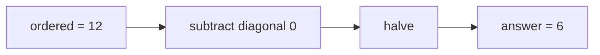

# Count Coprime Pairs Using the Möbius Function

| Field | Value |
| --- | --- |
| Source | Classic number-theory / competitive-programming exercise |
| Difficulty | Medium |
| Topics | Number Theory, Möbius Function, Inclusion–Exclusion, Divisor Counting |
| Link | https://cses.fi/problemset/ |

---

## Problem Statement

You are given an array $a_1, a_2, \dots, a_n$ of positive integers, each at most $M$. Count the number of **unordered** pairs $(i, j)$ with $i < j$ such that

$$
\gcd(a_i, a_j) = 1.
$$

Constraints: $1 \le n \le 10^6$ and $1 \le a_i \le M \le 10^6$.

```
Input:
5
2 3 4 5 6

Output:
6
```

The coprime unordered pairs are $(2,3), (2,5), (3,4), (3,5), (4,5), (5,6)$ — six in total. Pairs like $(2,4)$ or $(3,6)$ share a common factor and are excluded.

---

## Approach (WHY)

Brute force over all pairs and computing each gcd is $O(n^2 \log M)$ — far too slow for $n = 10^6$. Instead we use the Möbius indicator identity:

$$
[\gcd(x, y) = 1] = \sum_{d \mid \gcd(x, y)} \mu(d) = \sum_{d \mid x,\; d \mid y} \mu(d).
$$

Let $\text{cnt}[d]$ be the number of array elements divisible by $d$. Then the number of **ordered** pairs (including $i = j$) with gcd $1$ is

$$
\sum_{i, j} [\gcd(a_i, a_j) = 1]
= \sum_{d \ge 1} \mu(d) \, \text{cnt}[d]^2.
$$

Each element divisible by $d$ contributes to $\text{cnt}[d]$, and squaring counts ordered pairs both of whose members are divisible by $d$. To turn the ordered count into unordered pairs with $i < j$, subtract the $n$ diagonal pairs (where $a_i$ is coprime to itself only when $a_i = 1$) and halve:

$$
\text{answer} = \frac{\big(\sum_d \mu(d)\,\text{cnt}[d]^2\big) - D}{2},
\qquad D = \#\{i : \gcd(a_i, a_i) = 1\} = \#\{i : a_i = 1\}.
$$

We get $\text{cnt}[d]$ cheaply: count occurrences of each value, then for each $d$ sum the occurrences over multiples of $d$ (a harmonic $O(M \log M)$ pass).



---

## Solution

### Python

```python
import sys

def linear_mobius(N: int) -> list[int]:
    mu = [0] * (N + 1)
    primes = []
    is_composite = [False] * (N + 1)
    if N >= 1:
        mu[1] = 1
    for i in range(2, N + 1):
        if not is_composite[i]:
            primes.append(i)
            mu[i] = -1
        for p in primes:
            if i * p > N:
                break
            is_composite[i * p] = True
            if i % p == 0:
                mu[i * p] = 0
                break
            else:
                mu[i * p] = -mu[i]
    return mu

def main() -> None:
    data = sys.stdin.buffer.read().split()
    n = int(data[0])
    a = [int(x) for x in data[1:1 + n]]
    M = max(a) if a else 1

    freq = [0] * (M + 1)
    for v in a:
        freq[v] += 1

    cnt = [0] * (M + 1)
    for d in range(1, M + 1):
        s = 0
        for m in range(d, M + 1, d):
            s += freq[m]
        cnt[d] = s

    mu = linear_mobius(M)
    ordered = 0
    for d in range(1, M + 1):
        if mu[d] != 0:
            ordered += mu[d] * cnt[d] * cnt[d]

    diagonal = freq[1]                 # gcd(a_i, a_i) = 1 only when a_i = 1
    answer = (ordered - diagonal) // 2
    print(answer)

main()
```

### C++

```cpp
#include <bits/stdc++.h>
using namespace std;

vector<int> linear_mobius(int N) {
    vector<int> mu(N + 1, 0);
    vector<int> primes;
    vector<bool> is_composite(N + 1, false);
    if (N >= 1) mu[1] = 1;
    for (int i = 2; i <= N; ++i) {
        if (!is_composite[i]) {
            primes.push_back(i);
            mu[i] = -1;
        }
        for (int p : primes) {
            if (1LL * i * p > N) break;
            is_composite[i * p] = true;
            if (i % p == 0) {
                mu[i * p] = 0;
                break;
            } else {
                mu[i * p] = -mu[i];
            }
        }
    }
    return mu;
}

int main() {
    ios::sync_with_stdio(false);
    cin.tie(nullptr);

    int n;
    cin >> n;
    vector<int> a(n);
    int M = 1;
    for (int i = 0; i < n; ++i) {
        cin >> a[i];
        M = max(M, a[i]);
    }

    vector<long long> freq(M + 1, 0);
    for (int v : a) freq[v]++;

    vector<long long> cnt(M + 1, 0);
    for (int d = 1; d <= M; ++d) {
        long long s = 0;
        for (int m = d; m <= M; m += d) s += freq[m];
        cnt[d] = s;
    }

    vector<int> mu = linear_mobius(M);
    long long ordered = 0;
    for (int d = 1; d <= M; ++d) {
        if (mu[d] != 0)
            ordered += 1LL * mu[d] * cnt[d] * cnt[d];
    }

    long long diagonal = freq[1];      // gcd(a_i, a_i) = 1 only when a_i = 1
    long long answer = (ordered - diagonal) / 2;
    cout << answer << '\n';
    return 0;
}
```

---

## Iteration Trace

Array $[2, 3, 4, 5, 6]$, so $M = 6$. Frequencies: $\text{freq} = [\,0,0,1,1,1,1,1\,]$ for values $0\dots6$.

Divisor counts $\text{cnt}[d]$ (elements divisible by $d$):

| $d$ | multiples present | $\text{cnt}[d]$ | $\mu(d)$ | $\mu(d)\,\text{cnt}[d]^2$ |
| --- | --- | --- | --- | --- |
| 1 | all 5 | 5 | $+1$ | $+25$ |
| 2 | 2,4,6 | 3 | $-1$ | $-9$ |
| 3 | 3,6 | 2 | $-1$ | $-4$ |
| 4 | 4 | 1 | $0$ | $0$ |
| 5 | 5 | 1 | $-1$ | $-1$ |
| 6 | 6 | 1 | $+1$ | $+1$ |

Ordered total $= 25 - 9 - 4 + 0 - 1 + 1 = 12$. Diagonal $D = \text{freq}[1] = 0$ (no element equals 1). Unordered answer $= (12 - 0)/2 = 6$. ✓



---

The dominant cost is the harmonic divisor-count pass:

$$
\sum_{d=1}^{M} \frac{M}{d} = O(M \log M),
$$

plus the $O(M)$ linear sieve and $O(n)$ input.

## Complexity

| Aspect | Complexity |
| --- | --- |
| Linear sieve for $\mu$ | $O(M)$ |
| Divisor-count harmonic pass | $O(M \log M)$ |
| Möbius summation | $O(M)$ |
| Reading input | $O(n)$ |
| Total | $O(n + M \log M)$ |
| Space | $O(M)$ |

---

## Takeaway

The expression $[\gcd = 1] = \sum_{d \mid \gcd} \mu(d)$ converts a pairwise gcd condition into a single sum over divisor counts: $\sum_d \mu(d)\,\text{cnt}[d]^2$. Build $\text{cnt}[d]$ with a harmonic sieve, weight by $\mu(d)$, then convert ordered to unordered pairs. This $O(M \log M)$ pattern replaces an impossible $O(n^2)$ pairwise scan.
