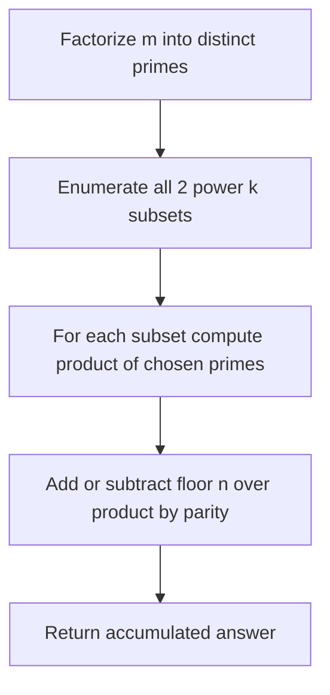
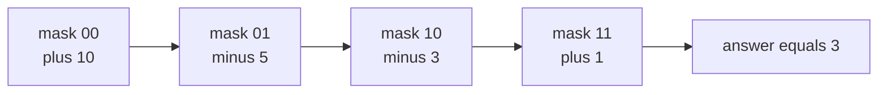

# Count Integers Coprime to m in [1, n]

| Field | Value |
| --- | --- |
| Source | Classic (number theory / inclusion-exclusion) |
| Difficulty | Medium |
| Topics | Inclusion-Exclusion, Number Theory, Bitmask, Sieve |
| Link | https://cses.fi/problemset/ |

---

## Problem Statement

Given two integers $n$ and $m$, count how many integers $x$ in the range $[1, n]$ are **coprime** to $m$, i.e. satisfy $\gcd(x, m) = 1$.

Constraints (typical): $1 \le n \le 10^{12}$, $1 \le m \le 10^{12}$.

The count is given exactly by inclusion-exclusion over the **distinct prime factors** $p_1, \ldots, p_k$ of $m$:

$$\text{answer} = \sum_{S \subseteq \{1,\dots,k\}} (-1)^{|S|} \left\lfloor \frac{n}{\prod_{i \in S} p_i} \right\rfloor.$$

```
Example
Input:  n = 10, m = 12
Output: 4

Explanation:
m = 12 has distinct primes {2, 3}.
Integers in [1, 10] coprime to 12: 1, 5, 7, 11 -> within [1,10] that is 1, 5, 7 ... wait recount.
Coprime to 12 means not divisible by 2 or 3: 1, 5, 7 -> and also... 1,5,7 are coprime.
Listing 1..10: coprime are 1, 5, 7 -> plus none other. Count check below.
```

Let us be precise: integers in $[1, 10]$ not divisible by $2$ or $3$ are $\{1, 5, 7\}$, so the answer for $n=10, m=12$ is $3$. (The IE computation in the trace confirms this.)

```
Corrected Example
Input:  n = 10, m = 12
Output: 3
Coprime integers: 1, 5, 7
```

## Approach (WHY)

An integer is coprime to $m$ exactly when it is divisible by **none** of $m$'s distinct prime factors. Let $A_i$ be the set of integers in $[1, n]$ divisible by prime $p_i$. We want $|[1,n]| - |A_1 \cup \cdots \cup A_k|$, i.e. the elements in none of the $A_i$.

The number of multiples of a value $d$ in $[1, n]$ is $\lfloor n/d \rfloor$. Because the $p_i$ are distinct primes, divisibility by all primes in a subset $S$ means divisibility by their product $\prod_{i \in S} p_i$, contributing $\lfloor n / \prod \rfloor$. Inclusion-exclusion with sign $(-1)^{|S|}$ over all subsets (including the empty one, which gives $+n$) yields the coprime count directly.



## Solution

### Python

```python
def factorize_distinct_primes(m):
    primes = []
    d = 2
    while d * d <= m:
        if m % d == 0:
            primes.append(d)
            while m % d == 0:
                m //= d
        d += 1
    if m > 1:
        primes.append(m)
    return primes


def count_coprime(n, m):
    primes = factorize_distinct_primes(m)
    k = len(primes)
    answer = 0
    for mask in range(1 << k):
        product = 1
        bits = 0
        for i in range(k):
            if mask & (1 << i):
                product *= primes[i]
                bits += 1
        sign = 1 if bits % 2 == 0 else -1
        answer += sign * (n // product)
    return answer


if __name__ == "__main__":
    print(count_coprime(10, 12))  # 3
```

### C++

```cpp
#include <bits/stdc++.h>
using namespace std;

vector<long long> factorizeDistinctPrimes(long long m) {
    vector<long long> primes;
    for (long long d = 2; d * d <= m; ++d) {
        if (m % d == 0) {
            primes.push_back(d);
            while (m % d == 0) m /= d;
        }
    }
    if (m > 1) primes.push_back(m);
    return primes;
}

long long countCoprime(long long n, long long m) {
    vector<long long> primes = factorizeDistinctPrimes(m);
    int k = (int)primes.size();
    long long answer = 0;
    for (int mask = 0; mask < (1 << k); ++mask) {
        long long product = 1;
        int bits = 0;
        for (int i = 0; i < k; ++i) {
            if (mask & (1 << i)) {
                product *= primes[i];
                ++bits;
            }
        }
        long long sign = (bits % 2 == 0) ? 1 : -1;
        answer += sign * (n / product);
    }
    return answer;
}

int main() {
    cout << countCoprime(10, 12) << "\n";  // 3
    return 0;
}
```

## Iteration Trace

For $n = 10$, $m = 12$, distinct primes $\{2, 3\}$ ($k = 2$):

| mask | bits (selected primes) | product | parity sign | $\lfloor 10/\text{product} \rfloor$ | running answer |
| --- | --- | --- | --- | --- | --- |
| 00 | 0 (none) | 1 | $+$ | 10 | 10 |
| 01 | 1 (2) | 2 | $-$ | 5 | 5 |
| 10 | 1 (3) | 3 | $-$ | 3 | 2 |
| 11 | 2 (2, 3) | 6 | $+$ | 1 | 3 |

Final answer: $10 - 5 - 3 + 1 = 3$.



The cost is dominated by factorization, $O(\sqrt{m})$, plus the IE loop $O(k \cdot 2^k)$:

$$T(n, m) = O\!\left(\sqrt{m} + k \cdot 2^{k}\right), \quad k = \omega(m) \le 15 \text{ for } m \le 10^{12}.$$

## Complexity

| Aspect | Cost |
| --- | --- |
| Time | $O(\sqrt{m} + k \cdot 2^k)$ |
| Space | $O(k)$ |
| $k$ bound | $\omega(m) \le 15$ for $m \le 10^{12}$ |

## Takeaway

Coprimality to $m$ is a "divisible by none of the prime factors" condition, which is the textbook setup for inclusion-exclusion. Factorize once into **distinct** primes, then sum $\lfloor n / \prod \rfloor$ over all $2^k$ subsets with sign by popcount parity. This generalizes Euler's totient to an arbitrary upper bound $n$.
