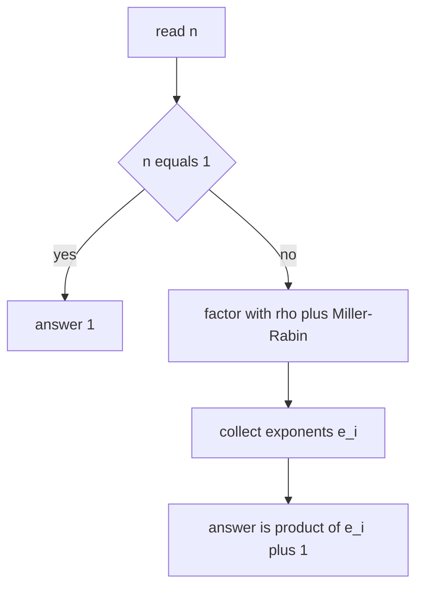
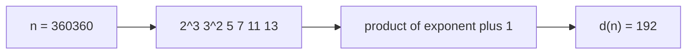

# Count Divisors of a Large Number

| Field | Value |
|---|---|
| Source | Self-contained |
| Difficulty | Hard |
| Topics | Pollard's rho, Miller-Rabin, divisor counting |
| Link | https://cses.fi/problemset/ |

---

## Problem Statement

You are given $q$ queries. Each query is an integer $n$ with $1 \le n \le 10^{18}$. For each query, output $d(n)$, the number of positive divisors of $n$.

If $n = p_1^{e_1} p_2^{e_2} \cdots p_k^{e_k}$ is the prime factorization, then the divisor count is

$$
d(n) = \prod_{i=1}^{k} (e_i + 1).
$$

Constraints: $1 \le q \le 500$, $1 \le n \le 10^{18}$.

```text
Input:
4
1
12
1000000000000000000
999999999999999989

Output:
1
6
361
2
```

For $n = 12 = 2^2 \cdot 3^1$ we get $(2+1)(1+1) = 6$. For $n = 10^{18} = 2^{18}\cdot 5^{18}$ we get $(18+1)(18+1) = 361$. The last value is prime, so $d(n) = 2$.

## Approach (WHY)

The divisor-counting formula needs the **exponents** in the prime factorization. With $n$ up to $10^{18}$, trial division to $\sqrt n$ is too slow, so we factor with **Pollard's rho** (assisted by **Miller-Rabin** to recognize prime factors), tally exponents, then multiply $(e_i + 1)$ together.

Special case: $n = 1$ has exactly one divisor (itself), and no prime factors.



## Solution

### Python

```python
import sys
import random
from math import gcd
from collections import Counter


def is_prime(n: int) -> bool:
    if n < 2:
        return False
    small = (2, 3, 5, 7, 11, 13, 17, 19, 23, 29, 31, 37)
    for p in small:
        if n == p:
            return True
        if n % p == 0:
            return False
    d, s = n - 1, 0
    while d % 2 == 0:
        d //= 2
        s += 1
    for a in small:
        x = pow(a, d, n)
        if x == 1 or x == n - 1:
            continue
        for _ in range(s - 1):
            x = x * x % n
            if x == n - 1:
                break
        else:
            return False
    return True


def pollard_rho(n: int) -> int:
    if n % 2 == 0:
        return 2
    while True:
        c = random.randrange(1, n)
        x = random.randrange(2, n)
        y = x
        d = 1
        while d == 1:
            x = (x * x + c) % n
            y = (y * y + c) % n
            y = (y * y + c) % n
            d = gcd(abs(x - y), n)
        if d != n:
            return d


def factorize(n: int, out: Counter) -> None:
    if n == 1:
        return
    if is_prime(n):
        out[n] += 1
        return
    d = pollard_rho(n)
    factorize(d, out)
    factorize(n // d, out)


def count_divisors(n: int) -> int:
    if n == 1:
        return 1
    out: Counter[int] = Counter()
    factorize(n, out)
    result = 1
    for e in out.values():
        result *= e + 1
    return result


def solve() -> None:
    data = sys.stdin.read().split()
    q = int(data[0])
    res = []
    for i in range(1, q + 1):
        res.append(str(count_divisors(int(data[i]))))
    sys.stdout.write("\n".join(res) + "\n")


if __name__ == "__main__":
    solve()
```

### C++

```cpp
#include <bits/stdc++.h>
using namespace std;

using u64 = uint64_t;
using u128 = __uint128_t;

u64 mulmod(u64 a, u64 b, u64 n) { return (u64)((u128)a * b % n); }

u64 powmod(u64 a, u64 e, u64 n) {
    u64 r = 1; a %= n;
    while (e) { if (e & 1) r = mulmod(r, a, n); a = mulmod(a, a, n); e >>= 1; }
    return r;
}

bool is_prime(u64 n) {
    if (n < 2) return false;
    for (u64 p : {2, 3, 5, 7, 11, 13, 17, 19, 23, 29, 31, 37}) {
        if (n == p) return true;
        if (n % p == 0) return false;
    }
    u64 d = n - 1; int s = 0;
    while ((d & 1) == 0) { d >>= 1; ++s; }
    for (u64 a : {2, 3, 5, 7, 11, 13, 17, 19, 23, 29, 31, 37}) {
        u64 x = powmod(a, d, n);
        if (x == 1 || x == n - 1) continue;
        bool composite = true;
        for (int i = 0; i < s - 1; ++i) {
            x = mulmod(x, x, n);
            if (x == n - 1) { composite = false; break; }
        }
        if (composite) return false;
    }
    return true;
}

static inline u64 absdiff(u64 a, u64 b) { return a > b ? a - b : b - a; }

u64 pollard_rho(u64 n) {
    if (n % 2 == 0) return 2;
    static mt19937_64 rng(0xC0FFEE);
    while (true) {
        u64 c = rng() % (n - 1) + 1;
        u64 x = rng() % (n - 2) + 2, y = x, d = 1;
        auto f = [&](u64 v) { return (mulmod(v, v, n) + c) % n; };
        while (d == 1) {
            x = f(x);
            y = f(f(y));
            d = gcd(absdiff(x, y), n);
        }
        if (d != n) return d;
    }
}

void factorize(u64 n, map<u64, int>& out) {
    if (n == 1) return;
    if (is_prime(n)) { out[n]++; return; }
    u64 d = pollard_rho(n);
    factorize(d, out);
    factorize(n / d, out);
}

u64 count_divisors(u64 n) {
    if (n == 1) return 1;
    map<u64, int> out;
    factorize(n, out);
    u64 result = 1;
    for (auto [p, e] : out) result *= (u64)(e + 1);
    return result;
}

int main() {
    ios_base::sync_with_stdio(false);
    cin.tie(nullptr);
    int q;
    if (!(cin >> q)) return 0;
    while (q--) {
        u64 n; cin >> n;
        cout << count_divisors(n) << "\n";
    }
    return 0;
}
```

## Iteration Trace

Counting divisors of $n = 360360$. Factoring (small primes peel off immediately, rho is not even needed here):

| Step | Action | Remaining $n$ | Exponents so far |
|---|---|---|---|
| 1 | divide by $2$ three times | $45045$ | $2^3$ |
| 2 | divide by $3$ twice | $5005$ | $2^3 3^2$ |
| 3 | divide by $5$ once | $1001$ | $2^3 3^2 5^1$ |
| 4 | divide by $7$ once | $143$ | $\dots 7^1$ |
| 5 | divide by $11$ once | $13$ | $\dots 11^1$ |
| 6 | $13$ prime, record | $1$ | $\dots 13^1$ |

So $360360 = 2^3 \cdot 3^2 \cdot 5 \cdot 7 \cdot 11 \cdot 13$, giving

$$
d(n) = (3+1)(2+1)(1+1)^4 = 4 \cdot 3 \cdot 16 = 192.
$$



For a number with a *large* prime factor (e.g. $n = p \cdot q$ with $p, q \approx 10^9$), the small-prime peeling does nothing and Pollard's rho does the real work of splitting $n$.

## Complexity

Factorization dominates; the product step is $O(k) = O(\log n)$:

$$
T(n) = O\!\left(n^{1/4} \log n\right) \text{ per query}, \qquad O(q\, n^{1/4}\log n) \text{ total}.
$$

| Aspect | Complexity |
|---|---|
| Miller-Rabin per number | $O(\log^3 n)$ |
| Pollard's rho per factor | expected $O(n^{1/4})$ |
| Full factorization per query | expected $O(n^{1/4}\log n)$ |
| Divisor product | $O(\log n)$ |
| All $q$ queries | $O(q\, n^{1/4}\log n)$ |
| Extra space | $O(\log n)$ |

## Takeaway

The number of divisors depends only on the **exponents** of the prime factorization, via $d(n) = \prod (e_i + 1)$. The hard part is getting that factorization for $n$ up to $10^{18}$ — solved by Pollard's rho with Miller-Rabin. Always strip small primes first and treat $n = 1$ as a base case with one divisor.
