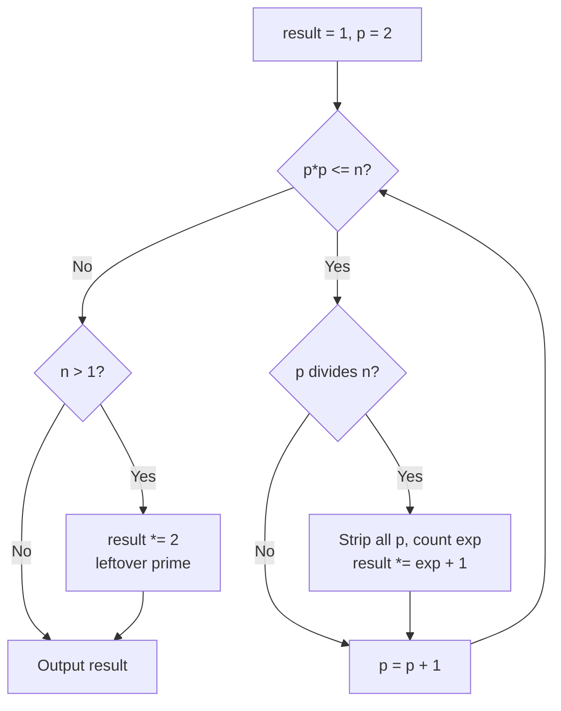
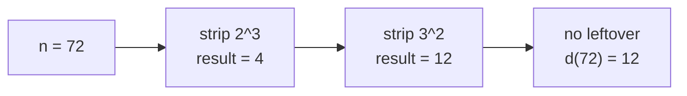

# Count Divisors of N

| | |
| --- | --- |
| **Source** | Classic number theory exercise (self-contained) |
| **Difficulty** | Easy |
| **Topics** | Number theory, prime factorization, divisor counting |
| **Link** | — (self-contained) |

---

## Problem Statement

Given a positive integer $n$, compute $d(n)$, the **number of positive divisors** of $n$.

If $n$ has the prime factorization

$$n = p_1^{e_1} \cdot p_2^{e_2} \cdots p_k^{e_k},$$

then the number of divisors is

$$d(n) = \prod_{i=1}^{k} (e_i + 1).$$

**Constraints.** $1 \le n \le 10^{12}$. (The bound exceeds $2^{31}$, so use 64-bit integers in C++.)

```text
Input:  72
Output: 12        # 72 = 2^3 * 3^2, so d(72) = (3+1)(2+1) = 12

Input:  1
Output: 1         # only divisor is 1

Input:  13
Output: 2         # prime: divisors 1 and 13
```

---

## Approach (WHY)

Every divisor of $n$ corresponds to choosing an exponent $0 \le f_i \le e_i$ for each prime $p_i$. The choices are independent, giving $\prod (e_i + 1)$ divisors. So we never enumerate divisors — we just factorize and multiply the incremented exponents.

To factorize, trial-divide by every $p$ with $p^2 \le n$. Each time $p$ divides $n$, strip out all copies of $p$ while counting the exponent, then multiply the running answer by `exp + 1`. After the loop, if `n > 1`, what remains is a single prime greater than $\sqrt{n}$ (it can appear only once, since two such factors would exceed the original $n$), contributing a factor of $2$.



---

## Solution

### Python

```python
def count_divisors(n: int) -> int:
    result = 1
    p = 2
    while p * p <= n:
        if n % p == 0:
            exp = 0
            while n % p == 0:
                n //= p
                exp += 1
            result *= exp + 1
        p += 1
    if n > 1:                    # leftover prime factor > sqrt(original n)
        result *= 2
    return result


if __name__ == "__main__":
    n = int(input())
    print(count_divisors(n))
```

```cpp
#include <bits/stdc++.h>
using namespace std;

long long count_divisors(long long n) {
    long long result = 1;
    for (long long p = 2; p * p <= n; ++p) {
        if (n % p == 0) {
            int exp = 0;
            while (n % p == 0) {
                n /= p;
                ++exp;
            }
            result *= exp + 1;
        }
    }
    if (n > 1) {                 // leftover prime factor > sqrt(original n)
        result *= 2;
    }
    return result;
}

int main() {
    ios::sync_with_stdio(false);
    cin.tie(nullptr);

    long long n;
    cin >> n;
    cout << count_divisors(n) << '\n';
    return 0;
}
```

---

## Iteration Trace

Input $n = 72$.

| $p$ | $p^2 \le n$? | $p \mid n$? | Exponent stripped | $n$ after | `result` |
| --- | --- | --- | --- | --- | --- |
| start | — | — | — | 72 | 1 |
| 2 | $4 \le 72$ | yes | $2^3$ → exp 3 | 9 | $1 \cdot 4 = 4$ |
| 3 | $9 \le 9$ | yes | $3^2$ → exp 2 | 1 | $4 \cdot 3 = 12$ |
| 4 | $16 \le 1$? no | — | — | 1 | 12 |
| end | leftover $n = 1$ | — | — | — | **12** |

Result: $d(72) = 12$, matching $(3+1)(2+1)$.

A second trace, $n = 13$ (prime):

| $p$ | $p^2 \le n$? | Action | $n$ | `result` |
| --- | --- | --- | --- | --- |
| 2 | $4 \le 13$ | $13 \bmod 2 \ne 0$ | 13 | 1 |
| 3 | $9 \le 13$ | $13 \bmod 3 \ne 0$ | 13 | 1 |
| 4 | $16 \le 13$? no | exit loop | 13 | 1 |
| end | leftover $n = 13 > 1$ | `result *= 2` | — | **2** |



---

## Complexity

Trial division runs while $p^2 \le n$, so at most $O(\sqrt{n})$ iterations; the inner stripping loops total to the number of prime factors, which is dominated by the outer bound.

$$T(n) = O(\sqrt{n}), \qquad S(n) = O(1).$$

| Resource | Bound |
| --- | --- |
| Time | $O(\sqrt{n})$ |
| Space | $O(1)$ |

For $n \le 10^{12}$, $\sqrt{n} \le 10^6$, so a single query is fast.

## Takeaway

Counting divisors never requires listing them. **Factorize, increment each exponent, multiply.** Remember the leftover-prime case after the $p^2 \le n$ loop, and use 64-bit integers when $n$ can exceed $2^{31}$.
