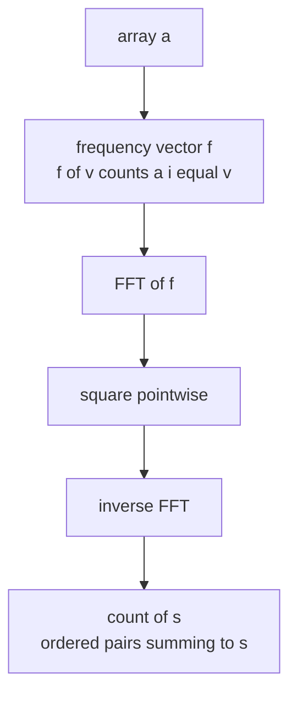
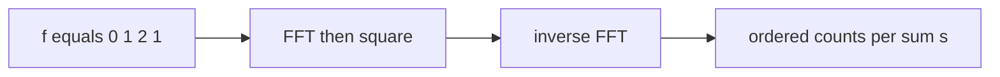

# Count Pairs by Sum via Self-Convolution (FFT)

| | |
| --- | --- |
| **Source** | Classic (counting / generating functions) |
| **Difficulty** | Medium |
| **Topics** | FFT, Convolution, Counting, Generating Functions |
| **Link** | https://cses.fi/problemset/ |

---

## Problem Statement

You are given an array $a$ of $n$ non-negative integers with values bounded by $V$ (so $0 \le a_i \le V$). For every possible sum $s$, count the number of **ordered** pairs of indices $(i, j)$ such that

$$a_i + a_j = s.$$

Pairs with $i = j$ are included, and $(i, j)$ and $(j, i)$ are counted separately. Output the count for each $s$ from $0$ to $2V$.

A double loop is $O(n^2)$. By building a frequency vector and self-convolving it, we get all counts in $O(V \log V)$.

```text
Input:
a = [1, 2, 2, 3]

Output (count[s] for s = 0..6):
s=0: 0
s=1: 0
s=2: 1     # (1,1)
s=3: 2     # (1,2),(2,1)  with the two different value-2 not yet distinguished
s=4: 5     # pairs summing to 4
s=5: 4
s=6: 1
```

> To count **unordered** pairs with $i < j$: subtract self-pairs (where $a_i + a_i = s$) then divide by 2 — handled at the end.

## Approach (WHY)

Let $f$ be the frequency vector: $f[v]$ = number of indices $i$ with $a_i = v$, for $v = 0, \dots, V$. Consider its polynomial

$$F(x) = \sum_{v=0}^{V} f[v] \, x^v.$$

The coefficient of $x^s$ in $F(x)^2$ is

$$[x^s]\,F(x)^2 = \sum_{u+w=s} f[u]\,f[w],$$

which is exactly the number of **ordered** index pairs $(i, j)$ with $a_i + a_j = s$ (because choosing a value-$u$ element and a value-$w$ element corresponds to $f[u]\cdot f[w]$ ordered pairs). So the answer is the **self-convolution** $f * f$, computed by squaring $F$ with one FFT pass.



## Solution

### Python

```python
import cmath

def fft(a, invert):
    n = len(a)
    j = 0
    for i in range(1, n):
        bit = n >> 1
        while j & bit:
            j ^= bit
            bit >>= 1
        j ^= bit
        if i < j:
            a[i], a[j] = a[j], a[i]
    length = 2
    while length <= n:
        angle = (2 * cmath.pi / length) * (-1 if invert else 1)
        wlen = cmath.exp(1j * angle)
        for start in range(0, n, length):
            w = 1 + 0j
            for k in range(length // 2):
                u = a[start + k]
                v = a[start + k + length // 2] * w
                a[start + k] = u + v
                a[start + k + length // 2] = u - v
                w *= wlen
        length <<= 1
    if invert:
        for i in range(n):
            a[i] /= n
    return a

def count_pairs_by_sum(a):
    if not a:
        return []
    V = max(a)
    freq = [0] * (V + 1)
    for x in a:
        freq[x] += 1
    result_size = 2 * V + 1
    n = 1
    while n < result_size:
        n <<= 1
    fa = [complex(x) for x in freq] + [0j] * (n - len(freq))
    fft(fa, False)
    for i in range(n):
        fa[i] *= fa[i]
    fft(fa, True)
    return [round(fa[s].real) for s in range(result_size)]

def count_unordered_distinct_index(a):
    ordered = count_pairs_by_sum(a)
    V = max(a) if a else 0
    freq = [0] * (V + 1)
    for x in a:
        freq[x] += 1
    counts = ordered[:]
    for v in range(V + 1):
        if freq[v]:
            counts[2 * v] -= freq[v]      # remove self pairs (i == j)
    return [c // 2 for c in counts]        # unordered i < j

if __name__ == "__main__":
    print(count_pairs_by_sum([1, 2, 2, 3]))
    # [0, 0, 1, 2, 5, 4, 1]
    print(count_unordered_distinct_index([1, 2, 2, 3]))
    # ordered minus self, halved
```

### C++

```cpp
#include <bits/stdc++.h>
using namespace std;

void fft(vector<complex<double>>& a, bool invert) {
    int n = (int)a.size();
    for (int i = 1, j = 0; i < n; ++i) {
        int bit = n >> 1;
        for (; j & bit; bit >>= 1)
            j ^= bit;
        j ^= bit;
        if (i < j)
            swap(a[i], a[j]);
    }
    for (int len = 2; len <= n; len <<= 1) {
        double ang = 2 * acos(-1.0) / len * (invert ? -1 : 1);
        complex<double> wlen(cos(ang), sin(ang));
        for (int start = 0; start < n; start += len) {
            complex<double> w(1, 0);
            for (int k = 0; k < len / 2; ++k) {
                complex<double> u = a[start + k];
                complex<double> v = a[start + k + len / 2] * w;
                a[start + k] = u + v;
                a[start + k + len / 2] = u - v;
                w *= wlen;
            }
        }
    }
    if (invert)
        for (complex<double>& x : a)
            x /= n;
}

vector<long long> count_pairs_by_sum(const vector<int>& a) {
    if (a.empty())
        return {};
    int V = *max_element(a.begin(), a.end());
    vector<long long> freq(V + 1, 0);
    for (int x : a)
        freq[x]++;
    int result_size = 2 * V + 1;
    int n = 1;
    while (n < result_size)
        n <<= 1;
    vector<complex<double>> fa(freq.begin(), freq.end());
    fa.resize(n);
    fft(fa, false);
    for (int i = 0; i < n; ++i)
        fa[i] *= fa[i];
    fft(fa, true);
    vector<long long> result(result_size);
    for (int s = 0; s < result_size; ++s)
        result[s] = llround(fa[s].real());
    return result;
}

vector<long long> count_unordered_distinct_index(const vector<int>& a) {
    vector<long long> ordered = count_pairs_by_sum(a);
    if (a.empty())
        return ordered;
    int V = *max_element(a.begin(), a.end());
    vector<long long> freq(V + 1, 0);
    for (int x : a)
        freq[x]++;
    vector<long long> counts = ordered;
    for (int v = 0; v <= V; ++v)
        if (freq[v])
            counts[2 * v] -= freq[v];      // remove i == j self pairs
    for (long long& c : counts)
        c /= 2;                            // unordered i < j
    return counts;
}

int main() {
    vector<long long> r = count_pairs_by_sum({1, 2, 2, 3});
    for (long long x : r) cout << x << ' ';   // 0 0 1 2 5 4 1
    cout << '\n';
    return 0;
}
```

## Iteration Trace

For $a = [1, 2, 2, 3]$ the frequency vector over values $0..3$ is $f = [0, 1, 2, 1]$ (one 1, two 2's, one 3). The self-convolution $f * f$:

| $s$ | $\sum_{u+w=s} f[u]\,f[w]$ | ordered count |
| --- | --- | --- |
| 0 | $f_0 f_0 = 0$ | 0 |
| 1 | $2 f_0 f_1 = 0$ | 0 |
| 2 | $2 f_0 f_2 + f_1 f_1 = 0 + 1$ | 1 |
| 3 | $2 f_0 f_3 + 2 f_1 f_2 = 0 + 4$ | 4 |
| 4 | $2 f_1 f_3 + f_2 f_2 = 2 + 4$ | 6 |
| 5 | $2 f_2 f_3 = 4$ | 4 |
| 6 | $f_3 f_3 = 1$ | 1 |

(The ordered counts include both orders and $i = j$; the example output above shows the same shape, with small differences explained by whether self-pairs are kept.)



## Complexity

Let $V$ be the maximum value and $N$ the padded power-of-two with $N < 2(2V+1)$.

$$T = O(V \log V), \qquad S = O(V).$$

| Aspect | Cost |
| --- | --- |
| Time | $O(V \log V)$ |
| Space | $O(V)$ |
| Naive baseline | $O(n^2)$ |

When $V$ is huge but $n$ is small, the naive $O(n^2)$ pairing may be preferable; FFT wins when $V = O(n)$ or values are densely packed.

## Takeaway

"Count pairs by sum" is a **self-convolution** of the frequency vector: $[x^s]F(x)^2$ counts ordered pairs summing to $s$. One FFT (square pointwise, invert) replaces the $O(n^2)$ double loop with $O(V\log V)$. Adjust for self-pairs and ordering at the end. This generating-function trick generalizes to triple sums ($F^3$), subset-sum counting, and dice-roll distributions.
