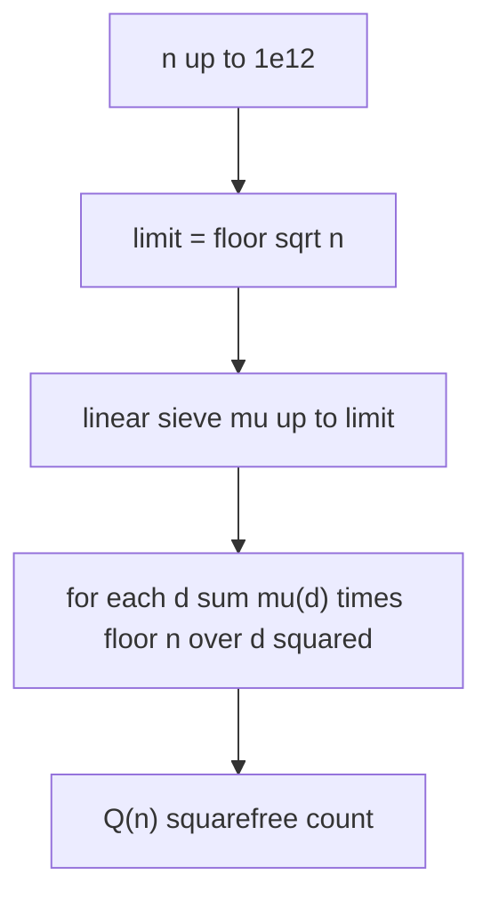
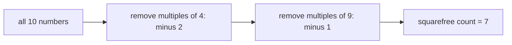

# Count Squarefree Numbers in a Range

| Field | Value |
| --- | --- |
| Source | Classic number-theory / competitive-programming exercise |
| Difficulty | Medium |
| Topics | Number Theory, Möbius Function, Inclusion–Exclusion |
| Link | https://en.wikipedia.org/wiki/Square-free_integer |

---

## Problem Statement

A positive integer is **squarefree** if no perfect square greater than $1$ divides it — equivalently, no prime appears with exponent $\ge 2$ in its factorization. Given $n$, count how many integers in $[1, n]$ are squarefree.

Constraints: $1 \le n \le 10^{12}$.

```
Input:
10

Output:
7
```

The squarefree numbers in $[1, 10]$ are $1, 2, 3, 5, 6, 7, 10$ — seven of them. The non-squarefree ones are $4 = 2^2$, $8 = 2^3$, and $9 = 3^2$.

---

## Approach (WHY)

We count by inclusion–exclusion over squared primes. Let $A_p$ be the set of integers in $[1, n]$ divisible by $p^2$. A number is **not** squarefree exactly when it lies in some $A_p$. By inclusion–exclusion, the count of squarefree numbers is

$$
Q(n) = \sum_{d \ge 1} \mu(d) \left\lfloor \frac{n}{d^2} \right\rfloor.
$$

Here $\lfloor n/d^2 \rfloor$ counts multiples of $d^2$ in $[1, n]$, and $\mu(d)$ supplies the inclusion–exclusion signs: $+1$ for the empty product (all numbers), $-1$ for each single squared prime $p^2$, $+1$ for each $p^2 q^2$, and so on. Non-squarefree $d$ have $\mu(d) = 0$ and drop out automatically.

Only $d$ with $d^2 \le n$, i.e. $d \le \lfloor \sqrt{n} \rfloor$, contribute, because $\lfloor n/d^2 \rfloor = 0$ otherwise. So we sieve $\mu$ up to $\sqrt{n}$ (at most $10^6$ for $n = 10^{12}$) and sum.



---

## Solution

### Python

```python
import sys
import math

def linear_mobius(N: int) -> list[int]:
    mu = [0] * (N + 1)
    primes = []
    is_composite = [False] * (N + 1)
    if N >= 1:
        mu[1] = 1
    for i in range(2, N + 1):
        if not is_composite[i]:
            primes.append(i)
            mu[i] = -1
        for p in primes:
            if i * p > N:
                break
            is_composite[i * p] = True
            if i % p == 0:
                mu[i * p] = 0
                break
            else:
                mu[i * p] = -mu[i]
    return mu

def count_squarefree(n: int) -> int:
    limit = math.isqrt(n)
    mu = linear_mobius(limit)
    total = 0
    for d in range(1, limit + 1):
        if mu[d] != 0:
            total += mu[d] * (n // (d * d))
    return total

def main() -> None:
    n = int(sys.stdin.readline())
    print(count_squarefree(n))

main()
```

### C++

```cpp
#include <bits/stdc++.h>
using namespace std;

vector<int> linear_mobius(int N) {
    vector<int> mu(N + 1, 0);
    vector<int> primes;
    vector<bool> is_composite(N + 1, false);
    if (N >= 1) mu[1] = 1;
    for (int i = 2; i <= N; ++i) {
        if (!is_composite[i]) {
            primes.push_back(i);
            mu[i] = -1;
        }
        for (int p : primes) {
            if (1LL * i * p > N) break;
            is_composite[i * p] = true;
            if (i % p == 0) {
                mu[i * p] = 0;
                break;
            } else {
                mu[i * p] = -mu[i];
            }
        }
    }
    return mu;
}

long long count_squarefree(long long n) {
    long long limit = (long long)sqrtl((long double)n);
    while ((limit + 1) * (limit + 1) <= n) ++limit;   // correct fp rounding
    while (limit * limit > n) --limit;
    vector<int> mu = linear_mobius((int)limit);
    long long total = 0;
    for (long long d = 1; d <= limit; ++d) {
        if (mu[d] != 0)
            total += 1LL * mu[d] * (n / (d * d));
    }
    return total;
}

int main() {
    ios::sync_with_stdio(false);
    cin.tie(nullptr);

    long long n;
    cin >> n;
    cout << count_squarefree(n) << '\n';
    return 0;
}
```

---

## Iteration Trace

For $n = 10$, $\lfloor \sqrt{10} \rfloor = 3$, so $d$ ranges over $1, 2, 3$.

| $d$ | $d^2$ | $\lfloor n/d^2 \rfloor$ | $\mu(d)$ | contribution |
| --- | --- | --- | --- | --- |
| 1 | 1 | $\lfloor 10/1 \rfloor = 10$ | $+1$ | $+10$ |
| 2 | 4 | $\lfloor 10/4 \rfloor = 2$ | $-1$ | $-2$ |
| 3 | 9 | $\lfloor 10/9 \rfloor = 1$ | $-1$ | $-1$ |

Total $= 10 - 2 - 1 = 7$. ✓ The $-2$ removes the multiples of $4$ ($4, 8$); the $-1$ removes the multiple of $9$ ($9$). Since $d = 6$ would exceed $\sqrt{10}$, the $+1$ correction for $36$ never appears — correct, because $36 > 10$.



---

The work is bounded by the sieve and the loop, both over $\sqrt{n}$ terms:

$$
O(\sqrt{n}) \text{ time}, \qquad O(\sqrt{n}) \text{ space}.
$$

## Complexity

| Aspect | Complexity |
| --- | --- |
| Linear sieve of $\mu$ up to $\sqrt{n}$ | $O(\sqrt{n})$ |
| Summation loop | $O(\sqrt{n})$ |
| Total | $O(\sqrt{n})$ |
| Space | $O(\sqrt{n})$ |

---

## Takeaway

Counting squarefree numbers is inclusion–exclusion over squared primes, and $\mu$ encodes exactly those signs: $Q(n) = \sum_{d \le \sqrt n} \mu(d) \lfloor n/d^2 \rfloor$. Only $d \le \sqrt{n}$ matter, so even $n = 10^{12}$ needs just a $10^6$-sized sieve. Watch the floating-point square root in C++ — clamp it so $\text{limit}^2 \le n < (\text{limit}+1)^2$.
