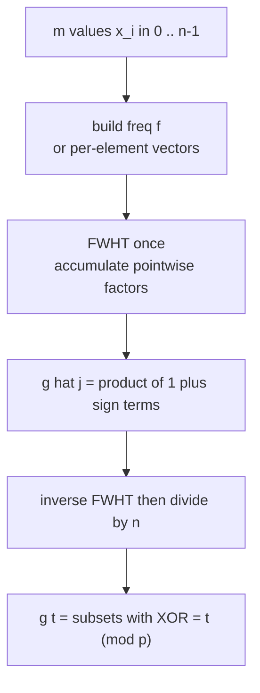
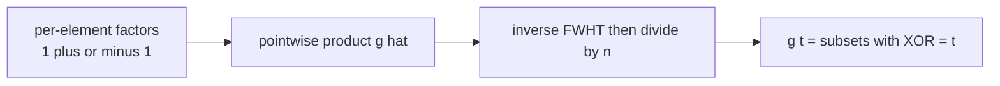

# Count Subsets by XOR Value (Repeated FWHT)

| | |
| --- | --- |
| **Source** | Classic (FWHT subset counting) |
| **Difficulty** | Medium–Hard |
| **Topics** | FWHT, XOR Convolution, Subset Counting, Modular Arithmetic |
| **Link** | https://cses.fi/problemset/ |

---

## Problem Statement

You are given $m$ non-negative integers $x_1, \dots, x_m$, each in $[0, 2^k)$. For every value $t \in [0, 2^k)$, count the number of **subsets** of the multiset whose XOR equals $t$:

$$g_t = \#\left\{ S \subseteq \{1, \dots, m\} : \bigoplus_{i \in S} x_i = t \right\}.$$

The empty subset has XOR $0$ and is counted in $g_0$. Output all $g_t$ modulo a prime $p = 998244353$ (counts can be astronomically large, up to $2^m$).

```text
Input:
k = 2  (values in [0,4))
x = [1, 2, 3]

Output g_t (number of subsets with XOR = t), n = 2^k = 4:
g = [2, 2, 2, 2]
# 8 subsets total. XORs:
#   {}    -> 0      {1} -> 1    {2} -> 2     {3} -> 3
#   {1,2} -> 3      {1,3}-> 2   {2,3}-> 1    {1,2,3}-> 0
# value 0: {}, {1,2,3}            -> 2
# value 1: {1}, {2,3}            -> 2
# value 2: {2}, {1,3}            -> 2
# value 3: {3}, {1,2}            -> 2
```

## Approach (WHY)

Each element $x_i$ corresponds to a length-$n$ vector $e_i$ with a $1$ at index $0$ (don't take it) and a $1$ at index $x_i$ (take it): choosing to include or exclude $x_i$ is an XOR-convolution by $[\,1\text{ at }0\,] + [\,1\text{ at }x_i\,]$. The full count is the XOR-convolution of all these per-element vectors:

$$g = (\delta_0 + \delta_{x_1}) \star (\delta_0 + \delta_{x_2}) \star \cdots \star (\delta_0 + \delta_{x_m}).$$

By the convolution theorem, the Walsh–Hadamard transform turns each $\star$ into pointwise multiplication. So:

1. For each element, $\widehat{(\delta_0 + \delta_{x_i})}_j = 1 + (-1)^{\langle x_i, j\rangle}$ — which is $2$ if the bitwise dot product is even, else $0$.
2. The transform of $g$ is the **pointwise product** over all elements: $\hat g_j = \prod_i \big(1 + (-1)^{\langle x_i, j\rangle}\big)$.
3. Inverse FWHT $\hat g$ (then divide by $n$) to recover $g$.

This computes all $g_t$ in $O(n\log n + m + n\log n)$ instead of $m$ separate convolutions. A simpler-to-code variant just folds the elements one at a time in the transform domain.



## Solution

### Python

```python
MOD = 998244353

def fwht_mod(a, invert=False):
    n = len(a)
    length = 1
    while length < n:
        for start in range(0, n, length * 2):
            for k in range(start, start + length):
                u = a[k]
                v = a[k + length]
                a[k] = (u + v) % MOD
                a[k + length] = (u - v) % MOD
        length <<= 1
    if invert:
        inv_n = pow(n, MOD - 2, MOD)
        for i in range(n):
            a[i] = a[i] * inv_n % MOD
    return a

def count_subsets_by_xor(k, xs):
    n = 1 << k
    # Transform domain: hat[j] = product over elements of (1 + (-1)^<x,j>).
    # Start from the all-ones transform (the empty-subset identity), then
    # multiply in each element's transform factor.
    hat = [1] * n
    for x in xs:
        # transform of (delta_0 + delta_x) at index j is 1 + (-1)^popcount(x & j)
        for j in range(n):
            sign = 1 if bin(x & j).count("1") % 2 == 0 else -1
            hat[j] = hat[j] * ((1 + sign) % MOD) % MOD
    g = hat
    fwht_mod(g, invert=True)
    return [v % MOD for v in g]

if __name__ == "__main__":
    print(count_subsets_by_xor(2, [1, 2, 3]))   # [2, 2, 2, 2]
```

The `O(n*m)` factor accumulation above is clear but can be replaced by the fully batched form: FWHT each per-element vector (each is just $1 + (-1)^{\langle x,j\rangle}$), multiply pointwise. For large $m$, group equal values via a frequency array and exponentiate per index.

### C++

```cpp
#include <bits/stdc++.h>
using namespace std;

const long long MOD = 998244353;

long long power_mod(long long base, long long exp, long long mod) {
    long long result = 1 % mod;
    base %= mod;
    while (exp > 0) {
        if (exp & 1) result = result * base % mod;
        base = base * base % mod;
        exp >>= 1;
    }
    return result;
}

void fwht_mod(vector<long long>& a, bool invert) {
    int n = (int)a.size();
    for (int length = 1; length < n; length <<= 1)
        for (int start = 0; start < n; start += length * 2)
            for (int k = start; k < start + length; ++k) {
                long long u = a[k];
                long long v = a[k + length];
                a[k] = (u + v) % MOD;
                a[k + length] = (u - v % MOD + MOD) % MOD;
            }
    if (invert) {
        long long inv_n = power_mod(n, MOD - 2, MOD);
        for (long long& x : a) x = x * inv_n % MOD;
    }
}

vector<long long> count_subsets_by_xor(int k, const vector<int>& xs) {
    int n = 1 << k;
    vector<long long> hat(n, 1);   // empty-subset identity in transform domain
    for (int x : xs) {
        for (int j = 0; j < n; ++j) {
            int sign = (__builtin_popcount(x & j) & 1) ? -1 : 1;
            long long factor = ((1 + sign) % MOD + MOD) % MOD;
            hat[j] = hat[j] * factor % MOD;
        }
    }
    fwht_mod(hat, true);
    return hat;
}

int main() {
    vector<long long> g = count_subsets_by_xor(2, {1, 2, 3});
    for (long long v : g) cout << v << ' ';   // 2 2 2 2
    cout << '\n';
    return 0;
}
```

## Iteration Trace

$k=2$, $n=4$, values $x = [1,2,3]$. Each element multiplies index $j$ by $1 + (-1)^{\langle x_i, j\rangle}$.

| $j$ | $\langle 1,j\rangle$ | $\langle 2,j\rangle$ | $\langle 3,j\rangle$ | factors $\prod (1 \pm 1)$ | $\hat g_j$ |
| --- | --- | --- | --- | --- | --- |
| 0 (`00`) | 0 | 0 | 0 | $2\cdot 2\cdot 2$ | 8 |
| 1 (`01`) | 1 | 0 | 1 | $0\cdot 2\cdot 0$ | 0 |
| 2 (`10`) | 0 | 1 | 1 | $2\cdot 0\cdot 0$ | 0 |
| 3 (`11`) | 1 | 1 | 0 | $0\cdot 0\cdot 2$ | 0 |

So $\hat g = [8, 0, 0, 0]$. Inverse FWHT (butterfly then $\div 4$):

| Stage | Array |
| --- | --- |
| product | $[8,0,0,0]$ |
| pass 1 | $[8,8,0,0]$ |
| pass 2 | $[8,8,8,8]$ |
| $\div n=4$ | $[2,2,2,2]$ |

Matching the eight subsets enumerated in the statement.



## Complexity

Folding $m$ elements in the transform domain plus one inverse FWHT:

$$T = O(n\,m + n \log n), \qquad S = O(n).$$

Batching equal values through a frequency array and per-index exponentiation reduces the fold to $O(n \log m)$, giving $O(n \log n + n \log m)$.

| Aspect | Cost |
| --- | --- |
| Time (direct fold) | $O(nm + n\log n)$ |
| Time (batched) | $O(n\log n + n\log m)$ |
| Space | $O(n)$ |
| Naive (enumerate subsets) | $O(2^m)$ |

## Takeaway

Counting subsets by XOR is repeated XOR-convolution, and the Walsh–Hadamard transform makes "repeated convolution" into "pointwise product" in the transform domain. Each element contributes a factor $1 + (-1)^{\langle x, j\rangle}$ per index; multiply them all, inverse-transform, divide by $n$ — turning an exponential subset enumeration into $O(n\log n)$ work.
