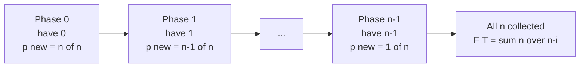

# Coupon Collector — Expected Draws to Collect All n Coupons

| Field | Value |
| --- | --- |
| Source | Classic probability / competitive programming exercise |
| Difficulty | Medium |
| Topics | Probability, Expectation, Linearity of Expectation, Harmonic Numbers, Modular Inverse |
| Link | https://en.wikipedia.org/wiki/Coupon_collector%27s_problem |

---

## Problem Statement

There are $n$ distinct coupon types. Each draw independently yields a uniformly random type (each with probability $\tfrac{1}{n}$). Let $T$ be the number of draws needed until you have collected **all** $n$ distinct types at least once. Compute $E[T]$.

The exact answer is the rational number

$$
E[T] = n\,H_n = n\sum_{k=1}^{n}\frac{1}{k}.
$$

Given $n$ with $1 \le n \le 10^6$, output $E[T] \bmod (10^9 + 7)$, i.e. $a \cdot b^{-1} \bmod p$ where $E[T] = \tfrac{a}{b}$.

```
Input:
3

Output:
500000009
```

Explanation: $E[T] = 3\left(\tfrac{1}{1} + \tfrac{1}{2} + \tfrac{1}{3}\right) = 3 \cdot \tfrac{11}{6} = \tfrac{11}{2}$. Modulo $10^9+7$, $\tfrac{11}{2} = 11 \cdot 2^{-1} = 500000009$.

---

## Approach (WHY)

Split collecting into **phases**. Phase $i$ (for $i = 0,1,\dots,n-1$) starts when you already hold $i$ distinct coupons and ends the moment you draw a new one. Let $T_i$ be the number of draws in phase $i$; then $T = \sum_{i=0}^{n-1} T_i$.

During phase $i$, a draw is "new" with probability $\tfrac{n-i}{n}$, so $T_i$ is **geometric** and its expectation is the reciprocal of that success probability:

$$
E[T_i] = \frac{n}{n - i}.
$$

By **linearity of expectation** (the phases are dependent in length, but linearity does not care):

$$
E[T] = \sum_{i=0}^{n-1} E[T_i] = \sum_{i=0}^{n-1} \frac{n}{n-i} = n\sum_{k=1}^{n}\frac{1}{k} = nH_n.
$$

Asymptotically $E[T] \approx n\ln n + \gamma n$. For an exact modular answer, sum the modular inverses $k^{-1}$ for $k = 1..n$ and multiply by $n$.



---

## Solution

### Python

```python
MOD = 1_000_000_007

def power(base: int, exp: int, mod: int) -> int:
    result = 1
    base %= mod
    while exp:
        if exp & 1:
            result = result * base % mod
        base = base * base % mod
        exp >>= 1
    return result

def coupon_collector(n: int) -> int:
    # E[T] = n * sum_{k=1..n} 1/k, all modulo MOD
    harmonic = 0
    for k in range(1, n + 1):
        harmonic = (harmonic + power(k, MOD - 2, MOD)) % MOD
    return n % MOD * harmonic % MOD

if __name__ == "__main__":
    n = int(input())
    print(coupon_collector(n))
```

### C++

```cpp
#include <bits/stdc++.h>
using namespace std;

const long long MOD = 1e9 + 7;

long long power(long long base, long long exp, long long mod) {
    long long result = 1;
    base %= mod;
    while (exp) {
        if (exp & 1) result = result * base % mod;
        base = base * base % mod;
        exp >>= 1;
    }
    return result;
}

long long coupon_collector(long long n) {
    // E[T] = n * sum_{k=1..n} 1/k, all modulo MOD
    long long harmonic = 0;
    for (long long k = 1; k <= n; ++k) {
        harmonic = (harmonic + power(k, MOD - 2, MOD)) % MOD;
    }
    return n % MOD * harmonic % MOD;
}

int main() {
    long long n;
    cin >> n;
    cout << coupon_collector(n) << "\n";
    return 0;
}
```

> For large $n$ the per-term `power` makes the loop $O(n\log p)$. To get $O(n)$, precompute all inverses linearly with `inv[1]=1; inv[k] = (MOD - (MOD/k)*inv[MOD%k]) % MOD;` and sum those instead.

---

## Iteration Trace

For $n = 3$, accumulating $H_3$ exactly:

| Phase $i$ | Have | $P(\text{new}) = \frac{n-i}{n}$ | $E[T_i] = \frac{n}{n-i}$ | Running $E[T]$ |
| --- | --- | --- | --- | --- |
| $0$ | $0$ | $3/3$ | $1$ | $1$ |
| $1$ | $1$ | $2/3$ | $3/2$ | $5/2$ |
| $2$ | $2$ | $1/3$ | $3$ | $11/2$ |

Total $E[T] = 1 + \tfrac{3}{2} + 3 = \tfrac{11}{2}$, matching $3H_3 = 3\cdot\tfrac{11}{6}$. Modulo $10^9+7$ this is $500000009$.

---

Each phase contributes one harmonic term; summing $n$ modular inverses gives:

$$
E[T] = n\sum_{k=1}^{n}\frac{1}{k}, \qquad T(n) = O(n\log p)\ \text{(or } O(n)\text{ with linear inverses)}.
$$

## Complexity

| Aspect | Cost |
| --- | --- |
| Time (Fermat per term) | $O(n \log p)$ |
| Time (linear inverses) | $O(n)$ |
| Space | $O(1)$, or $O(n)$ for an inverse table |

---

## Takeaway

The coupon collector is the canonical **linearity + geometric phases** problem: break a complicated random total into stages whose individual expectations are easy ($E[T_i] = 1/P(\text{success}) = n/(n-i)$), then add them up regardless of dependence. The closed form $nH_n \approx n\ln n$ shows collecting the last few coupons dominates the wait. Report the exact rational $\bmod p$ by summing modular inverses.
