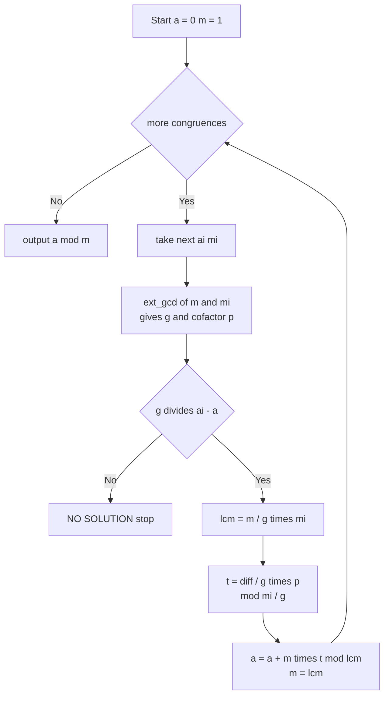

# CRT: System of Congruences

| | |
| --- | --- |
| **Source** | Classic number theory |
| **Difficulty** | Medium |
| **Topics** | Number theory, CRT, extended Euclid, iterative merge |
| **Link** | https://cses.fi/problemset/ |

---

## Problem Statement

Given $k$ congruences

$$x \equiv a_i \pmod{m_i}, \qquad i = 1, 2, \dots, k, \quad m_i \ge 1,$$

find the smallest non-negative $x$ satisfying all of them simultaneously, or report that no such $x$ exists. The moduli need **not** be pairwise coprime. If a solution exists it is unique modulo $M = \operatorname{lcm}(m_1, m_2, \dots, m_k)$.

```
Input:
  k = 3
  (a, m): (2, 3) (3, 5) (2, 7)
Output: x = 23 (mod 105)
        # 23 mod 3 = 2, 23 mod 5 = 3, 23 mod 7 = 2

Input:
  k = 2
  (a, m): (1, 6) (4, 9)
Output: NO SOLUTION
        # gcd(6,9)=3, but 1 mod 3 = 1 and 4 mod 3 = 1 ... check:
        # diff = 3 divisible by 3 -> actually solvable; see note below

Input:
  k = 2
  (a, m): (2, 6) (1, 9)
Output: NO SOLUTION
        # gcd(6,9)=3 does not divide (1-2) = -1
```

> Note on the middle example: $\gcd(6,9)=3$ and $4-1=3$ is divisible by $3$, so it **is** solvable ($x \equiv 13 \pmod{18}$). The genuinely inconsistent case is the third one.

## Approach (WHY)

We fold the congruences one at a time. Maintain a running solution as a single congruence $x \equiv a \pmod m$, starting from $x \equiv 0 \pmod 1$ (which every integer satisfies). For each new $(a_i, m_i)$ we merge it with the running pair using the two-congruence CRT: solve $a + m\,t \equiv a_i \pmod{m_i}$, which is consistent iff $\gcd(m, m_i) \mid (a_i - a)$. After a successful merge the running modulus grows to $\operatorname{lcm}(m, m_i)$.

If any merge fails the entire system is inconsistent and we stop immediately.



## Solution

### Python

```python
import sys


def ext_gcd(a: int, b: int) -> tuple[int, int, int]:
    if b == 0:
        return a, 1, 0
    g, x, y = ext_gcd(b, a % b)
    return g, y, x - (a // b) * y


def crt_merge(a1: int, m1: int, a2: int, m2: int):
    g, p, _ = ext_gcd(m1, m2)
    diff = a2 - a1
    if diff % g != 0:
        return None                      # inconsistent
    lcm = m1 // g * m2
    mod = m2 // g
    t = (diff // g) % mod * (p % mod) % mod
    x = (a1 + m1 * t) % lcm
    return x % lcm, lcm


def crt_system(rem: list[int], mod: list[int]):
    a, m = 0, 1
    for ai, mi in zip(rem, mod):
        merged = crt_merge(a, m, ai % mi, mi)
        if merged is None:
            return None
        a, m = merged
    return a, m


def main() -> None:
    data = sys.stdin.read().split()
    k = int(data[0])
    rem, mod = [], []
    idx = 1
    for _ in range(k):
        rem.append(int(data[idx]))
        mod.append(int(data[idx + 1]))
        idx += 2
    res = crt_system(rem, mod)
    if res is None:
        print("NO SOLUTION")
    else:
        a, m = res
        print(f"x = {a} (mod {m})")


if __name__ == "__main__":
    main()
```

### C++

```cpp
#include <bits/stdc++.h>
using namespace std;

array<long long, 3> ext_gcd(long long a, long long b) {
    if (b == 0) return {a, 1, 0};
    auto r = ext_gcd(b, a % b);
    long long g = r[0], x = r[1], y = r[2];
    return {g, y, x - (a / b) * y};
}

// Returns {x, lcm}; lcm == -1 signals inconsistency.
pair<long long, long long> crt_merge(long long a1, long long m1,
                                     long long a2, long long m2) {
    auto r = ext_gcd(m1, m2);
    long long g = r[0], p = r[1];
    long long diff = a2 - a1;
    if (diff % g != 0) return {0, -1};       // inconsistent
    long long lcm = m1 / g * m2;
    long long mod = m2 / g;
    long long pn = ((p % mod) + mod) % mod;
    long long t = (long long)(((__int128)((diff / g) % mod + mod) * pn) % mod);
    long long x = (long long)(((__int128)m1 * t + a1) % lcm);
    x = ((x % lcm) + lcm) % lcm;
    return {x, lcm};
}

pair<long long, long long> crt_system(const vector<long long>& rem,
                                      const vector<long long>& mod) {
    long long a = 0, m = 1;
    for (size_t i = 0; i < rem.size(); ++i) {
        long long ai = ((rem[i] % mod[i]) + mod[i]) % mod[i];
        auto merged = crt_merge(a, m, ai, mod[i]);
        if (merged.second == -1) return {0, -1};
        a = merged.first;
        m = merged.second;
    }
    return {a, m};
}

int main() {
    ios::sync_with_stdio(false);
    cin.tie(nullptr);
    int k;
    cin >> k;
    vector<long long> rem(k), mod(k);
    for (int i = 0; i < k; ++i) cin >> rem[i] >> mod[i];
    auto res = crt_system(rem, mod);
    if (res.second == -1) cout << "NO SOLUTION\n";
    else cout << "x = " << res.first << " (mod " << res.second << ")\n";
    return 0;
}
```

## Iteration Trace

System $x \equiv 2 \pmod 3$, $x \equiv 3 \pmod 5$, $x \equiv 2 \pmod 7$. Running pair starts at $(a, m) = (0, 1)$:

| Merge | New $(a_i, m_i)$ | $g$ | consistent? | new $a$ | new $m$ (lcm) |
| --- | --- | --- | --- | --- | --- |
| 1 | $(2, 3)$ | $\gcd(1,3)=1$ | yes | $2$ | $3$ |
| 2 | $(3, 5)$ | $\gcd(3,5)=1$ | yes | $8$ | $15$ |
| 3 | $(2, 7)$ | $\gcd(15,7)=1$ | yes | $23$ | $105$ |

Final: $x = 23 \pmod{105}$. Check $23 \bmod 3 = 2$, $23 \bmod 5 = 3$, $23 \bmod 7 = 2$. ✓


## Complexity

With $k$ congruences, each merge is one extended Euclid call:

$$T = O\!\left(k \log M\right), \qquad M = \operatorname{lcm}(m_1, \dots, m_k).$$

| Step | Time | Space |
| --- | --- | --- |
| One merge (ext Euclid) | $O(\log M)$ | $O(1)$ |
| Full system ($k$ merges) | $O(k \log M)$ | $O(1)$ |

## Takeaway

Fold congruences iteratively, keeping a single running $(a, m)$ and merging each new pair with the two-congruence CRT. Check $\gcd(m, m_i) \mid (a_i - a)$ at every step so inconsistent systems are caught early, and the running modulus is always the lcm of the moduli processed so far.
