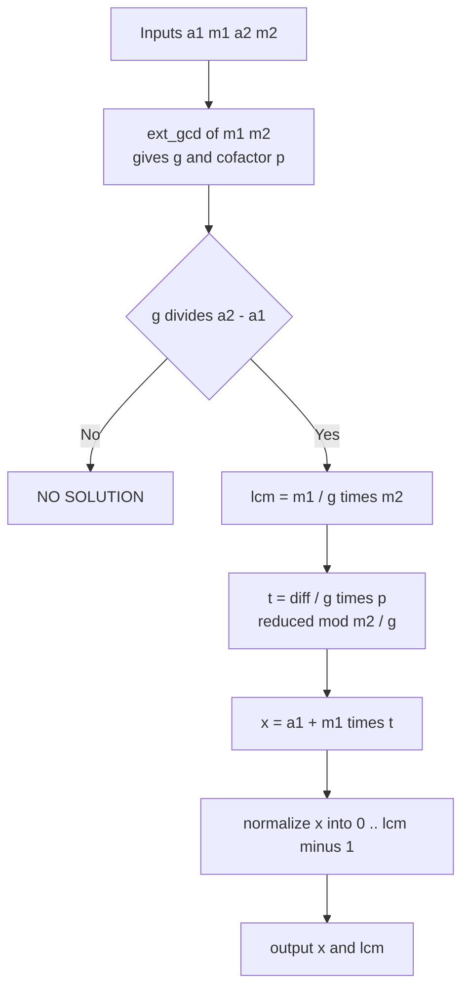
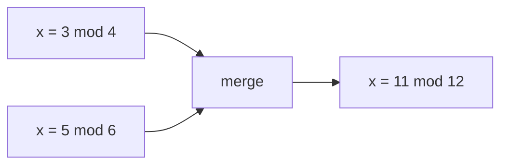

# CRT: Two Congruences

| | |
| --- | --- |
| **Source** | Classic number theory |
| **Difficulty** | Medium |
| **Topics** | Number theory, CRT, extended Euclid |
| **Link** | https://cses.fi/problemset/ |

---

## Problem Statement

Given four integers $a_1, m_1, a_2, m_2$ with $m_1, m_2 \ge 1$, find the smallest non-negative integer $x$ satisfying both congruences:

$$x \equiv a_1 \pmod{m_1}, \qquad x \equiv a_2 \pmod{m_2}.$$

The moduli are **not** assumed coprime. A solution exists if and only if $\gcd(m_1, m_2) \mid (a_2 - a_1)$; when it exists it is unique modulo $\operatorname{lcm}(m_1, m_2)$. Report the unique solution in $[0, \operatorname{lcm}(m_1, m_2))$, or that no solution exists.

```
Input:  a1=2 m1=3  a2=3 m2=5
Output: x = 8           # 8 mod 3 = 2, 8 mod 5 = 3; modulus lcm = 15

Input:  a1=2 m1=4  a2=3 m2=6
Output: NO SOLUTION     # gcd(4,6)=2 does not divide 3-2=1

Input:  a1=3 m1=4  a2=5 m2=6
Output: x = 11          # 11 mod 4 = 3, 11 mod 6 = 5; lcm = 12
```

## Approach (WHY)

Write the first congruence as $x = a_1 + m_1 t$ for an unknown integer $t$. Substituting into the second:

$$a_1 + m_1 t \equiv a_2 \pmod{m_2} \implies m_1 t \equiv (a_2 - a_1) \pmod{m_2}.$$

This linear congruence in $t$ is solvable iff $g = \gcd(m_1, m_2)$ divides $(a_2 - a_1)$. Using the extended Euclidean algorithm we get $m_1 p + m_2 q = g$, so $p$ is an inverse-like cofactor. Dividing through by $g$ and reducing modulo $m_2/g$ yields $t$, and back-substitution gives $x = a_1 + m_1 t$ reduced modulo $\operatorname{lcm}(m_1, m_2) = m_1 m_2 / g$.



## Solution

### Python

```python
import sys


def ext_gcd(a: int, b: int) -> tuple[int, int, int]:
    if b == 0:
        return a, 1, 0
    g, x, y = ext_gcd(b, a % b)
    return g, y, x - (a // b) * y


def crt_two(a1: int, m1: int, a2: int, m2: int):
    g, p, _ = ext_gcd(m1, m2)
    diff = a2 - a1
    if diff % g != 0:
        return None                      # inconsistent
    lcm = m1 // g * m2
    mod = m2 // g
    t = (diff // g) % mod * (p % mod) % mod
    x = (a1 + m1 * t) % lcm
    return x % lcm, lcm


def main() -> None:
    a1, m1, a2, m2 = map(int, sys.stdin.read().split())
    res = crt_two(a1 % m1, m1, a2 % m2, m2)
    if res is None:
        print("NO SOLUTION")
    else:
        x, lcm = res
        print(f"x = {x} (mod {lcm})")


if __name__ == "__main__":
    main()
```

### C++

```cpp
#include <bits/stdc++.h>
using namespace std;

array<long long, 3> ext_gcd(long long a, long long b) {
    if (b == 0) return {a, 1, 0};
    auto r = ext_gcd(b, a % b);
    long long g = r[0], x = r[1], y = r[2];
    return {g, y, x - (a / b) * y};
}

// Returns {x, lcm}; lcm == -1 signals no solution.
pair<long long, long long> crt_two(long long a1, long long m1,
                                   long long a2, long long m2) {
    auto r = ext_gcd(m1, m2);
    long long g = r[0], p = r[1];
    long long diff = a2 - a1;
    if (diff % g != 0) return {0, -1};       // inconsistent
    long long lcm = m1 / g * m2;
    long long mod = m2 / g;
    long long pn = ((p % mod) + mod) % mod;
    long long t = (long long)(((__int128)((diff / g) % mod + mod) * pn) % mod);
    long long x = (long long)(((__int128)m1 * t + a1) % lcm);
    x = ((x % lcm) + lcm) % lcm;
    return {x, lcm};
}

int main() {
    ios::sync_with_stdio(false);
    cin.tie(nullptr);
    long long a1, m1, a2, m2;
    cin >> a1 >> m1 >> a2 >> m2;
    a1 = ((a1 % m1) + m1) % m1;
    a2 = ((a2 % m2) + m2) % m2;
    auto res = crt_two(a1, m1, a2, m2);
    if (res.second == -1) cout << "NO SOLUTION\n";
    else cout << "x = " << res.first << " (mod " << res.second << ")\n";
    return 0;
}
```

## Iteration Trace

Solving $x \equiv 3 \pmod 4$, $x \equiv 5 \pmod 6$:

| Step | Quantity | Value |
| --- | --- | --- |
| 1 | $g = \gcd(4, 6)$, cofactor $p$ | $g = 2$, $p = -1$ |
| 2 | $\text{diff} = a_2 - a_1$ | $5 - 3 = 2$ |
| 3 | divisibility check $g \mid \text{diff}$ | $2 \mid 2$ → OK |
| 4 | $\text{lcm} = 4/2 \cdot 6$ | $12$ |
| 5 | reduce mod $= m_2/g = 3$, $p \bmod 3$ | $p \equiv 2$ |
| 6 | $t = (\text{diff}/g)\cdot p \bmod 3 = 1 \cdot 2$ | $t = 2$ |
| 7 | $x = a_1 + m_1 t = 3 + 4\cdot 2$ | $11$ |
| 8 | normalize mod $12$ | $x = 11$ |

Check: $11 \bmod 4 = 3$ and $11 \bmod 6 = 5$. ✓



## Complexity

The work is dominated by the extended Euclidean algorithm:

$$T = O\bigl(\log \min(m_1, m_2)\bigr).$$

| Step | Time | Space |
| --- | --- | --- |
| Extended Euclid | $O(\log \min(m_1, m_2))$ | $O(\log)$ recursion |
| Merge arithmetic | $O(1)$ | $O(1)$ |

## Takeaway

Merge two congruences by writing $x = a_1 + m_1 t$, solving the resulting linear congruence in $t$ with extended Euclid, and checking $g \mid (a_2 - a_1)$ for consistency. The result lives modulo $\operatorname{lcm}(m_1, m_2)$, and `__int128` guards the intermediate products from overflow.
