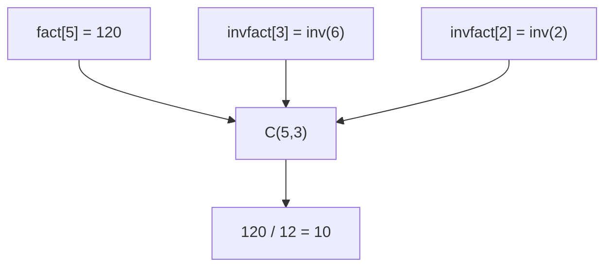

# CSES 1079 — Binomial Coefficients

| Field | Value |
| --- | --- |
| Source | CSES Problem Set — Mathematics |
| Difficulty | Easy |
| Topics | Combinatorics, Modular Arithmetic, Factorials, Inverse Factorials |
| Link | https://cses.fi/problemset/task/1079 |

---

## Problem Statement

You are given $n$ pairs of integers $a$ and $b$. For each pair, compute the binomial coefficient

$$
\binom{a}{b} \bmod (10^9 + 7).
$$

Constraints: $1 \le n \le 10^5$ and $0 \le b \le a \le 10^6$.

Since $a$ can be up to $10^6$ and there are up to $10^5$ queries, we need an $O(1)$ answer per query after a linear precomputation.

```
Input:
3
5 3
8 1
9 5

Output:
10
8
126
```

Here $\binom{5}{3} = 10$, $\binom{8}{1} = 8$, and $\binom{9}{5} = 126$.

---

## Approach (WHY)

The definition $\binom{a}{b} = \dfrac{a!}{b!\,(a-b)!}$ involves division, which is illegal in modular arithmetic — but the modulus $p = 10^9 + 7$ is **prime**, so every nonzero residue has a modular inverse. We replace division by multiplication with inverses:

$$
\binom{a}{b} \equiv a! \cdot (b!)^{-1} \cdot ((a-b)!)^{-1} \pmod p.
$$

Precompute all factorials up to $N = 10^6$, then all inverse factorials. By Fermat's little theorem, $(x)^{-1} \equiv x^{p-2} \pmod p$. We only do **one** exponentiation — invert the largest factorial — and recover the rest via $\text{invfact}[i-1] = \text{invfact}[i] \cdot i$.


This gives $O(N + \log p)$ preprocessing and $O(1)$ per query — comfortably within limits.

---

## Solution

### Python

```python
import sys

def main() -> None:
    data = sys.stdin.buffer.read().split()
    p = 10**9 + 7
    N = 10**6

    fact = [1] * (N + 1)
    for i in range(1, N + 1):
        fact[i] = fact[i - 1] * i % p

    invfact = [1] * (N + 1)
    invfact[N] = pow(fact[N], p - 2, p)          # single Fermat inverse
    for i in range(N, 0, -1):
        invfact[i - 1] = invfact[i] * i % p

    n = int(data[0])
    out = []
    idx = 1
    for _ in range(n):
        a = int(data[idx]); b = int(data[idx + 1]); idx += 2
        if b < 0 or b > a:
            out.append("0")
        else:
            res = fact[a] * invfact[b] % p * invfact[a - b] % p
            out.append(str(res))

    sys.stdout.write("\n".join(out) + "\n")

main()
```

### C++

```cpp
#include <bits/stdc++.h>
using namespace std;

const long long MOD = 1e9 + 7;
const int N = 1000000;

long long fact[N + 1], invfact[N + 1];

long long power(long long a, long long b, long long p) {
    long long result = 1 % p;
    a %= p;
    while (b > 0) {
        if (b & 1) result = result * a % p;
        a = a * a % p;
        b >>= 1;
    }
    return result;
}

int main() {
    ios::sync_with_stdio(false);
    cin.tie(nullptr);

    fact[0] = 1;
    for (int i = 1; i <= N; ++i) fact[i] = fact[i - 1] * i % MOD;
    invfact[N] = power(fact[N], MOD - 2, MOD);     // single Fermat inverse
    for (int i = N; i >= 1; --i) invfact[i - 1] = invfact[i] * i % MOD;

    int n;
    cin >> n;
    while (n--) {
        long long a, b;
        cin >> a >> b;
        if (b < 0 || b > a) {
            cout << 0 << '\n';
        } else {
            long long res = fact[a] * invfact[b] % MOD * invfact[a - b] % MOD;
            cout << res << '\n';
        }
    }
    return 0;
}
```

---

## Iteration Trace

Trace of the inverse-factorial recurrence for a tiny $N = 5$ with $p = 10^9 + 7$ (factorial values shown unreduced since they are small):

| Step | Statement | `invfact` updated | Value |
| --- | --- | --- | --- |
| 1 | `invfact[5] = pow(fact[5], p-2)` | `invfact[5]` | $(120)^{-1}$ |
| 2 | `invfact[4] = invfact[5] * 5` | `invfact[4]` | $(24)^{-1}$ |
| 3 | `invfact[3] = invfact[4] * 4` | `invfact[3]` | $(6)^{-1}$ |
| 4 | `invfact[2] = invfact[3] * 3` | `invfact[2]` | $(2)^{-1}$ |
| 5 | `invfact[1] = invfact[2] * 2` | `invfact[1]` | $(1)^{-1}$ |
| 6 | `invfact[0] = invfact[1] * 1` | `invfact[0]` | $1$ |

Now $\binom{5}{3} = \text{fact}[5]\cdot\text{invfact}[3]\cdot\text{invfact}[2] = 120 \cdot (6)^{-1} \cdot (2)^{-1} = 120 / 12 = 10$. ✓



---

The total cost is dominated by the precompute:

$$
O(N + \log p) \text{ preprocessing} \;+\; O(1) \text{ per query} \;=\; O(N + \log p + n).
$$

## Complexity

| Aspect | Complexity |
| --- | --- |
| Precompute factorials | $O(N)$ |
| One Fermat inverse | $O(\log p)$ |
| Inverse factorials | $O(N)$ |
| Per query | $O(1)$ |
| Total | $O(N + \log p + n)$ |
| Space | $O(N)$ |

---

## Takeaway

A prime modulus turns "division" into "multiply by inverse." Precompute factorials and inverse factorials once with a **single** Fermat exponentiation, then every $\binom{a}{b} \bmod p$ is a three-term product answered in $O(1)$. This template is the backbone of nearly every modular counting problem.
