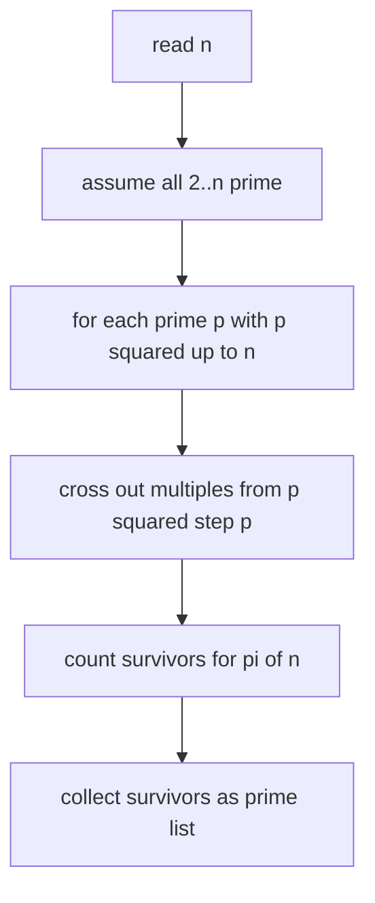
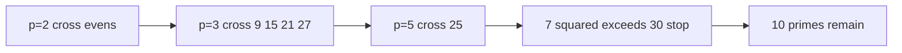

# Counting Primes with a Sieve

| Field | Value |
|---|---|
| Source | CSES-style (self-contained) |
| Difficulty | Easy |
| Topics | Sieve of Eratosthenes, prime counting |
| Link | https://cses.fi/problemset/ |

---

## Problem Statement

Given an integer $n$, count how many prime numbers are less than or equal to $n$, and also be able to list them.

Formally, compute the prime-counting function

$$
\pi(n) = \bigl|\{\, p : 2 \le p \le n,\ p \text{ is prime}\,\}\bigr|.
$$

Constraints: $1 \le n \le 10^7$.

```text
Input:
30

Output:
10
2 3 5 7 11 13 17 19 23 29
```

The first line is $\pi(30) = 10$; the second line lists the primes up to $30$.

## Approach (WHY)

We need primality information for *every* number up to $n$, so the Sieve of Eratosthenes is the natural fit: one $O(n \log \log n)$ pass marks all composites. Counting is then a sum over the boolean array, and listing is a scan collecting the surviving indices.

The reason the sieve beats per-number trial division ($O(\sqrt n)$ each, $O(n\sqrt n)$ total) is that marking multiples shares work: each composite is crossed out by its prime factors rather than re-tested from scratch.



## Solution

### Python

```python
import sys


def solve() -> None:
    data = sys.stdin.buffer.read().split()
    n = int(data[0]) if data else 0

    is_prime = bytearray([1]) * (n + 1)
    if n >= 0:
        is_prime[0] = 0
    if n >= 1:
        is_prime[1] = 0

    p = 2
    while p * p <= n:
        if is_prime[p]:
            is_prime[p * p : n + 1 : p] = bytearray(len(range(p * p, n + 1, p)))
        p += 1

    primes = [i for i in range(2, n + 1) if is_prime[i]]

    out = [str(len(primes))]
    out.append(" ".join(map(str, primes)))
    sys.stdout.write("\n".join(out) + "\n")


if __name__ == "__main__":
    solve()
```

### C++

```cpp
#include <bits/stdc++.h>
using namespace std;

int main() {
    ios::sync_with_stdio(false);
    cin.tie(nullptr);

    int n;
    if (!(cin >> n)) return 0;

    vector<char> is_prime(n + 1, true);
    if (n >= 0) is_prime[0] = false;
    if (n >= 1) is_prime[1] = false;

    for (long long p = 2; p * p <= n; ++p) {
        if (is_prime[p]) {
            for (long long multiple = p * p; multiple <= n; multiple += p)
                is_prime[multiple] = false;
        }
    }

    vector<int> primes;
    for (int i = 2; i <= n; ++i)
        if (is_prime[i]) primes.push_back(i);

    cout << primes.size() << '\n';
    for (size_t i = 0; i < primes.size(); ++i)
        cout << primes[i] << " \n"[i + 1 == primes.size()];
    return 0;
}
```

## Iteration Trace

For $n = 30$, the outer loop only runs while $p^2 \le 30$, i.e. for $p = 2, 3, 5$:

| Prime $p$ | Start $p^2$ | Numbers crossed out |
|---|---|---|
| 2 | 4 | 4, 6, 8, 10, 12, 14, 16, 18, 20, 22, 24, 26, 28, 30 |
| 3 | 9 | 9, 15, 21, 27 (others already gone) |
| 5 | 25 | 25 (others already gone) |
| 7 | 49 > 30 | loop stops |

Survivors: $2, 3, 5, 7, 11, 13, 17, 19, 23, 29$ — count $= 10$.



The total marking work follows

$$
\sum_{p \le n} \frac{n}{p} = n \sum_{p \le n} \frac{1}{p} \approx n \ln \ln n,
$$

so the algorithm is $O(n \log \log n)$.

## Complexity

| Aspect | Cost |
|---|---|
| Time (sieve) | $O(n \log \log n)$ |
| Time (count + list) | $O(n)$ |
| Space | $O(n)$ |

## Takeaway

When a problem needs primality for an entire range, sieve once and reuse. Counting primes is then a trivial sum over the boolean array, and listing is a single scan — both dominated by the one-time $O(n \log \log n)$ marking pass.
