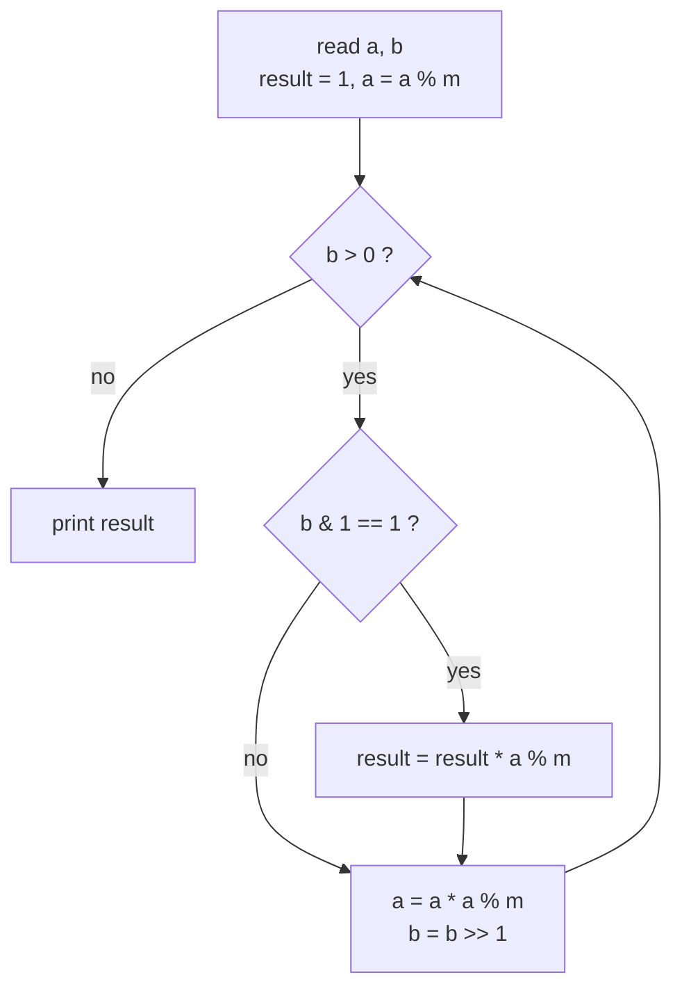
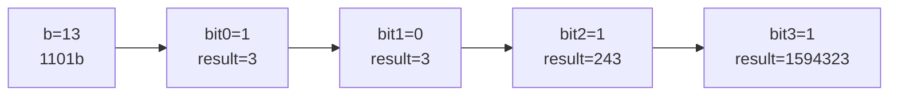

# CSES 1095 — Exponentiation

| | |
|---|---|
| **Source** | CSES Problem Set — Mathematics |
| **Difficulty** | Easy |
| **Topics** | Modular arithmetic, Binary (fast) exponentiation |
| **Link** | https://cses.fi/problemset/task/1095 |

---

## Problem Statement

You are given $n$ queries. For each query you receive two integers $a$ and $b$, and must compute

$$
a^{b} \bmod (10^9 + 7).
$$

**Constraints**

$$
1 \le n \le 2 \times 10^5, \qquad 0 \le a, b \le 10^9.
$$

Because $b$ can be as large as $10^9$, a naive loop multiplying $a$ a total of $b$ times — $O(b)$ per query — is far too slow. Fast exponentiation answers each query in $O(\log b)$.

```
Input
3
3 4
2 8
5 3

Output
81
256
125
```

Here $3^4 = 81$, $2^8 = 256$, and $5^3 = 125$, all already below the modulus.

> Edge case: $0^0$ is defined as $1$ by CSES convention, which the standard `result = 1` initialization handles naturally.

---

## Approach (WHY)

We exploit the binary representation of the exponent. Writing $b = \sum_i b_i 2^i$, we accumulate $a^{2^i}$ into the result whenever bit $b_i = 1$, squaring the base each step. This consumes one bit per iteration, so the cost is $O(\log b)$ — about 30 iterations for $b \le 10^9$.

Every product is reduced modulo $m = 10^9+7$ immediately. Two reduced values are each below $10^9+7$, and their product is below $\approx 10^{18}$, which fits in a signed 64-bit integer, so no overflow protection beyond `% m` is needed.



---

## Solution

### Python

```python
import sys

MOD = 10**9 + 7

def power(a: int, b: int, m: int = MOD) -> int:
    result = 1
    a %= m
    while b > 0:
        if b & 1:
            result = result * a % m
        a = a * a % m
        b >>= 1
    return result

def main() -> None:
    data = sys.stdin.buffer.read().split()
    n = int(data[0])
    out = []
    idx = 1
    for _ in range(n):
        a = int(data[idx]); b = int(data[idx + 1]); idx += 2
        out.append(str(power(a, b)))
    sys.stdout.write("\n".join(out) + "\n")

if __name__ == "__main__":
    main()
```

### C++

```cpp
#include <bits/stdc++.h>
using namespace std;

const long long MOD = 1e9 + 7;

long long power(long long a, long long b, long long m = MOD) {
    long long result = 1;
    a %= m;
    while (b > 0) {
        if (b & 1) result = result * a % m;
        a = a * a % m;
        b >>= 1;
    }
    return result;
}

int main() {
    ios::sync_with_stdio(false);
    cin.tie(nullptr);

    int n;
    cin >> n;
    while (n--) {
        long long a, b;
        cin >> a >> b;
        cout << power(a, b) << '\n';
    }
    return 0;
}
```

---

## Iteration Trace

Computing $3^{13} \bmod (10^9+7)$. Binary of $13$ is $1101_2$. True value $3^{13} = 1\,594\,323$, which is below the modulus, so the residue is $1\,594\,323$.

| Step | b (binary) | bit | base in | result in | took bit? | result out | base out |
|------|-----------|-----|---------|-----------|-----------|------------|----------|
| 1 | 1101 | 1 | 3 | 1 | yes | 3 | 9 |
| 2 | 110 | 0 | 9 | 3 | no | 3 | 81 |
| 3 | 11 | 1 | 81 | 3 | yes | 243 | 6561 |
| 4 | 1 | 1 | 6561 | 243 | yes | 1594323 | 43046721 |
| — | 0 | — | — | 1594323 | stop | **1594323** | — |



---

## Complexity

Per query, the loop runs $O(\log b)$ times. With $n$ queries the total work is

$$
O(n \log b).
$$

| Metric | Value |
|--------|-------|
| Time per query | $O(\log b)$ |
| Total time | $O(n \log b)$ |
| Space | $O(1)$ extra |

---

## Takeaway

Fast exponentiation turns an $O(b)$ multiply-loop into an $O(\log b)$ bit-walk by squaring the base and reading one exponent bit per step. Initialize `result = 1` so $a^0 = 1$ (including $0^0 = 1$) falls out for free, and reduce after both the multiply and the squaring.
