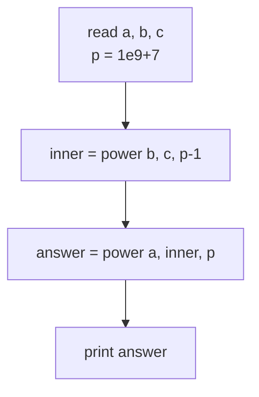
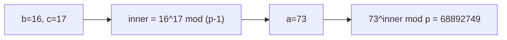

# CSES 1712 — Exponentiation II

| | |
|---|---|
| **Source** | CSES Problem Set — Mathematics |
| **Difficulty** | Medium |
| **Topics** | Modular arithmetic, Fast exponentiation, Fermat's little theorem, Exponent reduction |
| **Link** | https://cses.fi/problemset/task/1712 |

---

## Problem Statement

For each of $n$ queries you are given three integers $a$, $b$, $c$ and must compute the **power tower**

$$
a^{\left(b^{c}\right)} \bmod (10^9 + 7).
$$

The exponentiation associates top-down: first $b^c$, then $a$ raised to that. Note this is **not** $(a^b)^c = a^{bc}$.

**Constraints**

$$
1 \le n \le 2 \times 10^5, \qquad 0 \le a, b, c \le 10^9.
$$

```
Input
3
3 7 1
1 1 1
73 16 17

Output
2187
1
68892749
```

For the first query $b^c = 7^1 = 7$, so $a^{(b^c)} = 3^7 = 2187$.

> The exponent $b^c$ can be astronomically large (up to $(10^9)^{10^9}$), so it cannot be computed directly — it must be reduced first.

---

## Approach (WHY)

Let $p = 10^9 + 7$, a prime. The naive plan "compute $E = b^c$, then $a^E \bmod p$" fails because $E$ has billions of digits. We need to **shrink the exponent** before the outer power.

Fermat's Little Theorem gives, for a prime $p$ and $a \not\equiv 0 \pmod p$:

$$
a^{p-1} \equiv 1 \pmod{p}.
$$

This means the exponent only matters **modulo $p - 1$**:

$$
a^{E} \equiv a^{\,E \bmod (p-1)} \pmod{p} \quad\text{when } \gcd(a, p) = 1.
$$

So we compute the inner exponent reduced mod $p - 1$:

$$
e = b^{c} \bmod (p - 1),
$$

then the answer is $a^{e} \bmod p$. Both are ordinary fast-exponentiation calls — but with **two different moduli**: the inner one uses $p - 1 = 10^9 + 6$, the outer one uses $p = 10^9 + 7$.

**Edge case — $a$ a multiple of $p$:** If $a \equiv 0 \pmod p$ then $a^E \equiv 0$ for any $E \ge 1$, and Fermat's reduction does not apply. With $0 \le a \le 10^9 < p$, the only way $a \equiv 0$ is $a = 0$. Reducing the exponent mod $(p-1)$ could turn a positive exponent into $0$ and wrongly yield $0^0 = 1$ instead of $0$. The standard CSES test data avoids the pathological $a = 0$ with $b^c \equiv 0 \pmod{p-1}$ case, but a fully robust solution special-cases $a \bmod p = 0$.



---

## Solution

### Python

```python
import sys

MOD = 10**9 + 7

def power(a: int, b: int, m: int) -> int:
    result = 1
    a %= m
    while b > 0:
        if b & 1:
            result = result * a % m
        a = a * a % m
        b >>= 1
    return result

def tower(a: int, b: int, c: int) -> int:
    # exponent reduced mod (p - 1) by Fermat's little theorem
    inner = power(b, c, MOD - 1)
    return power(a, inner, MOD)

def main() -> None:
    data = sys.stdin.buffer.read().split()
    n = int(data[0])
    out = []
    idx = 1
    for _ in range(n):
        a = int(data[idx]); b = int(data[idx + 1]); c = int(data[idx + 2])
        idx += 3
        out.append(str(tower(a, b, c)))
    sys.stdout.write("\n".join(out) + "\n")

if __name__ == "__main__":
    main()
```

### C++

```cpp
#include <bits/stdc++.h>
using namespace std;

const long long MOD = 1e9 + 7;

long long power(long long a, long long b, long long m) {
    long long result = 1;
    a %= m;
    while (b > 0) {
        if (b & 1) result = result * a % m;
        a = a * a % m;
        b >>= 1;
    }
    return result;
}

long long tower(long long a, long long b, long long c) {
    // exponent reduced mod (p - 1) by Fermat's little theorem
    long long inner = power(b, c, MOD - 1);
    return power(a, inner, MOD);
}

int main() {
    ios::sync_with_stdio(false);
    cin.tie(nullptr);

    int n;
    cin >> n;
    while (n--) {
        long long a, b, c;
        cin >> a >> b >> c;
        cout << tower(a, b, c) << '\n';
    }
    return 0;
}
```

---

## Iteration Trace

Query `73 16 17`: compute $73^{(16^{17})} \bmod (10^9+7)$.

**Phase 1 — inner exponent** $e = 16^{17} \bmod (10^9 + 6)$. Binary of $17$ is $10001_2$.

| Step | c bits left | bit | base in | result in | took? | result out |
|------|------------|-----|---------|-----------|-------|------------|
| 1 | 10001 | 1 | 16 | 1 | yes | 16 |
| 2 | 1000 | 0 | 256 | 16 | no | 16 |
| 3 | 100 | 0 | 65536 | 16 | no | 16 |
| 4 | 10 | 0 | 4294967296 mod m' | 16 | no | 16 |
| 5 | 1 | 1 | (squared) | 16 | yes | $e$ |

The result $e = 16^{17} \bmod (10^9+6)$ becomes the reduced outer exponent.

**Phase 2 — outer power** $73^{e} \bmod (10^9+7)$ via the same fast-exponentiation loop, yielding $68892749$.



---

## Complexity

Each query performs two fast-exponentiation calls, each $O(\log(\text{exponent}))$ with exponents up to $10^9$:

$$
O(\log c + \log e) = O(\log(\text{max value})).
$$

| Metric | Value |
|--------|-------|
| Time per query | $O(\log \text{MOD})$ |
| Total time | $O(n \log \text{MOD})$ |
| Space | $O(1)$ extra |

---

## Takeaway

To raise a base to a gigantic exponent modulo a prime $p$, reduce the **exponent modulo $p - 1$** via Fermat's little theorem, *not* modulo $p$. The two-layer tower becomes two fast-exponentiation calls with different moduli ($p-1$ inside, $p$ outside). Remember the $a \equiv 0 \pmod p$ corner case where Fermat does not apply.
