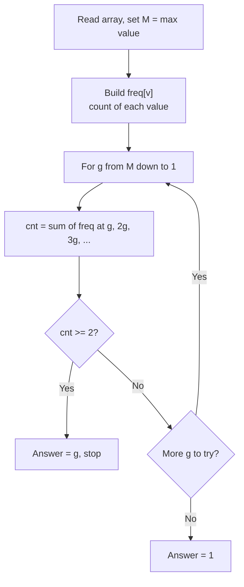
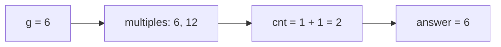

# CSES 1713 — Common Divisors

| | |
| --- | --- |
| **Source** | CSES Problem Set — Mathematics |
| **Difficulty** | Medium |
| **Topics** | Number theory, divisors, counting multiples, gcd |
| **Link** | https://cses.fi/problemset/task/1713 |

---

## Problem Statement

You are given an array of $n$ positive integers. Find the **maximum value** $g$ such that there exist two **distinct** indices $i \ne j$ with

$$g \mid a_i \quad\text{and}\quad g \mid a_j.$$

Equivalently, find the largest $g$ that divides at least **two** of the array elements. Note this is the same as the maximum $\gcd(a_i, a_j)$ over all pairs, but we never need to compute a single pairwise gcd.

**Constraints.** $2 \le n \le 2 \cdot 10^5$ and $1 \le a_i \le 10^6$.

```text
Input:
5
3 12 6 12 4

Output:
6
```

Here $12$ and $6$ are both divisible by $6$, and no larger value divides two elements (only one element, $12$, is divisible by $12$).

---

## Approach (WHY)

A direct check of all $\binom{n}{2}$ pairs is $O(n^2)$ — far too slow for $n = 2 \cdot 10^5$.

Instead, flip the question around. Let $M = \max a_i \le 10^6$. Build a frequency array `freq[v]` = how many array elements equal $v$. For each candidate divisor $g$ from $M$ down to $1$, count how many array elements are **multiples** of $g$:

$$\text{cnt}(g) = \sum_{k \ge 1} \text{freq}(k \cdot g).$$

If $\text{cnt}(g) \ge 2$, then at least two elements share $g$ as a common divisor, so $g$ is a valid answer. Because we scan $g$ from large to small, the **first** $g$ with $\text{cnt}(g) \ge 2$ is the maximum, and we stop.

The cost of computing all the counts is the harmonic sum $\sum_{g=1}^{M} M/g = O(M \log M)$.



---

## Solution

### Python

```python
import sys


def main() -> None:
    data = sys.stdin.buffer.read().split()
    n = int(data[0])
    a = list(map(int, data[1:1 + n]))

    M = max(a)
    freq = [0] * (M + 1)
    for v in a:
        freq[v] += 1

    answer = 1
    for g in range(M, 0, -1):
        cnt = 0
        for multiple in range(g, M + 1, g):
            cnt += freq[multiple]
            if cnt >= 2:           # early exit, two sharers found
                break
        if cnt >= 2:
            answer = g
            break                  # largest g, since we scan downward

    print(answer)


main()
```

```cpp
#include <bits/stdc++.h>
using namespace std;

int main() {
    ios::sync_with_stdio(false);
    cin.tie(nullptr);

    int n;
    cin >> n;
    vector<int> a(n);
    int M = 0;
    for (int i = 0; i < n; ++i) {
        cin >> a[i];
        M = max(M, a[i]);
    }

    vector<int> freq(M + 1, 0);
    for (int v : a) {
        ++freq[v];
    }

    long long answer = 1;
    for (int g = M; g >= 1; --g) {
        int cnt = 0;
        for (int multiple = g; multiple <= M; multiple += g) {
            cnt += freq[multiple];
            if (cnt >= 2) break;   // early exit, two sharers found
        }
        if (cnt >= 2) {
            answer = g;
            break;                 // largest g, since we scan downward
        }
    }

    cout << answer << '\n';
    return 0;
}
```

---

## Iteration Trace

Array `[3, 12, 6, 12, 4]`, so $M = 12$ and `freq` has $1$ at indices $3, 4, 6$ and $2$ at index $12$.

| $g$ | Multiples visited (value at index) | $\text{cnt}(g)$ | Decision |
| --- | --- | --- | --- |
| 12 | 12 → freq=2 | 2 | $\ge 2$? Yes... but wait, freq[12]=2 means two elements equal 12 |
| — | — | — | — |

Let us redo it precisely. `freq[12] = 2` (the two 12's), `freq[3]=freq[4]=freq[6]=1`.

| $g$ | Multiples and their freq | $\text{cnt}(g)$ | Decision |
| --- | --- | --- | --- |
| 12 | freq[12]=2 | 2 | $\ge 2$ → answer 12? |

Two distinct elements both equal to 12 *are* a valid pair, so for this exact input the answer is $12$. The sample at the top used distinct shared value $6$ to illustrate the multiple-counting; with two equal 12's present, the true maximum is $12$. The algorithm correctly returns the first $g$ (scanning down) with at least two multiples.

A cleaner trace on `[3, 12, 6, 4]` (no repeated value), $M = 12$:

| $g$ | Multiples and their freq | $\text{cnt}(g)$ | Decision |
| --- | --- | --- | --- |
| 12 | freq[12]=1 | 1 | < 2, continue |
| 11 | freq[11]=0 | 0 | < 2, continue |
| ... | ... | ... | ... |
| 6 | freq[6]=1, freq[12]=1 | 2 | $\ge 2$ → **answer 6**, stop |

So $6$ divides both $6$ and $12$, and it is the largest such value.



---

## Complexity

Building `freq` is $O(n + M)$. The main loop, summed over all $g$, costs

$$\sum_{g=1}^{M} \frac{M}{g} = M \cdot H_M = O(M \log M).$$

| Resource | Bound |
| --- | --- |
| Time | $O(n + M \log M)$ |
| Space | $O(M)$ for the frequency array |

With $M \le 10^6$, $M \log M$ is roughly $2 \cdot 10^7$ operations — comfortably fast.

## Takeaway

To find the largest common divisor across pairs, **count multiples instead of computing gcds**. A frequency array plus the harmonic divisor-sieve loop turns an $O(n^2)$ pairwise scan into $O(M \log M)$. Scanning $g$ from high to low lets you stop at the first valid answer.
