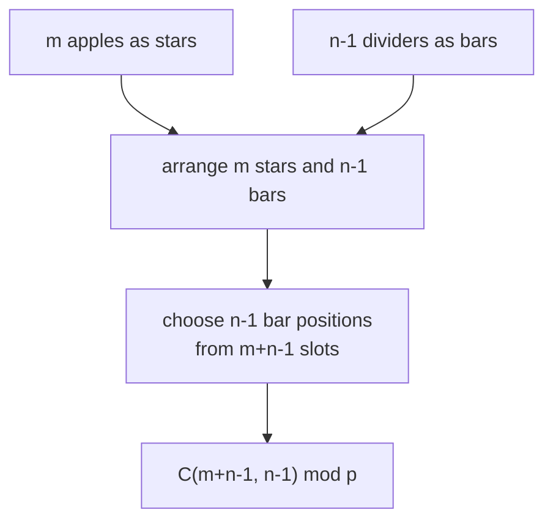
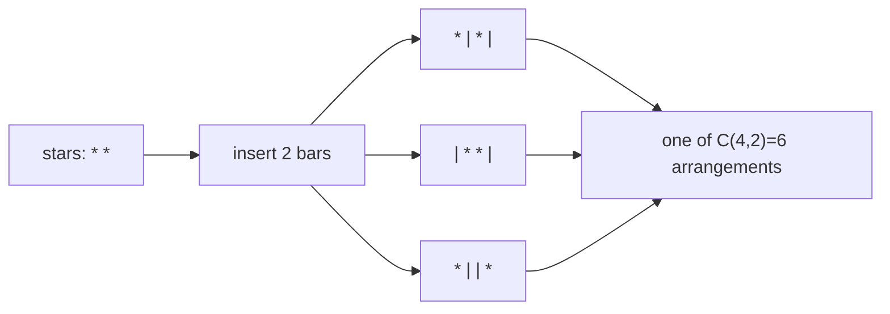

# CSES 1716 — Distributing Apples

| Field | Value |
| --- | --- |
| Source | CSES Problem Set — Mathematics |
| Difficulty | Easy–Medium |
| Topics | Combinatorics, Stars and Bars, Modular Arithmetic |
| Link | https://cses.fi/problemset/task/1716 |

---

## Problem Statement

There are $n$ children and $m$ apples. Count the number of ways to distribute the apples so that every child receives a nonnegative integer number of apples. Output the answer modulo $10^9 + 7$.

Constraints: $1 \le n, m \le 10^6$.

Formally, count the nonnegative integer solutions to

$$
x_1 + x_2 + \dots + x_n = m, \qquad x_i \ge 0.
$$

```
Input:
3 2

Output:
6
```

For $n = 3$ children and $m = 2$ apples the six distributions are $(2,0,0), (0,2,0), (0,0,2), (1,1,0), (1,0,1), (0,1,1)$.

---

## Approach (WHY)

This is the canonical **stars and bars** setup. Lay out the $m$ apples as stars in a row. To split them among $n$ children, insert $n-1$ dividers (bars) into the sequence. Each arrangement of stars and bars corresponds to exactly one distribution: the apples before the first bar go to child 1, those between bar 1 and bar 2 go to child 2, and so on.

We have $m$ stars and $n-1$ bars, for $m + n - 1$ total symbols. Choosing which $n-1$ of these positions are bars determines everything:

$$
\text{ways} = \binom{m + n - 1}{n - 1} = \binom{m + n - 1}{m}.
$$



The argument $m + n - 1$ can reach $\sim 2 \times 10^6$, so we precompute factorials and inverse factorials up to that bound and evaluate one binomial coefficient in $O(1)$.

---

## Solution

### Python

```python
import sys

def main() -> None:
    data = sys.stdin.buffer.read().split()
    n = int(data[0]); m = int(data[1])
    p = 10**9 + 7
    N = n + m + 5                    # upper bound for factorial table

    fact = [1] * (N + 1)
    for i in range(1, N + 1):
        fact[i] = fact[i - 1] * i % p

    invfact = [1] * (N + 1)
    invfact[N] = pow(fact[N], p - 2, p)
    for i in range(N, 0, -1):
        invfact[i - 1] = invfact[i] * i % p

    def nCr(a: int, b: int) -> int:
        if b < 0 or b > a:
            return 0
        return fact[a] * invfact[b] % p * invfact[a - b] % p

    ans = nCr(n + m - 1, n - 1)      # stars and bars
    print(ans)

main()
```

### C++

```cpp
#include <bits/stdc++.h>
using namespace std;

const long long MOD = 1e9 + 7;

long long power(long long a, long long b, long long p) {
    long long result = 1 % p;
    a %= p;
    while (b > 0) {
        if (b & 1) result = result * a % p;
        a = a * a % p;
        b >>= 1;
    }
    return result;
}

int main() {
    ios::sync_with_stdio(false);
    cin.tie(nullptr);

    long long n, m;
    cin >> n >> m;

    int N = (int)(n + m + 5);                 // upper bound for table
    vector<long long> fact(N + 1), invfact(N + 1);
    fact[0] = 1;
    for (int i = 1; i <= N; ++i) fact[i] = fact[i - 1] * i % MOD;
    invfact[N] = power(fact[N], MOD - 2, MOD);
    for (int i = N; i >= 1; --i) invfact[i - 1] = invfact[i] * i % MOD;

    auto nCr = [&](long long a, long long b) -> long long {
        if (b < 0 || b > a) return 0;
        return fact[a] * invfact[b] % MOD * invfact[a - b] % MOD;
    };

    cout << nCr(n + m - 1, n - 1) << '\n';     // stars and bars
    return 0;
}
```

---

## Iteration Trace

Walk through the sample $n = 3$, $m = 2$. We need $\binom{n+m-1}{n-1} = \binom{4}{2}$.

| Step | Quantity | Computation | Value |
| --- | --- | --- | --- |
| 1 | total symbols | $m + n - 1 = 2 + 3 - 1$ | $4$ |
| 2 | bars to place | $n - 1 = 3 - 1$ | $2$ |
| 3 | `fact[4]` | $4! = 24$ | $24$ |
| 4 | `invfact[2]` | $(2!)^{-1} = (2)^{-1}$ | $\text{inv}(2)$ |
| 5 | `invfact[4-2]` | $(2!)^{-1}$ | $\text{inv}(2)$ |
| 6 | result | $24 \cdot \text{inv}(2) \cdot \text{inv}(2) = 24 / 4$ | $6$ |

The answer $6$ matches the enumerated distributions.



---

The whole computation is one binomial coefficient over a linear precompute:

$$
O(n + m) \text{ build} \;+\; O(\log p) \text{ inverse} \;+\; O(1) \text{ query}.
$$

## Complexity

| Aspect | Complexity |
| --- | --- |
| Factorial table | $O(n + m)$ |
| Fermat inverse | $O(\log p)$ |
| Inverse factorials | $O(n + m)$ |
| Final query | $O(1)$ |
| Total | $O(n + m + \log p)$ |
| Space | $O(n + m)$ |

---

## Takeaway

"Distribute $m$ identical items among $n$ groups, each $\ge 0$" is stars and bars: the answer is $\binom{n+m-1}{n-1}$. Recognizing this reduces the entire problem to one modular binomial coefficient. Remember the at-least-one variant uses $\binom{m-1}{n-1}$ instead.
