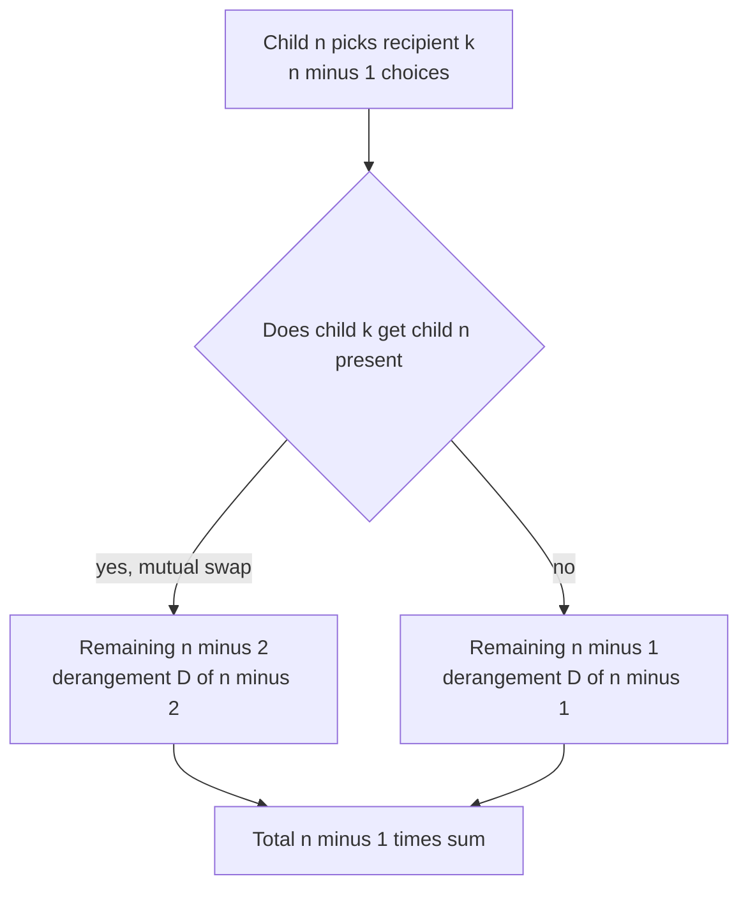
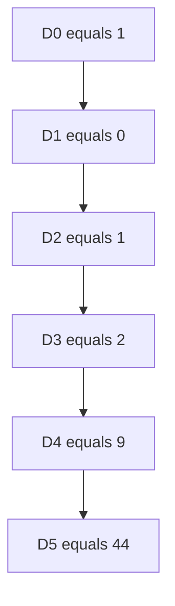

# CSES 1717 — Christmas Party

| Field | Value |
| --- | --- |
| Source | CSES Problem Set (Combinatorics) |
| Difficulty | Easy-Medium |
| Topics | Derangements, Combinatorics, Modular Arithmetic |
| Link | https://cses.fi/problemset/task/1717 |

---

## Problem Statement

There are $n$ children at a Christmas party. Each child brings one present. The presents are redistributed so that **every child receives exactly one present, but nobody receives their own present**. Count the number of ways to do this, modulo $10^9 + 7$.

Constraints: $1 \le n \le 10^6$.

This is precisely the number of **derangements** $D_n$ — permutations $\sigma$ of $\{1, \ldots, n\}$ with no fixed point ($\sigma(i) \neq i$ for all $i$):

$$
D_n = (n-1)\,(D_{n-1} + D_{n-2}), \qquad D_1 = 0,\ D_2 = 1.
$$

```
Input:
3

Output:
2
```

For $n = 3$ the two derangements of $(1,2,3)$ are $(2,3,1)$ and $(3,1,2)$; every other permutation fixes at least one child.

---

## Approach (WHY)

We need permutations with **no fixed point**. Build $D_n$ with the recurrence $D_n = (n-1)(D_{n-1} + D_{n-2})$.

*Why it holds:* place child $n$'s present. It must go to one of the other $n-1$ children — say child $k$ (there are $n-1$ choices). Now consider child $k$'s present:

- **Case A:** child $k$ receives child $n$'s present (a "swap"). Then children $n$ and $k$ are settled, and the remaining $n-2$ children form a derangement among themselves: $D_{n-2}$ ways.
- **Case B:** child $k$ does **not** receive child $n$'s present. Then we can relabel — treat child $n$'s present as a forbidden present for child $k$ — and the remaining $n-1$ children (excluding $n$) each have exactly one forbidden present, a derangement of size $n-1$: $D_{n-1}$ ways.

Summed and multiplied by the $n-1$ choices for $k$ gives $(n-1)(D_{n-1} + D_{n-2})$.



The recurrence is $O(n)$ time and $O(1)$ rolling space (only the last two values are needed). Equivalently the inclusion-exclusion form $D_n = \sum_{j=0}^{n}(-1)^j\binom{n}{j}(n-j)!$ gives the same answer.

---

## Solution

### Python

```python
import sys

MOD = 10**9 + 7

def solve() -> None:
    n = int(sys.stdin.readline())
    if n == 1:
        print(0)
        return
    prev2, prev1 = 1, 0  # D_0 = 1, D_1 = 0
    for i in range(2, n + 1):
        cur = (i - 1) * ((prev1 + prev2) % MOD) % MOD
        prev2, prev1 = prev1, cur
    print(prev1)

solve()
```

### C++

```cpp
#include <bits/stdc++.h>
using namespace std;

const long long MOD = 1e9 + 7;

int main() {
    ios::sync_with_stdio(false);
    cin.tie(nullptr);

    long long n;
    cin >> n;
    if (n == 1) {
        cout << 0 << '\n';
        return 0;
    }
    long long prev2 = 1, prev1 = 0;  // D_0 = 1, D_1 = 0
    for (long long i = 2; i <= n; ++i) {
        long long cur = (i - 1) % MOD * ((prev1 + prev2) % MOD) % MOD;
        prev2 = prev1;
        prev1 = cur;
    }
    cout << prev1 << '\n';
    return 0;
}
```

---

## Iteration Trace

Computing $D_n$ for $n = 5$ with the rolling recurrence:

| $i$ | $D_{i-2}$ | $D_{i-1}$ | $D_i = (i-1)(D_{i-1}+D_{i-2})$ |
| --- | --- | --- | --- |
| 2 | 1 | 0 | $1\cdot(0+1) = 1$ |
| 3 | 0 | 1 | $2\cdot(1+0) = 2$ |
| 4 | 1 | 2 | $3\cdot(2+1) = 9$ |
| 5 | 2 | 9 | $4\cdot(9+2) = 44$ |

So $D_5 = 44$, matching the well-known sequence $1, 0, 1, 2, 9, 44, 265, \ldots$ ✔



The single loop runs $n-1$ times with constant work each iteration:

$$
T(n) = O(n), \qquad \text{Space} = O(1).
$$

---

## Complexity

| Aspect | Cost |
| --- | --- |
| Time | $O(n)$ |
| Space | $O(1)$ rolling state |

---

## Takeaway

"Everyone gets a gift but never their own" is the canonical **derangement** problem. The linear recurrence $D_n = (n-1)(D_{n-1} + D_{n-2})$ computes $D_n$ in $O(n)$ time and $O(1)$ space — no factorial tables required. Remember the base cases $D_0 = 1$, $D_1 = 0$, and that $D_n \approx n!/e$.
