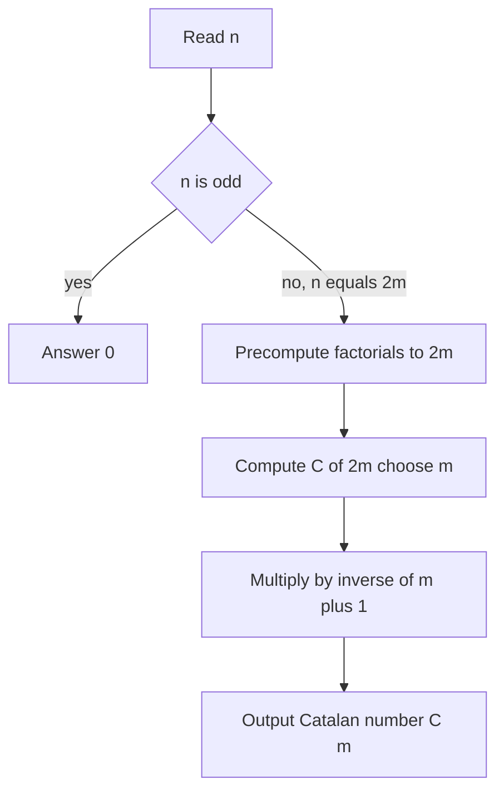
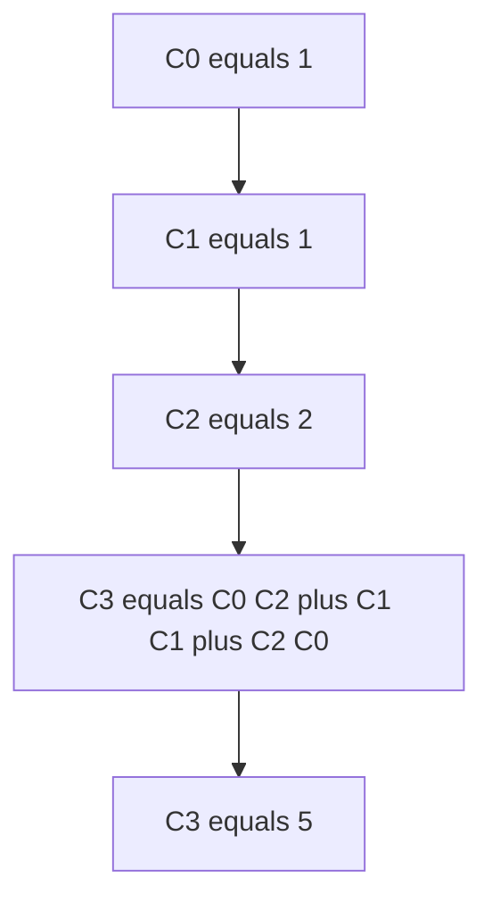

# CSES 2064 — Bracket Sequences I

| Field | Value |
| --- | --- |
| Source | CSES Problem Set (Counting / Combinatorics) |
| Difficulty | Easy-Medium |
| Topics | Catalan Numbers, Combinatorics, Modular Arithmetic |
| Link | https://cses.fi/problemset/task/2064 |

---

## Problem Statement

You are given an integer $n$. Count the number of **valid (balanced) bracket sequences** of length $n$, modulo $10^9 + 7$.

A bracket sequence is valid if every opening bracket `(` has a matching closing bracket `)`, and brackets are properly nested — i.e. in every prefix the number of `)` never exceeds the number of `(`, and the totals are equal.

Constraints: $1 \le n \le 10^6$.

If $n$ is **odd**, no valid sequence exists (you cannot pair an odd number of brackets), so the answer is $0$. If $n = 2m$ is even, the answer is the $m$-th Catalan number

$$
C_m = \frac{1}{m+1}\binom{2m}{m} \pmod{10^9 + 7}.
$$

```
Input:
6

Output:
5
```

For $n = 6$ we have $m = 3$ and $C_3 = 5$: the sequences are `()()()`, `()(())`, `(())()`, `(()())`, and `((()))`.

---

## Approach (WHY)

A valid bracket sequence of length $n = 2m$ is exactly a **Dyck word** of $m$ pairs, and the number of Dyck words of $m$ pairs is the Catalan number $C_m$. The intuition: walk left to right treating `(` as $+1$ and `)` as $-1$; validity means the running sum is never negative and ends at $0$ — a monotone lattice path from $(0,0)$ to $(2m, 0)$ staying on or above the axis. Such paths are counted by $C_m$.

We compute $C_m = \binom{2m}{m} - \binom{2m}{m+1} = \frac{1}{m+1}\binom{2m}{m}$ under the prime modulus using precomputed factorials and inverse factorials, so each binomial is $O(1)$ after an $O(n)$ precompute.



---

## Solution

### Python

```python
import sys

MOD = 10**9 + 7

def solve() -> None:
    n = int(sys.stdin.readline())
    if n % 2 == 1:
        print(0)
        return
    m = n // 2
    size = 2 * m
    fact = [1] * (size + 1)
    for i in range(1, size + 1):
        fact[i] = fact[i - 1] * i % MOD
    inv_fact = [1] * (size + 1)
    inv_fact[size] = pow(fact[size], MOD - 2, MOD)
    for i in range(size - 1, -1, -1):
        inv_fact[i] = inv_fact[i + 1] * (i + 1) % MOD
    # C_m = C(2m, m) / (m + 1)
    central = fact[2 * m] * inv_fact[m] % MOD * inv_fact[m] % MOD
    catalan = central * pow(m + 1, MOD - 2, MOD) % MOD
    print(catalan)

solve()
```

### C++

```cpp
#include <bits/stdc++.h>
using namespace std;

const long long MOD = 1e9 + 7;

long long modpow(long long base, long long exp, long long mod) {
    long long result = 1 % mod;
    base %= mod;
    while (exp > 0) {
        if (exp & 1) result = result * base % mod;
        base = base * base % mod;
        exp >>= 1;
    }
    return result;
}

int main() {
    ios::sync_with_stdio(false);
    cin.tie(nullptr);

    long long n;
    cin >> n;
    if (n % 2 == 1) {
        cout << 0 << '\n';
        return 0;
    }
    long long m = n / 2;
    long long size = 2 * m;
    vector<long long> fact(size + 1), invFact(size + 1);
    fact[0] = 1;
    for (long long i = 1; i <= size; ++i) fact[i] = fact[i - 1] * i % MOD;
    invFact[size] = modpow(fact[size], MOD - 2, MOD);
    for (long long i = size - 1; i >= 0; --i) invFact[i] = invFact[i + 1] * (i + 1) % MOD;

    // C_m = C(2m, m) / (m + 1)
    long long central = fact[2 * m] * invFact[m] % MOD * invFact[m] % MOD;
    long long catalan = central * modpow(m + 1, MOD - 2, MOD) % MOD;
    cout << catalan << '\n';
    return 0;
}
```

---

## Iteration Trace

For $n = 6 \Rightarrow m = 3$, computing $C_3$:

| Step | Expression | Value mod p |
| --- | --- | --- |
| 1 | $\binom{2m}{m} = \binom{6}{3}$ | $20$ |
| 2 | $(m+1)^{-1} = 4^{-1}$ | $250000002$ |
| 3 | $C_3 = 20 \cdot 4^{-1}$ | $5$ |

Cross-check via the small recurrence $C_0=1, C_1=1, C_2=2, C_3 = C_0C_2 + C_1C_1 + C_2C_0 = 2 + 1 + 2 = 5$. ✔



The work is dominated by the factorial precompute over $2m \le 10^6$ entries plus two modular inverses:

$$
T(n) = O(n + \log p) \approx O(n).
$$

---

## Complexity

| Aspect | Cost |
| --- | --- |
| Time | $O(n + \log p)$ |
| Space | $O(n)$ for factorial tables |

---

## Takeaway

Counting balanced bracket sequences of length $n$ is the textbook appearance of **Catalan numbers**: the answer is $0$ for odd $n$ and $C_{n/2}$ for even $n$. Reduce the closed form $\frac{1}{m+1}\binom{2m}{m}$ to factorial and inverse-factorial lookups under the prime modulus, and the whole problem is a single $O(n)$ precompute followed by one $O(1)$ formula.
