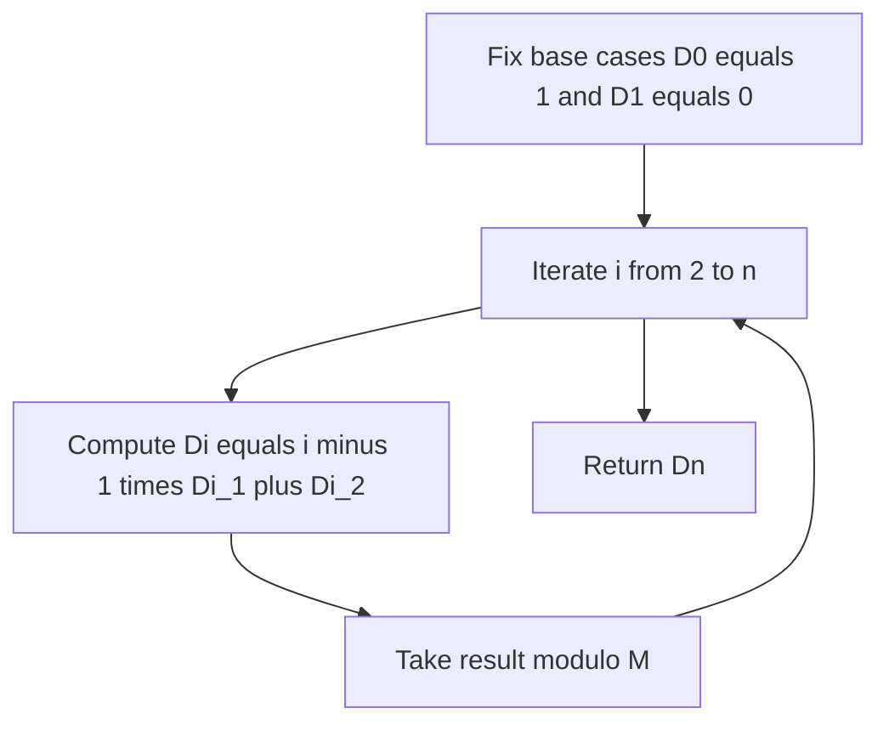
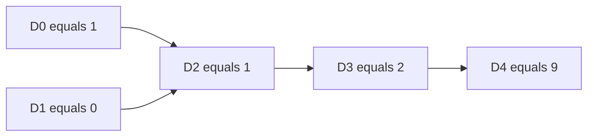

# Derangements via Inclusion-Exclusion

| Field | Value |
| --- | --- |
| Source | Classic combinatorics (Montmort's problème des rencontres) |
| Difficulty | Medium |
| Topics | Inclusion-Exclusion, Combinatorics, Modular Arithmetic |
| Link | https://en.wikipedia.org/wiki/Derangement |

---

## Problem Statement

A **derangement** of $\{1, 2, \ldots, n\}$ is a permutation in which no element appears in its original position, i.e. $\pi(i) \neq i$ for all $i$. Given $n$, compute the number of derangements $D_n$, modulo a prime $M = 10^9 + 7$.

Constraints (typical): $0 \le n \le 10^6$ (or larger with the linear recurrence).

By inclusion-exclusion:

$$D_n = \sum_{k=0}^{n} (-1)^k \binom{n}{k} (n - k)! = n! \sum_{k=0}^{n} \frac{(-1)^k}{k!}.$$

```
Example
Input:  n = 4
Output: 9

The 9 derangements of {1,2,3,4} include 2143, 2341, 2413, 3142,
3412, 3421, 4123, 4312, 4321.
```

## Approach (WHY)

Let $A_i$ be the set of permutations that **fix** position $i$ (i.e. $\pi(i) = i$). A derangement is a permutation in **none** of the $A_i$. By inclusion-exclusion over which positions are forced to be fixed:

$$D_n = \sum_{S \subseteq \{1,\dots,n\}} (-1)^{|S|} \big|{\textstyle\bigcap_{i \in S} A_i}\big|.$$

If a subset $S$ of size $k$ is forced fixed, the remaining $n - k$ elements may permute freely in $(n - k)!$ ways, and there are $\binom{n}{k}$ ways to choose $S$. This gives the formula above, which simplifies to $D_n = n! \sum_{k=0}^{n} \frac{(-1)^k}{k!}$.

For computation, the linear recurrence is fastest and avoids factorials/inverses:

$$D_n = (n - 1)\,(D_{n-1} + D_{n-2}), \quad D_0 = 1, \; D_1 = 0.$$



## Solution

### Python

```python
MOD = 10**9 + 7


def derangements_recurrence(n):
    """D_n modulo MOD using the linear recurrence."""
    if n == 0:
        return 1 % MOD
    if n == 1:
        return 0
    d_prev2, d_prev1 = 1, 0  # D_0, D_1
    for i in range(2, n + 1):
        d_cur = ((i - 1) * (d_prev1 + d_prev2)) % MOD
        d_prev2, d_prev1 = d_prev1, d_cur
    return d_prev1


def derangements_ie(n):
    """D_n modulo MOD directly from the inclusion-exclusion sum."""
    fact = [1] * (n + 1)
    for i in range(1, n + 1):
        fact[i] = fact[i - 1] * i % MOD
    inv_fact = [1] * (n + 1)
    inv_fact[n] = pow(fact[n], MOD - 2, MOD)
    for i in range(n, 0, -1):
        inv_fact[i - 1] = inv_fact[i] * i % MOD
    total = 0
    for k in range(n + 1):
        term = fact[n] * inv_fact[k] % MOD  # n! / k!
        if k % 2 == 0:
            total = (total + term) % MOD
        else:
            total = (total - term) % MOD
    return total % MOD


if __name__ == "__main__":
    print(derangements_recurrence(4))  # 9
    print(derangements_ie(4))          # 9
```

### C++

```cpp
#include <bits/stdc++.h>
using namespace std;

const long long MOD = 1e9 + 7;

long long power(long long base, long long exp, long long mod) {
    long long result = 1 % mod;
    base %= mod;
    while (exp > 0) {
        if (exp & 1) result = result * base % mod;
        base = base * base % mod;
        exp >>= 1;
    }
    return result;
}

// D_n modulo MOD using the linear recurrence.
long long derangementsRecurrence(int n) {
    if (n == 0) return 1 % MOD;
    if (n == 1) return 0;
    long long dPrev2 = 1, dPrev1 = 0;  // D_0, D_1
    for (int i = 2; i <= n; ++i) {
        long long dCur = (long long)(i - 1) * ((dPrev1 + dPrev2) % MOD) % MOD;
        dPrev2 = dPrev1;
        dPrev1 = dCur;
    }
    return dPrev1;
}

// D_n modulo MOD directly from the inclusion-exclusion sum.
long long derangementsIE(int n) {
    vector<long long> fact(n + 1), invFact(n + 1);
    fact[0] = 1;
    for (int i = 1; i <= n; ++i) fact[i] = fact[i - 1] * i % MOD;
    invFact[n] = power(fact[n], MOD - 2, MOD);
    for (int i = n; i >= 1; --i) invFact[i - 1] = invFact[i] * i % MOD;
    long long total = 0;
    for (int k = 0; k <= n; ++k) {
        long long term = fact[n] * invFact[k] % MOD;  // n! / k!
        if (k % 2 == 0) total = (total + term) % MOD;
        else total = (total - term + MOD) % MOD;
    }
    return total % MOD;
}

int main() {
    cout << derangementsRecurrence(4) << "\n";  // 9
    cout << derangementsIE(4) << "\n";           // 9
    return 0;
}
```

## Iteration Trace

Recurrence $D_i = (i-1)(D_{i-1} + D_{i-2})$ from the base cases:

| i | $D_{i-2}$ | $D_{i-1}$ | $(i-1)(D_{i-1} + D_{i-2})$ | $D_i$ |
| --- | --- | --- | --- | --- |
| 2 | 1 | 0 | $1 \cdot (0 + 1)$ | 1 |
| 3 | 0 | 1 | $2 \cdot (1 + 0)$ | 2 |
| 4 | 1 | 2 | $3 \cdot (2 + 1)$ | 9 |
| 5 | 2 | 9 | $4 \cdot (9 + 2)$ | 44 |

So $D_4 = 9$ and $D_5 = 44$, matching the known sequence $1, 0, 1, 2, 9, 44, 265, \ldots$



A useful sanity check: $D_n / n! \to e^{-1} \approx 0.3679$ as $n$ grows, since

$$\frac{D_n}{n!} = \sum_{k=0}^{n} \frac{(-1)^k}{k!} \xrightarrow{n \to \infty} e^{-1}.$$

## Complexity

| Method | Time | Space |
| --- | --- | --- |
| Linear recurrence | $O(n)$ | $O(1)$ |
| IE with factorials + inverse | $O(n)$ | $O(n)$ |

## Takeaway

Derangements are inclusion-exclusion applied to "permutations fixing at least one position": subtract those, add back double-fixed, and so on, yielding $D_n = n! \sum_{k=0}^n \frac{(-1)^k}{k!}$. For computation the $O(n)$ recurrence $D_n = (n-1)(D_{n-1} + D_{n-2})$ is simplest and needs no modular inverses. The same "count the complement of *at least one forbidden placement*" pattern extends to surjections and many constrained-permutation problems.
