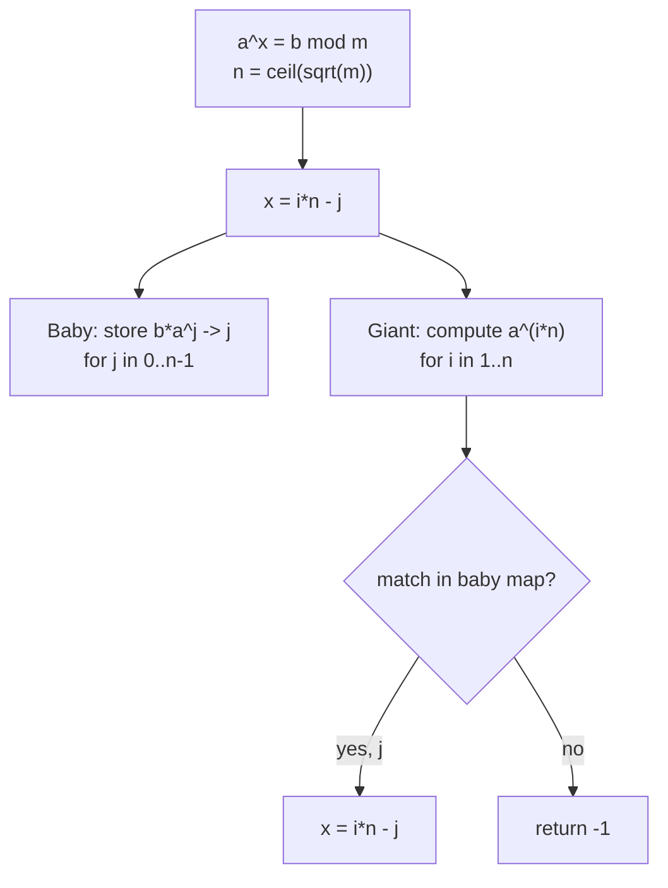
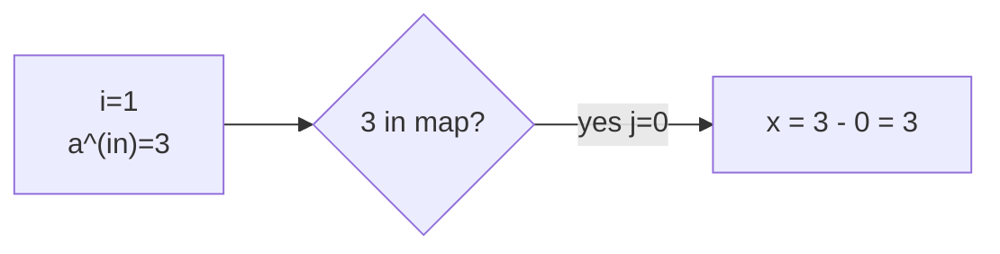

# Discrete Logarithm via Baby-Step Giant-Step

| | |
| --- | --- |
| **Source** | Classic number theory (CSES-style) |
| **Difficulty** | Hard |
| **Topics** | Modular arithmetic, BSGS, meet in the middle, hashing |
| **Link** | https://cses.fi/problemset/ |

---

## Problem Statement

You are given three integers $a$, $b$, and $m$ with $\gcd(a, m) = 1$. Find the **smallest non-negative integer** $x$ such that

$$a^{x} \equiv b \pmod{m},$$

or report that no such $x$ exists.

Constraints (typical): $1 \le a, b < m \le 10^{9}$.

```
Input
  a m b           (single query: a, modulus m, target b)
Output
  smallest x >= 0 with a^x = b (mod m), or -1 if none

Example
  Input:  2 1000000007 5
  Output: ...        (some x with 2^x = 5 mod 1e9+7, if it exists)

  Input:  2 5 1
  Output: 0          (2^0 = 1)

  Input:  2 5 3
  Output: 3          (2^3 = 8 = 3 mod 5)

  Input:  2 6 5
  Output: -1         (no power of 2 equals 5 mod 6)
```

## Approach (WHY)

A direct scan over $x = 0, 1, \dots, m-1$ costs $O(m)$ — too slow for $m \approx 10^9$. The powers of $a$ are eventually periodic with period at most $m$, so the answer (if any) lies in $[0, m)$, but we still need a sublinear search.

**Meet in the middle on the exponent.** Choose $n = \lceil \sqrt{m} \rceil$ and write

$$x = i \cdot n - j, \qquad 0 \le j < n, \quad 1 \le i \le n.$$

Then $a^x \equiv b$ becomes

$$a^{in} \equiv b \cdot a^{j} \pmod m.$$

Precompute all right-hand values $b \cdot a^{j}$ (the **baby steps**) into a hash map, then walk the left-hand values $a^{in}$ (the **giant steps**) and look each up. The first match in increasing $i$ yields the smallest $x$. Both phases are $O(\sqrt{m})$.



## Solution

### Python

```python
import math

def bsgs(a, b, m):
    """Smallest non-negative x with a^x == b (mod m), gcd(a, m) == 1; -1 if none."""
    a %= m
    b %= m
    if m == 1:
        return 0                       # everything is 0 mod 1
    n = math.isqrt(m) + 1
    # Baby steps: map value b * a^j -> j, keep the smallest j.
    table = {}
    cur = b % m
    for j in range(n):
        if cur not in table:
            table[cur] = j
        cur = cur * a % m
    # Giant stride g = a^n.
    g = pow(a, n, m)
    cur = 1
    for i in range(1, n + 1):
        cur = cur * g % m              # cur = a^(i*n)
        if cur in table:
            x = i * n - table[cur]
            if x >= 0:
                return x
    return -1

if __name__ == "__main__":
    a, m, b = map(int, input().split())
    print(bsgs(a, b, m))
```

### C++

```cpp
#include <bits/stdc++.h>
using namespace std;

// Smallest non-negative x with a^x == b (mod m), gcd(a, m) == 1; -1 if none.
long long bsgs(long long a, long long b, long long m) {
    a %= m;
    b %= m;
    if (m == 1) return 0;
    long long n = (long long)sqrt((double)m) + 1;
    // Baby steps: map value b * a^j -> j, keep the smallest j.
    unordered_map<long long, long long> table;
    table.reserve(n * 2);
    long long cur = b % m;
    for (long long j = 0; j < n; ++j) {
        if (table.find(cur) == table.end()) table[cur] = j;
        cur = cur * a % m;
    }
    // Giant stride g = a^n via fast exponentiation.
    long long g = 1, base = a % m, e = n;
    while (e) {
        if (e & 1) g = g * base % m;
        base = base * base % m;
        e >>= 1;
    }
    cur = 1;
    for (long long i = 1; i <= n; ++i) {
        cur = cur * g % m;            // cur = a^(i*n)
        auto it = table.find(cur);
        if (it != table.end()) {
            long long x = i * n - it->second;
            if (x >= 0) return x;
        }
    }
    return -1;
}

int main() {
    long long a, m, b;
    if (!(cin >> a >> m >> b)) return 0;
    cout << bsgs(a, b, m) << "\n";
    return 0;
}
```

## Iteration Trace

Example: $a = 2$, $m = 5$, $b = 3$. Here $n = \lceil\sqrt{5}\rceil = 3$.

**Baby steps** (store $b \cdot a^{j} = 3 \cdot 2^{j} \bmod 5$):

| $j$ | value $3 \cdot 2^{j} \bmod 5$ | table |
| --- | --- | --- |
| 0 | 3 | {3: 0} |
| 1 | 1 | {3: 0, 1: 1} |
| 2 | 2 | {3: 0, 1: 1, 2: 2} |

Giant stride $g = a^{n} = 2^{3} = 8 \equiv 3 \pmod 5$.

**Giant steps** (compute $a^{in} = 3^{i} \bmod 5$):

| $i$ | $a^{in} \bmod 5$ | in table? | $x = i\cdot n - j$ |
| --- | --- | --- | --- |
| 1 | 3 | yes, $j = 0$ | $1\cdot 3 - 0 = 3$ |

Answer: $x = 3$, and indeed $2^{3} = 8 \equiv 3 \pmod 5$.



## Complexity

The baby phase fills $n \approx \sqrt{m}$ map entries; the giant phase performs up to $n$ lookups. With expected $O(1)$ hashing:

$$T(m) = O(\sqrt{m}), \qquad S(m) = O(\sqrt{m}).$$

| Aspect | Cost |
| --- | --- |
| Baby steps (build map) | $O(\sqrt{m})$ |
| Giant steps (lookups) | $O(\sqrt{m})$ |
| Total time | $O(\sqrt{m})$ |
| Extra space | $O(\sqrt{m})$ |

## Takeaway

BSGS turns an $O(m)$ exponent search into $O(\sqrt{m})$ by splitting $x = i n - j$ and meeting in the middle through a hash map. Reduce inputs mod $m$, keep the smallest baby-step index, and scan giant steps in increasing order to return the minimal $x$. For non-coprime $m$, peel out $\gcd(a, m)$ first (generalized BSGS).
