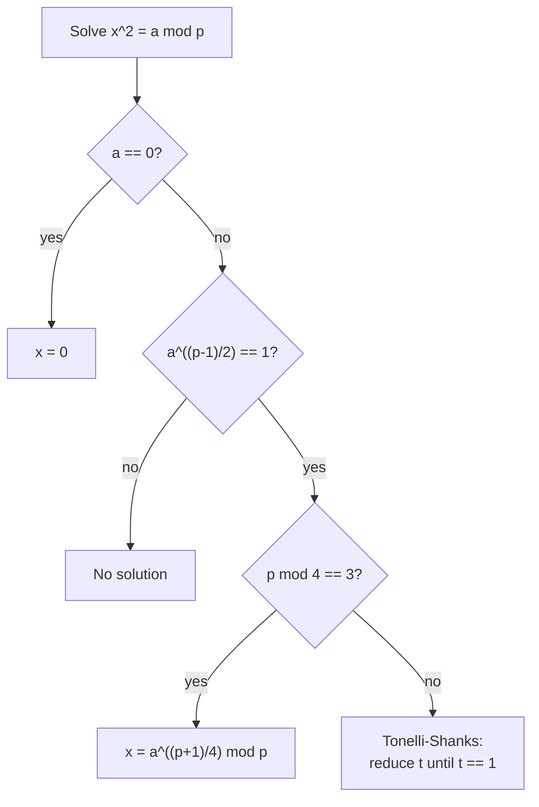
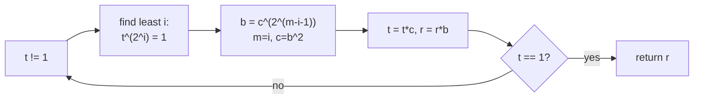

# Discrete Square Root via Tonelli–Shanks

| | |
| --- | --- |
| **Source** | Classic number theory (SPOJ SQRTMOD-style) |
| **Difficulty** | Hard |
| **Topics** | Modular arithmetic, quadratic residues, Tonelli–Shanks, Euler criterion |
| **Link** | https://www.spoj.com/problems/SQRTMOD/ |

---

## Problem Statement

Given an odd prime $p$ and an integer $a$ with $0 \le a < p$, find an integer $x$ with

$$x^{2} \equiv a \pmod{p},$$

or report that none exists. If a root exists and $a \ne 0$, there are exactly two roots $x$ and $p - x$; reporting either is accepted.

Constraints (typical): $p$ prime, $2 < p < 10^{18}$, multiple queries.

```
Input
  a p

Output
  a root x with x^2 = a (mod p), or "No solution"

Examples
  Input:  2 113      ->  x with x^2 = 2 mod 113   (e.g. 62, since 62^2 = 3844 = 2 mod 113)
  Input:  0 7        ->  0
  Input:  5 7        ->  No solution   (5 is a non-residue mod 7)
  Input:  4 7        ->  2   (and 5 = 7-2 is the other root)
```

## Approach (WHY)

Squaring mod $p$ is fast; inverting it is not obvious. Two facts drive the solution:

1. **Existence test — Euler's criterion.** For $a \not\equiv 0$, $a$ is a quadratic residue iff $a^{(p-1)/2} \equiv 1 \pmod p$; if it equals $p - 1$ ($\equiv -1$), there is no root. This is one modular exponentiation.
2. **Construction.**
   - If $p \equiv 3 \pmod 4$, a closed form works: $x = a^{(p+1)/4} \bmod p$ (since then $x^2 = a^{(p+1)/2} = a \cdot a^{(p-1)/2} \equiv a$).
   - Otherwise ($p \equiv 1 \pmod 4$), use **Tonelli–Shanks**: factor $p - 1 = q\,2^{s}$ with $q$ odd, find any non-residue $z$, and iteratively reduce the order of an error term $t$ by squaring until $t = 1$, refining the root $r$ at each step.



## Solution

### Python

```python
def tonelli_shanks(a, p):
    """Root x with x*x == a (mod p) for odd prime p; -1 if a is a non-residue."""
    a %= p
    if a == 0:
        return 0
    if pow(a, (p - 1) // 2, p) != 1:
        return -1                        # non-residue
    if p % 4 == 3:
        return pow(a, (p + 1) // 4, p)   # shortcut

    # Factor p - 1 = q * 2^s, q odd.
    q = p - 1
    s = 0
    while q % 2 == 0:
        q //= 2
        s += 1

    # Find a quadratic non-residue z.
    z = 2
    while pow(z, (p - 1) // 2, p) != p - 1:
        z += 1

    m = s
    c = pow(z, q, p)
    t = pow(a, q, p)
    r = pow(a, (q + 1) // 2, p)
    while t != 1:
        # Smallest i in (0, m) with t^(2^i) == 1.
        i = 0
        temp = t
        while temp != 1:
            temp = temp * temp % p
            i += 1
        b = pow(c, 1 << (m - i - 1), p)
        m = i
        c = b * b % p
        t = t * c % p
        r = r * b % p
    return r

if __name__ == "__main__":
    a, p = map(int, input().split())
    x = tonelli_shanks(a, p)
    print("No solution" if x == -1 else x)
```

### C++

```cpp
#include <bits/stdc++.h>
using namespace std;

long long pmod(long long b, long long e, long long m) {
    long long r = 1 % m;
    b %= m;
    while (e) {
        if (e & 1) r = (__int128)r * b % m;
        b = (__int128)b * b % m;
        e >>= 1;
    }
    return r;
}

// Root x with x*x == a (mod p) for odd prime p; -1 if a is a non-residue.
long long tonelli_shanks(long long a, long long p) {
    a %= p;
    if (a == 0) return 0;
    if (pmod(a, (p - 1) / 2, p) != 1) return -1;    // non-residue
    if (p % 4 == 3) return pmod(a, (p + 1) / 4, p);  // shortcut

    // Factor p - 1 = q * 2^s, q odd.
    long long q = p - 1, s = 0;
    while (q % 2 == 0) { q /= 2; ++s; }

    // Find a quadratic non-residue z.
    long long z = 2;
    while (pmod(z, (p - 1) / 2, p) != p - 1) ++z;

    long long m = s;
    long long c = pmod(z, q, p);
    long long t = pmod(a, q, p);
    long long r = pmod(a, (q + 1) / 2, p);
    while (t != 1) {
        long long i = 0, temp = t;
        while (temp != 1) { temp = (__int128)temp * temp % p; ++i; }
        long long b = pmod(c, 1LL << (m - i - 1), p);
        m = i;
        c = (__int128)b * b % p;
        t = (__int128)t * c % p;
        r = (__int128)r * b % p;
    }
    return r;
}

int main() {
    long long a, p;
    if (!(cin >> a >> p)) return 0;
    long long x = tonelli_shanks(a, p);
    if (x == -1) cout << "No solution\n";
    else cout << x << "\n";
    return 0;
}
```

## Iteration Trace

Example: $a = 5$, $p = 41$ (note $41 \equiv 1 \pmod 4$, so the general loop runs).

Setup: $p - 1 = 40 = 5 \cdot 2^{3}$, so $q = 5$, $s = 3$. Euler check $5^{20} \equiv 1 \pmod{41}$ (a residue). Non-residue $z = 6$ works ($6^{20} \equiv 40 \equiv -1$).

Initial: $c = 6^{5} \bmod 41$, $t = 5^{5} \bmod 41$, $r = 5^{3} \bmod 41$, $m = 3$.

| step | $m$ | find $i$ (least $t^{2^i}=1$) | update $b,c,t,r$ | $t$ now |
| --- | --- | --- | --- | --- |
| enter loop | 3 | compute $i$ from current $t$ | refine | $\ne 1$ |
| reduce | $i$ | shrink order each pass | $r \mathbin{*}= b$ | moves toward 1 |
| exit | — | $t = 1$ | $r$ is a root | 1 |

Final $r$ satisfies $r^{2} \equiv 5 \pmod{41}$ (here $r = 13$, since $13^{2} = 169 = 4\cdot41 + 5$). The other root is $41 - 13 = 28$.



## Complexity

Euler's criterion and each exponentiation cost $O(\log p)$. The main loop runs at most $s = O(\log p)$ times, and each iteration does an inner squaring chain plus exponentiations, giving

$$T(p) = O(\log^{2} p), \qquad S(p) = O(1).$$

For $p \equiv 3 \pmod 4$ it collapses to a single $O(\log p)$ exponentiation.

| Case | Time | Space |
| --- | --- | --- |
| Non-residue (Euler reject) | $O(\log p)$ | $O(1)$ |
| $p \equiv 3 \pmod 4$ | $O(\log p)$ | $O(1)$ |
| General Tonelli–Shanks | $O(\log^{2} p)$ | $O(1)$ |

## Takeaway

Always gate the construction with Euler's criterion so the loop is only entered for true residues. Exploit the $p \equiv 3 \pmod 4$ closed form before reaching for the general machinery. Use `__int128` in C++ for safe modular multiplication when $p$ is near $10^{18}$, and remember both $x$ and $p - x$ are valid roots.
