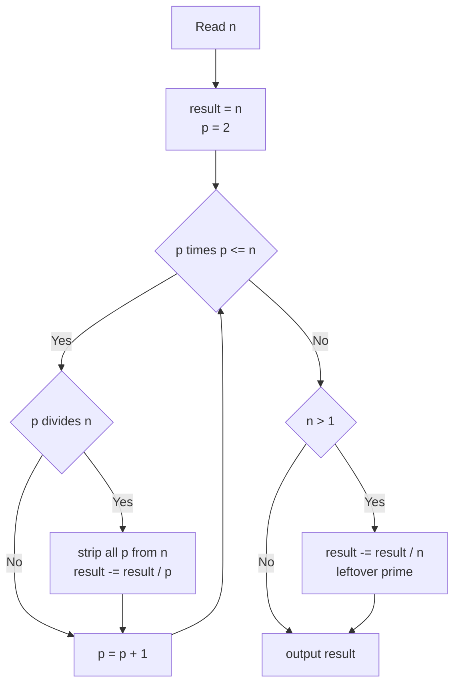
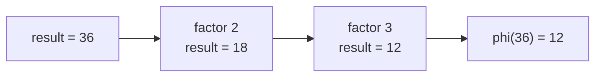

# Euler's Totient of N

| | |
| --- | --- |
| **Source** | Classic number theory |
| **Difficulty** | Easy–Medium |
| **Topics** | Number theory, Euler's totient, sieve |
| **Link** | https://cses.fi/problemset/ |

---

## Problem Statement

Given an integer $n$ with $1 \le n \le 10^{12}$, compute Euler's totient function $\varphi(n)$, the number of integers in $\{1, 2, \dots, n\}$ that are coprime to $n$:

$$\varphi(n) = \bigl|\{\, k : 1 \le k \le n,\ \gcd(k, n) = 1 \,\}\bigr| = n \prod_{p \mid n}\left(1 - \frac{1}{p}\right).$$

**Optional batch variant:** given a bound $N$ ($1 \le N \le 10^{6}$), output $\varphi(i)$ for every $i$ from $1$ to $N$.

```
Input:  n = 12
Output: 4          # the integers 1, 5, 7, 11 are coprime to 12

Input:  n = 36
Output: 12

Input (batch):  N = 6
Output:         phi[1..6] = 1 1 2 2 4 2
```

## Approach (WHY)

For a **single** $n$ that can be as large as $10^{12}$, we cannot enumerate $1..n$. Instead we factor $n$ by trial division up to $\sqrt n$. Each time we discover a new prime factor $p$, we strip all its powers from $n$ and multiply the running answer by $(1 - 1/p)$, applied as `result -= result / p`. Any factor left above $\sqrt n$ is a single large prime and contributes once.

For the **batch** variant we want every $\varphi(i)$ up to $N$, so we run a linear-sieve-style pass: initialize $\varphi[i] = i$ and, for each prime $i$, fold the $(1 - 1/i)$ factor into all multiples.



## Solution

### Python

```python
import sys


def phi(n: int) -> int:
    result = n
    p = 2
    while p * p <= n:
        if n % p == 0:
            while n % p == 0:
                n //= p
            result -= result // p
        p += 1
    if n > 1:                 # leftover prime factor
        result -= result // n
    return result


def totient_sieve(N: int) -> list[int]:
    phi_arr = list(range(N + 1))
    for i in range(2, N + 1):
        if phi_arr[i] == i:          # i is prime
            for j in range(i, N + 1, i):
                phi_arr[j] -= phi_arr[j] // i
    return phi_arr


def main() -> None:
    data = sys.stdin.read().split()
    n = int(data[0])
    print(phi(n))


if __name__ == "__main__":
    main()
```

### C++

```cpp
#include <bits/stdc++.h>
using namespace std;

long long phi(long long n) {
    long long result = n;
    for (long long p = 2; p * p <= n; ++p) {
        if (n % p == 0) {
            while (n % p == 0) n /= p;
            result -= result / p;
        }
    }
    if (n > 1) result -= result / n;   // leftover prime
    return result;
}

vector<long long> totient_sieve(int N) {
    vector<long long> phi_arr(N + 1);
    for (int i = 0; i <= N; ++i) phi_arr[i] = i;
    for (int i = 2; i <= N; ++i) {
        if (phi_arr[i] == i) {         // i is prime
            for (int j = i; j <= N; j += i)
                phi_arr[j] -= phi_arr[j] / i;
        }
    }
    return phi_arr;
}

int main() {
    ios::sync_with_stdio(false);
    cin.tie(nullptr);
    long long n;
    cin >> n;
    cout << phi(n) << "\n";
    return 0;
}
```

## Iteration Trace

Computing $\varphi(36)$, $36 = 2^2 \cdot 3^2$, starting with `result = 36`:

| Step | $p$ | $p \mid n$? | $n$ after stripping | Action | result |
| --- | --- | --- | --- | --- | --- |
| 1 | 2 | yes | $36 \to 9$ | `result -= 36/2 = 18` | 18 |
| 2 | 3 | yes | $9 \to 1$ | `result -= 18/3 = 6` | 12 |
| 3 | — | loop ends ($p^2 > n$) | $n = 1$ | no leftover prime | 12 |

Final answer $\varphi(36) = 12$.



## Complexity

Single-value trial division touches each candidate divisor up to $\sqrt n$:

$$T_{\text{single}}(n) = O(\sqrt n), \qquad T_{\text{sieve}}(N) = O(N \log \log N).$$

| Variant | Time | Space |
| --- | --- | --- |
| Single $\varphi(n)$ | $O(\sqrt n)$ | $O(1)$ |
| Sieve $\varphi[1..N]$ | $O(N \log \log N)$ | $O(N)$ |

## Takeaway

Use $O(\sqrt n)$ trial-division factoring for one large value of $\varphi$, and a totient sieve when you need every value up to $N$. The crucial implementation detail is applying each prime factor exactly once as `result -= result / p` after dividing out all of its powers.
