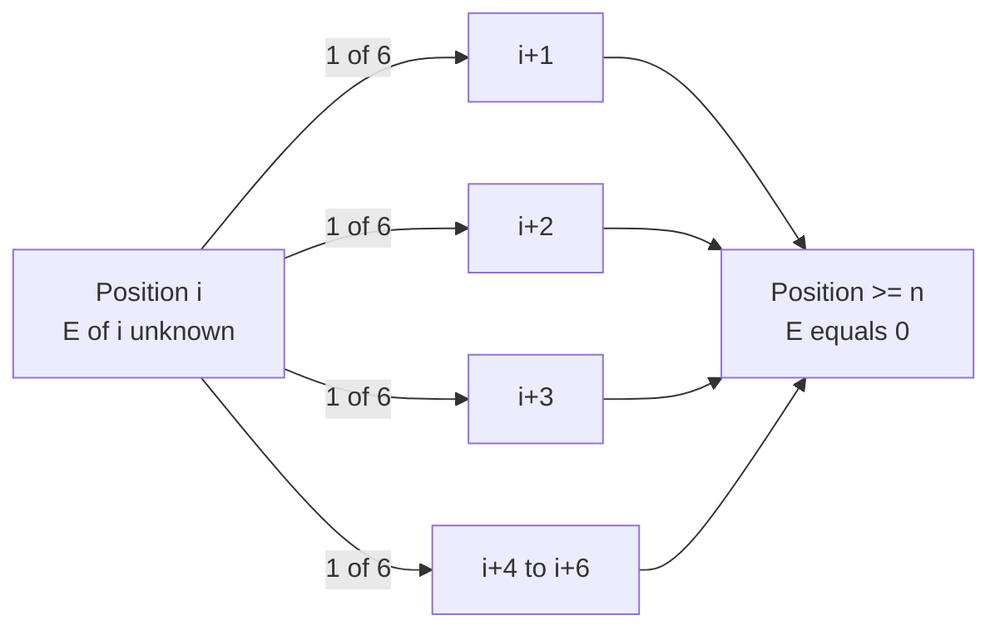
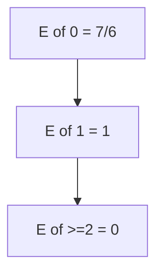

# Expected Number of Dice Rolls to Reach Position n

| Field | Value |
| --- | --- |
| Source | CSES Problemset (Dice Combinations family, expectation variant) |
| Difficulty | Medium |
| Topics | Probability, Expectation, Expected-Value DP, Modular Inverse |
| Link | https://cses.fi/problemset/ |

---

## Problem Statement

You start at position $0$ on a number line. Each turn you roll a fair six-sided die showing a value in $\{1,2,3,4,5,6\}$, each with probability $\tfrac{1}{6}$, and advance by that amount. You stop as soon as your position is **at least** $n$.

Let $X$ be the number of rolls made. Compute $E[X]$, the expected number of rolls, given an integer $n$ with $1 \le n \le 10^6$.

Because $E[X]$ is a rational number, output it modulo the prime $p = 10^9 + 7$: if $E[X] = \tfrac{a}{b}$ in lowest terms, print $a \cdot b^{-1} \bmod p$.

```
Input:
2

Output:
333333338
```

Explanation: from position $0$, $E[0] = 1 + \tfrac{1}{6}\sum_{f=1}^{6} E[\min(f, 2)]$. Since positions $\ge 2$ are terminal with $E = 0$, only rolls of $1$ keep you going. Solving gives $E[0] = \tfrac{7}{6}$, and $\tfrac{7}{6} \bmod (10^9+7) = 333333338$.

---

## Approach (WHY)

Define $E[i]$ = expected number of additional rolls needed when currently at position $i$. Any position $i \ge n$ is **terminal**, so $E[i] = 0$ there. From a position $i < n$ you always pay one roll, then land uniformly on one of $i+1,\dots,i+6$:

$$
E[i] = 1 + \frac{1}{6}\sum_{f=1}^{6} E[\min(i+f,\, n)].
$$

Every transition strictly **increases** the position, so the state graph is a DAG. Evaluating $E[i]$ from $i = n-1$ down to $0$ means every $E[i+f]$ on the right is already known — no cycles, no linear system. The answer is $E[0]$.

Since $\tfrac{1}{6}$ is a modular rational, precompute $6^{-1} \bmod p$ once via Fermat's little theorem and multiply.



---

## Solution

### Python

```python
MOD = 1_000_000_007

def power(base: int, exp: int, mod: int) -> int:
    result = 1
    base %= mod
    while exp:
        if exp & 1:
            result = result * base % mod
        base = base * base % mod
        exp >>= 1
    return result

def expected_rolls(n: int) -> int:
    inv6 = power(6, MOD - 2, MOD)
    E = [0] * (n + 7)            # positions >= n stay 0 (terminal)
    for i in range(n - 1, -1, -1):
        s = 0
        for f in range(1, 7):
            s = (s + E[min(i + f, n)]) % MOD
        E[i] = (1 + s * inv6) % MOD
    return E[0]

if __name__ == "__main__":
    n = int(input())
    print(expected_rolls(n))
```

### C++

```cpp
#include <bits/stdc++.h>
using namespace std;

const long long MOD = 1e9 + 7;

long long power(long long base, long long exp, long long mod) {
    long long result = 1;
    base %= mod;
    while (exp) {
        if (exp & 1) result = result * base % mod;
        base = base * base % mod;
        exp >>= 1;
    }
    return result;
}

long long expected_rolls(int n) {
    long long inv6 = power(6, MOD - 2, MOD);
    vector<long long> E(n + 7, 0);            // positions >= n stay 0
    for (int i = n - 1; i >= 0; --i) {
        long long s = 0;
        for (int f = 1; f <= 6; ++f) s = (s + E[min(i + f, n)]) % MOD;
        E[i] = (1 + s * inv6) % MOD;
    }
    return E[0];
}

int main() {
    int n;
    cin >> n;
    cout << expected_rolls(n) << "\n";
    return 0;
}
```

---

## Iteration Trace

For $n = 2$, working in exact rationals (positions $\ge 2$ are terminal):

| $i$ | Reachable $i+f$ | Equation | $E[i]$ |
| --- | --- | --- | --- |
| $\ge 2$ | — | terminal | $0$ |
| $1$ | $2,3,4,5,6,7$ all $\ge 2$ | $1 + \tfrac{1}{6}(0+0+0+0+0+0)$ | $1$ |
| $0$ | $1$ (then $\ge 2$) | $1 + \tfrac{1}{6}(E[1] + 0 \cdot 5)$ | $1 + \tfrac{1}{6} = \tfrac{7}{6}$ |

So $E[0] = \tfrac{7}{6}$, and modulo $10^9+7$ that is $7 \cdot 6^{-1} = 333333338$.



---

The work is one pass over $n$ positions, each doing constant work (a fixed 6-term sum), plus a single $O(\log p)$ modular inverse:

$$
T(n) = O(n + \log p), \qquad S(n) = O(n).
$$

## Complexity

| Aspect | Cost |
| --- | --- |
| Time | $O(n + \log p)$ |
| Space | $O(n)$ |
| Modular inverse | $O(\log p)$ once |

---

## Takeaway

Expected "steps to reach a target" is a textbook **expected-value DP**: define $E[\text{state}]$, set terminal states to $0$, and write $E[i] = 1 + \sum p\,E[\text{next}]$. When every transition moves strictly toward the goal the graph is a DAG, so a single reverse pass solves it with no linear algebra. Carry the $\tfrac{1}{6}$ as a modular inverse to report the exact rational answer $\bmod p$.
