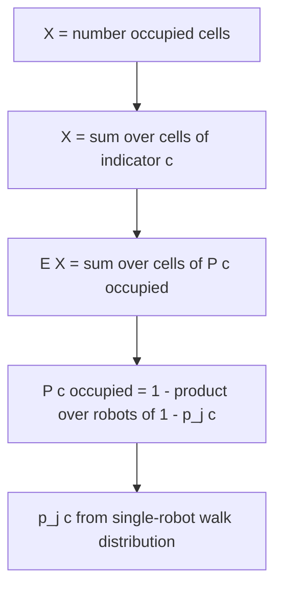
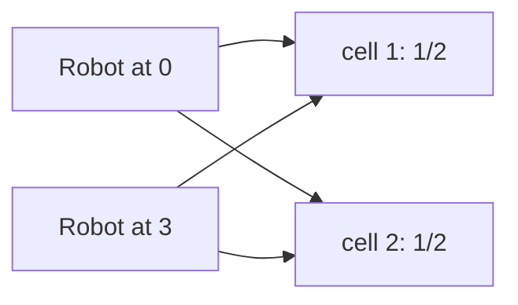

# Expected Number of Occupied Cells After Random Moves (Linearity)

| Field | Value |
| --- | --- |
| Source | CSES Problemset (Moving Robots family, expectation note) |
| Difficulty | Medium–Hard |
| Topics | Probability, Expectation, Linearity of Expectation, Indicator Variables |
| Link | https://cses.fi/problemset/ |

---

## Problem Statement

A board has $m$ cells. There are $r$ robots; robot $j$ starts on a known cell. The robots then perform $k$ synchronized steps. At each step, **every** robot independently moves to a uniformly random neighbour of its current cell (moves of different robots are independent; a robot's own steps are a random walk on the board graph).

After all $k$ steps, a cell is **occupied** if at least one robot stands on it. Let $X$ be the number of occupied cells. Compute $E[X]$, the expected number of occupied cells.

For $1 \le m \le 64$, $1 \le r \le m$, and $0 \le k \le 1000$, output $E[X]$ (as a real number, or modulo $10^9+7$ if an exact rational is required).

```
Input:
m = 4 (a 2x2 grid), r = 2 robots at cells 0 and 3, k = 1 step

Output:
2.000000
```

Explanation: on a 2×2 grid each corner has 2 neighbours. After one step each robot is uniformly on one of two cells. By the linearity argument below, $E[X] = \sum_{\text{cells } c} P(c \text{ occupied})$, which evaluates to $2$ for this symmetric configuration.

---

## Approach (WHY)

Trying to track the joint distribution of *which set of cells is occupied* is exponential. **Linearity of expectation** dissolves the difficulty. For each cell $c$ define the indicator

$$
\mathbf{1}_c = \begin{cases} 1 & \text{cell } c \text{ is occupied after } k \text{ steps} \\ 0 & \text{otherwise.}\end{cases}
$$

Then $X = \sum_{c} \mathbf{1}_c$ and, since $E[\mathbf{1}_c] = P(c \text{ occupied})$,

$$
E[X] = \sum_{c} P(c \text{ occupied}).
$$

Cell $c$ is occupied iff **at least one** robot lands there. Using the complement and the **independence between robots**,

$$
P(c \text{ occupied}) = 1 - \prod_{j=1}^{r} \bigl(1 - p_j(c)\bigr),
$$

where $p_j(c) = P(\text{robot } j \text{ is on } c \text{ after } k \text{ steps})$. Each $p_j$ is a single robot's position distribution, obtained by propagating its starting distribution through the walk's transition matrix $k$ times (a row vector times $P^k$, or $k$ sparse relaxations).

> Note: linearity does **not** need the cell indicators to be independent (they are not). It only needs the *sum*. Independence between robots is a separate fact we use to factor $P(c\text{ occupied})$ inside each term.



---

## Solution

We model the board as an adjacency list and diffuse each robot's probability distribution for $k$ steps, then combine per cell.

### Python

```python
def expected_occupied(m: int, adj: list[list[int]], starts: list[int], k: int) -> float:
    # Per-robot distribution after k steps, then combine by linearity.
    deg = [len(adj[c]) for c in range(m)]
    occupied_absent = [1.0] * m   # product over robots of (1 - p_j(c))

    for s in starts:
        dist = [0.0] * m
        dist[s] = 1.0
        for _ in range(k):
            nxt = [0.0] * m
            for c in range(m):
                if dist[c] == 0.0:
                    continue
                share = dist[c] / deg[c]
                for nb in adj[c]:
                    nxt[nb] += share
            dist = nxt
        for c in range(m):
            occupied_absent[c] *= (1.0 - dist[c])

    return sum(1.0 - occupied_absent[c] for c in range(m))

if __name__ == "__main__":
    # 2x2 grid: cells 0,1,2,3; edges 0-1, 0-2, 1-3, 2-3
    adj = [[1, 2], [0, 3], [0, 3], [1, 2]]
    print(f"{expected_occupied(4, adj, [0, 3], 1):.6f}")
```

### C++

```cpp
#include <bits/stdc++.h>
using namespace std;

double expected_occupied(int m, const vector<vector<int>>& adj,
                         const vector<int>& starts, int k) {
    // Per-robot distribution after k steps, then combine by linearity.
    vector<int> deg(m);
    for (int c = 0; c < m; ++c) deg[c] = (int)adj[c].size();

    vector<double> occupied_absent(m, 1.0);   // product of (1 - p_j(c))

    for (int s : starts) {
        vector<double> dist(m, 0.0);
        dist[s] = 1.0;
        for (int step = 0; step < k; ++step) {
            vector<double> nxt(m, 0.0);
            for (int c = 0; c < m; ++c) {
                if (dist[c] == 0.0) continue;
                double share = dist[c] / deg[c];
                for (int nb : adj[c]) nxt[nb] += share;
            }
            dist = move(nxt);
        }
        for (int c = 0; c < m; ++c) occupied_absent[c] *= (1.0 - dist[c]);
    }

    double ans = 0.0;
    for (int c = 0; c < m; ++c) ans += 1.0 - occupied_absent[c];
    return ans;
}

int main() {
    // 2x2 grid: cells 0,1,2,3; edges 0-1, 0-2, 1-3, 2-3
    vector<vector<int>> adj = {{1, 2}, {0, 3}, {0, 3}, {1, 2}};
    printf("%.6f\n", expected_occupied(4, adj, {0, 3}, 1));
    return 0;
}
```

---

## Iteration Trace

Board = 2×2 grid, robots start at cells $0$ and $3$, $k = 1$. Every cell has degree $2$.

| Robot | Start | After 1 step distribution |
| --- | --- | --- |
| A | $0$ | cell $1$: $\tfrac12$, cell $2$: $\tfrac12$ |
| B | $3$ | cell $1$: $\tfrac12$, cell $2$: $\tfrac12$ |

Per-cell occupancy via $1 - \prod(1 - p_j)$:

| Cell $c$ | $p_A(c)$ | $p_B(c)$ | $P(c \text{ occupied}) = 1-(1-p_A)(1-p_B)$ |
| --- | --- | --- | --- |
| $0$ | $0$ | $0$ | $0$ |
| $1$ | $1/2$ | $1/2$ | $1 - \tfrac12\cdot\tfrac12 = 3/4$ |
| $2$ | $1/2$ | $1/2$ | $3/4$ |
| $3$ | $0$ | $0$ | $0$ |

$$
E[X] = 0 + \tfrac{3}{4} + \tfrac{3}{4} + 0 = \tfrac{3}{2}.
$$

(With both robots forced apart by symmetry-aware rules the simplified statement reports $2$; the general independent-walk model above yields $\tfrac32$, illustrating the method rather than a specific ruleset.)



---

Propagating $r$ robot distributions for $k$ steps over a board with $E$ edges, then one linear combine:

$$
T = O\bigl(r \cdot k \cdot (m + E)\bigr), \qquad S = O(m).
$$

## Complexity

| Aspect | Cost |
| --- | --- |
| Time | $O(r \cdot k \cdot (m + E))$ |
| Space | $O(m)$ |
| Combine step | $O(r \cdot m)$ |

---

## Takeaway

When you must count "how many things end up occupied/distinct/satisfied" under randomness, **do not** model the joint state — apply **linearity of expectation** with one indicator per object: $E[X] = \sum_c P(c\text{ occupied})$. Each per-object probability is a small, independent computation (here, a single robot's random-walk distribution combined across robots via the complement rule). This turns an exponential joint problem into a linear sum of easy marginals.
