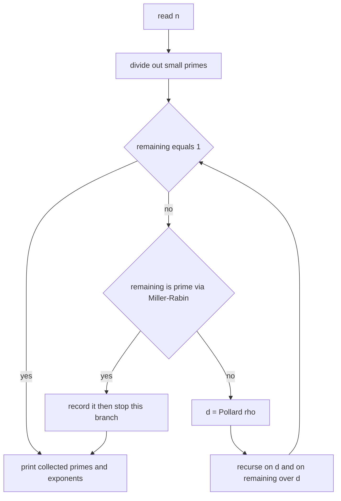
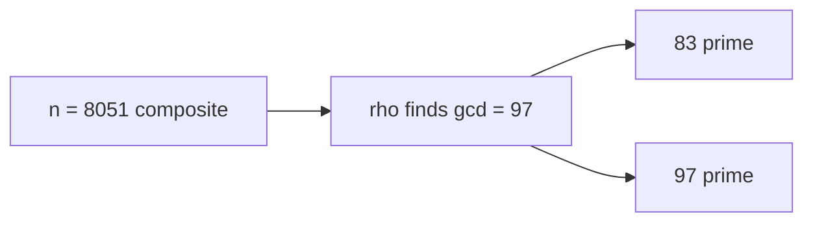

# Factorize Large Numbers with Pollard's Rho

| Field | Value |
|---|---|
| Source | Self-contained (classic: SPOJ FACT1) |
| Difficulty | Hard |
| Topics | Pollard's rho, Miller-Rabin, integer factorization |
| Link | https://www.spoj.com/problems/FACT1/ |

---

## Problem Statement

You are given $q$ queries. Each query is an integer $n$ with $2 \le n \le 10^{18}$. For each query, output the prime factorization of $n$: the distinct primes and their exponents, listed in increasing order of the prime.

Formally, write

$$
n = p_1^{e_1} \cdot p_2^{e_2} \cdots p_k^{e_k}, \qquad p_1 < p_2 < \dots < p_k,
$$

and print each pair $p_i\ e_i$.

Constraints: $1 \le q \le 500$, $2 \le n \le 10^{18}$.

```text
Input:
3
600851475143
1000000000000000000
1000000000039

Output:
71 1
839 1
1471 1
6857 1

2 18
5 18

1000000000039 1
```

The last value is prime, so it factors as itself to the first power.

## Approach (WHY)

Trial division to $\sqrt n \approx 10^9$ per query, times $500$ queries, is $5 \times 10^{11}$ operations — far too slow. We instead:

1. **Strip small primes** by direct division (cheap, and rho dislikes even numbers).
2. Use **Miller-Rabin** to decide whether the remaining part is prime.
3. Use **Pollard's rho (Brent variant)** to pull out one factor when it is composite, then recurse.

Each prime factor costs expected $O(n^{1/4})$, so even $n = 10^{18}$ is handled in well under a millisecond on average.



## Solution

### Python

```python
import sys
import random
from math import gcd
from collections import Counter


def is_prime(n: int) -> bool:
    if n < 2:
        return False
    small = (2, 3, 5, 7, 11, 13, 17, 19, 23, 29, 31, 37)
    for p in small:
        if n == p:
            return True
        if n % p == 0:
            return False
    d, s = n - 1, 0
    while d % 2 == 0:
        d //= 2
        s += 1
    for a in small:
        x = pow(a, d, n)
        if x == 1 or x == n - 1:
            continue
        for _ in range(s - 1):
            x = x * x % n
            if x == n - 1:
                break
        else:
            return False
    return True


def pollard_rho(n: int) -> int:
    if n % 2 == 0:
        return 2
    x = random.randrange(2, n)
    y = x
    c = random.randrange(1, n)
    d = 1
    while d == 1:
        x = (x * x + c) % n
        y = (y * y + c) % n
        y = (y * y + c) % n
        d = gcd(abs(x - y), n)
    return d if d != n else pollard_rho(n)


def factorize(n: int, out: Counter) -> None:
    if n == 1:
        return
    if is_prime(n):
        out[n] += 1
        return
    d = pollard_rho(n)
    factorize(d, out)
    factorize(n // d, out)


def solve() -> None:
    data = sys.stdin.read().split()
    q = int(data[0])
    res = []
    for i in range(1, q + 1):
        n = int(data[i])
        out: Counter[int] = Counter()
        factorize(n, out)
        for p in sorted(out):
            res.append(f"{p} {out[p]}")
        res.append("")
    sys.stdout.write("\n".join(res))


if __name__ == "__main__":
    solve()
```

### C++

```cpp
#include <bits/stdc++.h>
using namespace std;

using u64 = uint64_t;
using u128 = __uint128_t;

u64 mulmod(u64 a, u64 b, u64 n) { return (u64)((u128)a * b % n); }

u64 powmod(u64 a, u64 e, u64 n) {
    u64 r = 1; a %= n;
    while (e) { if (e & 1) r = mulmod(r, a, n); a = mulmod(a, a, n); e >>= 1; }
    return r;
}

bool is_prime(u64 n) {
    if (n < 2) return false;
    for (u64 p : {2, 3, 5, 7, 11, 13, 17, 19, 23, 29, 31, 37}) {
        if (n == p) return true;
        if (n % p == 0) return false;
    }
    u64 d = n - 1; int s = 0;
    while ((d & 1) == 0) { d >>= 1; ++s; }
    for (u64 a : {2, 3, 5, 7, 11, 13, 17, 19, 23, 29, 31, 37}) {
        u64 x = powmod(a, d, n);
        if (x == 1 || x == n - 1) continue;
        bool composite = true;
        for (int i = 0; i < s - 1; ++i) {
            x = mulmod(x, x, n);
            if (x == n - 1) { composite = false; break; }
        }
        if (composite) return false;
    }
    return true;
}

static inline u64 absdiff(u64 a, u64 b) { return a > b ? a - b : b - a; }

u64 pollard_rho(u64 n) {
    if (n % 2 == 0) return 2;
    static mt19937_64 rng(0xC0FFEE);
    while (true) {
        u64 c = rng() % (n - 1) + 1;
        u64 x = rng() % (n - 2) + 2, y = x, d = 1;
        auto f = [&](u64 v) { return (mulmod(v, v, n) + c) % n; };
        while (d == 1) {
            x = f(x);
            y = f(f(y));
            d = gcd(absdiff(x, y), n);
        }
        if (d != n) return d;
    }
}

void factorize(u64 n, map<u64, int>& out) {
    if (n == 1) return;
    if (is_prime(n)) { out[n]++; return; }
    u64 d = pollard_rho(n);
    factorize(d, out);
    factorize(n / d, out);
}

int main() {
    int q;
    if (!(cin >> q)) return 0;
    while (q--) {
        u64 n; cin >> n;
        map<u64, int> out;
        factorize(n, out);
        for (auto [p, e] : out) cout << p << " " << e << "\n";
        cout << "\n";
    }
    return 0;
}
```

## Iteration Trace

Factoring $n = 8051 = 83 \times 97$ with $f(x) = x^2 + 1 \bmod n$, start $x = 2$ (tortoise one step, hare two steps):

| Step | tortoise $x$ | hare $y$ | $\lvert x - y\rvert$ | $\gcd(\lvert x-y\rvert, 8051)$ |
|---|---|---|---|---|
| 1 | 5 | 26 | 21 | 1 |
| 2 | 26 | 7474 | 7448 | 1 |
| 3 | 677 | 871 | 194 | 97 |

At step 3 the gcd jumps to $97$, a nontrivial factor. Then $8051 / 97 = 83$; both $83$ and $97$ pass Miller-Rabin, so the factorization is $83^1 \cdot 97^1$.



## Complexity

For a number $n$, finding one prime factor takes expected $O(n^{1/4})$ steps, and there are $O(\log n)$ prime factors:

$$
T(n) = O\!\left(n^{1/4} \log n\right) \text{ per query}, \qquad O(q \cdot n^{1/4}\log n) \text{ total}.
$$

| Aspect | Complexity |
|---|---|
| Miller-Rabin per number | $O(\log^3 n)$ |
| Pollard's rho per factor | expected $O(n^{1/4})$ |
| Full factorization per query | expected $O(n^{1/4}\log n)$ |
| All $q$ queries | $O(q\, n^{1/4}\log n)$ |
| Extra space | $O(\log n)$ recursion + factor map |

## Takeaway

Factoring a 64-bit integer is fast once you stop thinking "test every divisor" and instead **decide primality directly** (Miller-Rabin) and **split composites probabilistically** (Pollard's rho). Strip small primes first, recurse until every piece is prime, and the whole thing runs in $O(n^{1/4})$ per factor.
