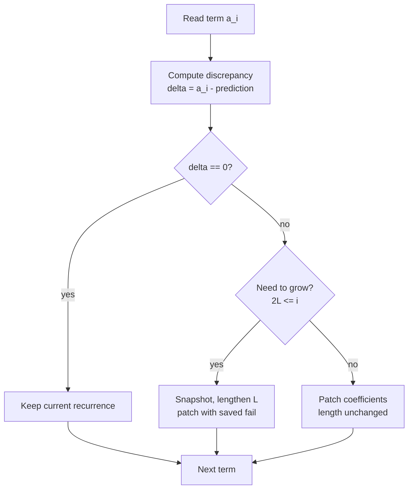

# Find the Shortest Linear Recurrence (Berlekamp-Massey)

| | |
| --- | --- |
| **Source** | Classic / CP folklore |
| **Difficulty** | Medium |
| **Topics** | Linear recurrences, Berlekamp-Massey, modular arithmetic |
| **Link** | https://cses.fi/problemset/ |

---

## Problem Statement

You are given the first $m$ terms of an integer sequence taken modulo a prime $p$:

$$a_0, a_1, \dots, a_{m-1} \pmod p.$$

Find the **shortest** linear recurrence that generates the sequence: output its order $k$ and coefficients $c_1, c_2, \dots, c_k$ such that

$$a_n \equiv \sum_{i=1}^{k} c_i \, a_{n-i} \pmod p \qquad \text{for all } n \ge k.$$

If the sequence is all zeros, the order is $0$ (empty recurrence). Use $p = 10^9 + 7$.

```text
Input:
m = 8
sequence = [0, 1, 1, 2, 3, 5, 8, 13]      # Fibonacci mod p

Output:
k = 2
c = [1, 1]                                 # a_n = a_{n-1} + a_{n-2}
```

## Approach (WHY)

The Berlekamp-Massey algorithm scans the terms left to right, always keeping the **shortest** recurrence consistent with everything seen so far. At each new term it computes the **discrepancy** $\delta$ — actual minus predicted. If $\delta = 0$ the current recurrence still works; otherwise it patches the coefficients using the last recurrence that failed, scaled by $\delta / \delta_{\text{old}}$.

The minimality invariant guarantees the final coefficient list is the shortest possible. We need at least $2k$ terms to recover an order-$k$ recurrence, so always feed it generously.



## Solution

### Python

```python
def berlekamp_massey(seq, mod=10**9 + 7):
    """Return coefficient list C with seq[n] = sum(C[j]*seq[n-1-j])."""
    ls, cur = [], []
    lf = 0
    ld = 0
    for i in range(len(seq)):
        t = 0
        for j in range(len(cur)):
            t = (t + cur[j] * seq[i - 1 - j]) % mod
        if (seq[i] - t) % mod == 0:
            continue
        if not cur:
            cur = [0] * (i + 1)
            lf, ld = i, (seq[i] - t) % mod
            continue
        k = (seq[i] - t) * pow(ld, mod - 2, mod) % mod
        c = [0] * (i - lf - 1) + [k]
        c += [(-k * x) % mod for x in ls]
        if len(c) < len(cur):
            c += [0] * (len(cur) - len(c))
        for j in range(len(cur)):
            c[j] = (c[j] + cur[j]) % mod
        if i - len(cur) >= lf - len(ls):
            ls, lf, ld = cur, i, (seq[i] - t) % mod
        cur = c
    return [x % mod for x in cur]


if __name__ == "__main__":
    seq = [0, 1, 1, 2, 3, 5, 8, 13]
    rec = berlekamp_massey(seq)
    print("k =", len(rec))
    print("c =", rec)
```

### C++

```cpp
#include <bits/stdc++.h>
using namespace std;
const long long MOD = 1e9 + 7;

long long power(long long b, long long e, long long m) {
    long long r = 1 % m;
    b %= m;
    while (e > 0) {
        if (e & 1) r = r * b % m;
        b = b * b % m;
        e >>= 1;
    }
    return r;
}

vector<long long> berlekampMassey(const vector<long long>& seq) {
    vector<long long> ls, cur;
    long long lf = 0, ld = 0;
    for (int i = 0; i < (int)seq.size(); i++) {
        long long t = 0;
        for (int j = 0; j < (int)cur.size(); j++)
            t = (t + cur[j] * seq[i - 1 - j]) % MOD;
        if (((seq[i] - t) % MOD + MOD) % MOD == 0) continue;
        if (cur.empty()) {
            cur.assign(i + 1, 0);
            lf = i;
            ld = ((seq[i] - t) % MOD + MOD) % MOD;
            continue;
        }
        long long k = (seq[i] - t) % MOD * power(ld, MOD - 2, MOD) % MOD;
        k = (k % MOD + MOD) % MOD;
        vector<long long> c(i - lf - 1, 0);
        c.push_back(k);
        for (long long x : ls) c.push_back((MOD - k * x % MOD) % MOD);
        if (c.size() < cur.size()) c.resize(cur.size(), 0);
        for (int j = 0; j < (int)cur.size(); j++)
            c[j] = (c[j] + cur[j]) % MOD;
        if (i - (int)cur.size() >= lf - (int)ls.size()) {
            ls = cur;
            lf = i;
            ld = ((seq[i] - t) % MOD + MOD) % MOD;
        }
        cur = c;
    }
    for (auto& x : cur) x = (x % MOD + MOD) % MOD;
    return cur;
}

int main() {
    vector<long long> seq = {0, 1, 1, 2, 3, 5, 8, 13};
    vector<long long> rec = berlekampMassey(seq);
    cout << "k = " << rec.size() << "\n";
    cout << "c =";
    for (long long x : rec) cout << " " << x;
    cout << "\n";
    return 0;
}
```

## Iteration Trace

Processing Fibonacci `[0, 1, 1, 2, 3, 5, 8, 13]` (predictions use the current `cur`):

| $i$ | $a_i$ | prediction $t$ | $\delta$ | action | `cur` after |
| --- | --- | --- | --- | --- | --- |
| 0 | 0 | 0 | 0 | none | `[]` |
| 1 | 1 | 0 | 1 | first nonzero, start | `[0, 0]` |
| 2 | 1 | 0 | 1 | patch, grow | `[1, 0]` |
| 3 | 2 | 1 | 1 | patch, grow | `[1, 1]` |
| 4 | 3 | 3 | 0 | none | `[1, 1]` |
| 5 | 5 | 5 | 0 | none | `[1, 1]` |
| 6 | 8 | 8 | 0 | none | `[1, 1]` |
| 7 | 13 | 13 | 0 | none | `[1, 1]` |

The recurrence length stabilizes at $k = 2$ by index 3 and every later term is predicted exactly — strong evidence the fit is genuine.


## Complexity

The inner prediction loop runs over the current length $L$ for each of the $m$ terms:

$$T(m) = O\!\left(\sum_{i} L_i\right) = O(m \cdot L) \subseteq O(m^2).$$

| Resource | Cost |
| --- | --- |
| Time | $O(m \cdot L)$, worst case $O(m^2)$ |
| Space | $O(m)$ |
| Requirement | modulus must be prime (needs inverses) |

## Takeaway

Berlekamp-Massey turns a list of numbers into the shortest linear recurrence that produced them, in $O(m^2)$ over a prime field. Feed it at least $2k$ terms, verify the reported length stabilizes well below half your sample size, and you have a trustworthy recurrence ready for fast extrapolation.
