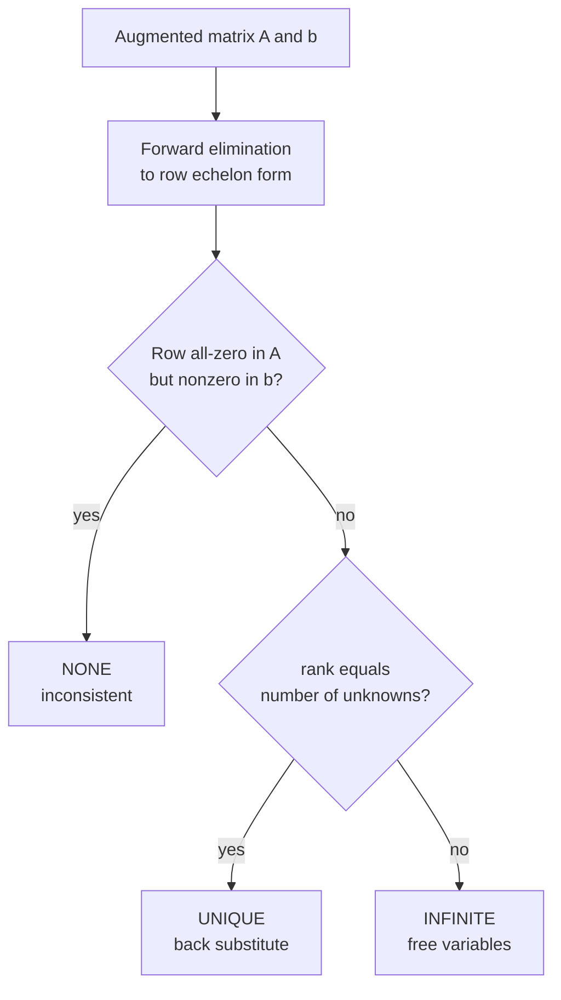

# Gaussian Elimination: Solving a Linear System $Ax = b$

| Field | Value |
| --- | --- |
| Source | Classic linear algebra exercise |
| Difficulty | Medium |
| Topics | Linear Algebra, Gaussian Elimination, Rank, Rational Arithmetic |
| Link | https://en.wikipedia.org/wiki/Gaussian_elimination |

---

## Problem Statement

You are given an $n \times m$ coefficient matrix $A$ and a right-hand-side vector $b$ of length $n$, describing the linear system

$$
A x = b, \qquad A \in \mathbb{Q}^{n \times m}, \; x \in \mathbb{Q}^{m}, \; b \in \mathbb{Q}^{n}.
$$

Determine which of three cases holds and report accordingly:

- **`NONE`** — the system is inconsistent (no solution),
- **`UNIQUE`** — exactly one solution; print the vector $x$,
- **`INFINITE`** — infinitely many solutions (some variables are free).

Constraints: $1 \le n, m \le 200$; all input entries are integers with $|A_{ij}|, |b_i| \le 10^6$.

```
Input:
2 2
1 1 3
1 -1 1

Output:
UNIQUE
2 1
```

Here $x + y = 3$ and $x - y = 1$ give the unique solution $x = 2, y = 1$. If instead the second equation were $2x + 2y = 7$, the two equations would contradict the first ($0 = 1$ after elimination) and the answer would be `NONE`.

---

## Approach (WHY)

Gaussian elimination applies three solution-preserving **row operations** — swap, scale, and add-a-multiple — to drive $[A \mid b]$ into **row echelon form**. The structure of that form reveals the answer.

We process columns left to right. For each, pick a pivot row (partial pivoting picks the largest magnitude for stability; with exact arithmetic any nonzero entry works), swap it up, and eliminate that variable from all other rows. After elimination we inspect:

- A row that is all zeros in $A$ but nonzero in $b$ is the impossible equation $0 = c$ → **NONE**.
- Otherwise, if every variable received a pivot (rank $= m$) → **UNIQUE**.
- If consistent but some variable has no pivot (rank $< m$) → **INFINITE** (free variables).

Using **exact rational arithmetic** (Python's `Fraction`, or a hand-rolled fraction in C++) avoids all floating-point misclassification of zero pivots.



---

## Solution

### Python

```python
import sys
from fractions import Fraction
from typing import List, Optional, Tuple


def gauss(A: List[List[Fraction]], b: List[Fraction]) -> Tuple[str, Optional[List[Fraction]]]:
    n = len(A)
    m = len(A[0]) if n else 0
    # Augmented matrix with exact fractions.
    M = [A[i][:] + [b[i]] for i in range(n)]

    where = [-1] * m  # which row pivots on each column
    row = 0
    for col in range(m):
        # Find a pivot in this column at or below the current row.
        sel = -1
        for r in range(row, n):
            if M[r][col] != 0:
                sel = r
                break
        if sel == -1:
            continue  # free column
        M[row], M[sel] = M[sel], M[row]
        where[col] = row

        # Normalize and eliminate the column from every other row.
        inv = M[row][col]
        M[row] = [v / inv for v in M[row]]
        for r in range(n):
            if r != row and M[r][col] != 0:
                f = M[r][col]
                M[r] = [M[r][c] - f * M[row][c] for c in range(m + 1)]
        row += 1

    # Consistency check: a zero LHS row with nonzero RHS is impossible.
    for r in range(n):
        if all(M[r][c] == 0 for c in range(m)) and M[r][m] != 0:
            return "NONE", None

    if row < m:
        return "INFINITE", None

    # Unique: read each variable off its pivot row.
    x = [Fraction(0)] * m
    for col in range(m):
        x[col] = M[where[col]][m]
    return "UNIQUE", x


def main() -> None:
    data = sys.stdin.read().split()
    idx = 0
    n = int(data[idx]); idx += 1
    m = int(data[idx]); idx += 1
    A, b = [], []
    for _ in range(n):
        row = [Fraction(int(data[idx + j])) for j in range(m)]
        idx += m
        b.append(Fraction(int(data[idx]))); idx += 1
        A.append(row)

    status, x = gauss(A, b)
    if status == "UNIQUE":
        print("UNIQUE")
        print(" ".join(str(v) for v in x))
    else:
        print(status)


if __name__ == "__main__":
    main()
```

### C++

```cpp
#include <bits/stdc++.h>
using namespace std;

// Exact rational using long long numerator/denominator.
struct Frac {
    long long num = 0, den = 1;
    Frac(long long n = 0, long long d = 1) : num(n), den(d) { norm(); }
    void norm() {
        if (den < 0) { num = -num; den = -den; }
        long long g = std::gcd(num < 0 ? -num : num, den);
        if (g) { num /= g; den /= g; }
        if (num == 0) den = 1;
    }
    Frac operator+(const Frac& o) const { return Frac(num * o.den + o.num * den, den * o.den); }
    Frac operator-(const Frac& o) const { return Frac(num * o.den - o.num * den, den * o.den); }
    Frac operator*(const Frac& o) const { return Frac(num * o.num, den * o.den); }
    Frac operator/(const Frac& o) const { return Frac(num * o.den, den * o.num); }
    bool isZero() const { return num == 0; }
};

int main() {
    ios::sync_with_stdio(false);
    cin.tie(nullptr);

    int n, m;
    cin >> n >> m;
    vector<vector<Frac>> M(n, vector<Frac>(m + 1));
    for (int i = 0; i < n; ++i) {
        for (int j = 0; j < m; ++j) { long long v; cin >> v; M[i][j] = Frac(v); }
        long long v; cin >> v; M[i][m] = Frac(v);
    }

    vector<int> where(m, -1);
    int row = 0;
    for (int col = 0; col < m; ++col) {
        int sel = -1;
        for (int r = row; r < n; ++r)
            if (!M[r][col].isZero()) { sel = r; break; }
        if (sel == -1) continue;  // free column
        swap(M[row], M[sel]);
        where[col] = row;

        Frac inv = M[row][col];
        for (int c = 0; c <= m; ++c) M[row][c] = M[row][c] / inv;
        for (int r = 0; r < n; ++r) {
            if (r != row && !M[r][col].isZero()) {
                Frac f = M[r][col];
                for (int c = 0; c <= m; ++c) M[r][c] = M[r][c] - f * M[row][c];
            }
        }
        ++row;
    }

    // Consistency check.
    for (int r = 0; r < n; ++r) {
        bool zeroLhs = true;
        for (int c = 0; c < m; ++c) if (!M[r][c].isZero()) { zeroLhs = false; break; }
        if (zeroLhs && !M[r][m].isZero()) { cout << "NONE\n"; return 0; }
    }

    if (row < m) { cout << "INFINITE\n"; return 0; }

    cout << "UNIQUE\n";
    for (int col = 0; col < m; ++col) {
        Frac x = M[where[col]][m];
        cout << x.num;
        if (x.den != 1) cout << '/' << x.den;
        cout << (col + 1 < m ? ' ' : '\n');
    }
    return 0;
}
```

---

## Iteration Trace

System $\begin{cases} x + y = 3 \\ x - y = 1 \end{cases}$, augmented rows shown as `[x  y | rhs]`:

| Step | Action | Rows |
| --- | --- | --- |
| start | — | `[1 1 \| 3]`, `[1 -1 \| 1]` |
| col 0 | pivot row 0, normalize (already 1) | `[1 1 \| 3]`, `[1 -1 \| 1]` |
| col 0 | eliminate row 1: $R_1 - R_0$ | `[1 1 \| 3]`, `[0 -2 \| -2]` |
| col 1 | pivot row 1, normalize $\div(-2)$ | `[1 1 \| 3]`, `[0 1 \| 1]` |
| col 1 | eliminate row 0: $R_0 - R_1$ | `[1 0 \| 2]`, `[0 1 \| 1]` |

Rank $= 2 =$ number of unknowns and no inconsistent row → **UNIQUE**, reading $x = 2, y = 1$.

---

Each of the $m$ pivot columns eliminates across $n$ rows of width $m+1$:

$$
T(n, m) = O\!\left(n \cdot m \cdot \min(n, m)\right) = O(n^3) \text{ for a square system.}
$$

## Complexity

| Aspect | Cost |
| --- | --- |
| Time | $O(n \cdot m \cdot \min(n, m))$ |
| Space | $O(n \cdot m)$ |

---

## Takeaway

Gaussian elimination reduces $[A \mid b]$ to echelon form, and the **shape of that form** is the answer: a zero-LHS / nonzero-RHS row means `NONE`, full pivot count means `UNIQUE`, and leftover free variables mean `INFINITE`. Working in exact rationals removes every floating-point ambiguity about when a pivot is truly zero.
