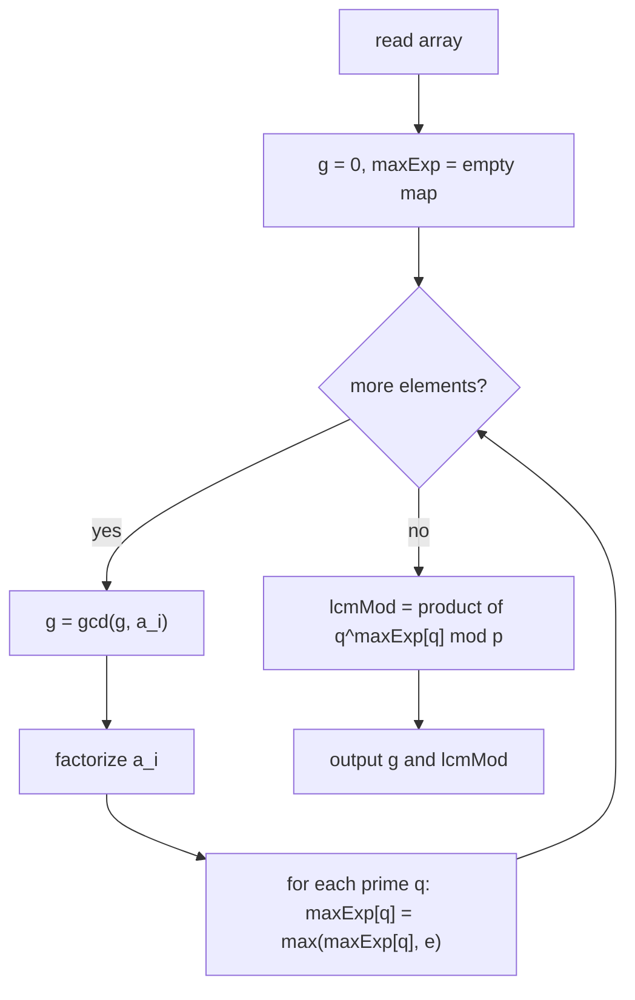

# GCD and LCM of an Array (mod $10^9+7$)

| | |
|---|---|
| **Source** | Classic number-theory exercise |
| **Difficulty** | Easy–Medium |
| **Topics** | GCD, LCM, prime factorization, modular arithmetic |
| **Link** | https://cses.fi/problemset/ |

---

## Problem Statement

You are given an array $A$ of $n$ positive integers $a_1, a_2, \dots, a_n$.

Compute two values:

1. $G = \gcd(a_1, a_2, \dots, a_n)$.
2. $L = \text{lcm}(a_1, a_2, \dots, a_n) \bmod (10^9 + 7)$.

Because the true LCM can be astronomically large, report it modulo the prime $p = 10^9 + 7$. The GCD always fits in a normal integer, so report it exactly.

**Constraints**

$$1 \le n \le 2 \cdot 10^5, \qquad 1 \le a_i \le 10^9$$

```
Input
4
6 8 12 10

Output
2 120
```

Here $\gcd(6,8,12,10) = 2$ and $\text{lcm} = 120$, and $120 \bmod (10^9+7) = 120$.

---

## Approach (WHY)

**GCD** folds trivially. Since $\gcd$ is associative, accumulate `g = gcd(g, a_i)` starting from $0$ (because $\gcd(0, v) = v$). The running value can only stay equal or shrink, and once it reaches $1$ it can never change again — a useful early exit.

**LCM under a modulus** is the subtle part. The pairwise identity

$$\text{lcm}(x, y) = \frac{x}{\gcd(x,y)} \cdot y$$

needs an *exact* division by $\gcd(x,y)$ on the **true** values — but we can only store the running LCM modulo $p$, and division does not commute with the modulus. We dodge the problem with the definition of LCM by prime factorization:

$$\text{lcm}(a_1, \dots, a_n) = \prod_{q \text{ prime}} q^{\max_i e_q(a_i)}$$

where $e_q(a_i)$ is the exponent of prime $q$ in $a_i$. We factorize each $a_i$, keep a map `prime -> max exponent` seen so far, and at the end multiply $q^{\text{exp}} \bmod p$ across the map. Every multiplication is on already-reduced residues, so there is **no overflow and no need for a modular inverse**.



Trial division up to $\sqrt{a_i}$ factorizes each value in $O(\sqrt{V})$ with $V = \max a_i \le 10^9$, i.e. about $3.2 \times 10^4$ operations per element.

---

## Solution

### Python

```python
import sys
from math import gcd

MOD = 10**9 + 7


def factorize(x: int) -> dict[int, int]:
    factors: dict[int, int] = {}
    d = 2
    while d * d <= x:
        while x % d == 0:
            factors[d] = factors.get(d, 0) + 1
            x //= d
        d += 1
    if x > 1:                       # leftover prime factor
        factors[x] = factors.get(x, 0) + 1
    return factors


def solve() -> None:
    data = sys.stdin.read().split()
    n = int(data[0])
    a = list(map(int, data[1:1 + n]))

    g = 0                           # running gcd of all elements
    max_exp: dict[int, int] = {}    # prime -> highest exponent seen
    for x in a:
        g = gcd(g, x)
        for prime, exp in factorize(x).items():
            if exp > max_exp.get(prime, 0):
                max_exp[prime] = exp

    lcm_mod = 1
    for prime, exp in max_exp.items():
        lcm_mod = lcm_mod * pow(prime, exp, MOD) % MOD

    print(g, lcm_mod)


solve()
```

```cpp
#include <bits/stdc++.h>
using namespace std;

const long long MOD = 1000000007LL;

// Hand-written gcd (also available as std::gcd / __gcd).
long long my_gcd(long long a, long long b) {
    while (b != 0) {
        long long t = a % b;
        a = b;
        b = t;
    }
    return a;
}

long long power_mod(long long base, long long exp, long long mod) {
    long long result = 1 % mod;
    base %= mod;
    while (exp > 0) {
        if (exp & 1) result = result * base % mod;
        base = base * base % mod;
        exp >>= 1;
    }
    return result;
}

int main() {
    ios::sync_with_stdio(false);
    cin.tie(nullptr);

    int n;
    if (!(cin >> n)) return 0;

    long long g = 0;                        // running gcd of all elements
    unordered_map<long long, int> maxExp;   // prime -> highest exponent seen
    maxExp.reserve(1024);

    for (int i = 0; i < n; ++i) {
        long long x;
        cin >> x;
        g = my_gcd(g, x);

        // factorize x by trial division up to sqrt(x)
        for (long long d = 2; d * d <= x; ++d) {
            if (x % d == 0) {
                int e = 0;
                while (x % d == 0) { x /= d; ++e; }
                if (e > maxExp[d]) maxExp[d] = e;
            }
        }
        if (x > 1) {                        // leftover prime factor
            if (1 > maxExp[x]) maxExp[x] = 1;
        }
    }

    long long lcm_mod = 1;
    for (const auto &kv : maxExp) {
        lcm_mod = lcm_mod * power_mod(kv.first, kv.second, MOD) % MOD;
    }

    cout << g << ' ' << lcm_mod << '\n';
    return 0;
}
```

---

## Iteration Trace

Input array $A = [6, 8, 12, 10]$, $p = 10^9+7$.

| Step | $x$ | factorization | $g=\gcd(g,x)$ | `max_exp` after merge |
|------|-----|---------------|----------------|------------------------|
| init | — | — | 0 | `{}` |
| 1 | 6 | $2^1 \cdot 3^1$ | 6 | `{2:1, 3:1}` |
| 2 | 8 | $2^3$ | 2 | `{2:3, 3:1}` |
| 3 | 12 | $2^2 \cdot 3^1$ | 2 | `{2:3, 3:1}` |
| 4 | 10 | $2^1 \cdot 5^1$ | 2 | `{2:3, 3:1, 5:1}` |

Final LCM from the map:

$$L = 2^3 \cdot 3^1 \cdot 5^1 = 8 \cdot 3 \cdot 5 = 120$$

So $G = 2$, $L = 120 \bmod (10^9+7) = 120$. ✓

---

## Complexity

Factorizing each element by trial division dominates.

$$T(n) = O\!\left(n \sqrt{V}\right), \qquad V = \max_i a_i$$

The GCD fold adds only $O(n \log V)$, which is lower order.

| Metric | Value |
|--------|-------|
| Time | $O(n \sqrt{V})$ |
| Space | $O(P)$ where $P$ = number of distinct primes across all $a_i$ |

---

## Takeaway

GCD folds with the identity seed $0$ and never increases. To compute an LCM **modulo a prime**, avoid the divide-by-gcd identity entirely — instead take the **max exponent per prime** across all factorizations, then multiply $q^{\text{exp}} \bmod p$. Every step stays exact, overflow-free, and needs no modular inverse.
