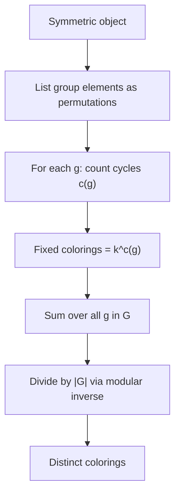
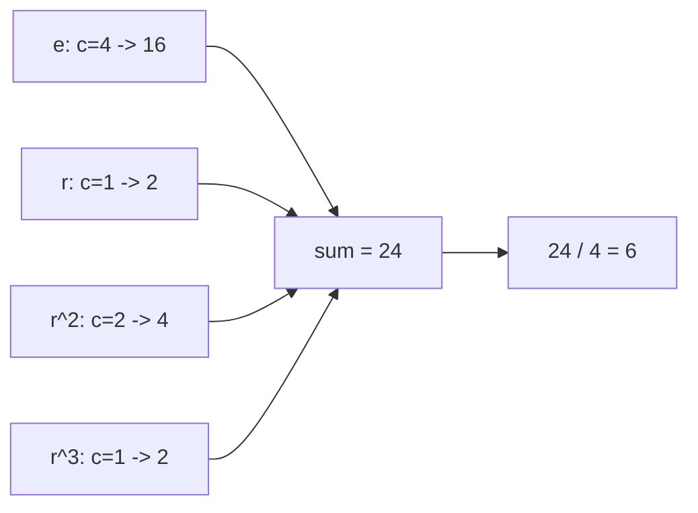

# Grid / Cube Colorings via Pólya (Cycle Index)

| | |
|---|---|
| **Source** | Classic combinatorics (Pólya enumeration theorem) |
| **Difficulty** | Medium |
| **Topics** | Group actions, cycle index, Pólya enumeration, permutation cycles, modular inverse |
| **Link** | [CP-Algorithms: Burnside & Pólya](https://cp-algorithms.com/combinatorics/burnside.html) · [CSES problemset](https://cses.fi/problemset/) |

---

## Problem Statement

Color a small symmetric object with $k$ colors and count the **distinct** colorings up to the object's **symmetry (rotation) group**, modulo a prime $p = 10^9 + 7$.

We solve two concrete instances with the **same engine**:

1. A $2\times 2$ **grid** of 4 cells, considered the same under the $90°$ rotation group $C_4$.
2. A **cube**, coloring its $6$ faces, considered the same under the cube's rotation group (order $24$).

The unifying tool is the **Pólya enumeration theorem**: enumerate each group element $g$, count the number of cycles $c(g)$ it induces on the colored positions, then

$$\#\text{colorings} = \frac{1}{|G|}\sum_{g\in G} k^{c(g)}.$$

```
Object: 2x2 grid under C4,  k = 2
Output: 6

Object: cube faces under rotation group (order 24),  k = 2
Output: 10
```

---

## Approach (WHY)

A coloring is **fixed** by a symmetry $g$ exactly when every cycle of $g$ (on the positions) is **monochromatic**. With $k$ colors available, each cycle can independently take any color, so the number of fixed colorings is $k^{c(g)}$ where $c(g)$ is the **number of cycles**. Averaging over the group (Burnside) gives Pólya's count.

So the algorithm is uniform:

1. Represent the symmetry group as a **list of permutations** of the positions.
2. For each permutation, **count its cycles** $c(g)$.
3. Sum $k^{c(g)}$ and divide by $|G|$ (modular inverse).



**Cube cycle structure on 6 faces** (the data we feed the engine):

| Rotation class | Count | Cycles on faces | $c(g)$ |
|----------------|-------|-----------------|--------|
| identity | 1 | $(1)(2)(3)(4)(5)(6)$ | 6 |
| face axis $90°/270°$ | 6 | 2 fixed + one 4-cycle | 3 |
| face axis $180°$ | 3 | 2 fixed + two 2-cycles | 4 |
| vertex axis $120°/240°$ | 8 | two 3-cycles | 2 |
| edge axis $180°$ | 6 | three 2-cycles | 3 |

Giving $\frac{1}{24}(k^6 + 6k^3 + 3k^4 + 8k^2 + 6k^3) = \frac{k^6 + 3k^4 + 12k^3 + 8k^2}{24}$, which is $10$ for $k=2$.

---

## Solution

### Python

```python
MOD = 10**9 + 7

def power(base, exp, mod):
    result = 1
    base %= mod
    while exp > 0:
        if exp & 1:
            result = result * base % mod
        base = base * base % mod
        exp >>= 1
    return result

def inverse(a, mod):
    return power(a, mod - 2, mod)

def polya_count(group_perms, k):
    """group_perms: list of permutations (position -> image). Returns count mod p."""
    n = len(group_perms[0])
    total = 0
    for perm in group_perms:
        seen = [False] * n
        cycles = 0
        for start in range(n):
            if not seen[start]:
                cycles += 1
                j = start
                while not seen[j]:
                    seen[j] = True
                    j = perm[j]
        total = (total + power(k, cycles, MOD)) % MOD
    return total * inverse(len(group_perms) % MOD, MOD) % MOD

def grid2x2_group():
    # Cells: 0 1 / 2 3.  90deg CW: new[0]=old[2], new[1]=old[0],
    #                              new[2]=old[3], new[3]=old[1]
    def rot(c):
        return [c[2], c[0], c[3], c[1]]
    g = []
    cur = [0, 1, 2, 3]
    for _ in range(4):
        g.append(cur)
        cur = rot(cur)
    return g

def cube_face_group():
    # Faces: 0=U,1=D,2=F,3=B,4=L,5=R
    return [
        [0, 1, 2, 3, 4, 5],
        [0, 1, 5, 4, 2, 3], [0, 1, 3, 2, 5, 4], [0, 1, 4, 5, 3, 2],
        [4, 5, 2, 3, 1, 0], [1, 0, 2, 3, 5, 4], [5, 4, 2, 3, 0, 1],
        [3, 2, 0, 1, 4, 5], [1, 0, 3, 2, 4, 5], [2, 3, 1, 0, 4, 5],
        [2, 3, 5, 4, 0, 1], [4, 5, 0, 1, 2, 3], [3, 2, 4, 5, 1, 0],
        [5, 4, 1, 0, 3, 2], [2, 3, 4, 5, 1, 0], [5, 4, 0, 1, 2, 3],
        [4, 5, 1, 0, 3, 2], [3, 2, 5, 4, 0, 1],
        [2, 3, 0, 1, 5, 4], [3, 2, 1, 0, 5, 4], [5, 4, 3, 2, 1, 0],
        [4, 5, 2, 3, 0, 1], [1, 0, 4, 5, 2, 3], [1, 0, 5, 4, 3, 2],
    ]

if __name__ == "__main__":
    print(polya_count(grid2x2_group(), 2))    # 6
    print(polya_count(cube_face_group(), 2))   # 10
    print(polya_count(cube_face_group(), 3))   # 57
```

### C++

```cpp
#include <bits/stdc++.h>
using namespace std;
const long long MOD = 1e9 + 7;

long long power(long long base, long long exp, long long mod) {
    long long result = 1;
    base %= mod;
    while (exp > 0) {
        if (exp & 1) result = result * base % mod;
        base = base * base % mod;
        exp >>= 1;
    }
    return result;
}

long long inverse(long long a, long long mod) {
    return power(a, mod - 2, mod);
}

long long polyaCount(const vector<vector<int>> &groupPerms, long long k) {
    int n = (int)groupPerms[0].size();
    long long total = 0;
    for (const auto &perm : groupPerms) {
        vector<char> seen(n, 0);
        int cycles = 0;
        for (int start = 0; start < n; ++start) {
            if (!seen[start]) {
                ++cycles;
                int j = start;
                while (!seen[j]) { seen[j] = 1; j = perm[j]; }
            }
        }
        total = (total + power(k, cycles, MOD)) % MOD;
    }
    return total * inverse((long long)groupPerms.size() % MOD, MOD) % MOD;
}

vector<vector<int>> grid2x2Group() {
    // Cells: 0 1 / 2 3.  90deg CW rotation.
    auto rot = [](const vector<int> &c) {
        return vector<int>{c[2], c[0], c[3], c[1]};
    };
    vector<vector<int>> g;
    vector<int> cur = {0, 1, 2, 3};
    for (int i = 0; i < 4; ++i) { g.push_back(cur); cur = rot(cur); }
    return g;
}

vector<vector<int>> cubeFaceGroup() {
    // Faces: 0=U,1=D,2=F,3=B,4=L,5=R
    return {
        {0, 1, 2, 3, 4, 5},
        {0, 1, 5, 4, 2, 3}, {0, 1, 3, 2, 5, 4}, {0, 1, 4, 5, 3, 2},
        {4, 5, 2, 3, 1, 0}, {1, 0, 2, 3, 5, 4}, {5, 4, 2, 3, 0, 1},
        {3, 2, 0, 1, 4, 5}, {1, 0, 3, 2, 4, 5}, {2, 3, 1, 0, 4, 5},
        {2, 3, 5, 4, 0, 1}, {4, 5, 0, 1, 2, 3}, {3, 2, 4, 5, 1, 0},
        {5, 4, 1, 0, 3, 2}, {2, 3, 4, 5, 1, 0}, {5, 4, 0, 1, 2, 3},
        {4, 5, 1, 0, 3, 2}, {3, 2, 5, 4, 0, 1},
        {2, 3, 0, 1, 5, 4}, {3, 2, 1, 0, 5, 4}, {5, 4, 3, 2, 1, 0},
        {4, 5, 2, 3, 0, 1}, {1, 0, 4, 5, 2, 3}, {1, 0, 5, 4, 3, 2}};
}

int main() {
    cout << polyaCount(grid2x2Group(), 2) << '\n';    // 6
    cout << polyaCount(cubeFaceGroup(), 2) << '\n';   // 10
    cout << polyaCount(cubeFaceGroup(), 3) << '\n';   // 57
    return 0;
}
```

---

## Iteration Trace

$2\times 2$ grid under $C_4$, $k = 2$:

| Group element | Cell permutation | Cycles $c(g)$ | $k^{c(g)} = 2^{c(g)}$ | Running sum |
|---------------|------------------|---------------|------------------------|-------------|
| $e$ (0°) | $[0,1,2,3]$ | $4$ | $16$ | $16$ |
| $r$ (90°) | $[2,0,3,1]$ | $1$ | $2$ | $18$ |
| $r^2$ (180°) | $[3,2,1,0]$ | $2$ | $4$ | $22$ |
| $r^3$ (270°) | $[1,3,0,2]$ | $1$ | $2$ | $24$ |

Sum $= 24$; $24 / |G| = 24 / 4 = 6$. ✓



---

## Complexity

Let $|G|$ be the group order and $n$ the number of positions. We scan each permutation once to count cycles, then one modular power per element, plus one inverse at the end:

$$O\!\left(|G|\cdot(n + \log k)\right).$$

| Aspect | Cost |
|--------|------|
| Time | $O(|G|\cdot(n + \log k))$ |
| Space | $O(n)$ for the cycle-visited array |
| Modular division | $O(\log p)$ inverse |

For the cube ($|G| = 24$, $n = 6$) and the grid ($|G| = 4$, $n = 4$) this is effectively constant.

---

## Takeaway

Pólya's theorem turns symmetry counting into **cycle counting**: list the group as permutations, count cycles per element, sum $k^{c(g)}$, divide by $|G|$. The *same* engine handles a $2\times2$ grid, a cube, or any finite object — you only swap in the group's permutation table.
