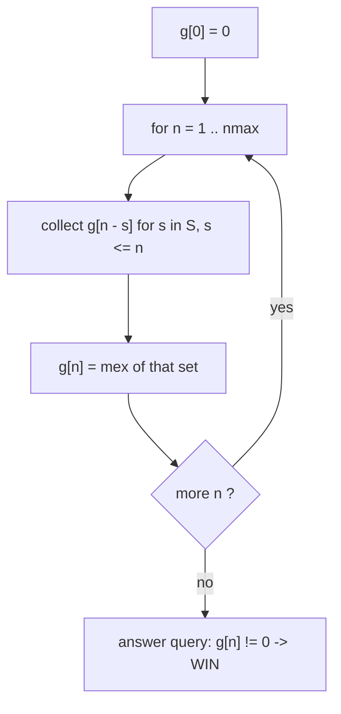
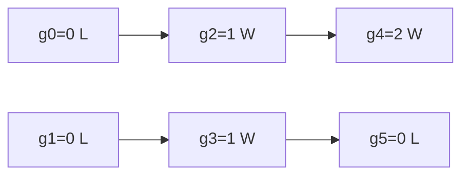

# Subtraction Game — Winner via Grundy / mex

| | |
|---|---|
| **Source** | Self-contained (classic impartial subtraction game) |
| **Difficulty** | Medium |
| **Topics** | Game theory, Grundy numbers, mex, Sprague–Grundy |
| **Link** | — |

---

## Problem Statement

There is a single pile of $n$ stones and a fixed **move set** $S = \{s_1, s_2, \dots, s_k\}$ of positive integers. On a turn the player removes **exactly $s$** stones for some $s \in S$ with $s \le$ (current pile size). The player who **cannot move** **loses** (normal play). The first player moves first; both play optimally.

For each query pile size, decide whether the **first player wins**.

**Constraints**

$$
1 \le k \le 100, \qquad 1 \le s_i \le 100, \qquad 0 \le n \le 10^{6}, \qquad 1 \le q \le 10^{6}.
$$

```
Input
moves = {2, 3}
queries = [0, 1, 2, 3, 4, 5, 6, 7]

Output
LOSE LOSE WIN WIN WIN LOSE LOSE WIN
```

With $S = \{2, 3\}$: piles $0$ and $1$ admit no move (lose). Pile $2$ → remove 2 → $0$ (a losing position for the opponent), so it is a win. Pile $5$ can only reach $g(3)=1$ or $g(2)=1$, whose mex is $0$, so it is a loss.

---

## Approach (WHY)

A single pile with a fixed subtraction set is an impartial game, so by **Sprague–Grundy** it is equivalent to a Nim pile of size $g(n)$, where the **Grundy value** is the **mex** of the reachable Grundy values:

$$
g(0) = 0, \qquad g(n) = \operatorname{mex}\bigl(\{\, g(n - s) : s \in S,\ s \le n \,\}\bigr).
$$

The first player **wins iff $g(n) \ne 0$**. We build the table $g[0\ldots n_{\max}]$ once in $O(n_{\max} \cdot k)$, then answer each query in $O(1)$. The mex at each step scans candidate values $0, 1, 2, \dots$ until one is missing — bounded by $\lvert S\rvert + 1$ since at most $\lvert S\rvert$ distinct values are reachable.



---

## Solution

### Python

```python
def build_grundy(n_max: int, moves: list[int]) -> list[int]:
    g = [0] * (n_max + 1)
    for n in range(1, n_max + 1):
        reachable = set()
        for s in moves:
            if s <= n:
                reachable.add(g[n - s])
        m = 0
        while m in reachable:
            m += 1
        g[n] = m
    return g

def solve(n_max: int, moves: list[int], queries: list[int]) -> list[str]:
    g = build_grundy(n_max, moves)
    return ["WIN" if g[n] != 0 else "LOSE" for n in queries]

if __name__ == "__main__":
    moves = [2, 3]
    queries = [0, 1, 2, 3, 4, 5, 6, 7]
    print(" ".join(solve(max(queries), moves, queries)))
```

### C++

```cpp
#include <bits/stdc++.h>
using namespace std;

vector<int> build_grundy(int n_max, const vector<int>& moves) {
    vector<int> g(n_max + 1, 0);
    for (int n = 1; n <= n_max; ++n) {
        vector<char> seen(moves.size() + 1, 0);   // mex bounded by |S|
        for (int s : moves) {
            if (s <= n) {
                int v = g[n - s];
                if (v <= (int)moves.size()) seen[v] = 1;
            }
        }
        int m = 0;
        while (m < (int)seen.size() && seen[m]) ++m;
        g[n] = m;
    }
    return g;
}

int main() {
    ios::sync_with_stdio(false);
    cin.tie(nullptr);

    vector<int> moves = {2, 3};
    vector<int> queries = {0, 1, 2, 3, 4, 5, 6, 7};
    int n_max = *max_element(queries.begin(), queries.end());

    vector<int> g = build_grundy(n_max, moves);
    for (size_t i = 0; i < queries.size(); ++i) {
        cout << (g[queries[i]] != 0 ? "WIN" : "LOSE");
        cout << (i + 1 < queries.size() ? ' ' : '\n');
    }
    return 0;
}
```

---

## Iteration Trace

Building $g$ for $S = \{2, 3\}$ step by step. At each $n$ we collect $g(n-s)$ for every $s \in S$ with $s \le n$, then take the mex:

| $n$ | Reachable Grundy set | $g(n) = \operatorname{mex}$ | Verdict |
|---|---|---|---|
| 0 | $\{\}$ (no move) | 0 | LOSE |
| 1 | $\{\}$ (no $s \le 1$) | 0 | LOSE |
| 2 | $\{g(0)\} = \{0\}$ | 1 | WIN |
| 3 | $\{g(1), g(0)\} = \{0\}$ | 1 | WIN |
| 4 | $\{g(2), g(1)\} = \{1, 0\}$ | 2 | WIN |
| 5 | $\{g(3), g(2)\} = \{1\}$ | 0 | LOSE |
| 6 | $\{g(4), g(3)\} = \{2, 1\}$ | 0 | LOSE |
| 7 | $\{g(5), g(4)\} = \{0, 2\}$ | 1 | WIN |

Note how $\operatorname{mex}\{1\} = 0$ at $n=5$ and $\operatorname{mex}\{1,2\} = 0$ at $n=6$ — the mex is the smallest *missing* non-negative integer, which is why both are losing positions. Always trust the mex computation over a guessed pattern.

Authoritative Grundy table for $S=\{2,3\}$ (period 5 once stabilized):

| $n$ | 0 | 1 | 2 | 3 | 4 | 5 | 6 | 7 | 8 | 9 |
|---|---|---|---|---|---|---|---|---|---|---|
| $g(n)$ | 0 | 0 | 1 | 1 | 2 | 0 | 0 | 1 | 1 | 2 |
| verdict | L | L | W | W | W | L | L | W | W | W |



---

## Complexity

Let $n_{\max}$ be the largest pile and $k = \lvert S \rvert$.

$$
\text{Precompute } O(n_{\max} \cdot k), \qquad \text{Per query } O(1), \qquad \text{Space } O(n_{\max}).
$$

| Aspect | Cost |
|---|---|
| Build Grundy table | $O(n_{\max} \cdot k)$ |
| Answer one query | $O(1)$ |
| Space | $O(n_{\max})$ |

---

## Takeaway

For any single-pile subtraction game, tabulate Grundy values with $g(n) = \operatorname{mex}\{g(n-s)\}$ and answer "first player wins?" by testing $g(n) \ne 0$. The sequence is eventually **periodic**, so for very large $n$ you can detect the period from the first few hundred values and index by modular reduction. Always **compute the mex** rather than trusting a guessed pattern.
