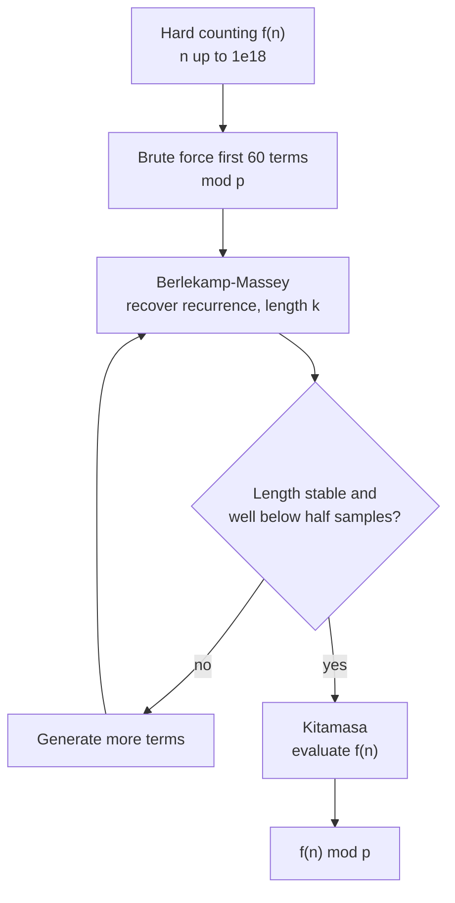
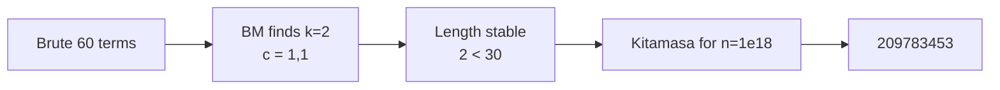

# Guess the Sequence: Brute-Force, Fit, Extrapolate

| | |
| --- | --- |
| **Source** | Classic / CP folklore |
| **Difficulty** | Hard |
| **Topics** | Dynamic programming, Berlekamp-Massey, Kitamasa, extrapolation |
| **Link** | https://cses.fi/problemset/ |

---

## Problem Statement

A counting problem defines a value $f(n)$ for each $n \ge 0$. You have a correct but slow way to compute small $f(n)$ (a brute force or a small DP), but the real query asks for $f(n) \bmod p$ with $n$ up to $10^{18}$ — far beyond what brute force can reach. Assume $f$ satisfies an unknown linear recurrence of modest order. Compute $f(n) \bmod p$, $p = 10^9 + 7$.

As a concrete instance, let $f(n)$ count the number of ways to tile a $2 \times n$ board with $1 \times 2$ dominoes. Small values are $1, 1, 2, 3, 5, 8, \dots$ (the Fibonacci numbers). Given huge $n$, output $f(n) \bmod p$.

```text
Input:
n = 1000000000000000000      # 1e18

Output:
f(n) mod p = 209783453       # tilings of a 2 x 1e18 board, mod 1e9+7
```

## Approach (WHY)

We do not know the recurrence in advance, so we **discover** it:

1. **Brute force** the first $\sim 60$ terms of $f$ modulo $p$ using the slow-but-correct method.
2. **Berlekamp-Massey** the terms to recover the shortest recurrence. Check that its length stabilizes well below half the sample count — that confirms a real recurrence rather than overfitting.
3. **Kitamasa** evaluates $f(n)$ for the real, huge $n$ in $O(k^2 \log n)$.

This brute → BM → Kitamasa pipeline is the standard weapon for "compute $f(n) \bmod p$ for gigantic $n$" problems with a hidden linear structure.



## Solution

### Python

```python
MOD = 10**9 + 7


def brute_tiling(m):
    """First m terms of 2xN domino tilings mod MOD (slow reference DP)."""
    f = [0] * max(m, 2)
    f[0], f[1] = 1, 1
    for i in range(2, m):
        f[i] = (f[i - 1] + f[i - 2]) % MOD
    return f[:m]


def berlekamp_massey(seq, mod=MOD):
    ls, cur = [], []
    lf = ld = 0
    for i in range(len(seq)):
        t = 0
        for j in range(len(cur)):
            t = (t + cur[j] * seq[i - 1 - j]) % mod
        if (seq[i] - t) % mod == 0:
            continue
        if not cur:
            cur = [0] * (i + 1)
            lf, ld = i, (seq[i] - t) % mod
            continue
        k = (seq[i] - t) * pow(ld, mod - 2, mod) % mod
        c = [0] * (i - lf - 1) + [k]
        c += [(-k * x) % mod for x in ls]
        if len(c) < len(cur):
            c += [0] * (len(cur) - len(c))
        for j in range(len(cur)):
            c[j] = (c[j] + cur[j]) % mod
        if i - len(cur) >= lf - len(ls):
            ls, lf, ld = cur, i, (seq[i] - t) % mod
        cur = c
    return [x % mod for x in cur]


def kitamasa(rec, init, n, mod=MOD):
    k = len(rec)
    if n < k:
        return init[n] % mod

    def mul(a, b):
        res = [0] * (len(a) + len(b) - 1)
        for i, av in enumerate(a):
            if av:
                for j, bv in enumerate(b):
                    res[i + j] = (res[i + j] + av * bv) % mod
        for i in range(len(res) - 1, k - 1, -1):
            coef = res[i]
            if coef:
                res[i] = 0
                for j in range(k):
                    res[i - 1 - j] = (res[i - 1 - j] + coef * rec[j]) % mod
        return res[:k]

    result = [1]
    base = [0, 1] if k > 1 else [rec[0] % mod]
    e = n
    while e > 0:
        if e & 1:
            result = mul(result, base)
        base = mul(base, base)
        e >>= 1
    ans = 0
    for i in range(min(k, len(result))):
        ans = (ans + result[i] * init[i]) % mod
    return ans


def solve(n):
    terms = brute_tiling(60)               # 1. brute force
    rec = berlekamp_massey(terms)          # 2. fit recurrence
    k = len(rec)
    return kitamasa(rec, terms[:k], n)     # 3. extrapolate


if __name__ == "__main__":
    print(solve(10**18))
```

### C++

```cpp
#include <bits/stdc++.h>
using namespace std;
const long long MOD = 1e9 + 7;

long long power(long long b, long long e, long long m) {
    long long r = 1 % m;
    b %= m;
    while (e > 0) {
        if (e & 1) r = r * b % m;
        b = b * b % m;
        e >>= 1;
    }
    return r;
}

vector<long long> bruteTiling(int m) {
    vector<long long> f(max(m, 2), 0);
    f[0] = 1;
    f[1] = 1;
    for (int i = 2; i < m; i++) f[i] = (f[i - 1] + f[i - 2]) % MOD;
    f.resize(m);
    return f;
}

vector<long long> berlekampMassey(const vector<long long>& seq) {
    vector<long long> ls, cur;
    long long lf = 0, ld = 0;
    for (int i = 0; i < (int)seq.size(); i++) {
        long long t = 0;
        for (int j = 0; j < (int)cur.size(); j++)
            t = (t + cur[j] * seq[i - 1 - j]) % MOD;
        if (((seq[i] - t) % MOD + MOD) % MOD == 0) continue;
        if (cur.empty()) {
            cur.assign(i + 1, 0);
            lf = i;
            ld = ((seq[i] - t) % MOD + MOD) % MOD;
            continue;
        }
        long long k = (seq[i] - t) % MOD * power(ld, MOD - 2, MOD) % MOD;
        k = (k % MOD + MOD) % MOD;
        vector<long long> c(i - lf - 1, 0);
        c.push_back(k);
        for (long long x : ls) c.push_back((MOD - k * x % MOD) % MOD);
        if (c.size() < cur.size()) c.resize(cur.size(), 0);
        for (int j = 0; j < (int)cur.size(); j++)
            c[j] = (c[j] + cur[j]) % MOD;
        if (i - (int)cur.size() >= lf - (int)ls.size()) {
            ls = cur;
            lf = i;
            ld = ((seq[i] - t) % MOD + MOD) % MOD;
        }
        cur = c;
    }
    for (auto& x : cur) x = (x % MOD + MOD) % MOD;
    return cur;
}

long long kitamasa(const vector<long long>& rec,
                   const vector<long long>& init, long long n) {
    int k = (int)rec.size();
    if (n < k) return init[n] % MOD;

    auto mul = [&](const vector<long long>& a,
                   const vector<long long>& b) {
        vector<long long> res(a.size() + b.size() - 1, 0);
        for (int i = 0; i < (int)a.size(); i++)
            if (a[i])
                for (int j = 0; j < (int)b.size(); j++)
                    res[i + j] = (res[i + j] + a[i] * b[j]) % MOD;
        for (int i = (int)res.size() - 1; i >= k; i--) {
            long long coef = res[i];
            if (coef) {
                res[i] = 0;
                for (int j = 0; j < k; j++)
                    res[i - 1 - j] =
                        (res[i - 1 - j] + coef * rec[j]) % MOD;
            }
        }
        res.resize(k);
        return res;
    };

    vector<long long> result(k, 0), base(k, 0);
    result[0] = 1;
    if (k > 1) base[1] = 1;
    else base[0] = rec[0] % MOD;

    long long e = n;
    while (e > 0) {
        if (e & 1) result = mul(result, base);
        base = mul(base, base);
        e >>= 1;
    }
    long long ans = 0;
    for (int i = 0; i < k; i++)
        ans = (ans + result[i] * init[i]) % MOD;
    return ans;
}

long long solve(long long n) {
    vector<long long> terms = bruteTiling(60);     // 1. brute force
    vector<long long> rec = berlekampMassey(terms); // 2. fit recurrence
    int k = (int)rec.size();
    vector<long long> init(terms.begin(), terms.begin() + k);
    return kitamasa(rec, init, n);                 // 3. extrapolate
}

int main() {
    cout << solve(1000000000000000000LL) << "\n";
    return 0;
}
```

## Iteration Trace

Pipeline on the tiling sequence `[1, 1, 2, 3, 5, 8, 13, 21, ...]`:

| stage | input | output | check |
| --- | --- | --- | --- |
| Brute force | 60 terms wanted | `[1, 1, 2, 3, 5, 8, ...]` | matches known counts |
| Berlekamp-Massey | 60 terms | `c = [1, 1]`, $k = 2$ | length 2 ≪ 30 = half samples ✓ |
| Verify | regenerate term 30+ | matches brute | no overfit ✓ |
| Kitamasa | $k=2$, $n=10^{18}$ | `209783453` | $O(k^2 \log n)$ |

The recurrence length **stabilizes at 2** after only a few terms while we supplied 60 — comfortably below the half-sample threshold of 30, so the fit is trustworthy.



## Complexity

Let $T$ be the number of brute-forced terms and $k$ the recovered order:

$$T_{\text{total}} = \underbrace{O(\text{brute}(T))}_{\text{sampling}} + \underbrace{O(T \cdot k)}_{\text{Berlekamp-Massey}} + \underbrace{O(k^2 \log n)}_{\text{Kitamasa}}.$$

| Stage | Cost |
| --- | --- |
| Brute sampling | problem-dependent, small $T$ |
| Berlekamp-Massey | $O(T \cdot k)$, up to $O(T^2)$ |
| Kitamasa | $O(k^2 \log n)$ |
| Overall (here) | dominated by $O(k^2 \log n)$ |

## Takeaway

When a counting problem demands $f(n) \bmod p$ for astronomically large $n$ and only a slow brute force exists, suspect a hidden linear recurrence: sample a few dozen terms, let Berlekamp-Massey discover the recurrence, confirm its length stabilizes well below half your sample size, then let Kitamasa leap to the answer. This brute → fit → extrapolate pipeline routinely cracks problems that look intractable.
