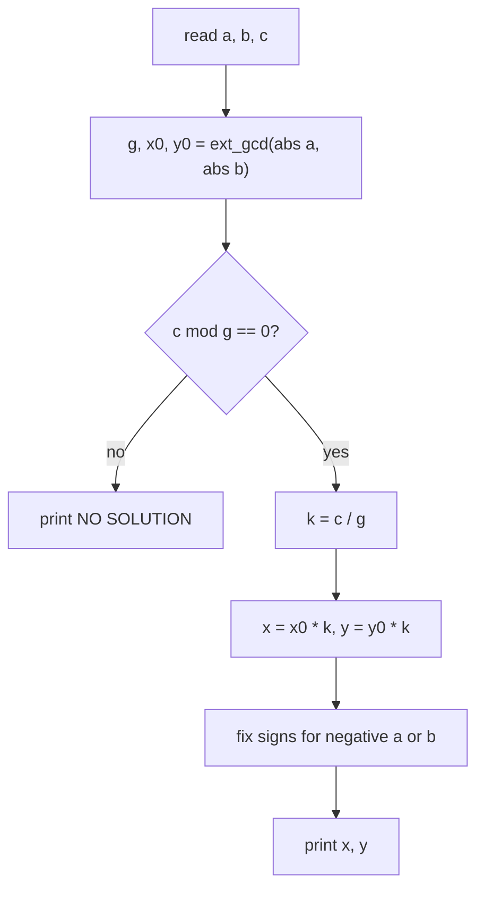
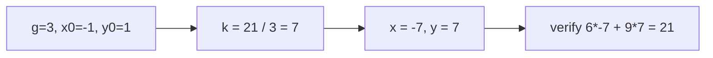

# Linear Diophantine Equation $ax + by = c$

| | |
|---|---|
| **Source** | Classic number-theory exercise |
| **Difficulty** | Medium |
| **Topics** | Extended Euclidean algorithm, Bézout's identity, Diophantine equations |
| **Link** | https://cses.fi/problemset/ |

---

## Problem Statement

Given three integers $a$, $b$, and $c$, find **any** pair of integers $(x, y)$ satisfying:

$$a x + b y = c$$

If no integer solution exists, report `NO SOLUTION`.

**Constraints**

$$-10^9 \le a, b, c \le 10^9$$

```
Input
6 9 21

Output
x = -7, y = 7

Input
2 4 5

Output
NO SOLUTION
```

For the first case $6(-7) + 9(7) = -42 + 63 = 21$. For the second, $\gcd(2,4)=2$ does not divide $5$, so there is no integer solution.

---

## Approach (WHY)

Every value of $ax + by$ is a multiple of $g = \gcd(a, b)$, because $g$ divides both $a$ and $b$. Conversely, **Bézout's identity** guarantees we can reach exactly $g$:

$$a x_0 + b y_0 = g$$

Therefore:

$$ax + by = c \text{ has an integer solution} \iff g \mid c$$

**Solvability check.** If $c \bmod g \neq 0$, print `NO SOLUTION`.

**Constructing a solution.** Run the extended Euclidean algorithm on $(a, b)$ to get $(g, x_0, y_0)$. Scale by $k = c / g$:

$$x = x_0 \cdot k, \qquad y = y_0 \cdot k$$

because multiplying the whole identity by $k$ gives $a(x_0 k) + b(y_0 k) = g k = c$.

**Sign handling.** Extended Euclid is run on $|a|, |b|$; flip the sign of $x_0$ or $y_0$ afterward if the original $a$ or $b$ was negative.

**General family (optional).** All solutions are $x + \tfrac{b}{g}t$, $y - \tfrac{a}{g}t$ for $t \in \mathbb Z$.



---

## Solution

### Python

```python
import sys


def ext_gcd(a: int, b: int) -> tuple[int, int, int]:
    if b == 0:
        return (a, 1, 0)
    g, x1, y1 = ext_gcd(b, a % b)
    return (g, y1, x1 - (a // b) * y1)


def solve() -> None:
    a, b, c = map(int, sys.stdin.read().split())
    g, x0, y0 = ext_gcd(abs(a), abs(b))

    if c % g != 0:
        print("NO SOLUTION")
        return

    k = c // g
    x = x0 * k
    y = y0 * k
    if a < 0:
        x = -x
    if b < 0:
        y = -y

    print(f"x = {x}, y = {y}")


solve()
```

```cpp
#include <bits/stdc++.h>
using namespace std;

// Extended Euclid: returns gcd(a, b), sets x, y with a*x + b*y = gcd.
long long ext_gcd(long long a, long long b, long long &x, long long &y) {
    if (b == 0) {
        x = 1;
        y = 0;
        return a;
    }
    long long x1, y1;
    long long g = ext_gcd(b, a % b, x1, y1);
    x = y1;
    y = x1 - (a / b) * y1;
    return g;
}

int main() {
    ios::sync_with_stdio(false);
    cin.tie(nullptr);

    long long a, b, c;
    cin >> a >> b >> c;

    long long x0, y0;
    long long g = ext_gcd(llabs(a), llabs(b), x0, y0);

    if (c % g != 0) {
        cout << "NO SOLUTION" << '\n';
        return 0;
    }

    long long k = c / g;
    long long x = x0 * k;
    long long y = y0 * k;
    if (a < 0) x = -x;
    if (b < 0) y = -y;

    cout << "x = " << x << ", y = " << y << '\n';
    return 0;
}
```

---

## Iteration Trace

Solve $6x + 9y = 21$. First run `ext_gcd(6, 9)`.

| Call | $a$ | $b$ | $\lfloor a/b\rfloor$ | returns $(g, x, y)$ | check $ax+by$ |
|------|-----|-----|----------------------|---------------------|---------------|
| 0 | 6 | 9 | 0 | $(3,\, -1,\, 1)$ | $6(-1)+9(1)=3$ |
| 1 | 9 | 6 | 1 | $(3,\, 1,\, -1)$ | $9(1)+6(-1)=3$ |
| 2 | 6 | 3 | 2 | $(3,\, 0,\, 1)$ | $6(0)+3(1)=3$ |
| 3 | 3 | 0 | — | $(3,\, 1,\, 0)$ | base case |

So $g = 3$, $x_0 = -1$, $y_0 = 1$. Since $3 \mid 21$, scale by $k = 21/3 = 7$:

$$x = -1 \cdot 7 = -7, \qquad y = 1 \cdot 7 = 7$$

Check: $6(-7) + 9(7) = -42 + 63 = 21$. ✓



---

## Complexity

The cost is dominated by the extended Euclidean recursion.

$$T = O(\log \min(|a|, |b|))$$

| Metric | Value |
|--------|-------|
| Time | $O(\log \min(\lvert a\rvert, \lvert b\rvert))$ |
| Space | $O(\log)$ recursion stack ($O(1)$ if iterative) |

---

## Takeaway

A linear Diophantine equation $ax + by = c$ is solvable **iff** $\gcd(a,b) \mid c$. Extended Euclid hands you a base solution to $ax_0 + by_0 = g$; scale it by $c/g$ to hit $c$, and shift by multiples of $\tfrac{b}{g}, \tfrac{a}{g}$ to enumerate the entire solution family.
