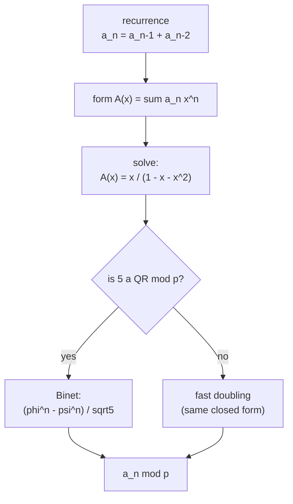
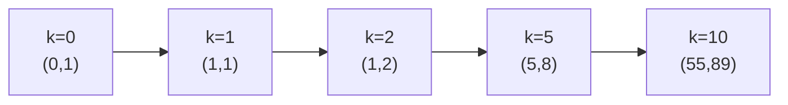

# Linear Recurrence Closed Form via Generating Functions

| | |
|---|---|
| **Source** | Classic — Fibonacci-like recurrence (closed form) |
| **Difficulty** | Medium |
| **Topics** | Generating functions, OGF, partial fractions, linear recurrence, modular arithmetic |
| **Link** | https://cses.fi/problemset/ |

---

## Problem Statement

A sequence is defined by the linear recurrence

$$a_0 = 0,\qquad a_1 = 1,\qquad a_n = a_{n-1} + a_{n-2}\ \ (n \ge 2).$$

This is the Fibonacci sequence. Given an index $n$ and a prime modulus $p$, compute $a_n \bmod p$. Use the **generating function** of the sequence to derive its rational closed form $\dfrac{x}{1 - x - x^2}$, then evaluate the $n$-th term — both by the mechanical $O(n)$ series expansion and (when $5$ is a quadratic residue mod $p$) by the partial-fraction closed form.

**Constraints**

$$
0 \le n \le 10^{18}, \qquad p \text{ prime}, \qquad 2 \le p \le 10^9 + 9.
$$

```
Input
10 1000000007

Output
55
```

The first terms are $0,1,1,2,3,5,8,13,21,34,55$, so $a_{10} = 55$.

---

## Approach (WHY)

Define the OGF $A(x) = \sum_{n\ge0} a_n x^n$. Multiply the recurrence $a_n = a_{n-1} + a_{n-2}$ by $x^n$ and sum over $n \ge 2$. A shift by $1$ is multiplication by $x$, a shift by $2$ by $x^2$:

$$\sum_{n\ge2} a_n x^n = x\sum_{n\ge2} a_{n-1}x^{n-1} + x^2\sum_{n\ge2} a_{n-2}x^{n-2}.$$

Replacing each sum by $A(x)$ minus its low-order terms and using $a_0=0,\,a_1=1$ gives

$$A(x) - x = x\,A(x) + x^2 A(x) \implies A(x) = \frac{x}{1 - x - x^2}.$$

The denominator $1 - x - x^2$ is the **reflected characteristic polynomial**. Factor it as $(1-\varphi x)(1-\psi x)$ with $\varphi=\frac{1+\sqrt5}{2}$, $\psi=\frac{1-\sqrt5}{2}$. Partial fractions yield each piece $\frac{c}{1-r x}$, whose $[x^n]$ is $c\,r^n$:

$$a_n = \frac{\varphi^n - \psi^n}{\sqrt5}\qquad(\text{Binet's formula}).$$

Modulo a prime $p$, $\sqrt5$ exists iff $5$ is a quadratic residue (e.g. $p=10^9+9$). When it does, $a_n \bmod p$ is computed in $O(\log n)$ via modular exponentiation and a modular inverse. When it does **not** (e.g. $p=10^9+7$), fall back to the equivalent fast-doubling identities — which are the same closed form rearranged to avoid irrationalities — also $O(\log n)$.



## Solution

### Python

```python
import sys

def fib_fast_doubling(n, mod):
    """Return F(n) mod p using the closed-form fast-doubling identities:
       F(2k)   = F(k) * (2 F(k+1) - F(k))
       F(2k+1) = F(k+1)^2 + F(k)^2
    These follow from A(x) = x / (1 - x - x^2)."""
    def rec(k):
        if k == 0:
            return (0, 1)  # (F(k), F(k+1))
        a, b = rec(k >> 1)
        c = (a * ((2 * b - a) % mod)) % mod      # F(2k)
        d = (a * a + b * b) % mod                # F(2k+1)
        if k & 1:
            return (d, (c + d) % mod)
        else:
            return (c, d)
    return rec(n)[0] % mod

def fib_binet(n, p):
    """Binet's formula mod p, valid only when 5 is a quadratic residue mod p.
       a_n = (phi^n - psi^n) / sqrt5 with phi,psi = (1 +/- sqrt5)/2."""
    def sqrt_mod(a, p):
        a %= p
        if a == 0:
            return 0
        if pow(a, (p - 1) // 2, p) != 1:
            return None  # no square root
        if p % 4 == 3:
            return pow(a, (p + 1) // 4, p)
        # Tonelli-Shanks
        q, s = p - 1, 0
        while q % 2 == 0:
            q //= 2; s += 1
        z = 2
        while pow(z, (p - 1) // 2, p) != p - 1:
            z += 1
        m, c, t, r = s, pow(z, q, p), pow(a, q, p), pow(a, (q + 1) // 2, p)
        while t != 1:
            i, t2 = 0, t
            while t2 != 1:
                t2 = t2 * t2 % p; i += 1
            b = pow(c, 1 << (m - i - 1), p)
            m, c = i, b * b % p
            t = t * c % p; r = r * b % p
        return r

    root5 = sqrt_mod(5, p)
    if root5 is None:
        return None
    inv2 = pow(2, p - 2, p)
    phi = (1 + root5) * inv2 % p
    psi = (1 - root5) * inv2 % p
    inv_root5 = pow(root5, p - 2, p)
    return (pow(phi, n, p) - pow(psi, n, p)) * inv_root5 % p

def fib(n, p):
    val = fib_binet(n, p)
    if val is not None:
        return val
    return fib_fast_doubling(n, p)

def main():
    n, p = map(int, sys.stdin.read().split())
    print(fib(n, p) % p)

if __name__ == "__main__":
    main()
```

### C++

```cpp
#include <bits/stdc++.h>
using namespace std;

long long power_mod(long long b, long long e, long long mod) {
    long long r = 1 % mod;
    b %= mod;
    if (b < 0) b += mod;
    while (e > 0) {
        if (e & 1) r = (__int128)r * b % mod;
        b = (__int128)b * b % mod;
        e >>= 1;
    }
    return r;
}

// Fast doubling from A(x) = x / (1 - x - x^2). Returns {F(n), F(n+1)} mod p.
pair<long long, long long> fib_pair(long long n, long long mod) {
    if (n == 0) return {0, 1};
    auto p = fib_pair(n >> 1, mod);
    long long a = p.first, b = p.second;
    long long c = (__int128)a * (((2 * b - a) % mod + mod) % mod) % mod; // F(2k)
    long long d = ((__int128)a * a + (__int128)b * b) % mod;            // F(2k+1)
    if (n & 1) return {d, (c + d) % mod};
    return {c, d};
}

long long fib_fast_doubling(long long n, long long mod) {
    return fib_pair(n, mod).first % mod;
}

// Tonelli-Shanks: square root of a mod prime p, or -1 if none.
long long sqrt_mod(long long a, long long p) {
    a %= p;
    if (a == 0) return 0;
    if (power_mod(a, (p - 1) / 2, p) != 1) return -1;
    if (p % 4 == 3) return power_mod(a, (p + 1) / 4, p);
    long long q = p - 1, s = 0;
    while ((q & 1) == 0) { q >>= 1; ++s; }
    long long z = 2;
    while (power_mod(z, (p - 1) / 2, p) != p - 1) ++z;
    long long m = s, c = power_mod(z, q, p);
    long long t = power_mod(a, q, p), r = power_mod(a, (q + 1) / 2, p);
    while (t != 1) {
        long long i = 0, t2 = t;
        while (t2 != 1) { t2 = (__int128)t2 * t2 % p; ++i; }
        long long b = power_mod(c, 1LL << (m - i - 1), p);
        m = i; c = (__int128)b * b % p;
        t = (__int128)t * c % p; r = (__int128)r * b % p;
    }
    return r;
}

// Binet's formula mod p, valid when 5 is a quadratic residue. Returns -1 otherwise.
long long fib_binet(long long n, long long p) {
    long long root5 = sqrt_mod(5, p);
    if (root5 < 0) return -1;
    long long inv2 = power_mod(2, p - 2, p);
    long long phi = (1 + root5) % p * inv2 % p;
    long long psi = ((1 - root5) % p + p) % p * inv2 % p;
    long long inv_root5 = power_mod(root5, p - 2, p);
    long long val = ((power_mod(phi, n, p) - power_mod(psi, n, p)) % p + p) % p;
    return (__int128)val * inv_root5 % p;
}

long long fib(long long n, long long p) {
    long long v = fib_binet(n, p);
    if (v >= 0) return v;
    return fib_fast_doubling(n, p);
}

int main() {
    ios::sync_with_stdio(false);
    cin.tie(nullptr);
    long long n, p;
    cin >> n >> p;
    cout << fib(n, p) % p << "\n";
    return 0;
}
```

## Iteration Trace

Fast doubling for $n = 10$ (binary `1010`), recursing on $\lfloor n/2 \rfloor$ and combining `(F(k), F(k+1))`.

| Call $k$ | bit | returns $(F(k), F(k{+}1))$ |
|---|---|---|
| $0$ | — | $(0, 1)$ |
| $1$ | 1 | $(1, 1)$ |
| $2$ | 0 | $(1, 2)$ |
| $5$ | 1 | $(5, 8)$ |
| $10$ | 0 | $(55, 89)$ |

The final call returns $F(10) = 55$.



Both routes evaluate powers/recursion of depth $\log_2 n$, so

$$T(n) = O(\log n)\ \text{modular multiplications}.$$

## Complexity

| Method | Time | Space |
|---|---|---|
| Series expansion of $P/Q$ (first $N$ terms) | $O(N)$ | $O(N)$ |
| Binet closed form (5 a QR) | $O(\log n)$ | $O(1)$ |
| Fast doubling (any prime) | $O(\log n)$ | $O(\log n)$ recursion |

## Takeaway

Writing the OGF of a linear recurrence turns it into a rational function $\frac{P(x)}{Q(x)}$ with $Q$ the reflected characteristic polynomial; partial fractions then deliver a closed form whose $[x^n]$ is a sum of geometric terms $c\,r^n$. For Fibonacci that is Binet's formula, and its modular-safe rearrangement is the $O(\log n)$ fast-doubling recurrence.
