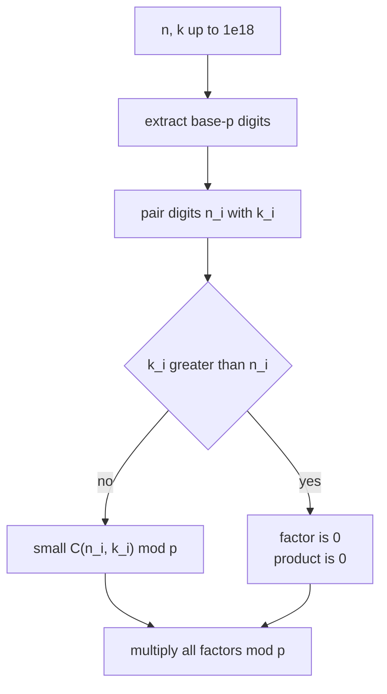
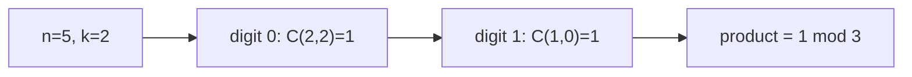

# Lucas' Theorem — Binomial Coefficient mod a Small Prime

| Field | Value |
| --- | --- |
| Source | Classic number theory / competitive programming exercise |
| Difficulty | Medium |
| Topics | Combinatorics, Number Theory, Lucas' Theorem, Modular Arithmetic |
| Link | https://en.wikipedia.org/wiki/Lucas%27s_theorem |

---

## Problem Statement

You are given $q$ queries. Each query provides three integers $n$, $k$, and a prime $p$. For each query, output

$$
\binom{n}{k} \bmod p.
$$

Constraints: $0 \le k \le n \le 10^{18}$ and the prime satisfies $2 \le p \le 10^6$. There can be up to $q \le 10^5$ queries, and $p$ may differ per query.

Because $n$ can be as large as $10^{18}$, we cannot precompute $n!$ — its factorial table would need $10^{18}$ entries. The modulus, however, is a **small prime**, which is exactly the situation Lucas' theorem was made for.

```
Input:
3
5 2 3
1000000000000000000 500000000000000000 7
10 3 2

Output:
1
0
0
```

For the first query $\binom{5}{2} = 10 \equiv 1 \pmod 3$. The last query: $\binom{10}{3} = 120$, and $120 \equiv 0 \pmod 2$.

---

## Approach (WHY)

**Lucas' theorem.** Write $n$ and $k$ in base $p$:

$$
n = \sum_{i=0}^{m} n_i p^{i}, \qquad k = \sum_{i=0}^{m} k_i p^{i}, \qquad 0 \le n_i, k_i < p.
$$

Then

$$
\binom{n}{k} \equiv \prod_{i=0}^{m} \binom{n_i}{k_i} \pmod{p}.
$$

Every digit-level binomial $\binom{n_i}{k_i}$ has both arguments strictly below $p$, so it is computable with a factorial table of size only $p$. If any digit has $k_i > n_i$, that factor is $0$, and the whole product collapses to $0$ — a quick way to see the answer vanish.



Since $p$ may change per query, we cache factorial tables keyed by $p$ so repeated primes reuse the same precomputation. Each query then costs $O(\log_p n)$ digit pairs, each an $O(1)$ table lookup.

---

## Solution

### Python

```python
import sys

def build_tables(p: int):
    fact = [1] * p
    for i in range(1, p):
        fact[i] = fact[i - 1] * i % p
    invfact = [1] * p
    invfact[p - 1] = pow(fact[p - 1], p - 2, p)
    for i in range(p - 1, 0, -1):
        invfact[i - 1] = invfact[i] * i % p
    return fact, invfact

def small_binom(n: int, k: int, p: int, fact, invfact) -> int:
    if k < 0 or k > n:
        return 0
    return fact[n] * invfact[k] % p * invfact[n - k] % p

def lucas(n: int, k: int, p: int, fact, invfact) -> int:
    result = 1
    while k > 0 or n > 0:
        ni, ki = n % p, k % p
        if ki > ni:
            return 0
        result = result * small_binom(ni, ki, p, fact, invfact) % p
        n //= p
        k //= p
    return result

def main() -> None:
    data = sys.stdin.buffer.read().split()
    q = int(data[0])
    idx = 1
    cache = {}
    out = []
    for _ in range(q):
        n = int(data[idx]); k = int(data[idx + 1]); p = int(data[idx + 2])
        idx += 3
        if p not in cache:
            cache[p] = build_tables(p)
        fact, invfact = cache[p]
        out.append(str(lucas(n, k, p, fact, invfact)))
    sys.stdout.write("\n".join(out) + "\n")

main()
```

### C++

```cpp
#include <bits/stdc++.h>
using namespace std;

long long power(long long a, long long b, long long p) {
    long long result = 1 % p;
    a %= p;
    while (b > 0) {
        if (b & 1) result = result * a % p;
        a = a * a % p;
        b >>= 1;
    }
    return result;
}

struct Tables {
    vector<long long> fact, invfact;
};

Tables build_tables(long long p) {
    Tables t;
    t.fact.assign(p, 1);
    for (long long i = 1; i < p; ++i) t.fact[i] = t.fact[i - 1] * i % p;
    t.invfact.assign(p, 1);
    t.invfact[p - 1] = power(t.fact[p - 1], p - 2, p);
    for (long long i = p - 1; i >= 1; --i)
        t.invfact[i - 1] = t.invfact[i] * i % p;
    return t;
}

long long small_binom(long long n, long long k, long long p, const Tables& t) {
    if (k < 0 || k > n) return 0;
    return t.fact[n] * t.invfact[k] % p * t.invfact[n - k] % p;
}

long long lucas(long long n, long long k, long long p, const Tables& t) {
    long long result = 1;
    while (k > 0 || n > 0) {
        long long ni = n % p, ki = k % p;
        if (ki > ni) return 0;
        result = result * small_binom(ni, ki, p, t) % p;
        n /= p;
        k /= p;
    }
    return result;
}

int main() {
    ios::sync_with_stdio(false);
    cin.tie(nullptr);

    int q;
    cin >> q;
    unordered_map<long long, Tables> cache;
    while (q--) {
        long long n, k, p;
        cin >> n >> k >> p;
        auto it = cache.find(p);
        if (it == cache.end())
            it = cache.emplace(p, build_tables(p)).first;
        cout << lucas(n, k, p, it->second) << '\n';
    }
    return 0;
}
```

---

## Iteration Trace

Query: $\binom{10}{3} \bmod 2$. We process digits in base $p = 2$.

Base-2 digits: $10 = 1010_2$ (digits $0,1,0,1$ from least significant), $3 = 11_2$ (digits $1,1,0,0$).

| Iteration | $n$ | $k$ | $n_i = n \bmod 2$ | $k_i = k \bmod 2$ | $\binom{n_i}{k_i}$ | running product |
| --- | --- | --- | --- | --- | --- | --- |
| 1 | 10 | 3 | 0 | 1 | $k_i > n_i \Rightarrow 0$ | return 0 |

The very first digit pair has $k_0 = 1 > n_0 = 0$, so the product is $0$. Indeed $\binom{10}{3} = 120 \equiv 0 \pmod 2$. ✓

A non-vanishing example, $\binom{5}{2} \bmod 3$ with $5 = 12_3$, $2 = 02_3$:

| Iteration | $n$ | $k$ | $n_i$ | $k_i$ | $\binom{n_i}{k_i} \bmod 3$ | product |
| --- | --- | --- | --- | --- | --- | --- |
| 1 | 5 | 2 | 2 | 2 | $\binom{2}{2} = 1$ | $1$ |
| 2 | 1 | 0 | 1 | 0 | $\binom{1}{0} = 1$ | $1$ |

Result $1$, matching $\binom{5}{2} = 10 \equiv 1 \pmod 3$. ✓



---

Each query touches $O(\log_p n)$ digits, and building a fresh table costs $O(p)$:

$$
O(p) \text{ per distinct prime} \;+\; O(\log_p n) \text{ per query}.
$$

## Complexity

| Aspect | Complexity |
| --- | --- |
| Build table for one prime | $O(p)$ |
| Distinct primes | up to $\min(q, \text{#primes})$ |
| Per query (digit loop) | $O(\log_p n)$ |
| Total | $O\!\big(\sum_p p \;+\; q \log_p n\big)$ |
| Space | $O(p)$ per cached prime |

---

## Takeaway

When $n$ is gigantic but the modulus is a **small prime**, Lucas' theorem breaks $\binom{n}{k} \bmod p$ into a product of digit-level binomials in base $p$, each computable from a size-$p$ factorial table. The shortcut "$\binom{n}{k} \equiv 0 \pmod p$ iff some base-$p$ digit of $k$ exceeds that of $n$" often answers the query instantly. For composite or prime-power moduli, reach for the generalized Lucas (Granville) variant instead.
