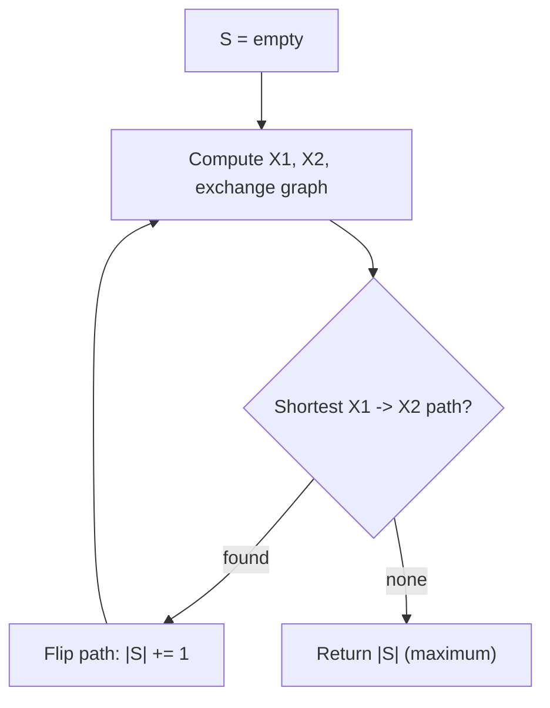
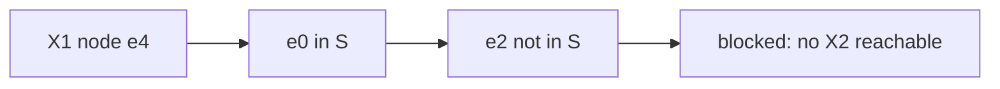

# Max Common Independent Set (Matroid Intersection)

| Field | Value |
| --- | --- |
| Source | Edmonds' matroid intersection theorem |
| Difficulty | Hard |
| Topics | Matroids, Matroid Intersection, Exchange Graph, Augmenting Path, DSU, BFS |
| Link | [Matroid intersection — Wikipedia](https://en.wikipedia.org/wiki/Matroid_intersection) |

---

## Problem Statement

You are given a ground set of $m$ edges over $n$ vertices. Two matroids share this ground set:

- $M_1$: the **graphic matroid** — a set of edges is independent iff it forms a **forest** (no cycle).
- $M_2$: a **partition matroid** — each edge belongs to a group $g_i$, and group $i$ has capacity $d_i$; a set is independent iff it uses at most $d_i$ edges of group $i$.

Compute the **size of the largest set of edges that is independent in both matroids** simultaneously:

$$
\text{answer} = \max_{S \in \mathcal{I}_1 \cap \mathcal{I}_2} |S| .
$$

By Edmonds' theorem this also equals $\min_{E = E_1 \cup E_2}\big(r_1(E_1) + r_2(E_2)\big)$, a min–max certificate of optimality.

```text
Input:
n = 4 vertices, m = 5 edges
edges:  e0: 0-1   e1: 1-2   e2: 2-3   e3: 3-0   e4: 0-2
group:  [0, 1, 1, 2, 2]      # group id per edge
cap:    [1, 1, 1]            # capacity per group

Output:
3
(e.g. {e0, e1, e3} is a forest using groups {0,1,2} within capacity)
```

## Approach (WHY)

We cannot use greedy: it is optimal for **one** matroid only. Instead we run **matroid intersection**. Maintain $S \in \mathcal{I}_1 \cap \mathcal{I}_2$, starting empty. Each phase:

1. $X_1 = \{x \notin S : S + x \in \mathcal{I}_1\}$ — edges freely addable in the graphic matroid.
2. $X_2 = \{x \notin S : S + x \in \mathcal{I}_2\}$ — edges freely addable in the partition matroid.
3. Build the **exchange graph**: $y \to x$ if $S - y + x \in \mathcal{I}_1$; $x \to y$ if $S - y + x \in \mathcal{I}_2$.
4. BFS for the **shortest** $X_1 \to X_2$ path; flipping membership along it grows $|S|$ by one.

When no path exists, $|S|$ is maximum.



## Solution

### Python

```python
from collections import deque
from typing import List, Optional, Tuple


class DSU:
    def __init__(self, n: int):
        self.p = list(range(n))

    def find(self, x: int) -> int:
        while self.p[x] != x:
            self.p[x] = self.p[self.p[x]]
            x = self.p[x]
        return x

    def union(self, a: int, b: int) -> bool:
        ra, rb = self.find(a), self.find(b)
        if ra == rb:
            return False
        self.p[ra] = rb
        return True


def is_forest(edges: List[Tuple[int, int]], n: int, subset: List[int]) -> bool:
    dsu = DSU(n)
    for i in subset:
        u, v = edges[i]
        if not dsu.union(u, v):
            return False
    return True


def partition_ok(group: List[int], cap: List[int], subset: List[int]) -> bool:
    used = [0] * len(cap)
    for i in subset:
        used[group[i]] += 1
        if used[group[i]] > cap[group[i]]:
            return False
    return True


def max_common_independent(n: int, edges: List[Tuple[int, int]],
                           group: List[int], cap: List[int]) -> int:
    m = len(edges)
    S = [False] * m

    def subset(extra: Optional[int], removed: Optional[int]) -> List[int]:
        s = [i for i in range(m) if S[i] and i != removed]
        if extra is not None:
            s.append(extra)
        return s

    def indep1(extra, removed):
        return is_forest(edges, n, subset(extra, removed))

    def indep2(extra, removed):
        return partition_ok(group, cap, subset(extra, removed))

    while True:
        in_set = [i for i in range(m) if S[i]]
        out_set = [i for i in range(m) if not S[i]]

        X1 = [x for x in out_set if indep1(x, None)]
        X2 = set(x for x in out_set if indep2(x, None))

        adj = {i: [] for i in range(m)}
        for y in in_set:
            for x in out_set:
                if indep1(x, y):      # y -> x
                    adj[y].append(x)
                if indep2(x, y):      # x -> y
                    adj[x].append(y)

        prev = {s: -1 for s in X1}
        dq = deque(X1)
        found = -1
        while dq:
            u = dq.popleft()
            if u in X2:
                found = u
                break
            for w in adj[u]:
                if w not in prev:
                    prev[w] = u
                    dq.append(w)
        if found == -1:
            break

        node = found
        while node != -1:
            S[node] = not S[node]
            node = prev[node]

    return sum(S)


if __name__ == "__main__":
    n = 4
    edges = [(0, 1), (1, 2), (2, 3), (3, 0), (0, 2)]
    group = [0, 1, 1, 2, 2]
    cap = [1, 1, 1]
    print(max_common_independent(n, edges, group, cap))
```

### C++

```cpp
#include <bits/stdc++.h>
using namespace std;

struct DSU {
    vector<int> p;
    explicit DSU(int n) : p(n) { iota(p.begin(), p.end(), 0); }
    int find(int x) {
        while (p[x] != x) { p[x] = p[p[x]]; x = p[x]; }
        return x;
    }
    bool unite(int a, int b) {
        int ra = find(a), rb = find(b);
        if (ra == rb) return false;
        p[ra] = rb;
        return true;
    }
};

static bool isForest(const vector<pair<int,int>>& edges, int n,
                     const vector<int>& subset) {
    DSU dsu(n);
    for (int i : subset)
        if (!dsu.unite(edges[i].first, edges[i].second)) return false;
    return true;
}

static bool partitionOk(const vector<int>& group, const vector<int>& cap,
                        const vector<int>& subset) {
    vector<int> used(cap.size(), 0);
    for (int i : subset) {
        int g = group[i];
        if (++used[g] > cap[g]) return false;
    }
    return true;
}

int maxCommonIndependent(int n, const vector<pair<int,int>>& edges,
                         const vector<int>& group, const vector<int>& cap) {
    int m = static_cast<int>(edges.size());
    vector<char> S(m, 0);

    auto subset = [&](int extra, int removed) {
        vector<int> s;
        for (int i = 0; i < m; ++i)
            if (S[i] && i != removed) s.push_back(i);
        if (extra != -1) s.push_back(extra);
        return s;
    };
    auto indep1 = [&](int extra, int removed) {
        return isForest(edges, n, subset(extra, removed));
    };
    auto indep2 = [&](int extra, int removed) {
        return partitionOk(group, cap, subset(extra, removed));
    };

    while (true) {
        vector<int> inSet, outSet;
        for (int i = 0; i < m; ++i) (S[i] ? inSet : outSet).push_back(i);

        vector<int> X1;
        vector<char> isX2(m, 0);
        for (int x : outSet) {
            if (indep1(x, -1)) X1.push_back(x);
            if (indep2(x, -1)) isX2[x] = 1;
        }

        vector<vector<int>> adj(m);
        for (int y : inSet)
            for (int x : outSet) {
                if (indep1(x, y)) adj[y].push_back(x);  // y -> x
                if (indep2(x, y)) adj[x].push_back(y);  // x -> y
            }

        vector<int> prev(m, -2);
        queue<int> q;
        for (int s : X1) { prev[s] = -1; q.push(s); }
        int found = -1;
        while (!q.empty()) {
            int u = q.front(); q.pop();
            if (isX2[u]) { found = u; break; }
            for (int w : adj[u])
                if (prev[w] == -2) { prev[w] = u; q.push(w); }
        }
        if (found == -1) break;

        for (int node = found; node != -1; node = prev[node])
            S[node] = !S[node];
    }

    int sz = 0;
    for (char b : S) sz += b;
    return sz;
}

int main() {
    int n = 4;
    vector<pair<int,int>> edges = {{0,1},{1,2},{2,3},{3,0},{0,2}};
    vector<int> group = {0,1,1,2,2};
    vector<int> cap = {1,1,1};
    cout << maxCommonIndependent(n, edges, group, cap) << "\n";
    return 0;
}
```

## Iteration Trace

Ground set: `e0..e4`, groups `[0,1,1,2,2]`, caps `[1,1,1]`.

| Phase | $S$ before | $X_1$ | $X_2$ | Path (shortest) | $S$ after |
| --- | --- | --- | --- | --- | --- |
| 1 | $\{\}$ | all | all | e0 | $\{e0\}$ |
| 2 | $\{e0\}$ | e1,e2,e3,e4 | e1,e3 (group caps) | e1 | $\{e0,e1\}$ |
| 3 | $\{e0,e1\}$ | e3,e4 | e3 | e3 | $\{e0,e1,e3\}$ |
| stop | $\{e0,e1,e3\}$ | — | no $X_1 \to X_2$ path | — | $|S| = 3$ |

The maximum common independent set has size $\mathbf{3}$: $\{e0, e1, e3\}$ is a forest using groups $\{0, 1, 2\}$, one each.



## Complexity

With $O(n)$ phases (answer $\le n-1$) and $O(m^2)$ oracle calls per phase, each oracle costing $O(m\,\alpha(n))$:

$$
T = O\big(n \cdot m^2 \cdot m\,\alpha(n)\big) = O(n\,m^3\,\alpha(n)).
$$

| Aspect | Complexity |
| --- | --- |
| Phases | $O(\min(r_1, r_2)) = O(n)$ |
| Exchange graph build | $O(m^2)$ oracle calls |
| Oracle cost | $O(m\,\alpha(n))$ |
| BFS per phase | $O(m^2)$ |
| Total time | $O(n\,m^3\,\alpha(n))$ |
| Space | $O(m^2)$ |

## Takeaway

The largest common independent set of two matroids is found by repeatedly augmenting along **shortest paths in the exchange graph**. Model the "forest" rule as a graphic matroid (DSU oracle) and the "per-group capacity" rule as a partition matroid; the algorithm's stopping condition gives Edmonds' min–max optimal value.
