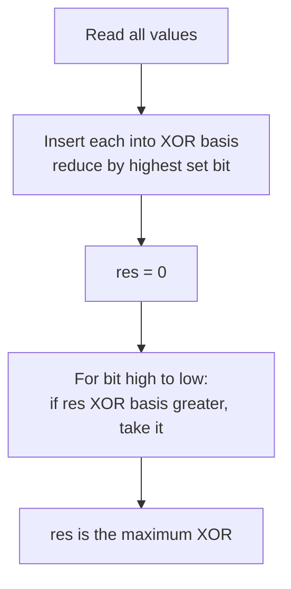

# Maximum XOR of a Subset

| Field | Value |
| --- | --- |
| Source | Classic linear-algebra-over-GF(2) exercise |
| Difficulty | Medium |
| Topics | Linear Algebra, XOR Linear Basis, GF(2), Greedy |
| Link | https://en.wikipedia.org/wiki/Linear_subspace |

---

## Problem Statement

You are given an array $a_1, a_2, \dots, a_n$ of non-negative integers. Choose any subset $S \subseteq \{1, \dots, n\}$ (the subset may be empty) and form its XOR

$$
f(S) = \bigoplus_{i \in S} a_i.
$$

Output the **maximum** possible value of $f(S)$ over all subsets.

Constraints: $1 \le n \le 10^5$ and $0 \le a_i < 2^{60}$.

```
Input:
3
1 2 7

Output:
7
```

The XOR of the whole set is $1 \oplus 2 \oplus 7 = 4$, but the single-element subset $\{7\}$ already gives $7$, which is the maximum here. With values such as $\{3, 5\}$ the best is $3 \oplus 5 = 6$, beating either element alone — so we genuinely must search over subsets, not just pick the largest element.

---

## Approach (WHY)

The set of all achievable XOR values $\{ f(S) : S \subseteq A \}$ is a **vector space over $\mathrm{GF}(2)$**: it is closed under XOR (the field's addition) and contains $0$. A vector space is fully described by a **basis**, so instead of examining $2^n$ subsets we maintain a compact **XOR linear basis** of at most 60 vectors.

We insert each number, reducing it by existing basis vectors via its highest set bit. Each stored basis vector "owns" a unique highest bit. To maximize, start from $0$ and greedily walk the basis from the highest bit downward, taking a vector whenever it **increases** the running answer. This is optimal: the highest bit a vector controls cannot be produced or cancelled by any lower vector, so grabbing it whenever it helps is never regretted.



---

## Solution

### Python

```python
import sys


class XorBasis:
    def __init__(self):
        self.basis = {}  # highest-bit -> vector

    def insert(self, x):
        while x:
            top = x.bit_length() - 1
            if top not in self.basis:
                self.basis[top] = x
                return
            x ^= self.basis[top]

    def max_xor(self):
        res = 0
        for top in sorted(self.basis, reverse=True):
            if res ^ self.basis[top] > res:
                res ^= self.basis[top]
        return res


def main():
    data = sys.stdin.read().split()
    n = int(data[0])
    nums = map(int, data[1:1 + n])
    b = XorBasis()
    for v in nums:
        b.insert(v)
    print(b.max_xor())


if __name__ == "__main__":
    main()
```

### C++

```cpp
#include <bits/stdc++.h>
using namespace std;

struct XorBasis {
    static const int BITS = 60;
    array<unsigned long long, BITS + 1> basis{};

    void insert(unsigned long long x) {
        while (x) {
            int top = 63 - __builtin_clzll(x);
            if (basis[top] == 0ULL) { basis[top] = x; return; }
            x ^= basis[top];
        }
    }

    unsigned long long maxXor() const {
        unsigned long long res = 0;
        for (int top = BITS; top >= 0; --top)
            if (basis[top] && (res ^ basis[top]) > res) res ^= basis[top];
        return res;
    }
};

int main() {
    ios::sync_with_stdio(false);
    cin.tie(nullptr);

    int n;
    if (!(cin >> n)) return 0;
    XorBasis b;
    for (int i = 0; i < n; ++i) {
        unsigned long long v;
        cin >> v;
        b.insert(v);
    }
    cout << b.maxXor() << "\n";
    return 0;
}
```

---

## Iteration Trace

Inserting $\{1, 2, 7\}$ (binary `001`, `010`, `111`), basis slots keyed by highest set bit:

| Step | Value (bin) | Reduction | Basis after (bit: vec) |
| --- | --- | --- | --- |
| insert 1 | `001` | top bit 0 empty | `{0: 001}` |
| insert 2 | `010` | top bit 1 empty | `{0: 001, 1: 010}` |
| insert 7 | `111` | bit 2 empty, store | `{0: 001, 1: 010, 2: 111}` |

Max query starting from `res = 000`:

| Bit | basis vec | res ⊕ vec | Take? | res |
| --- | --- | --- | --- | --- |
| 2 | `111` | `111` > `000` | yes | `111` |
| 1 | `010` | `101` < `111` | no | `111` |
| 0 | `001` | `110` < `111` | no | `111` |

Answer: `111` = $7$.

---

The cost is one $O(\text{bits})$ reduction per element plus one $O(\text{bits})$ greedy pass:

$$
T(n) = O(n \cdot B), \qquad B = \text{number of bits} \le 60.
$$

## Complexity

| Aspect | Cost |
| --- | --- |
| Time | $O(n \cdot B)$ |
| Space | $O(B)$ |

---

## Takeaway

The achievable XOR values form a $\mathrm{GF}(2)$ vector space; a 60-slot **linear basis** captures it entirely. Build the basis by reducing each number on its highest set bit, then read off the maximum with a single high-to-low greedy pass — turning an exponential subset search into linear time.
