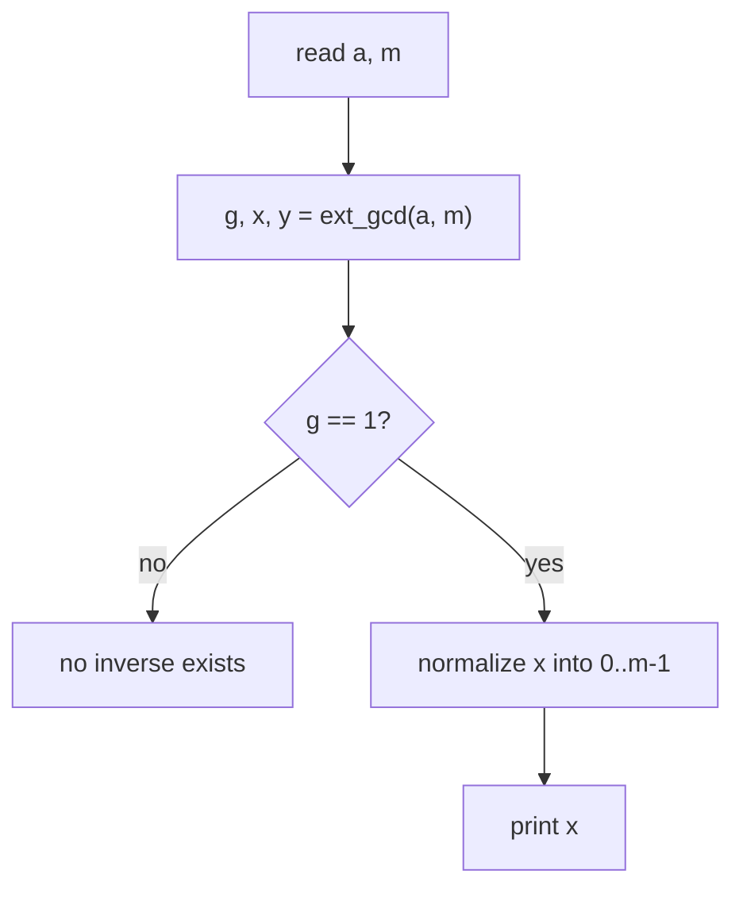
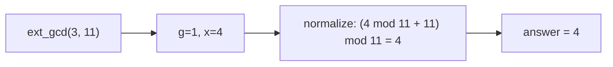

# Modular Inverse via Extended Euclid

| | |
|---|---|
| **Source** | Classic number-theory exercise |
| **Difficulty** | Easy–Medium |
| **Topics** | Extended Euclidean algorithm, modular arithmetic, Bézout's identity |
| **Link** | https://cses.fi/problemset/ |

---

## Problem Statement

Given two integers $a$ and $m$ with $\gcd(a, m) = 1$, compute the **modular inverse** of $a$ modulo $m$: the unique integer $a^{-1}$ in the range $[0, m)$ such that

$$a \cdot a^{-1} \equiv 1 \pmod{m}$$

**Constraints**

$$1 \le a < m \le 10^9, \qquad \gcd(a, m) = 1$$

```
Input
3 11

Output
4
```

Because $3 \cdot 4 = 12 \equiv 1 \pmod{11}$.

---

## Approach (WHY)

The inverse exists **iff** $\gcd(a, m) = 1$. When it does, extended Euclid gives Bézout coefficients $x, y$ with:

$$a x + m y = \gcd(a, m) = 1$$

Reduce both sides modulo $m$. The term $m y$ vanishes:

$$a x \equiv 1 \pmod m \implies a^{-1} \equiv x \pmod m$$

So the inverse is simply the $x$ coefficient. The raw $x$ may be negative, so normalise it into $[0, m)$:

$$a^{-1} = \big((x \bmod m) + m\big) \bmod m$$

**Why ext-gcd over Fermat?** Fermat's little theorem gives $a^{-1} \equiv a^{m-2} \pmod m$ but **requires $m$ prime**. Extended Euclid needs only $\gcd(a, m) = 1$, so it works for *any* coprime modulus.



---

## Solution

### Python

```python
import sys


def ext_gcd(a: int, b: int) -> tuple[int, int, int]:
    if b == 0:
        return (a, 1, 0)
    g, x1, y1 = ext_gcd(b, a % b)
    return (g, y1, x1 - (a // b) * y1)


def mod_inverse(a: int, m: int):
    g, x, _ = ext_gcd(a, m)
    if g != 1:
        return None              # inverse does not exist
    return (x % m + m) % m       # normalize into [0, m)


def solve() -> None:
    a, m = map(int, sys.stdin.read().split())
    inv = mod_inverse(a, m)
    print(inv if inv is not None else "NO INVERSE")


solve()
```

```cpp
#include <bits/stdc++.h>
using namespace std;

// Extended Euclid: returns gcd(a, b), sets x, y with a*x + b*y = gcd.
long long ext_gcd(long long a, long long b, long long &x, long long &y) {
    if (b == 0) {
        x = 1;
        y = 0;
        return a;
    }
    long long x1, y1;
    long long g = ext_gcd(b, a % b, x1, y1);
    x = y1;
    y = x1 - (a / b) * y1;
    return g;
}

// Returns -1 if no inverse exists.
long long mod_inverse(long long a, long long m) {
    long long x, y;
    long long g = ext_gcd(a, m, x, y);
    if (g != 1) return -1;
    return ((x % m) + m) % m;    // normalize into [0, m)
}

int main() {
    ios::sync_with_stdio(false);
    cin.tie(nullptr);

    long long a, m;
    cin >> a >> m;

    long long inv = mod_inverse(a, m);
    if (inv == -1) cout << "NO INVERSE" << '\n';
    else cout << inv << '\n';
    return 0;
}
```

---

## Iteration Trace

Compute the inverse of $3$ modulo $11$ — run `ext_gcd(3, 11)`.

| Call | $a$ | $b$ | $\lfloor a/b\rfloor$ | returns $(g, x, y)$ | check $ax+by$ |
|------|-----|-----|----------------------|---------------------|---------------|
| 0 | 3 | 11 | 0 | $(1,\, 4,\, -1)$ | $3(4)+11(-1)=1$ |
| 1 | 11 | 3 | 3 | $(1,\, -1,\, 4)$ | $11(-1)+3(4)=1$ |
| 2 | 3 | 2 | 1 | $(1,\, 1,\, -1)$ | $3(1)+2(-1)=1$ |
| 3 | 2 | 1 | 2 | $(1,\, 0,\, 1)$ | $2(0)+1(1)=1$ |
| 4 | 1 | 0 | — | $(1,\, 1,\, 0)$ | base case |

At call 0 we get $g = 1$, $x = 4$. Since $4$ is already in $[0, 11)$, no normalisation is needed.

$$3 \cdot 4 = 12 \equiv 1 \pmod{11} \quad\checkmark$$



---

## Complexity

The work is one extended Euclidean run.

$$T = O(\log m)$$

| Metric | Value |
|--------|-------|
| Time | $O(\log m)$ |
| Space | $O(\log)$ recursion stack ($O(1)$ if iterative) |

---

## Takeaway

The modular inverse of $a$ modulo $m$ is exactly the Bézout coefficient $x$ from $a x + m y = 1$, normalised into $[0, m)$. Unlike Fermat's $a^{m-2}$, extended Euclid needs only $\gcd(a, m) = 1$ — so it inverts under **any** coprime modulus, prime or not.
