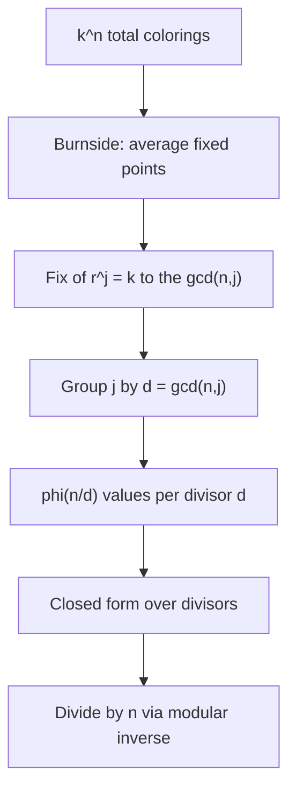
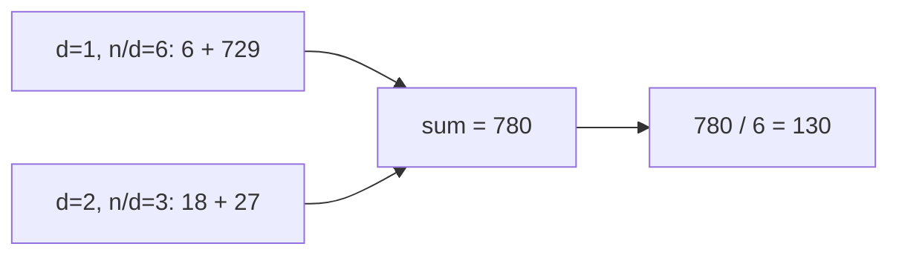

# Necklace Colorings (Burnside / Cyclic Group)

| | |
|---|---|
| **Source** | Classic combinatorics (Pólya / Burnside) |
| **Difficulty** | Medium |
| **Topics** | Group actions, Burnside's lemma, Euler's totient, modular inverse |
| **Link** | [CSES Counting Necklaces analog](https://cses.fi/problemset/) · [CP-Algorithms: Burnside](https://cp-algorithms.com/combinatorics/burnside.html) |

---

## Problem Statement

You have a circular **necklace** of $n$ beads. Each bead is painted with one of $k$ colors. Two necklaces are considered **the same** if one can be obtained from the other by a **rotation** (the necklace cannot be flipped over — only rotated around its center).

Count the number of **distinct** necklaces, modulo a prime $p = 10^9 + 7$.

Formally, the cyclic group $C_n = \{r^0, r^1, \dots, r^{n-1}\}$ acts on the set of $k^n$ colorings, where $r^j$ rotates every bead $j$ positions. You must count the number of **orbits**.

```
Input:  n = 4, k = 2
Output: 6

The 6 distinct necklaces (B/W beads), using one representative each:
  BBBB
  WBBB   (one white bead, all rotations equivalent)
  WWBB   (two adjacent white)
  WBWB   (alternating)
  WWWB   (one black bead)
  WWWW
```

---

## Approach (WHY)

By **Burnside's lemma**, the number of distinct necklaces equals the average number of colorings left **fixed** by each rotation:

$$\#\text{necklaces} = \frac{1}{n}\sum_{j=0}^{n-1} |\text{Fix}(r^j)|.$$

A coloring is fixed by rotation $r^j$ iff beads in the same cycle of $r^j$ share a color. Rotation by $j$ splits the $n$ beads into $\gcd(n, j)$ cycles, so

$$|\text{Fix}(r^j)| = k^{\gcd(n, j)}.$$

Summing directly is $O(n)$. We collapse it using **Euler's totient**: grouping the $j$'s by $d = \gcd(n,j)$, exactly $\varphi(n/d)$ values of $j$ give each divisor $d \mid n$. This yields the closed form

$$\boxed{\;\#\text{necklaces} = \frac{1}{n}\sum_{d \mid n} \varphi\!\left(\frac{n}{d}\right) k^{d}\;}$$

which runs in $O(\sqrt n)$ (iterating divisors) — fast even for huge $n$.



Division by $n$ under the modulus uses the modular inverse $n^{-1} \equiv n^{p-2} \pmod p$ (Fermat).

---

## Solution

### Python

```python
MOD = 10**9 + 7

def power(base, exp, mod):
    result = 1
    base %= mod
    while exp > 0:
        if exp & 1:
            result = result * base % mod
        base = base * base % mod
        exp >>= 1
    return result

def inverse(a, mod):
    return power(a, mod - 2, mod)

def euler_phi(n):
    result, m, p = n, n, 2
    while p * p <= m:
        if m % p == 0:
            while m % p == 0:
                m //= p
            result -= result // p
        p += 1
    if m > 1:
        result -= result // m
    return result

def count_necklaces(n, k):
    total = 0
    d = 1
    while d * d <= n:
        if n % d == 0:
            # divisor d
            total = (total + euler_phi(n // d) % MOD * power(k, d, MOD)) % MOD
            # paired divisor n // d
            if d != n // d:
                total = (total + euler_phi(d) % MOD * power(k, n // d, MOD)) % MOD
        d += 1
    return total * inverse(n % MOD, MOD) % MOD

if __name__ == "__main__":
    print(count_necklaces(4, 2))   # 6
    print(count_necklaces(6, 3))   # 130
    print(count_necklaces(5, 3))   # 51
```

### C++

```cpp
#include <bits/stdc++.h>
using namespace std;
const long long MOD = 1e9 + 7;

long long power(long long base, long long exp, long long mod) {
    long long result = 1;
    base %= mod;
    while (exp > 0) {
        if (exp & 1) result = result * base % mod;
        base = base * base % mod;
        exp >>= 1;
    }
    return result;
}

long long inverse(long long a, long long mod) {
    return power(a, mod - 2, mod);
}

long long eulerPhi(long long n) {
    long long result = n, m = n;
    for (long long p = 2; p * p <= m; ++p) {
        if (m % p == 0) {
            while (m % p == 0) m /= p;
            result -= result / p;
        }
    }
    if (m > 1) result -= result / m;
    return result;
}

long long countNecklaces(long long n, long long k) {
    long long total = 0;
    for (long long d = 1; d * d <= n; ++d) {
        if (n % d == 0) {
            total = (total + eulerPhi(n / d) % MOD * power(k, d, MOD)) % MOD;
            if (d != n / d)
                total = (total + eulerPhi(d) % MOD * power(k, n / d, MOD)) % MOD;
        }
    }
    return total * inverse(n % MOD, MOD) % MOD;
}

int main() {
    cout << countNecklaces(4, 2) << '\n';  // 6
    cout << countNecklaces(6, 3) << '\n';  // 130
    cout << countNecklaces(5, 3) << '\n';  // 51
    return 0;
}
```

---

## Iteration Trace

For $n = 6$, $k = 3$ (before dividing by $n = 6$):

| Divisor $d$ | Paired $n/d$ | $\varphi(n/d)$ | $k^d$ | Term $\varphi(n/d)\cdot k^d$ | Paired $\varphi(d)$ | $k^{n/d}$ | Paired term | Running sum |
|-------------|--------------|----------------|-------|------------------------------|---------------------|-----------|-------------|-------------|
| 1 | 6 | $\varphi(6)=2$ | $3^1=3$ | $6$ | $\varphi(1)=1$ | $3^6=729$ | $729$ | $735$ |
| 2 | 3 | $\varphi(3)=2$ | $3^2=9$ | $18$ | $\varphi(2)=1$ | $3^3=27$ | $27$ | $780$ |

Sum $= 780$; $780 / 6 = 130$. ✓



---

## Complexity

Iterating divisors costs $O(\sqrt n)$; each totient is $O(\sqrt n)$ and each power is $O(\log k)$. Total:

$$O\!\left(\sqrt n \cdot \big(\sqrt n + \log k\big)\right) = O\!\left(n + \sqrt n \log k\right)_{\text{worst}} \approx O(\sqrt n \, d(n)).$$

| Aspect | Cost |
|--------|------|
| Time | $O(\sqrt n \cdot (\sqrt n + \log k))$ |
| Space | $O(1)$ |
| Modular division | $O(\log p)$ inverse |

---

## Takeaway

Necklace counting is **Burnside applied to the cyclic group**: each rotation $r^j$ fixes $k^{\gcd(n,j)}$ colorings, and Euler's totient compresses the $n$-term sum into a divisor sum. Memorize $\frac{1}{n}\sum_{d\mid n}\varphi(n/d)k^d$ and handle the final division with a modular inverse.
